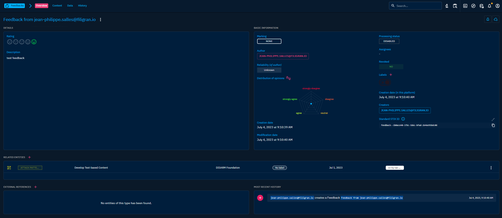

# Exploring "Cases"

When you click on "Cases" in the left-side bar, you access all the "Cases" tabs, visible on the top bar on the left. By default, the user directly access the "Incident Responses" tab, but can navigate to the other tabs as well.

As Analyses, `Cases` can contains other objects. This way, by adding context and results of your investigations in the case, you will be able to get an up to date overview of the ongoing situation, and later produce more easily an incident report. 

From the `Cases` section, users can access the following tabs:

- `Incident Responses`: This type of Cases is dedicated to the management of incidents. An Incident Reponse case does not represent an incident, but all the context and actions that will encompass the response to a specific incident.
- `Request for Information`: CTI teams are often asked to provide extensive information and analysis on a specific subject, be it related to an ongoing incident or a particular trending threat. Request for Information cases allow you to store context and actions relative to this type of request and its response.
- `Request for Takedown`: When an orgnization is targeted by an attack campaign, a typical response action can be to request the Takedown of elements of the attack infrastructure, for example a domain name impersonating the organization to phish its employees, or an email address used to deliver phishing content. As Takedown needs in most case to reach out to external providers and be effective quickly, it often needs specific workflows. Request for Takedown cases give you a dedicated space to manage these specific actions.
- `Tasks`: In every case, you need tasks to be performed in order to solve it. The Tasks tab allows you to review all created tasks to quickly see past due date, or quickly see every task assigned to a specific user.
- `Feedbacks`: If you use your platform to interact with other teams and provide them CTI Knowledge, some users may want to give you feedback about it. Those feedbacks can easily be considered as an other type of case to solve, as it will often reffer to Knowledge inconsistency or gaps.

## Incident Response, Request for Information & Request for Takedown

### General presentation

Incident responses, Request for Information & Request for Takedown cases are an important part of the case management system in OpenCTI. Here, you can organize the work of your team to respond to cybersecurity situations. You can also give context to the team and other users on the platform about the situation and actions (to be) taken.

To manage the situation, you can issue `Tasks` and assign them to users in the platform, by directly creating a Task or by applying a Case template that will append a list of predifined tasks.

To bring context, you can use your Case as a container (like Reports or Groupings), allowing you to add any Knowledge from your platform in it. You can also use this possibility to trace your investigation, your Case playing the role of an Incident report. You will find more information about case management [here](case-management.md).

Incident Response, Request for Information & Request for Takedown are not STIX 2.1 Objects.

When clicking on the Incident Response, Request for Information & Request for Takedown tabs at the top, you access the list of all Cases you have access too, in respect with your [allowed marking definitions](../administration/users.md). You can then search and filter on some common and specific attributes.

### Visualizing Knowledge within an Incident Response, Request for Information & Request for Takedown

When clicking on an Incident Response, Request for Information or Request for Takedown, you land on the Overview tab. The following tabs are accessible:

- Overview: Overview of Cases are slightly different than the usual (described [here](overview.md)). Cases' Overview displays also the list of the tasks associated with the case. It also let you hightlight Incident, Report or Sighting at the origin of the case. If other cases contains some Observables with your Case, they will be displayed as Related Cases in the Overview.
- Knowledge: a complex tab that regroups all the structured Knowledge contained in the Case, accessible through different views (See below for a dive-in).
- Content: a tab to upload or creates outcomes document displaying the content of the Case (for example in PDF, text, HTML or markdown files). The Content of the document is displayed to ease the access of Knowledge through a readable format.
- Entities: A table containing all SDO (Stix Domain Objects) contained in the Case, with search and filters available. It also display if the SDO has been added directly or through [inferences with the reasonging engine](inferences.md)
- Observables: A table containing all SCO (Stix Cyber Observable) contained in the Case, with search and filters available. It also display if the SDO has been added directly or through [inferences with the reasonging engine](inferences.md)
- Data: as described [here](overview.md).

Exploring and modifying the structured Knowledge contained in a Case can be done through different lenses.

#### Graph View

In Graph view, STIX SDO are displayed as graph nodes and relationships as graph links. Nodes are colored depending of their type. Direct relationship are displayed as plain link and inferred relationships in dotted link.
At the top right, you will find a serie of icons. From there you can change the current type of view. Here you can also perform global action on the Knowledge of the Case. Let's highlight 2 of them:
- Suggestions: This tool suggests you some logical relationships to add between your contained Object to give more consistency to your Knowledge.
- Share with an Organization: if you have designated a main Organization in the platform settings, you can here share your Case and its content with users of an other Organization.
At the bottom, you have many option to manipulate the graph:
- Multiple option for shaping the graph and applying forces to the nodes and links
- Multiple selection options
- Multiple filters, including a time range selector allowing you to see the evolution of the Knowledge within the Case.
- Multiple creation and edition tools to modify the Knowledge contained in the Case.

#### Content mapping view

Through this view, you can map exsisting or new Objects directly from a readable content, allowing you to quickly append structured Knowledge in your Case before refining it with relationships and details. 
This view is a great place to see the continuum between unstructured and structured Knowledge.

#### Timeline view

This view allows you to see the structured Knowledge chronologically. This view is particularily useful in the context of a Case, allowing you to see the chain of events, either from the attack perspectives, the defense perspectives or both.
The view can be filtered and displayed relationships too.

#### Matrix view

If your Case contains attack patterns, you will be able to visualize them in a Matrix view.

## Tasks

Tasks are actions to be performed in the context of a Case (Incident Response, Request for Information, Request for Takedown). Usually, a task is assigned to a user, but important tasks may involved more participants.

When clicking on the Tasks tab at the top of the interface, you access the list of all Tasks you have access too, in respect with your [allowed marking definitions](../administration/users.md). You can then search and filter on some common and specific attributes of the tasks.

Clicking on a Task, you land on its Overview tab. For a Tasks, the following tabs are accessible:
- Overview: as described [here](overview.md).
- Data: as described [here](overview.md).
- History: as described [here](overview.md).

## Feedbacks

When a user fill a feedback form from its Profile/Feedback menu, it will then be accessible here.

This feature gives the opportunity to engage with other users of your platform and to respond directly to their concern about it or the Knowledge, without the need of third party software.

Clicking on a Feedback, you land on its Overview tab. For a Feedback, the following tabs are accessible:
- Overview: as described [here](overview.md).
- Content: as described [here](overview.md). 
- Data: as described [here](overview.md).
- History: as described [here](overview.md).
