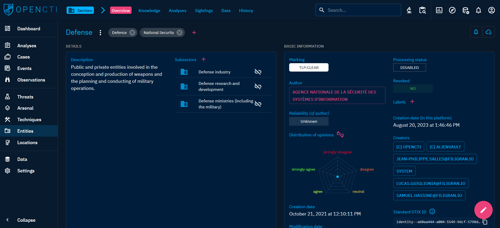
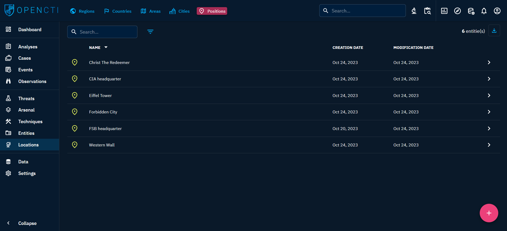

# Entities

OpenCTI's Entities objects provides a comprehensive framework for modeling various targets and attack victims within your threat intelligence data. With five distinct Entity object types, you can represent sectors, events, organizations, systems, and individuals. This robust classification empowers you to contextualize threats effectively, enhancing the depth and precision of your analysis.

When you click on "Entities" in the left-side bar, you access all the "Entities" tabs, visible on the top bar on the left. By default, the user directly access the "Sectors" tab, but can navigate to the other tabs as well.

From the `Entities` section, users can access the following tabs:

- `Sectors`: areas of activity.
- `Events`: event in the real world.
- `Organizations`: groups with specific aims such as companies and government entities.
- `Systems`: technologies such as platforms and software.
- `Individuals`: real persons.

## Sectors

### General presentation

Sectors represent specific domains of activity, defining areas such as energy, government, health, finance, and more. Utilize sectors to categorize targeted industries or sectors of interest, providing valuable context for threat intelligence analysis within distinct areas of the economy.

When clicking on the Sectors tab at the top left, you see the list of all the Sectors you have access to, in respect with your [allowed marking definitions](../administration/users.md).

### Visualizing Knowledge associated with a Sector

When clicking on a `Sector` in the list, you land on its Overview tab. For a Sector, the following tabs are accessible:

- Overview: as described [here](overview.md#overview-section).
- Knowledge: a complex tab that regroups all the structured Knowledge linked to the Sector. Different thematic views are proposed to easily see the related entities, the threats, the incidents, etc. linked to the Sector. As described [here](overview.md#knowledge-section).
- Analyses: as described [here](overview.md#analyses-section).
- Sightings: a table containing all `Sightings` relationships corresponding to events in which an `Indicator` (IP, domain name, url, etc.) is sighted in the Sector.
- Data: as described [here](overview.md#data-section).
- History: as described [here](overview.md#history-section).

## Events

### General presentation

Events encompass occurrences like international sports events, summits (e.g., G20), trials, conferences, or any significant happening in the real world. By modeling events, you can analyze threats associated with specific occurrences, allowing for targeted investigations surrounding high-profile incidents.

When clicking on the Events tab at the top left, you see the list of all the Events you have access to, in respect with your [allowed marking definitions](../administration/users.md).

### Visualizing Knowledge associated with an Event

When clicking on an `Event` in the list, you land on its Overview tab. For an Event, the following tabs are accessible:

- Overview: as described [here](overview.md#overview-section).
- Knowledge: a complex tab that regroups all the structured Knowledge linked to the Event. Different thematic views are proposed to easily see the related entities, the threats, the locations, etc. linked to the Event. As described [here](overview.md#knowledge-section).
- Analyses: as described [here](overview.md#analyses-section).
- Sightings: a table containing all `Sightings` relationships corresponding to events in which an `Indicator` (IP, domain name, url, etc.) is sighted during an attack against the Event.
- Data: as described [here](overview.md#data-section).
- History: as described [here](overview.md#history-section).

## Organizations

### General presentation

Organizations include diverse entities such as companies, government bodies, associations, non-profits, and other groups with specific aims. Modeling organizations enables you to understand the threat landscape concerning various entities, facilitating investigations into cyber-espionage, data breaches, or other malicious activities targeting specific groups.

When clicking on the Organizations tab at the top left, you see the list of all the Organizations you have access to, in respect with your [allowed marking definitions](../administration/users.md).

### Visualizing Knowledge associated with an Organization

When clicking on an `Organization` in the list, you land on its Overview tab. For an Organization, the following tabs are accessible:

- Overview: as described [here](overview.md#overview-section).
- Knowledge: a complex tab that regroups all the structured Knowledge linked to the Organization. Different thematic views are proposed to easily see the related entities, the threats, the locations, etc. linked to the Organization. As described [here](overview.md#knowledge-section).
- Analyses: as described [here](overview.md#analyses-section).
- Sightings: a table containing all `Sightings` relationships corresponding to events in which an `Indicator` (IP, domain name, url, etc.) is sighted in the Organization.
- Data: as described [here](overview.md#data-section).
- History: as described [here](overview.md#history-section).

Furthermore, an Organization can be observed from an "Author" perspective. It is possible to change this viewpoint to the right of the entity name, using the "Display as" drop-down menu (see screenshot below). This different perspective is accessible in the Overview, Knowledge and Analyses tabs. When switched to "Author" mode, the observed data pertains to the entity's description as an author within the platform:

- Overview: The "Latest created relationships" and "Latest containers about the object" panels are replaced by the "Latest containers authored by this entity" panel.
- Knowledge: A tab that presents an overview of the data authored by the Organization (i.e. counters and a graph).
- Analyses: The list of all Analyses (`Report`, `Groupings`) and Cases (`Incident response`, `Request for Information`, `Request for Takedown`) for which the Organization is the author.

## Systems

### General presentation

Systems represent software applications, platforms, frameworks, or specific tools like WordPress, VirtualBox, Firefox, Python, etc. Modeling systems allows you to focus on threats related to specific software or technology, aiding in vulnerability assessments, patch management, and securing critical applications.

When clicking on the Systems tab at the top left, you see the list of all the Systems you have access to, in respect with your [allowed marking definitions](../administration/users.md).

### Visualizing Knowledge associated with a System

When clicking on a `System` in the list, you land on its Overview tab. For a System, the following tabs are accessible:

- Overview: as described [here](overview.md#overview-section).
- Knowledge: a complex tab that regroups all the structured Knowledge linked to the System. Different thematic views are proposed to easily see the related entities, the threats, the incidents, etc. linked to the System. As described [here](overview.md#knowledge-section).
- Analyses: as described [here](overview.md#analyses-section).
- Sightings: a table containing all `Sightings` relationships corresponding to events in which an `Indicator` (IP, domain name, url, etc.) is sighted in the System.
- Data: as described [here](overview.md#data-section).
- History: as described [here](overview.md#history-section).

Furthermore, a System can be observed from an "Author" perspective. It is possible to change this viewpoint to the right of the entity name, using the "Display as" drop-down menu (see screenshot below). This different perspective is accessible in the Overview, Knowledge and Analyses tabs. When switched to "Author" mode, the observed data pertains to the entity's description as an author within the platform:

- Overview: The "Latest created relationships" and "Latest containers about the object" panels are replaced by the "Latest containers authored by this entity" panel.
- Knowledge: A tab that presents an overview of the data authored by the System (i.e. counters and a graph).
- Analyses: The list of all Analyses (`Report`, `Groupings`) and Cases (`Incident response`, `Request for Information`, `Request for Takedown`) for which the System is the author.

## Individuals

### General presentation

Individuals represent specific persons relevant to your threat intelligence analysis. This category includes targeted individuals, or influential figures in various fields. Modeling individuals enables you to analyze threats related to specific people, enhancing investigations into cyber-stalking, impersonation, or other targeted attacks.

When clicking on the Individuals tab at the top left, you see the list of all the Individuals you have access to, in respect with your [allowed marking definitions](../administration/users.md).

### Visualizing Knowledge associated with an Individual

When clicking on an `Individual` in the list, you land on its Overview tab. For an Individual, the following tabs are accessible:

- Overview: as described [here](overview.md#overview-section).
- Knowledge: a complex tab that regroups all the structured Knowledge linked to the Individual. Different thematic views are proposed to easily see the related entities, the threats, the locations, etc. linked to the Individual. As described [here](overview.md#knowledge-section).
- Analyses: as described [here](overview.md#analyses-section).
- Sightings: a table containing all `Sightings` relationships corresponding to events in which an `Indicator` (IP, domain name, url, etc.) is sighted in the Individual.
- Data: as described [here](overview.md#data-section).
- History: as described [here](overview.md#history-section).

Furthermore, an Individual can be observed from an "Author" perspective. It is possible to change this viewpoint to the right of the entity name, using the "Display as" drop-down menu (see screenshot below). This different perspective is accessible in the Overview, Knowledge and Analyses tabs. When switched to "Author" mode, the observed data pertains to the entity's description as an author within the platform:

- Overview: The "Latest created relationships" and "Latest containers about the object" panels are replaced by the "Latest containers authored by this entity" panel.
- Knowledge: A tab that presents an overview of the data authored by the Individual (i.e. counters and a graph).
- Analyses: The list of all Analyses (`Report`, `Groupings`) and Cases (`Incident response`, `Request for Information`, `Request for Takedown`) for which the Individual is the author.