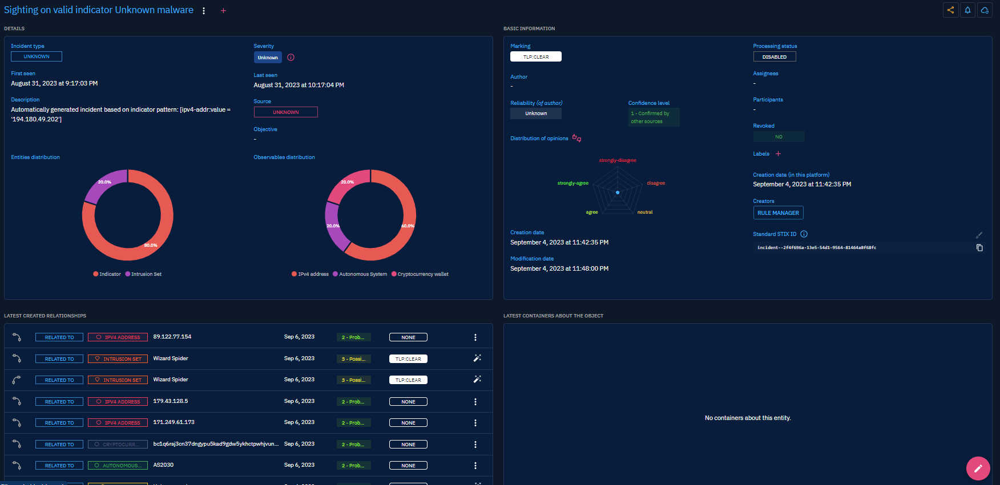

# Events

When you click on "Events" in the left-side bar, you access all the "Events" tabs, visible on the top bar on the left. By default, the user directly access the "Incidents" tab, but can navigate to the other tabs as well.

From the `Events` section, users can access the following tabs:

- `Incidents`: In OpenCTI, `Incidents` correspond to a negative event happening on an information system. This can include a cyberattack (intrusion, phishing, etc.), a consolidated security alert generated by a SIEM or EDR that need to be qualified, and so on. It can also refer to an information warfare attack in the context of countering disinformation.
- `Sightings`: `Sightings` correspond to the event in which an `Observable` (IP, domain name, certificate, etc.) is detected by or within an information system, an individual or an organization. Most often, this corresponds to a security event transmitted by a SIEM or an EDR.
- `Observed Data`: `Observed Data` has been added in OpenCTI by compliance with the STIX 2.1 standard. You can see it has a pseudo-container that contains Observables, like a line of firewall log for example. Currently, it is rarely used.

## Incidents

### General presentation

Incidents usually represents negative events impacting ressources you want to protect, but local definitions can vary a lot, from a simple security events send by a SIEM to a massive scale supply chain attack impacting a whole activity sector.

In the MITRE STIX 2.1, the `Incident` SDO has not yet been finalize and is the object of important work as part of a forthcoming STIX Extension.

When clicking on the Incidents tab at the top left, you see the list of all the Incidents you have access to, in respect with your [allowed marking definitions](../administration/users.md).

### Visualizing Knowledge associated with an Incident

When clicking on an `Incident` in the list, you land on its Overview tab. For an Incident, the following tabs are accessible:

- Overview: as described [here](overview.md#overview-section), with the particularity to display two distribution graphs of its related Entities (STIX SDO) and Observable (STIX SCO).
- Knowledge: a complex tab that regroups all the structured Knowledge linked to the Incident. Different thematic views are proposed to easily see the victimology, arsenal and techniques and so on used in the context of the Incident. As described [here](overview.md#knowledge-section).
- Content: This specific tab allows to previzualize, manage and write deliverable associated with the Incident. For example an analytic report to share with other teams, a markdown files to feed a collaborative wiki with, etc. As described [here](overview.md#content-section).
- Analyses: as described [here](overview.md#analyses-section).
- Data: as described [here](overview.md#data-section).
- History: as described [here](overview.md#history-section).

## Sightings

### General presentation

`Sightings` correspond to the event in which an `Observable` (IP, domain name, certificate, etc.) is detected by or within an information system, an individual or an organization. Most often, this corresponds to a security event transmitted by a SIEM or EDR. 

In OpenCTI, as we are in a cybersecurity context, `Sightings` are associated with `Indicators` of Compromise (IoC) and the notion of "True positive" and "False positive". 

It is important to note that Sightings are a type of relationship (not a STIX SDO or STIX SCO), between an Observable and an Individual/Organization/Sector/System.

When clicking on the Sightings tab at the top left, you see the list of all the Sightings you have access to, in respect with your [allowed marking definitions](../administration/users.md).

### Visualizing Knowledge associated with a Sighting

When clicking on a `Sighting` in the list, you land on its Overview tab. As other relationships in the platform, Sighting's overview displays common related metadata, containers, external references, notes and entities linked by the relationship. 

In addition, this overview displays:
- Qualification : if the Sighting is a True Positive or a False Positive
- Count : number of times the event has been seen

## Observed Data

### General presentation

`Observed Data` correspond to an extract from a log that contains Observables. 

In the MITRE STIX 2.1, the `Observed Data` SDO is defined as such:

> Observed Data conveys information about cyber security related entities such as files, systems, and networks using the STIX Cyber-observable Objects (SCOs). For example, Observed Data can capture information about an IP address, a network connection, a file, or a registry key. Observed Data is not an intelligence assertion, it is simply the raw information without any context for what it means.

When clicking on the `Observed Data` tab at the top left, you see the list of all the `Observed Data` you have access to, in respect with your [allowed marking definitions](../administration/users.md).

### Visualizing Knowledge associated with an Observed Data

When clicking on an `Observed Data` in the list, you land on its Overview tab. The following tabs are accessible:

- Overview: as described [here](overview.md#overview-section), with the particularity to display a distribution graphs of its related Observables (STIX SCO).
- Entities : a sortable and filterable list of all Entities (SDO) 
- Observables: a sortable and filterable list of all Observables (SCO) in relation with the Observed Data
- Data: as described [here](overview.md#data-section).
- History: as described [here](overview.md#history-section).
