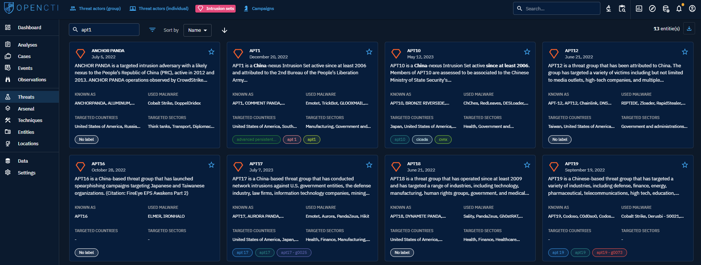

# Threats 

When you click on "Threats" in the left-side bar, you access all the "Threats" tabs, visible on the top bar on the left. By default, the user directly access the "Threat Actor (Group)" tab, but can navigate to the other tabs as well.

From the `Threats` section, users can access the following tabs:

- `Threat actors (Group)`: Threat actor (Group) represents a physical group of attackers operating an Intrusion set, using malware and attack infrastructure, etc.
- `Threat actors (Indvidual)`: Threat actor (Individual) represents a real attacker that can be described by physical and personal attributes and motivations. Threat actor (Individual) operates Intrusion set, uses malware and infrastructure, etc.
- `Intrusion sets`: Intrusion set is an important concept in Cyber Threat Intelligence field. It is a consistent set of technical and non technical elements corresponding of what, how and why a Threat actor acts. it is particularly usefull for associating multiple attacks and malicious actions to a defined Threat, even without sufficiant informations regarding who did them. Often, with you understanding of the threat growing, you will link an Intrusion set to a Threat actor (either a Group or an Individual).
- `Campaigns`: Campaign represents a serie of attacks taking place in a certain period of time and/or targeting a consistent subset of Organization/Individual.

## Threat actors (Group and Individual)

### General presentation

Threat actors are the humans who are building, deploying and operating intrusion sets. A threat actor can be an single individual or a group of attackers (who may be composed of individuals). A group of attackers may be a state-nation, a state-sponsored group, a corporation, a group of hacktivists, etc. 

Beware, groups of attackers might be modelized as "Intrusion sets" in feeds, as there is sometimes a misunderstanding in the industry between group of people and the technical/operational intrusion set they operate.

When clicking on the Threat actor (Group or Individual) tabs at the top left, you access the list of all the groups of Threat actors or INdivudual Threat actors you have access too, in respect with your [allowed marking definitions](../administration/users.md). These groups or individual are displayed as **Cards** where you can find a summary of the important Knowledge associated with each of them: description, aliases, malwares they used, countries and industries they target, labels. You can then search and filter on some common and specific attributes of Threat actors.

At the top right of each Card, you can click the star icon to put it as favorite. It will pin the card on top of the list. You will also be able to display all your favorite easily in your [Custom Dashboards](dashboards.md).

### Visualizing Knowledge associated with a Threat actor

When clicking on a Threat actor Card, you land on its Overview tab. For a Threat actor, the following tabs are accessible:

- Overview: as described [here](overview.md).
- Knowledge: a complex tab that regroups all the structured Knowledge linked to the Threat actor. Different thematic views are proposed to easily see the victimology, arsenal and techniques used by the Threat actor, etc. 
- Analyses: as described [here](overview.md).
- Data: as described [here](overview.md).
- History: as described [here](overview.md).

## Intrusion Sets

An intrusion set is a consistent group of technical elements such as "tactics, technics and procedures" (TTP), tools, malware and infrastructure used by a threat actor against one or a number of victims who are usually sharing some characteristics (field of activity, country or region) to reach a similar goal whoever the victim is. The intrusion set may be deployed once or several times and may evolve with time.
Several intrusion sets may be linked to one threat actor. All of the entities described below may be linked to one intrusion set. There are many debates in the Threat Intelligence community on how to define an intrusion set and how to distinguish several intrusion sets with regards to:

- their differences
- their evolutions
- the possible reuse
- "false flag" type of attacks

As OpenCTI is very customizable, each organization or individual may use these categories as they wish. Instead, it is also possible to use the import feed for the choice of categories.

When clicking on the Intrusion set tab on the top left, you access the list of all the Intrusion sets you have access too, in respect with your [allowed marking definitions](../administration/users.md). These intrusion sets are displayed as **Cards** where you can find a summary of the important Knowledge associated with each of them: description, aliases, malwares they used, countries and industries they target, labels. You can then search and filter on some common and specific attributes of Intrusion set.

At the top right of each Card, you can click the star icon to put it as favorite. It will pin the card on top of the list. You will also be able to display all your favorite easily in your [Custom Dashboards](dashboards.md).

### Visualizing Knowledge associated with an Intrusion set

When clicking on an Intrusion set Card, you land on its Overview tab. The following tabs are accessible:

- Overview: as described [here](overview.md).
- Knowledge: a complex tab that regroups all the structured Knowledge linked to the Intrusion Set. Different thematic views are proposed to easily see the victimology, arsenal and techniques used by the Intrusion Set, etc. 
- Analyses: as described [here](overview.md).
- Data: as described [here](overview.md).
- History: as described [here](overview.md).

## Campaigns

A campaign can be defined as "a series of malicious activities or attacks (sometimes called a "wave of attacks") taking place within a limited period of time, against a defined group of victims, associated to a similar intrusion set and characterized by the use of one or several identical malware towards the various victims and common TTPs".
However, a campaign is an investigation element and may not be widely recognized. Thus, a provider might define a series of attacks as a campaign and another as an intrusion set.
Campaigns can be attributed to an Intrusion set.

When clicking on the Campaign tab on the top left, you access the list of all the Campaigns you have access too, in respect with your [allowed marking definitions](../administration/users.md). These campaigns are displayed as **Cards** where you can find a summary of the important Knowledge associated with each of them: description, aliases, malwares used, countries and industries they target, labels. You can then search and filter on some common and specific attributes of Campaigns.

At the top right of each Card, you can click the star icon to put it as favorite. It will pin the card on top of the list. You will also be able to display all your favorite easily in your [Custom Dashboards](dashboards.md).

### Visualizing Knowledge associated with a Campaign

When clicking on an Campaign Card, you land on its Overview tab. The following tabs are accessible:

- Overview: as described [here](overview.md).
- Knowledge: a complex tab that regroups all the structured Knowledge linked to the Campaign. Different thematic views are proposed to easily see the victimology, arsenal and techniques used in the context of the Campaign. 
- Analyses: as described [here](overview.md).
- Data: as described [here](overview.md).
- History: as described [here](overview.md).
