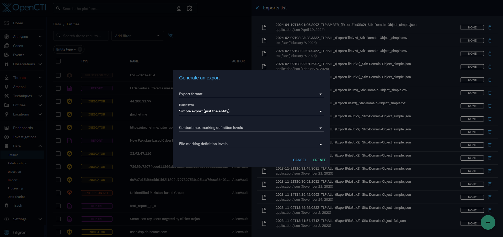
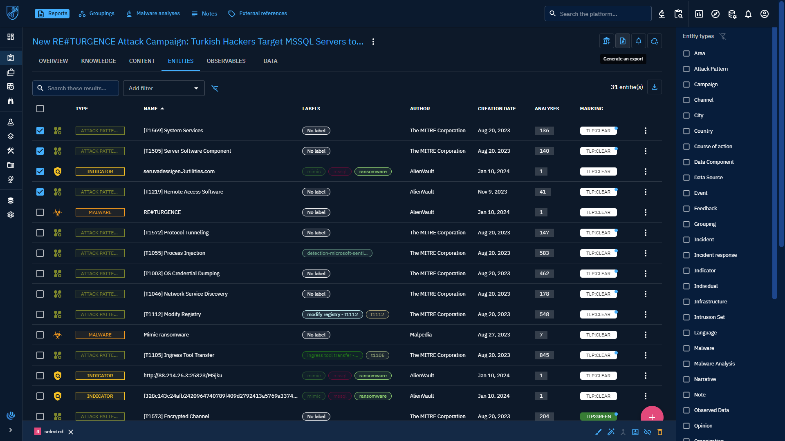
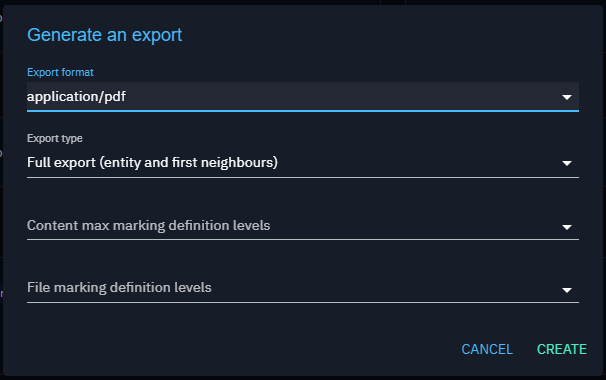

# Manual export

## Introduction

With the OpenCTI platform, you can manually export your intelligence content in the following formats:

- JSON,
- CSV,
- PDF,
- TXT.

## Export in structured or document format

### Generate an export

To export one or more entities you have two possibilities. First you can click on the button "Open export panel". The list of pre-existing exports will open, and in the bottom right-hand corner you can configure and generate a new export.

This opens the export settings panel, where you can customize your export according to three fields:

- desired export format (text/csv, application/pdf, application/vnd.oasis.stix+json, text/plain)
- export type (simple or full),
- the max marking definition level of the elements in the entity to be exported (a TLP level, for instance).

The second way is to click directly on the "Generate an Export" button to export the content of an entity in the desired format. The same settings panel will open.

### Export possibilities

All entities in your instance can be exported either directly via Generate Export or indirectly via Export List in .json and .csv formats.

### Export a list entities

You have the option to export either a single element, such as a report, or a collection of elements, such as multiple reports. These exports may contain not only the entity itself but also related elements, depending on the type of export you select: "simple" or "full". See the [Export types (simple and full)](export.md#export-type-section) section.

You can also choose to export a list of entities within a container. To do so, go to the container's entities tab. For example, for a report, if you only want to retrieve entity type attack pattern and indicators to design a detection strategy, go to the entities tab and select specific elements for export.

### Export types (simple and full)

When you wish to export only the content of a specific entity such as a report, you can choose a "simple" export type.

If you also wish to export associated content, you can choose a "full" export. With this type of export, the entity will be exported along with all entities directly associated with the central one (first neighbors).

### Exports list panel

Once an export has been created, you can find it in the export list panel. Simply click on a particular export to download it.

You can also generate a new export directly from the Exports list, as explained in the [Generate an export](export.md#generate-export-section) section.

