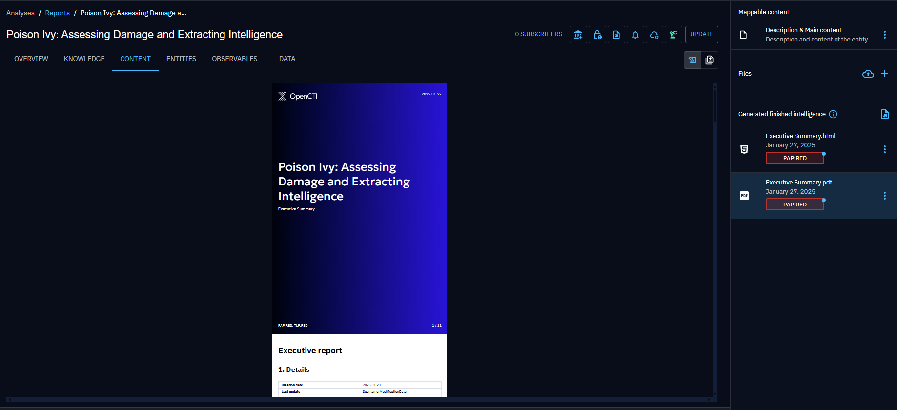

# Manual export

## Introduction

With the OpenCTI platform, you can manually export your intelligence content in the following formats:

- JSON,
- CSV,
- PDF,
- TXT.


## Export in structured or document format

<a id="generate-export-section"></a>
### Generate an export

To export one or more entities you have two possibilities. First you can click on the button "Open export panel". The list of pre-existing exports will open, and in the bottom right-hand corner you can configure and generate a new export.


This opens the export settings panel, where you can customize your export according to four fields:

- desired export format (text/csv, application/pdf, application/vnd.oasis.stix+json, text/plain)
- export type (simple or full),
- the max marking definition levels of the elements to be included in the export (a TLP level, for instance). The list of the available max markings is limited by the user allowed markings and its maximum shareable markings (more details about maximum shareable marking definitions in [data segregation](../administration/segregation.md)). For a marking definition type to be taken into account here, a marking definition from this type must be provided. For example, if you select TLP:GREEN for this field, AMBER and RED elements will be excluded but it will not take into account any PAP markings unless one is elected too.
- the file marking definition levels of the export (a TLP level, for instance). This marking on the file itself will then restrain the access to it in accordance with users' marking definition levels. For example, if a file has the marking TLP:RED and INTERNAL, a user will need to have these marking to see and access the file in the platform.```


The second way is to click directly on the "Generate an Export" button to export the content of an entity in the desired format. The same settings panel will open.


Both ways add your export in the Exported files list in the Data tab.


### Export possibilities

All entities in your instance can be exported either directly via Generate Export or indirectly via Export List in .json and .csv formats.

### Export a list of entities

You have the option to export either a single element, such as a report, or a collection of elements, such as multiple reports. These exports may contain not only the entity itself but also related elements, depending on the type of export you select: "simple" or "full". See the [Export types (simple and full)](export.md#export-type-section) section.

You can also choose to export a list of entities within a container. To do so, go to the container's entities tab. For example, for a report, if you only want to retrieve entity type attack pattern and indicators to design a detection strategy, go to the entities tab and select specific elements for export.


### Export a Fintel template (EE only)

In containers, under Enterprise Edition, it's possible to generate html and pdf files from a given template.
Finished intelligence files can be generated via the general Export button or under the 'Content' section of your container.


You can choose the type of your file (html or pdf), its name, its marking, and the maximum markings of the entities that may be included in the file. Indeed a template can include lists of entities (for instance, the indicators contained in your container) and you may want to restrict the displayed entities according to their markings.
The internal connector generating your template is called 'Generate FINTEL from template'.


If you generate Fintel template in html, the file will appear in the right panel and you will be able to modify its content via CK Editor.


Then you can also export your html file in pdf via the internal connector 'HTML content files to PDF' that generates custom pdfs.





<a id="export-type-section"></a>
### Export types (simple and full)

When you wish to export only the content of a specific entity such as a report, you can choose a "simple" export type.

If you also wish to export associated content, you can choose a "full" export. With this type of export, the entity will be exported along with all entities directly associated with the central one (first neighbors).


### Exports list panel

Once an export has been created, you can find it in the export list panel. Simply click on a particular export to download it.

You can also generate a new export directly from the Exports list, as explained in the [Generate an export](export.md#generate-export-section) section.

