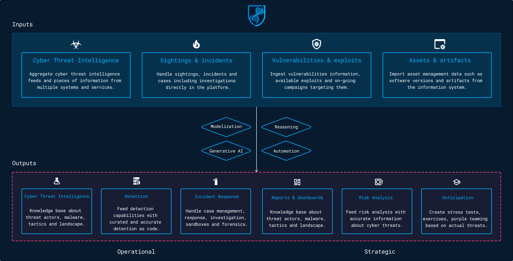

# Getting started

This guide aims to give you a full overview of the OpenCTI features and workflows. The platform can be used in various contexts to handle threats management use cases from a technical to a more strategic level. OpenCTI has been designed as a knowledge graph, taking inputs (threat intelligence feeds, sightings & alerts, vulnerabilities, assets, artifacts, etc.) and generating outputs based on built-in capabilities and / or connectors.

Here are some examples of use cases:

* Cyber Threat Intelligence knowledge base
* Detection as code feeds for XDR, EDR, SIEMs, firewalls, proxies, etc.
* Incident response artifacts & cases management
* Vulnerabilities management
* Reporting, alerting and dashboarding on a subset of data

## Welcome dashboard

The welcome gives any visitor on the OpenCTI platform an outlook on the live of the platform. It can be replaced by a [custom dashboard](dashboards.md), created by a user (or the default dashboard in a role, a group or an organization).

### Indicators in the dashboard

#### Numbers

| Component             | Description                                                                                                    |
| :-------------------- | :------------------------------------------------------------------------------------------------------------- |
| Total entities        | Number of entities (`threat actor`, `intrusion set`, `indicator`, etc.).                                       |
| Total relationships   | Number of relationships (`targets`, `uses`, `indicates`, etc.).                                                |
| Total reports         | Number of reports.                                                                                             |
| Total observables     | Number of observables (`IPv4-Addr`, `File`, etc.).                                                             |

#### Charts & lists

| Component               | Description                                                                                                    |
| :---------------------- | :------------------------------------------------------------------------------------------------------------- |
| Top labels              | Top labels given to entities during the last 3 months.                                                         |
| Ingested entities       | Number of entities ingested by month.                                                                          |
| Top 10 active entities  | List of the entities with the greatest number of relations over the last 3 months.                             |
| Targeted countries      | Intensity of the targeting tied to the number of relations `targets` for a given country.                      |
| Observable distribution | Distribution of the number of observables by type.                                                             |
| Last ingested reports   | Last reports ingested in the platform.                                                                         |