# Graph analytics: paths, similarity and clusters

OpenCTI computes deterministic analytics on top of your knowledge graph: how two entities are connected, which threats or infrastructures look alike, which elements form a cluster, and which entities are the hubs of your graph. Every result is explained by the knowledge it comes from, and none of them is ever written as a relationship: turning an analytics result into knowledge is always an explicit analyst action.

Graph analytics are part of the Community Edition and do not use any AI.

## Why use graph analytics?

- **Answer "how is this connected?" in one click**: find how an IP address relates to an intrusion set, or how two campaigns share infrastructure, instead of expanding the graph manually.
- **Spot look-alikes**: list the intrusion sets, malware or infrastructures that share the most techniques, tools, victims, certificates or hosting with the one you are looking at, with the shared elements as evidence.
- **Group what belongs together**: surface clusters of infrastructure sharing certificates, ASNs, registrars or name servers, and turn them into a Grouping or a Campaign when you agree.
- **Prioritize**: sort and filter any list or widget by the number of connections of an entity (graph degree), its approximate betweenness (how often it bridges parts of the graph) or the size of its cluster.

!!! note "Access rights"

    Analytics respect markings and organization restrictions. A path never goes through an entity you cannot access, a similar entity is only listed when you can access it, only the shared evidence you can access is displayed, and graph metrics never count relationships you cannot read (see [graph metrics and access restrictions](#graph-metrics-and-access-restrictions)).

## Find paths between two entities

### From an entity

1. Open any entity, open the more-actions menu of its header and click **Connect to...**.
2. Select the target entity.
3. Optionally adjust the search: maximum path length (4 relationships by default, 6 at most), number of paths, relationship types and intermediate entity types, inferred relationships, or going through containers (reports, groupings, cases). Each setting has a help line under it with an example, and **Learn more** at the top of the dialog opens this section.
4. Click **Find paths**. The shortest paths are listed first, each one as a chain of entities and relationship types. Longer paths are only listed when they reach each of their entities by its shortest route: a detour through an entity already reached by a shorter path is not listed.
5. Select the paths you are interested in and click **Start an investigation with the selected paths** to open them in a new investigation.

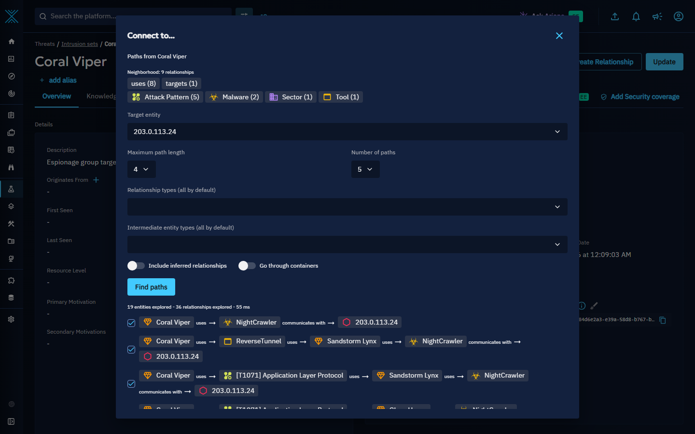

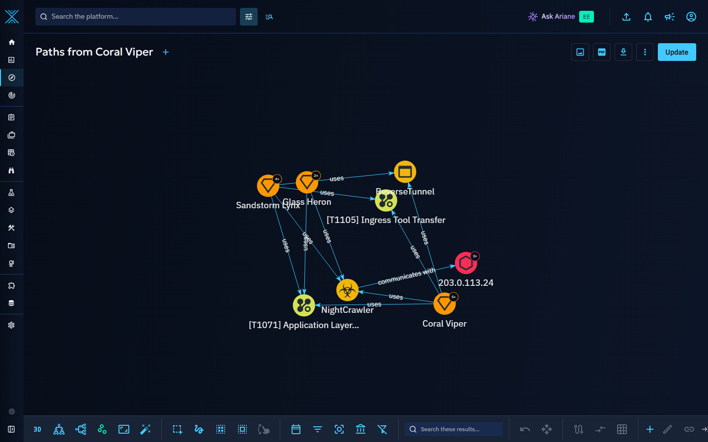

When no path is found, the result offers the next step: **Allow longer paths** raises the maximum path length by one and searches again, and **Remove the type filters** searches again without relationship and entity type restrictions.

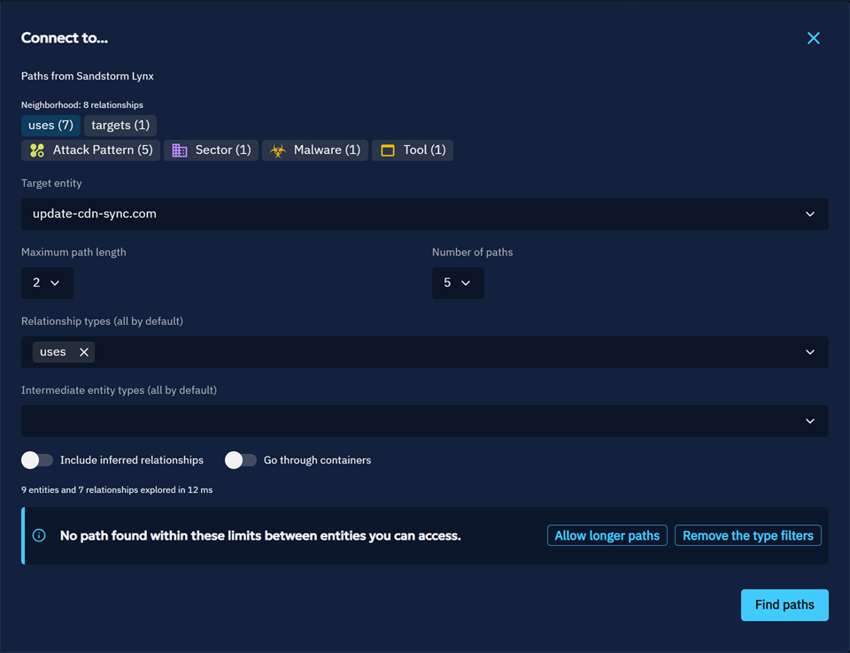

The search is bounded in time and in explored entities. When a limit is reached, a warning tells you that longer paths may exist, and **Narrow by relationship type** takes you to the relationship type filter: a narrower search explores fewer entities. The neighborhood chips at the top of the dialog add or remove a relationship type in one click.

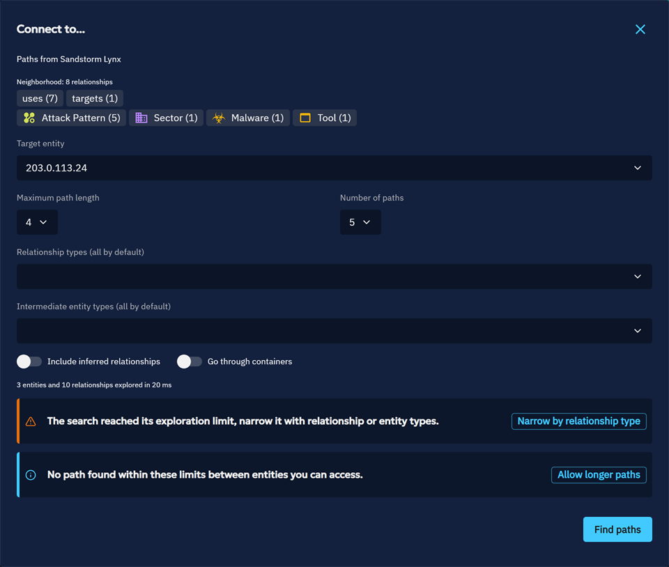

### In an investigation

Select two entities in the investigation graph and click **Find path** in the toolbar. The selected paths are added to the graph, and the rollback button removes them like any other expansion.

## Similar entities

### The Similar tab

Threats (intrusion sets, threat actors, campaigns), malware, infrastructures, domain names, hostnames, IP addresses, URLs and certificates have a **Similar** tab, right after **Analyses**, listing their look-alikes. Similar reports are found in investigations (**Expand by similarity**) and in the similarity matrix widget. For each similar entity, the tab shows:

- how **similar** it is, as a percentage with a bar; hover the percentage to see the two measures it combines, a weighted Jaccard index of the shared elements and a structural similarity of the relationship types,
- the number of **shared elements** and when the similarity was computed,
- the **shared evidence**, grouped by family, each element being a link to the entity,
- a flag when an existing **OpenAEV scenario** covers the similar threat (through its Security Coverage), with a filter to only list those,
- actions to **compare side by side** or open the entity in a new tab.

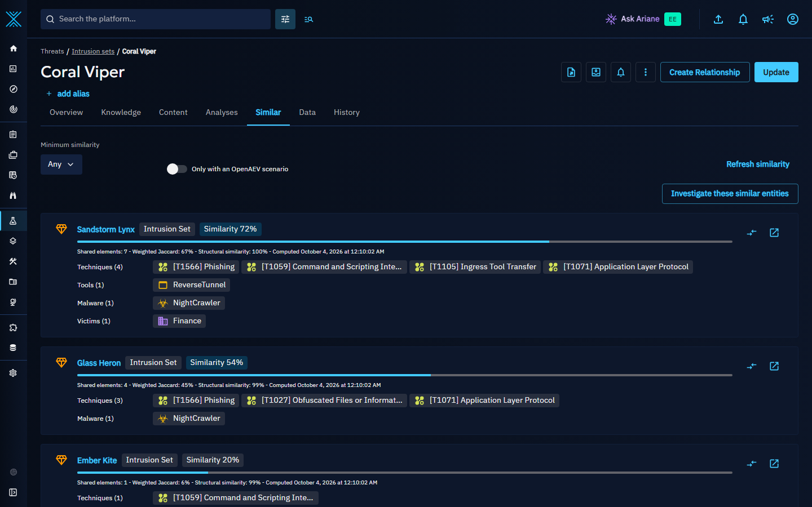

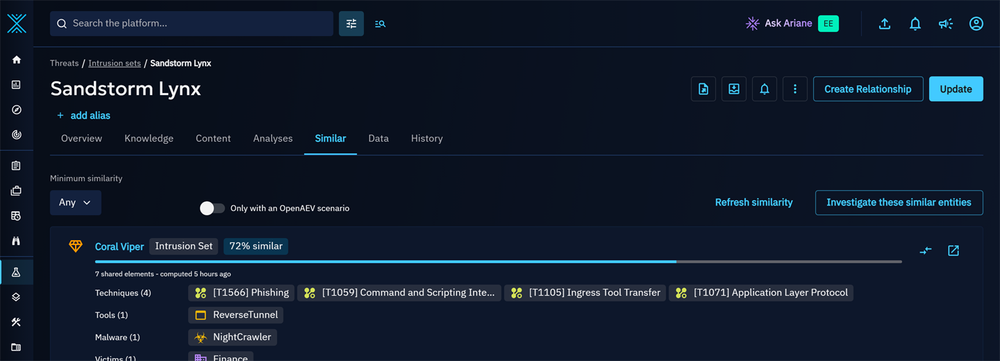

The **Investigate these similar entities** button, on the same toolbar as the filters and **Refresh similarity**, starts an investigation with the entity, its look-alikes and the shared evidence. An investigation always starts with the whole result: a result of more than 2,000 entities is refused with a message giving its size, and a higher minimum similarity narrows it.

When no look-alike is listed, the tab names the next step. With a minimum similarity or **Only with an OpenAEV scenario** set, **Reset the filters** lists every look-alike again. Otherwise, it names the knowledge similarity is computed from (the techniques, tools, malware, infrastructure or victims of a threat or a malware; the certificates, autonomous systems, registrars, name servers or hosting of an infrastructure or an observable): add it, for example from a report, then click **Refresh similarity**.

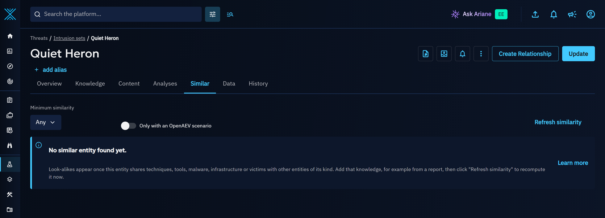

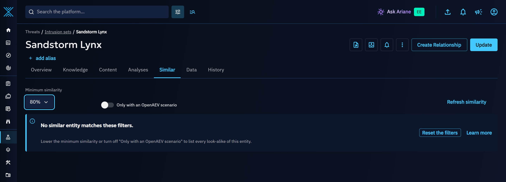

**Compare side by side** lines up the description, author, creation date, graph degree, graph cluster, markings and labels of both entities, then lists the shared evidence.

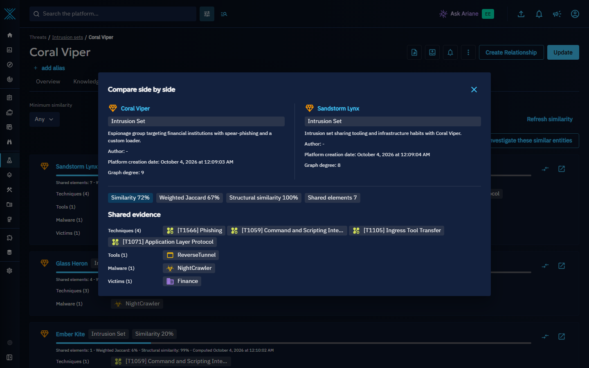

### How similarity is computed

Entities are only compared with entities of the same group (threats together, malware together, infrastructures together, domain names with hostnames, IP addresses together, and so on), on the elements that characterize them:

| Entity types | Shared elements used |
|---|---|
| Intrusion sets, threat actors, campaigns, malware | Techniques, tools and malware they use, infrastructures they use or control, victims they target (sectors, organizations, individuals, locations) |
| Infrastructures and observables | Certificates, autonomous systems, registrars, name servers, co-hosted names or addresses, related infrastructures and malware, reports they appear in |
| Reports | Objects they contain |

Rare and specific elements (certificates, malware, infrastructures, name servers) weigh more than broad context (victims, autonomous systems). Elements shared by too many entities, such as a popular hosting provider, are not used to find look-alikes, so that a common element alone does not make two entities similar. A score is never displayed without at least one shared element.

Similarities are computed in the background by the [graph analytics manager](../deployment/advanced/managers.md#graph-analytics-manager) about a minute after the knowledge of an entity changes, and refreshed every night. Click **Refresh similarity** in the Similar tab to request an immediate recompute.

### In an investigation

- **Expand by similarity**: select entities in the investigation graph to list their look-alikes, then add the ones you choose to the graph.
- **Similarity matrix**: select up to 25 entities to compare them pairwise in a heat map.

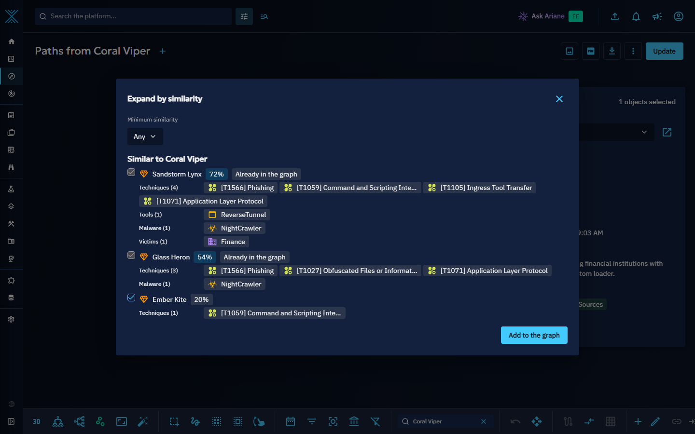

## Clusters

The **Analyses > Clusters** page lists clusters of entities that belong together:

| Kind | Content |
|---|---|
| Infrastructure cluster | Mostly infrastructures and observables (IP addresses, domain names, URLs, certificates, autonomous systems) sharing certificates, autonomous systems, registrars, name servers, hosting or report co-occurrences |
| Tooling cluster | Mostly malware, tools and attack patterns used together |
| Campaign cluster | Other communities of the graph, typically threats, campaigns, their victims and the reports they appear in |

The platform computes infrastructure clusters from shared features. On large platforms, the optional analytics process detects communities in the whole graph and computes the three kinds.

The top of the page states whether the analytics are up to date or analysing, with the time of the last full pass, then three counters: clusters you can see (those with at least one member you can access, as in the list), similarity links between two entities you can access (among the 10,000 most recently computed; an account that bypasses data restrictions sees every link), and entities waiting for analysis that you can access (among the next 10,000 in the queue; an account that bypasses data restrictions sees the whole queue). When entities are waiting, **Show the entities** lists the next ones you can access, in processing order, and users who can edit knowledge can click **Analyse them now** to have them recomputed at the next run. **Details** tells who computes the clusters: the platform, or the optional analytics process on large platforms.

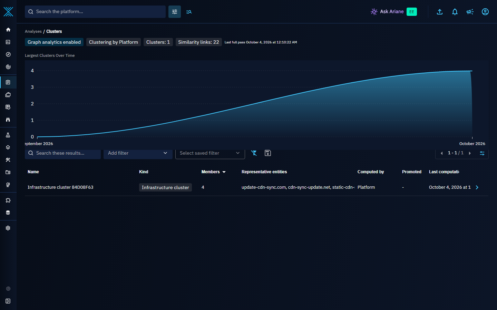

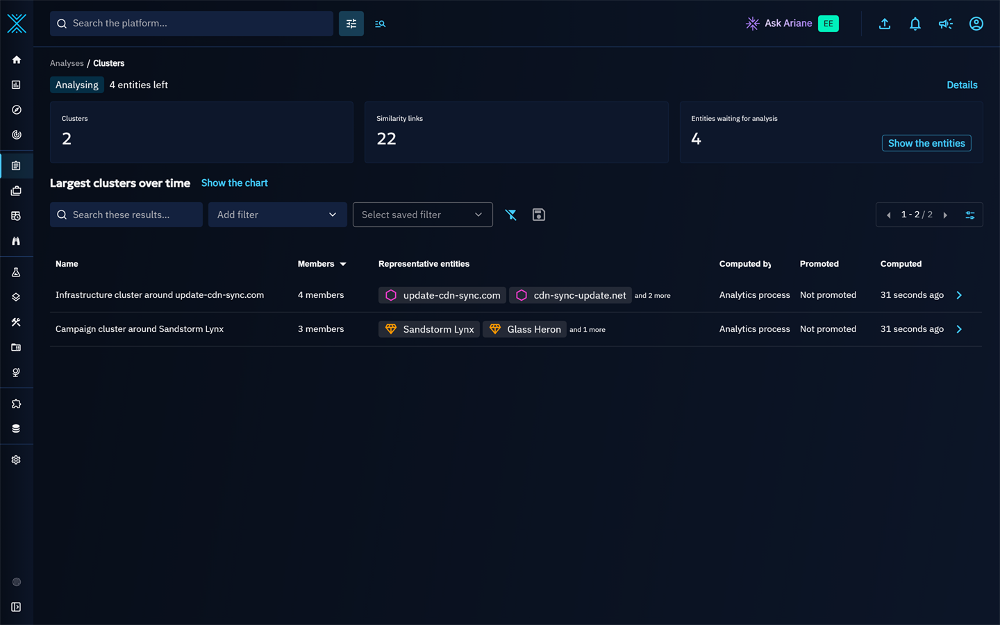

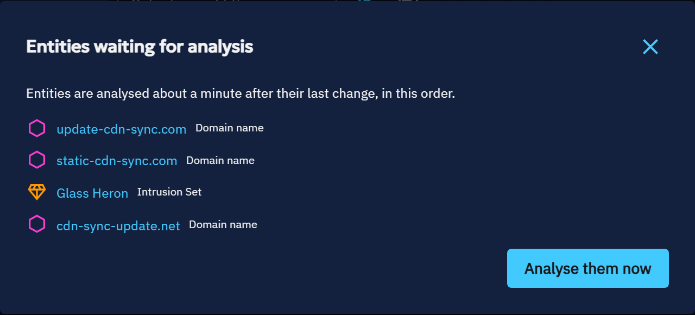

A cluster is named after the first of its representative entities you can access, for instance "Infrastructure cluster around update-cdn-sync.com"; its identifier is shown when you hover the name. The list shows the number of members, the first representatives and the number of other representatives (named when you hover it), whether the cluster was promoted, and when it was computed. It covers the 10,000 clusters with the most members you can see: on a larger knowledge graph, filter by kind or by member to reach the others. **Show the chart** displays the growth of the largest clusters since they appeared; it is shown by default from three clusters.

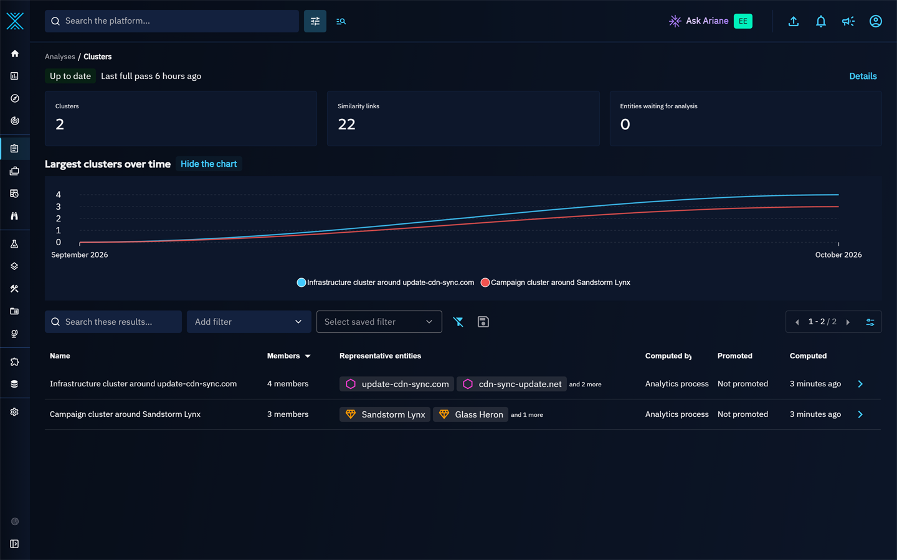

Until the first full pass has found clusters, the page explains what clusters are and when the next full pass starts.

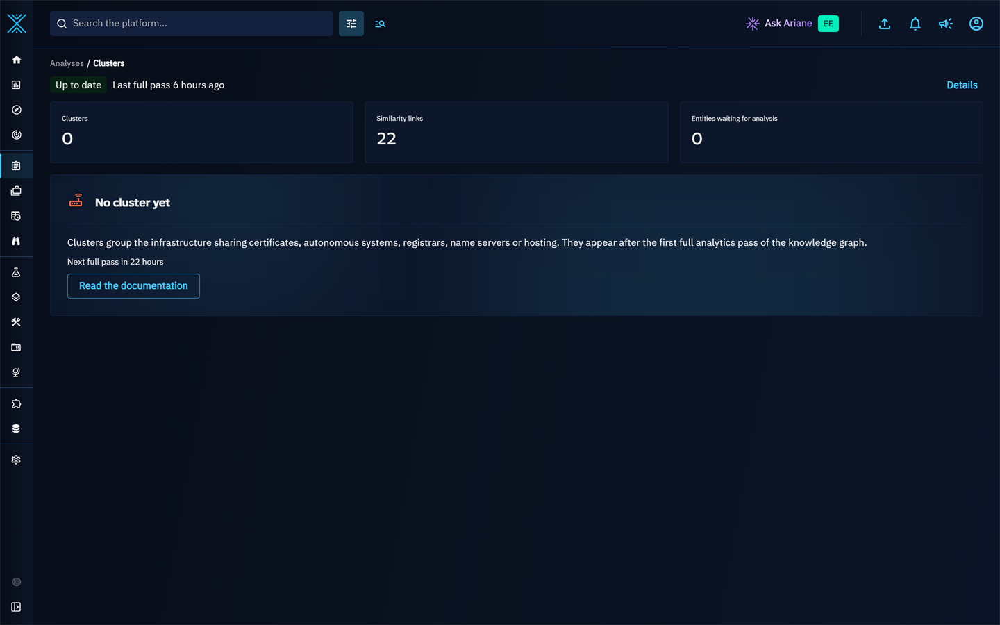

The detail of a cluster shows its members (most connected first), its shared features, its representative entities and the growth of its membership. From there:

- **Create Grouping** creates a Grouping containing the members you can access, and optionally the shared features. The dialog lists the members it will contain before you confirm: the first five, then **Show more** loads the next ones until every member is listed.
- **Create Campaign** creates a Campaign related to the members you can access.
- In both dialogs, **Include the shared features** (on by default) also adds the certificates, autonomous systems, registrars and other features the members share, as the evidence of what ties them together; when it is off, only the members are added.
- **Add to investigation** opens the members and shared features in a new investigation.

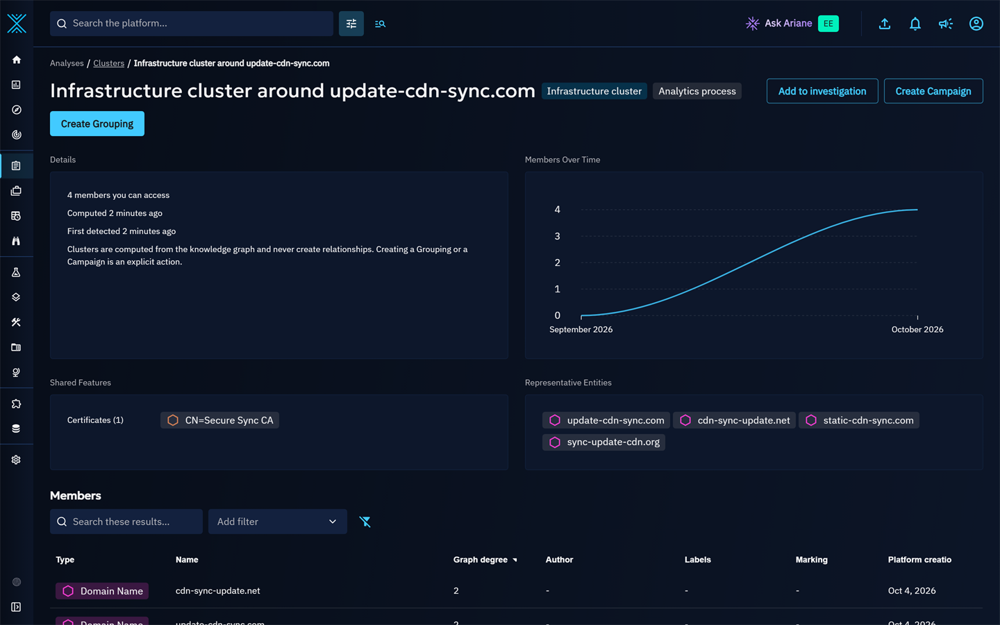

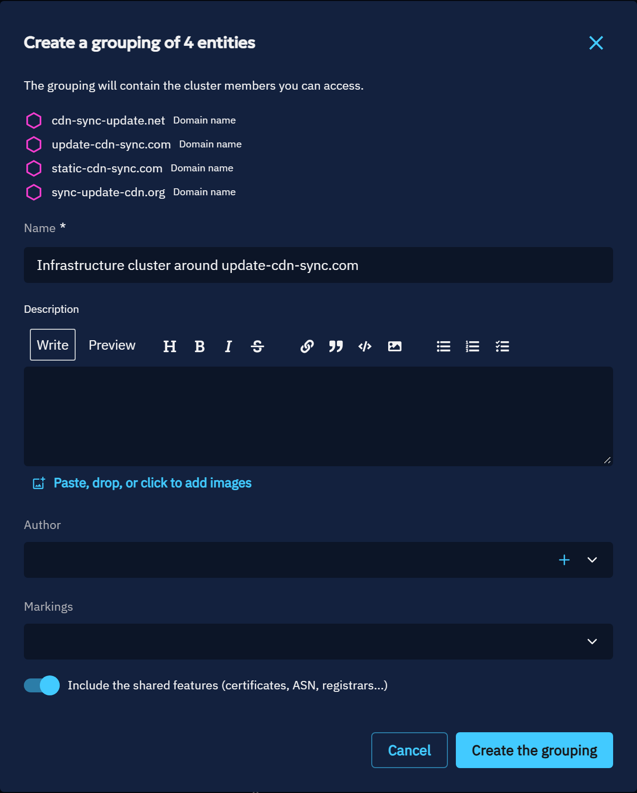

A Grouping, a Campaign or an investigation always holds every member you can access: a cluster with more than 2,000 accessible members cannot be promoted or added to an investigation, and the cluster page says so.

A cluster keeps its identity from one computation to the next, as long as it holds most of its previous members, even when it grows, shrinks or splits: the Groupings and Campaigns it was promoted to remain listed on it, and the cluster size over time counts the members from the date they joined the cluster.

To be told when an entity you follow joins a cluster, create a live trigger on **Joined a graph cluster** (see [notifications](notifications.md#graph-analytics-events)), or add this event to the subscription of the entity from its subscription button.

## Graph metrics on entities

Every entity carries graph metrics, refreshed in the background without changing its modification date:

- **Graph degree**: number of relationships and sightings of the entity.
- **Approximate betweenness**: how often the entity lies on the shortest paths between other entities (computed by the analytics process).
- **Graph cluster** and **graph cluster size**: the cluster the entity belongs to.

You can filter on **Graph degree** and **Graph cluster** in lists and dashboards, sort lists by these metrics, and display them as list widget columns. For instance, a list widget of intrusion sets sorted by graph degree shows the hubs of your threat landscape.

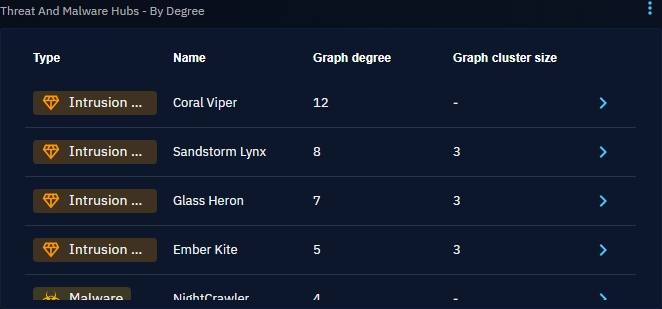

### Graph metrics and access restrictions

The metrics computed in the background count every relationship of the platform. They are shown as computed, and can be used to filter, sort and rank, only by users who can read every relationship: users with the **Bypass** capability, and users who hold every marking definition and, when a platform organization is set, belong to it.

For every other user, nothing derived from relationships they cannot read is disclosed:

- **Graph degree** and its split by relationship type are counted from the relationships the user can read and whose other end the user can access. An entity with more than 10,000 such relationships shows no graph degree for these users rather than a partial count.
- **Graph cluster size** is the number of cluster members the user can read.
- **Approximate betweenness** is not displayed, as it cannot be derived from a partial view of the graph.
- The **Graph degree** filter and the sorting options based on graph metrics are not offered. A list widget ranked by a graph metric explains why it is empty, and the API rejects such filters and sorts.
- Clusters are ranked by the number of members the user can read, and the similarity matrix of a data selection ranks the 500 most recently created matching entities by the number of relationships the user can see.

## Dashboards

Three widgets are dedicated to graph analytics (see [widget creation](widgets.md)):

- **Similarity matrix**: pairwise similarity of the most connected entities of the selection, up to 25 entities.
- **Cluster size over time**: growth of the largest clusters whose members match the selection, up to 20 clusters.
- **Top hubs**: the most connected entities of the selection ranked by graph degree, up to 50 entities; click a bar to open the entity.

All three are available in public dashboards. Like any ranking on graph metrics, the top hubs are only shown to users who can read every relationship of the platform; in a public dashboard, this depends on the access of its author and on the markings the dashboard shares.

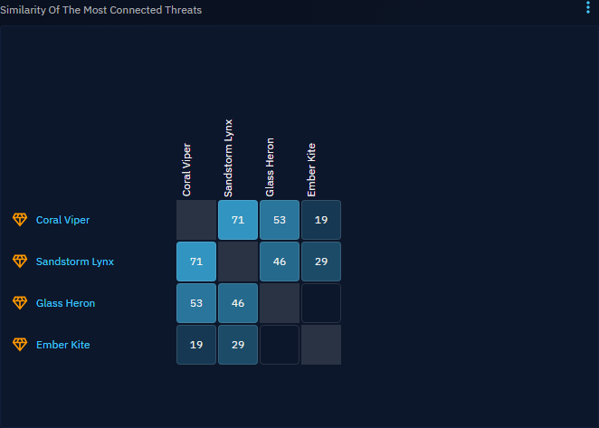

To start from a ready-made dashboard, open **Dashboards**, click **Create from template** next to **Import dashboard** and choose **Graph analytics**. The created dashboard holds the largest clusters with their members over time, the similarity of the most connected threats, two lists ranked by graph degree (the threat and malware hubs and the infrastructure hubs) and the top hubs of the whole knowledge graph. Like any dashboard, it can then be edited, shared or made public. A cluster widget without data says so: clusters appear when an analytics pass finds entities sharing infrastructure.

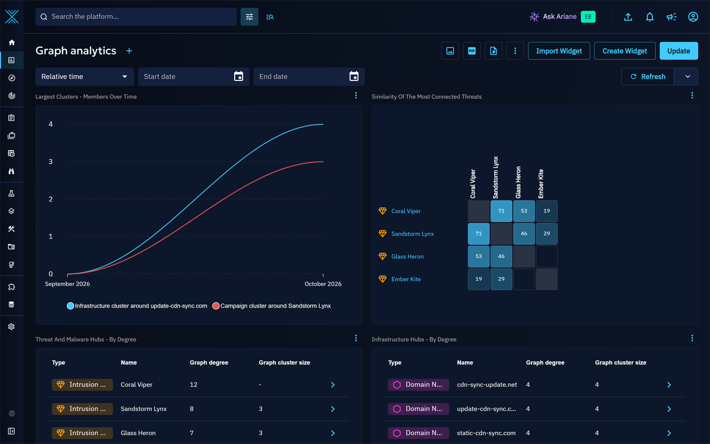

## What's next?

- [Pivot and investigate](pivoting.md) in investigations.
- [Deploy and configure graph analytics](../deployment/graph-analytics.md), including the analytics process for large platforms.
