# Work with graphs

OpenCTI draws knowledge as graphs in several places: the **Graph** and **Correlation** views of containers (reports, groupings, incident responses, requests for information and for takedown), **investigations**, the graph view of the **Analyses** tab of an entity, and the explanation of an **inferred relationship**. All of them draw nodes, links and badges the same way. The first four are the interactive graph described on this page; the explanation of an inferred relationship is a fixed, read-only illustration of the rule that produced it, with the focus on hover and the keyboard list of its elements but without controls, legend, layouts or context menu.

## Why use the graph?

A graph shows what a list cannot: who is connected to what, through which relationships, and how strongly. The graph is built to answer those questions quickly:

- every node says what it is (icon and colour of its type), what it carries (markings, a low confidence, an inference) and how certain its relationships are;
- focusing on an entity fades everything else, so its neighbourhood reads at a glance;
- deterministic layouts arrange the same graph the same way every time, from the threat to its victims;
- every element can be acted on from where it is drawn.

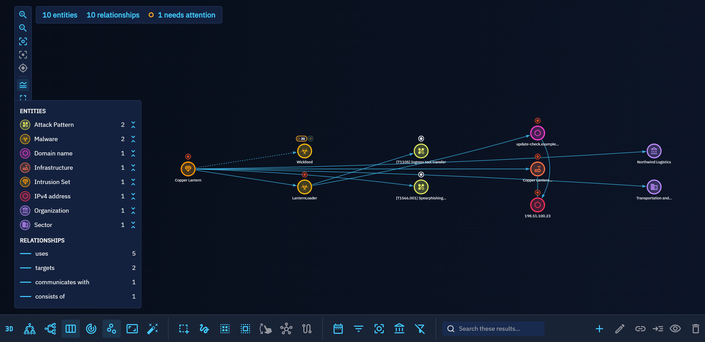

## Where graphs appear

The same interactive graph, with the same controls, is drawn on every surface below, in the dark and the light themes.

=== "Knowledge of a container"

    The **Graph** view of the **Knowledge** tab of a report, a grouping, a case or any other container draws its entities and relationships.

    === "Dark theme"

        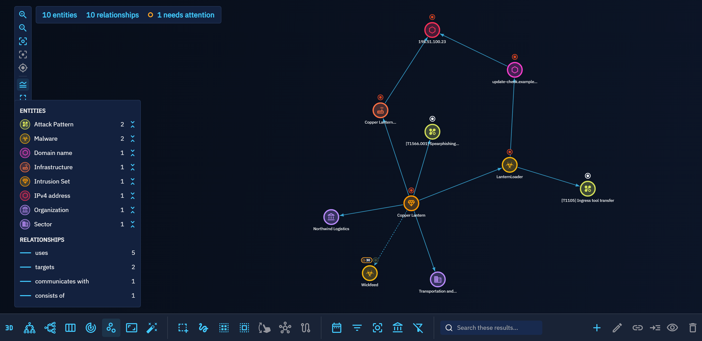

    === "Light theme"

        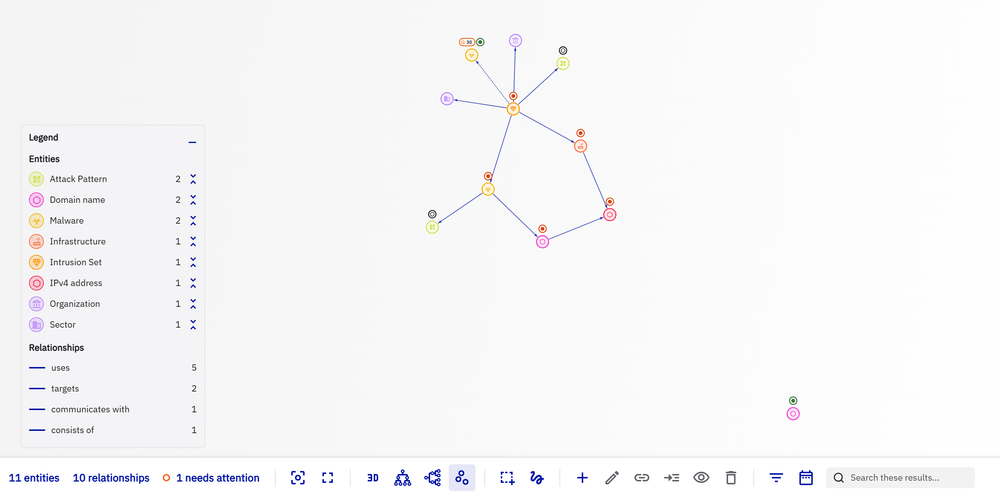

=== "Correlation"

    The **Correlation** view of a container links its observables and indicators to the other containers that share them.

    === "Dark theme"

        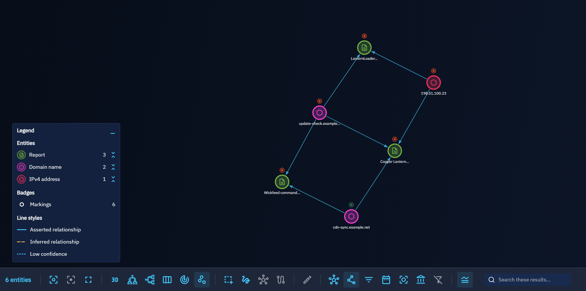

    === "Light theme"

        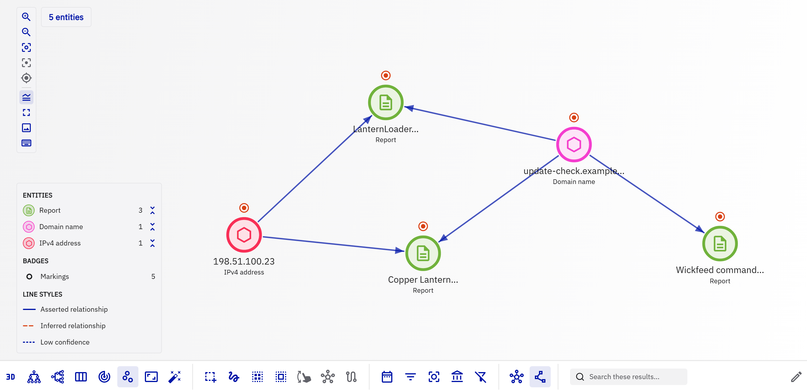

=== "Investigation"

    An investigation of the **Investigations** workspace starts from a few entities and grows as you expand them (see [Pivot and investigate](pivoting.md)).

    === "Dark theme"

        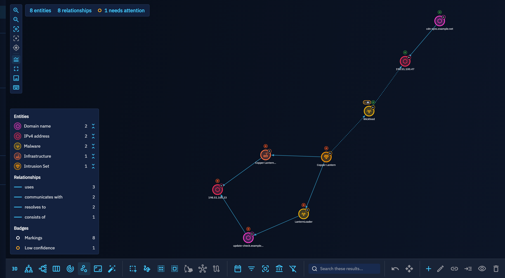

    === "Light theme"

        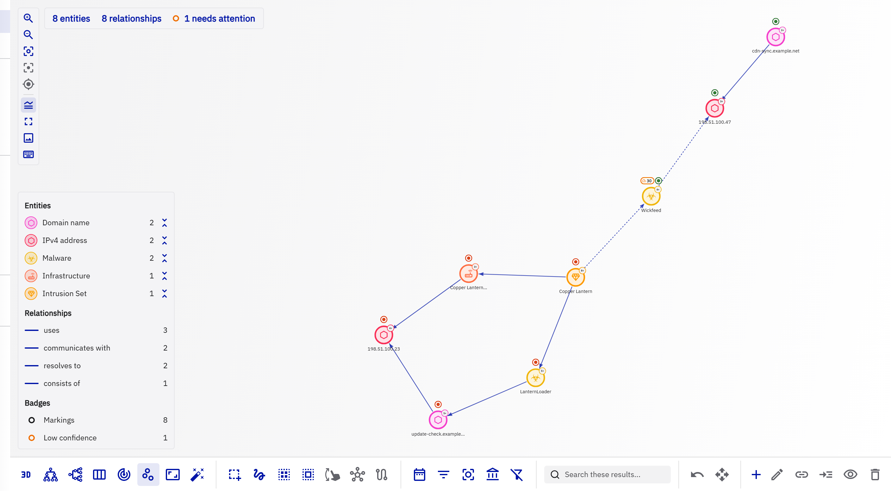

=== "Analyses of an entity"

    The graph view of the **Analyses** tab of an entity draws the containers in which the entity appears, with the other objects they share.

    === "Dark theme"

        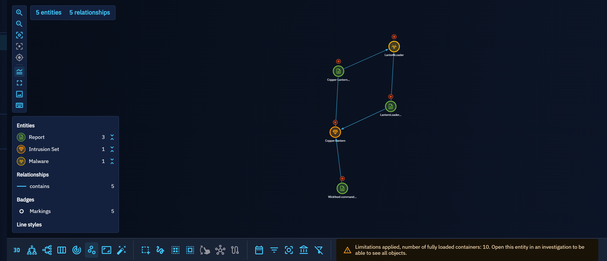

    === "Light theme"

        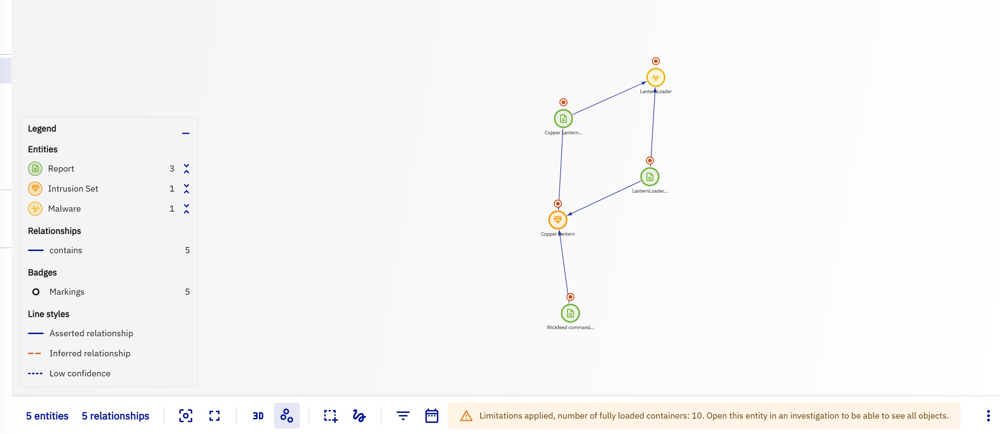

## Read the graph

### Nodes

Each entity is a disc tinted with the colour of its type, ringed with that colour and marked with the icon of its type, the same icon as everywhere else in the platform. Its name is written below; long names are shortened, the full name is in the hover card. Relationships that are themselves the source or target of another relationship are drawn as smaller nodes.

Above a node, **badges** give its state. At most three are drawn, the most severe first (an error before a warning), followed by `+2` for example when the entity carries more; the hover card lists every badge with what it means.

| Badge | Meaning |
|---|---|
| Coloured dot | The markings of the entity, in the colour of its first marking (for example TLP:GREEN), with their number when there are several; the hover card names each of them. |
| Gauge with a number | A low confidence (below 50), with its value. |
| Wand | The entity is inferred by the rules engine. |

Other features of the platform can add their own badges (see [Extend the graph](#extend-the-graph)).

An entity you do not have access to, because of its markings or of an organization restriction, is drawn with a dashed outline and named **Restricted**; its hover card says that you do not have access to it.

In investigations, a small counter on the top right of a node tells how many relationships of the entity are not drawn yet (`5+`, `99+`, or `?` while the count loads).

### Links

| Style | Meaning |
|---|---|
| Plain line | A relationship asserted in the knowledge base. |
| Dashed line, warning colour | An inferred relationship. |
| Dotted line | A relationship with a low confidence (below 50). |

Links end with an arrowhead on their target. Several relationships between the same two entities are fanned out instead of drawn on top of each other. The name of a relationship appears along its link when you zoom in, or when the link is selected or hovered. A label never covers an entity: it slides along its link when the middle is taken, and is left out when it finds no free place.

In the deterministic layouts, which line entities up, a link that would run through another entity bends around it, so that it never reads as two links.

### Level of detail

Details appear as they become readable: far out, nodes are plain discs; closer, icons, names, badges, arrowheads and relationship names appear. The entity hovered, selected or on a highlighted path always keeps a readable name.

## The toolbar

Every action on the graph lives in one toolbar docked under it; nothing covers the canvas unless you open it (the legend, a hover card, a dialog).

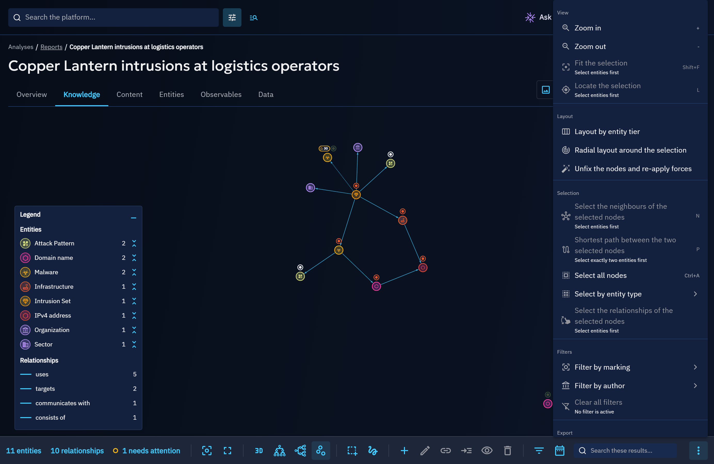

From left to right:

| Group | Actions |
|---|---|
| Counters | The entities drawn one by one (the legend also counts the members of collapsed groups), the relationships, the entities you do not have access to (**restricted**) and the entities that **need attention** because they carry a warning or an error badge, such as a low confidence. Click a counter to select what it counts. While something is selected, the first counter tells what the selection holds against the totals, for example **3 of 19 entities · 2 of 25 relationships selected**; click it to fit the selection. |
| View | Zoom in and out, **Fit the whole graph**, fit the selection, locate the selection, full screen. |
| Layout | 3D mode, hierarchical layouts (top to bottom, left to right), layered layout (by entity category), radial layout, force-directed layout (see [Layouts](#layouts)). |
| Selection | Box and lasso selection, adding the neighbours to the selection, the shortest path between two entities (see [Select](#select)). |
| Creation and removal | Add entities, edit the selected item, create a relationship, a nested relationship or a sighting, remove the selection; in investigations, expand the selection and roll the last expansion back. |
| Filters | Filter by type (entity and relationship types, the same filters as the legend), by marking and by author, the time range selector, and **Clear all filters**; in correlation graphs, show every correlated entity or only the observables and indicators. A number on a filter tells how many choices are in use. Each filter opens a menu of its choices, grouped under headings and checked when in use; the menu stays open so that several choices can be made in a row. |
| Export and help | The high-resolution image export, the keyboard shortcuts. |

The toolbar acts on the drawing: what is shown and how, the selection, the filters of the drawing and its image. The header of the page acts on the knowledge it is about: export as a PDF or a STIX report, add to a container, duplicate, delete, manage the access restriction. The legend opens and closes from itself (see [The legend](#the-legend)).

The search field and the **More actions** menu close the toolbar. **More actions** holds, when the window is too narrow for the whole toolbar, the actions it has no room for, grouped the same way; the rare actions (select all nodes, select by entity type, the relationships of the selection, unfix the nodes) are in the [context menu](#context-menu). On a graph narrower still (a small window, or a side panel open next to it), the creation and removal tools fold into one **Creation and removal** button that opens them.

Every tooltip names the action, and its keyboard shortcut when it has one; a disabled action says why in its tooltip (for example "Select entities first"). The toolbar is one stop of the `Tab` key: the arrow keys, `Home` and `End` move between its controls.

## Navigate

Fitting keeps every entity clear of the legend, the details panel and the toolbar. A graph opened for the first time is fitted again once its layout settles, unless you zoomed or moved it meanwhile; afterwards it opens as you left it. In full screen, the toolbar and every dialog stay available; press `Esc` or **Full screen** again to leave.

## Focus and hover cards

Hovering an entity or a relationship, or selecting it, keeps it and its direct neighbours at full strength and fades the rest of the graph.

After a short moment on an element, a **hover card** previews its key facts: type, name, date, author, confidence, markings, relationship counts, every badge with what it means and, in investigations, the number of relationships not drawn yet. The card only reads; what you can do with the element is in its context menu.

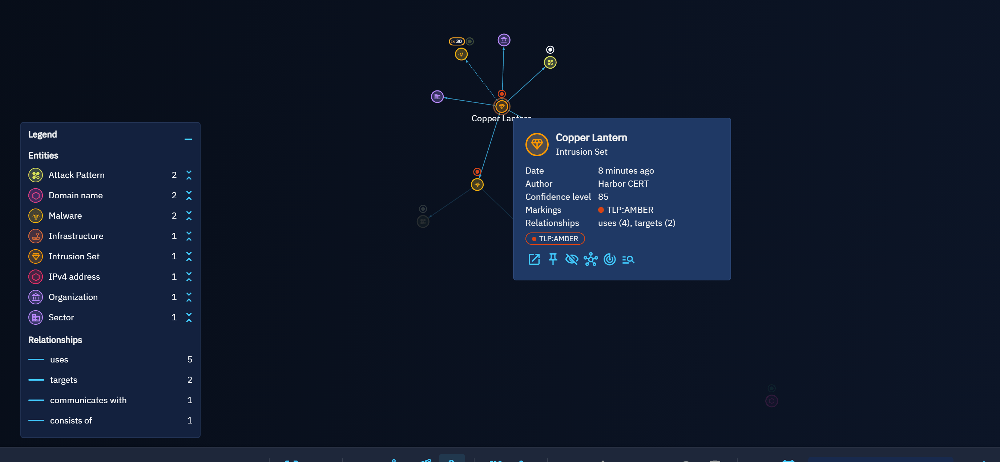

## Context menu

Right-click an entity, a relationship or the empty canvas, or press `Shift` + `F10` (or the context-menu key of the keyboard), to open the menu of what is under the pointer; on macOS, `Control`-click opens it too, and `Command`-click adds to the selection. A right press that moves draws a relationship from one entity to another instead, where relationships can be created, and opens no menu.

- On an **entity**: **Open in a new tab**, **Expand this entity** (investigations), **Select entity and neighbours**, **Pin in place** / **Unpin**, **Hide** (the entity is not removed from the container or the investigation; the legend shows it back), **Lay out the graph around it** (radial layout), **Highlight shortest path from the selection** and **Create a relationship from the selection** when one other entity is selected, **Start an investigation** (outside investigations, for users allowed to create them, not in a draft), and the actions other features add.
- On a **group node**: **Ungroup** and **Pin in place**.
- On a **relationship**: **Open in a new tab** and **Select this relationship**.
- On the **selection** (an entity of a selection of several, or the canvas while something is selected): **Add neighbours to selection**, **Highlight shortest path between the two selected nodes**, the outgoing or incoming relationships of the selection, **Fit the selection**, **Hide**, **Create a relationship** between two selected entities and **Start an investigation** with the selected entities.
- On the **empty canvas**: **Select all nodes**, **Select by entity type**, **Invert selection**, **Clear selection**, **Show the hidden entities**, **Ungroup all** and **Unfix the nodes and re-apply forces**.

An action that cannot run says why under its name, for example **Nothing is selected**.

## The legend

The legend on the bottom left counts the entities of each type and the relationships of each type drawn in the graph.

- Click a counter to fade or restore every entity or relationship of that type; these are the filters of **Filter by type** in the toolbar.
- Use **Group by type**, the button next to an entity type, to group all its entities into a single group node, and **Ungroup** to bring them back; the row of a grouped type reads **Group:** followed by the type. A click on a group node ungroups it too; its hover card lists its first five members, and its context menu offers **Pin in place**, so that the group keeps its place while the rest of the layout moves. Relationships towards the members of a group are drawn once towards the group, and relationships between two members as a loop on the group; the legend and the hover cards count every relationship the group stands for, while the counters of the toolbar count only what is drawn one by one. **Select by entity type** offers a grouped type again once it is ungrouped.
- When entities are hidden, **Show the hidden entities** brings them back. The hidden entities are remembered for each graph in your browser; they are not part of the page link you share.
- The **Badges** section lists only the badges present in the graph, with the number of entities carrying each; click one to select those entities.

**Minimise the legend** (the button in its header, or `G`) folds it to a small **Legend** pill in the same corner, which tells how many type filters are in use; click the pill or press `G` again to open it. The choice is remembered for every graph you open.

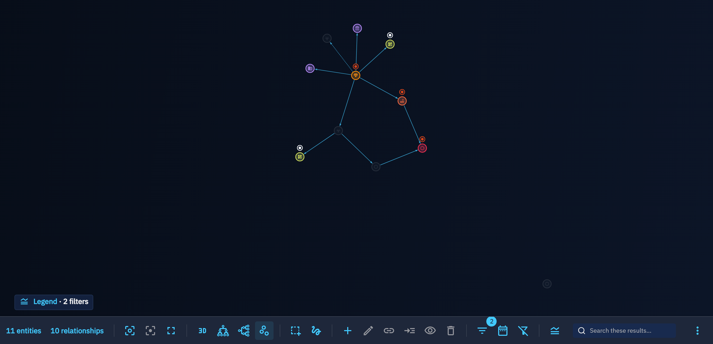

When the time range selector of the toolbar is open, the legend moves up so that the whole slider stays free; when the graph is too short to show the legend whole, it scrolls.

## When nothing is drawn

The graph says why it is empty and offers the next step:

- a container or an investigation without any entity yet explains how to add some, with a link to this page;
- when the filters of the toolbar leave no entity, **Clear filters** restores the graph;
- when every entity is hidden from the view, **Show the hidden entities** brings them back.

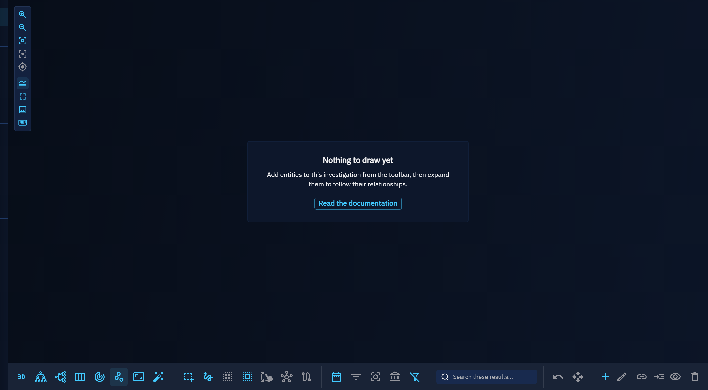

## Layouts

The **Layout** group of the toolbar offers several layouts, each a toggle. All of them except the force-directed layout are deterministic: the same graph is always drawn the same way, and nodes glide to their new place.

| Layout | Use it to |
|---|---|
| Force-directed layout (default) | Let related entities gather; drag nodes to arrange them, their positions are saved. |
| Hierarchical layout (top to bottom / left to right) | Follow the direction of the relationships, from sources to targets, top to bottom or left to right. Cycles are handled. |
| Layered layout (by entity category) | Read an attack left to right: threats, arsenal, techniques, observables and indicators, victims, locations, then containers. |
| Radial layout | Put one entity at the centre (the selected one, or the most connected) and the others on rings by distance. |

**Unfix the nodes and re-apply forces**, in **More actions**, leaves a hierarchical, layered or radial layout, forgets the saved positions and lets the force-directed layout arrange the graph again.

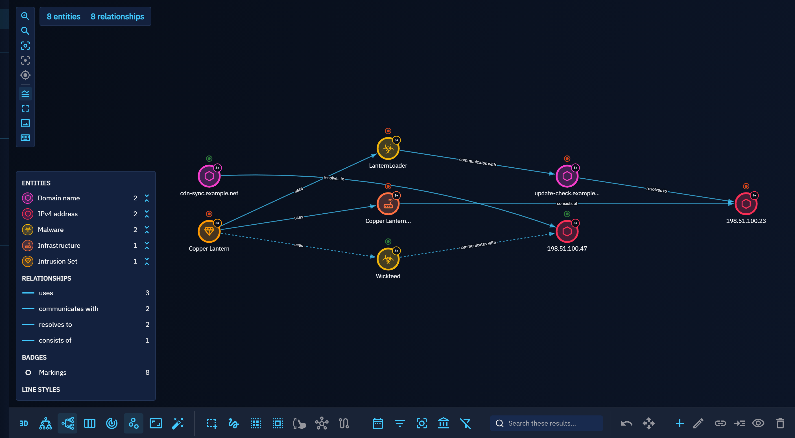

## Select

Besides clicking (with `Ctrl`, `Shift` or `Alt` to add to the selection), the toolbar selects with a box or a lasso; **More actions** selects all nodes, the nodes of an entity type, or the outgoing or incoming relationships of the selected nodes. The toolbar also:

- **adds the neighbours** of the selected nodes to the selection, which keeps them selected;
- **highlights the shortest paths** between two selected nodes: every path with the fewest relationships, whatever their direction; the counters tell how many there are and how many hops they take, for example **3 shortest paths · 2 hops**, and a click on that counter fits them. The paths stay highlighted until the selection changes.

The search field of the toolbar selects the matching entities. The graph view of the **Analyses** tab of an entity has no search field in its toolbar: the one of the page, above the graph, filters the containers it draws.

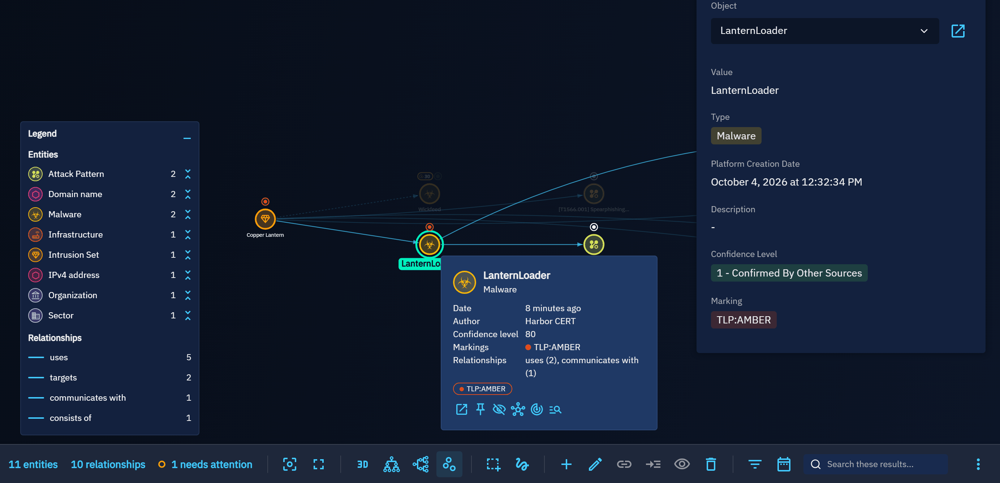

## Keyboard shortcuts

Shortcuts apply while the pointer is over the graph or the focus is inside it, never while typing in a field or when a dialog is open. In 3D mode, the shortcuts of the actions available in 2D only (zoom, locate, shortest path, legend, image export) do nothing. The `Esc` that closes a menu only closes it. Press `?` to list them in the platform.

| Keys | Action |
|---|---|
| `F` / `Shift` + `F` | Fit the whole graph / fit the selection |
| `L` | Locate the selection |
| `+` / `-` | Zoom in / zoom out |
| `Ctrl` + `A` | Select all nodes |
| `N` | Add neighbours to selection |
| `P` | Highlight shortest path between the two selected nodes |
| `H` / `Shift` + `H` | Hide the selection / show the hidden entities |
| `Esc` | Clear selection (leave full screen when nothing is selected) |
| `Shift` + `F10` | Open the context menu of the element under the pointer or in the keyboard list, else of the graph |
| `G` | Show or minimise the legend |
| `Shift` + `M` | Full screen |
| `Shift` + `E` | Export the whole graph as a high-resolution image |
| `/` | Search in the graph (where its toolbar has a search field) |

## Export

The image of a graph is exported from its toolbar: **Export the whole graph as a high-resolution image** renders the whole graph, not only the visible area, at print resolution, with a title and a legend of the entity types and line styles. The header of the page keeps the exports of the knowledge object: the PDF of the visible area and, for an investigation, the STIX report. On the other views of a container (timeline, matrix), the header also exports the visible area as an image.

Every export needs the capability that allows exporting knowledge; without it, the toolbar has no export and `Shift` + `E` does nothing.

## 3D mode

The 3D mode shows the same graph in three dimensions, with the same filters, hidden entities, groups and selection. Selection shapes, the legend and the deterministic layouts other than the trees are available in 2D only.

## Accessibility

Every entity and relationship drawn is mirrored in a list box that keyboard and screen reader users can reach with `Tab`: the arrow keys move in the list, the element reached is highlighted on the canvas, `Enter` or `Space` selects it (with `Shift` to add it to the selection), and the keyboard shortcuts above apply.

## Extend the graph

Features of the platform add states and actions to the graph without changing it:

- a **badge provider** returns badges for a node from the data the graph received, and returns nothing when its data is absent;
- a **node action** adds an action, or an action offering a choice, to the context menu of the nodes it applies to.

Both are registered in `opencti-platform/opencti-front/src/components/graph/badges/` (see `graphBadgeRegistry.ts` and `graphNodeActionRegistry.ts`); the built-in marking, confidence and inferred badges use the same contract.

## What's next?

- [Pivot and investigate](pivoting.md) with the investigation graph.
- [Analyses](exploring-analysis.md): the graph and correlation views of containers.
- [Inferences](inferences.md) and the graph explaining an inferred relationship.
