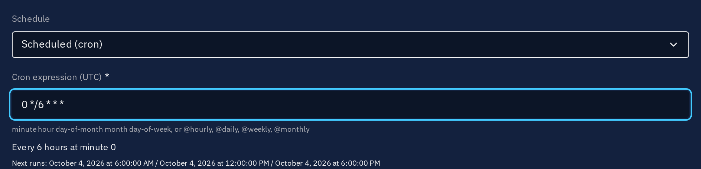

# Hunt automation

!!! tip "Enterprise edition"

    Scheduled hunts, standing hunts, PIR activation, playbook hunt components and the validation from OpenAEV are available under the **OpenCTI Enterprise Edition** licence. Please read the [dedicated page](../administration/enterprise.md) for full details.

    Manual hunts, manual runs, query tests, verdicts and hunt packs are part of the Community Edition.

An active hunt can run on its own. Automation never bypasses the analyst on what matters: hunts proposed by an agent start as drafts, Incidents are created in draft workspaces, and agent verdicts are proposals. What automation does on its own is limited to running hunts, recording their results (the observed data of the hunt connectors, the sightings OpenCTI keeps up to date) and creating Incident drafts or adding new hits to an incident still open. Recurring runs search since the previous run and only new hits escalate, see [How hits are counted](hunts.md#how-hits-are-counted).

## Schedules

The **schedule** of a hunt is `manual` (the default), `standing` (see below) or a cron expression, for instance `0 */6 * * *` for every 6 hours. Schedules firing more often than the minimum interval (15 minutes by default) are refused; the creation and edition forms check the interval configured on the platform and describe the schedule in words.

When a scheduled hunt is due, the hunt manager runs it on the platforms of its scope and computes its next occurrence from the current date: occurrences missed during an outage are not replayed. The next run date is displayed on the hunt.

Scheduled, standing and PIR armed runs target every hunt connector registered for the scope of the hunt, including a connector that is temporarily offline: its run waits in the queue until the connector reconnects, and is given up with its reason after the queue expiry (24 hours by default). An occurrence whose runs could not be created at all (for instance while the search engine is unavailable) stays due and is tried again at the next tick. Manual runs, query tests, playbook steps and validations from OpenAEV, which expect an answer now, only target the connectors that are online.

## Standing hunts

A **standing** hunt runs when the knowledge around it moves: a report adds one of its techniques or targets, a new sighting of one of its targets is created, an indicator it relies on is updated. The **trigger filters** of the hunt narrow down the events that start it (for instance, only reports with a given label).

Standing hunts are debounced: a hunt runs at most once per debounce period (15 minutes by default), however many events touch it. When the community trend of a target is rising in Threat Pulse, the debounce of its standing hunts is halved. The knowledge created by hunt runs never triggers standing hunts, so that a hunt never triggers itself.

## Activation by Priority Intelligence Requirements

With **PIR activation**, a hunt is **armed** while at least one of its targets is flagged by a [Priority Intelligence Requirement](pir.md). Arming runs the hunt once (the run is listed with the trigger **PIR activation**), and the hunt counts as armed once that run has started (when no hunt connector serves its scope yet, arming is tried again at the next tick); while armed, its schedule and standing triggers apply. When no PIR flags its targets anymore, the hunt is disarmed and waits. Arming never changes the status of the hunt, which remains the analyst's decision.

## Playbooks

Two playbook components orchestrate hunts. See [Playbook components](playbook-components.md).

- **Run hunts** runs hunts for the entities of the bundle: the hunts targeting them, or a fixed list of hunts. It can wait for the results: the playbook execution is suspended until every run the step started for its entity is settled (completed, failed or timed out with no retry left; an entity going through the same step at the same time waits for its own runs only), then continues with the bundle, optionally completed with the knowledge produced by the runs (a continuation interrupted by a stop of the platform is taken again 15 minutes later). That knowledge is read with the user of the hunt connector of each run: an object this user cannot read is never added to the bundle. A step whose hunts cannot run continues through its `no-hunt` output. When a playbook fires on every update of an entity, the same step runs a hunt once per entity per debounce period (15 minutes by default); other playbooks, other steps and other entities are never held back.
- **Match hunt results** routes the bundle on the outcome of the hunt runs of the execution for its entity: their verdicts (the verdicts proposed by the triage agent can stand for the runs still pending), a minimum number of hits, an Incident draft opened. Bundles that do not match continue through its `no-match` output.

## Validation from OpenAEV

When OpenAEV finishes an inject for a technique on an asset whose security platform is known, it asks OpenCTI to validate the detection: every active hunt covering the technique runs on the hunt connector of that security platform, over the execution window of the inject. The request is idempotent per inject, technique, hunt, platform and security coverage, including when OpenAEV delivers the same inject several times at once: an inject emulating several techniques gets runs of its own for each technique.

When the runs complete, OpenCTI writes the `hunt_detected` coverage on the security coverage of the simulation: 100 when a hunt found the emulated activity on any security platform of the inject, 0 otherwise. Each security coverage only reads its own validation runs, and a retried run counts like the run it replaces. This coverage is kept when OpenAEV later updates the security coverage.

## Hunt manager

The hunt manager runs on one platform node at a time. It dispatches the queued runs within the connector budgets, expires the runs a connector never completed, completes the finalization of runs that were interrupted after their final report (automatic verdict, incident draft, hunt statistics), retries failed runs, resumes the playbooks waiting on hunts, applies the run retention and, in Enterprise Edition, starts the scheduled, standing and PIR armed hunts. Manual runs rely on it too, the manager is therefore enabled in every edition.

Work a tick cannot take is kept for the next tick, never dropped: due scheduled hunts beyond the tick budget, or whose runs could not be created, keep their occurrence, triggered standing hunts stay pending until a run serves them, a hunt scoped to more security platforms than the budget left in the tick has its other runs queued and dispatched at the next ticks, and the runs queued for a saturated or offline connector never hold back the runs of the other connectors.

| Parameter | Environment variable | Default | Description |
|---|---|---|---|
| `hunt_manager:enabled` | `HUNT_MANAGER__ENABLED` | `true` | Enable the hunt manager |
| `hunt_manager:interval` | `HUNT_MANAGER__INTERVAL` | `30000` | Interval between two ticks, in milliseconds |
| `hunt_manager:max_runs_per_tick` | `HUNT_MANAGER__MAX_RUNS_PER_TICK` | `50` | Maximum runs dispatched by one tick, shared by all its phases in this order: automatic retries, PIR activation, scheduled hunts, standing hunts, then the queued runs. Runs beyond it wait queued, and due retries, schedules and triggers stay due, for the next tick |
| `hunt_manager:automation_page_size` | `HUNT_MANAGER__AUTOMATION_PAGE_SIZE` | `500` | Hunts read per page: due scheduled hunts per tick, and the page size used to evaluate the PIR activated and standing hunts |
| `hunt_manager:automation_max_pages_per_tick` | `HUNT_MANAGER__AUTOMATION_MAX_PAGES_PER_TICK` | `4` | Pages of PIR activated hunts evaluated per tick; the next tick resumes after the last hunt evaluated, so every hunt is evaluated within a bounded number of ticks. Standing hunts are all evaluated at each tick, since they share the events of the tick |
| `hunt_manager:max_concurrent_runs_per_connector` | `HUNT_MANAGER__MAX_CONCURRENT_RUNS_PER_CONNECTOR` | `2` | Runs a hunt connector executes at the same time (a connector may declare a lower limit) |
| `hunt_manager:daily_runs_per_connector` | `HUNT_MANAGER__DAILY_RUNS_PER_CONNECTOR` | `200` | Runs dispatched to a hunt connector per day |
| `hunt_manager:run_timeout_minutes` | `HUNT_MANAGER__RUN_TIMEOUT_MINUTES` | `60` | Time a connector has to complete a run |
| `hunt_manager:preview_timeout_minutes` | `HUNT_MANAGER__PREVIEW_TIMEOUT_MINUTES` | `5` | Time a connector has to translate a query test |
| `hunt_manager:queue_expiry_hours` | `HUNT_MANAGER__QUEUE_EXPIRY_HOURS` | `24` | Time a run waits for an available connector before it is given up |
| `hunt_manager:dispatch_recovery_minutes` | `HUNT_MANAGER__DISPATCH_RECOVERY_MINUTES` | `5` | A run reserved for its dispatch but never published to its connector (the platform stopped in between) is queued again after this delay, instead of waiting for the run timeout |
| `hunt_manager:max_retries` | `HUNT_MANAGER__MAX_RETRIES` | `2` | Automatic retries of a failed or timed out run |
| `hunt_manager:retry_backoff_minutes` | `HUNT_MANAGER__RETRY_BACKOFF_MINUTES` | `10` | Delay before the first retry, doubled at each attempt |
| `hunt_manager:standing_debounce_minutes` | `HUNT_MANAGER__STANDING_DEBOUNCE_MINUTES` | `15` | Minimum delay between two runs of a standing hunt |
| `hunt_manager:standing_filter_evaluations_per_tick` | `HUNT_MANAGER__STANDING_FILTER_EVALUATIONS_PER_TICK` | `20000` | Trigger filter evaluations one tick spends matching knowledge events against standing hunts; the next tick resumes after the last event fully matched |
| `hunt_manager:min_schedule_interval_minutes` | `HUNT_MANAGER__MIN_SCHEDULE_INTERVAL_MINUTES` | `15` | Minimum interval between two occurrences of a schedule |
| `hunt_manager:max_time_window_hours` | `HUNT_MANAGER__MAX_TIME_WINDOW_HOURS` | `720` | Maximum time window searched by a run; the hunt forms, Run now and the AI planning of a hunt take it as their limit |
| `hunt_manager:max_results_per_run` | `HUNT_MANAGER__MAX_RESULTS_PER_RUN` | `10000` | Maximum results a connector returns for a run, and the highest **Maximum results per run** the hunt forms accept |
| `hunt_manager:evidence_max_items` | `HUNT_MANAGER__EVIDENCE_MAX_ITEMS` | `20` | Maximum evidence items kept per run |
| `hunt_manager:evidence_max_value_length` | `HUNT_MANAGER__EVIDENCE_MAX_VALUE_LENGTH` | `256` | Maximum length of an evidence value preview |
| `hunt_manager:run_retention_days` | `HUNT_MANAGER__RUN_RETENTION_DAYS` | `365` | Retention of the executed runs |
| `hunt_manager:preview_retention_days` | `HUNT_MANAGER__PREVIEW_RETENTION_DAYS` | `7` | Retention of the query tests |
