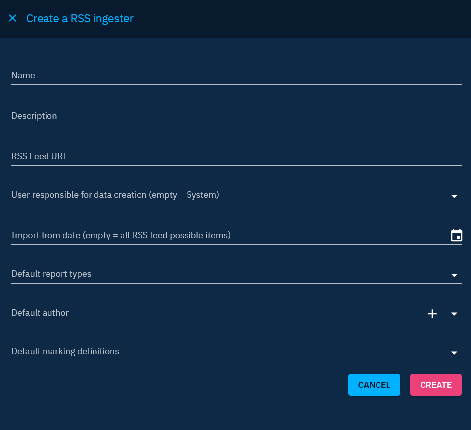
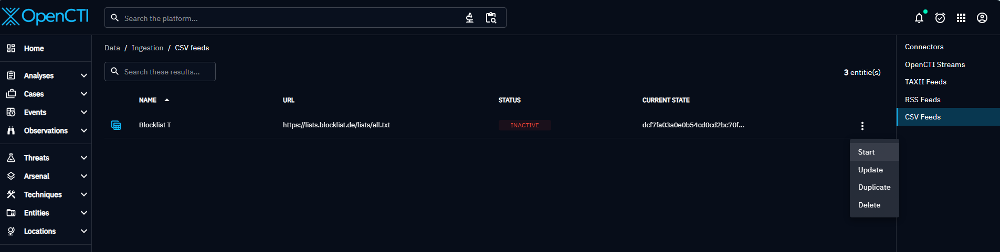

# Automated import

Automated imports in OpenCTI streamline the process of data ingestion, allowing users to effortlessly bring in valuable intelligence from diverse sources. This page focuses on the automated methods of importing data, which serve as bridges between OpenCTI and diverse external systems, formatting it into a STIX bundle, and importing it into the OpenCTI platform.

## Connectors

Connectors in OpenCTI serve as dynamic gateways, facilitating the import of data from a wide array of sources and systems. Every connector is designed to handle specific data types and structures of the source, allowing OpenCTI to efficiently ingest the data.

### Connector behaviors

The behavior of each connector is defined by its development, determining the types of data it imports and its configuration options. This flexibility allows users to customize the import process to their specific needs, ensuring a seamless and personalized data integration experience.

The level of configuration granularity regarding the imported data type varies with each connector. Nevertheless, connectors empower users to specify the date from which they wish to fetch data. This capability is particularly useful during the initial activation of a connector, enabling the retrieval of historical data. Following this, the connector operates in real-time, continuously importing new data from the source.

#### Reset connector state

Resetting the connector state enables you to restart the ingestion process from the very beginning. 
Additionally, resetting the connector state will purge the RabbitMQ queue for this specific connector. 

However, this action requires the "Manage connector state" capability (more details about capabilities: [List of capabilities](../administration/users.md#list-of-capabilities)). Without this specific capability, you will not be able to reset the connector state.

When the action is performed, a message is displayed confirming the reset and inform you about the number of messages that will be purged

Purging a message queue is necessary to remove any accumulated messages that may be outdated or redundant. It helps to avoid reprocessing messages that have already been ingested.

By purging the queue, you ensure that the connector starts with a clean slate, processing only the new data.

### Connector Ecosystem

OpenCTI's connector ecosystem covers a broad spectrum of sources, enhancing the platform's capability to integrate data from various contexts, from threat intelligence providers to specialized databases. The list of available connectors can be found in our [connectors catalog](https://www.notion.site/OpenCTI-Ecosystem-868329e9fb734fca89692b2ed6087e76). Connectors are categorized into three types: import connectors (the focus here), [enrichment connectors](enrichment.md), and stream consumers. Further documentation on connectors is available on [the dedicated documentation page](../deployment/connectors.md).

In summary, automated imports through connectors empower OpenCTI users with a scalable, efficient, and customizable mechanism for data ingestion, ensuring that the platform remains enriched with the latest and most relevant intelligence.

## Native automated import

In OpenCTI, the "Data > Ingestion" section provides users with built-in functions for automated data import. These functions are designed for specific purposes and can be configured to seamlessly ingest data into the platform. Here, we'll explore the configuration process for the four built-in functions: Live Streams, TAXII Feeds, RSS Feeds, and CSV Feeds.

### Live streams

Live Streams enable users to consume data from another OpenCTI platform, fostering collaborative intelligence sharing. Here's a step-by-step guide to configure Live streams synchroniser:

1. Remote OpenCTI URL: Provide the URL of the remote OpenCTI platform (e.g., `https://[domain]`; don't include the path).
2. Remote OpenCTI token: Provide the user token. An administrator from the remote platform must supply this token, and the associated user must have the "Access data sharing" privilege.
3. After filling in the URL and user token, validate the configuration.
4. Once validated, select a live stream to which you have access.

Additional configuration options:

- User responsible for data creation: Define the user responsible for creating data received from this stream. Best practice is to dedicate one user per source for organizational clarity. Please [see the section "Best practices" below](import-automated.md#best-practices-section) for more information.
- Starting synchronization: Specify the date of the oldest data to retrieve. Leave the field empty to import everything.
- Take deletions into account: Enable this option to delete data from your platform if it was deleted on the providing stream. (Note: Data won't be deleted if another source has imported it previously.)
- Verify SSL certificate: Check the validity of the certificate of the domain hosting the remote platform.
- Avoid dependencies resolution: Import only entities without their relationships. For instance, if the stream shares malware, all the malware's relationships will be retrieved by default. This option enables you to choose not to recover them.
- Use perfect synchronization: This option is specifically for synchronizing two platforms. If an imported entity already exists on the platform, the one from the stream will overwrite it.

### TAXII feeds

TAXII Feeds in OpenCTI provide a robust mechanism for ingesting TAXII collections from TAXII servers or other OpenCTI instances. Configuring TAXII ingester involves specifying essential details to seamlessly integrate threat intelligence data. Here's a step-by-step guide to configure TAXII ingesters:

1. TAXII server URL: Provide the root API URL of the TAXII server. For collections from another OpenCTI instance, the URL is in the form `https://[domain]/taxii2/root`.
2. TAXII collection: Enter the ID of the TAXII collection to be ingested. For collections from another OpenCTI instance, the ID follows the format `426e3acb-db50-4118-be7e-648fab67c16c`.
3. Authentication type (if necessary): Enter the authentication type. For non-public collections from another OpenCTI instance, the authentication type is "Bearer token." Enter the token of a user with access to the collection (similar to the point 2 of the Live streams configuration above).

!!! note "TAXII root API URL"

    Many ISAC TAXII configuration instructions will provide the URL for the collection or discovery service. In these cases, remove the last path segment from the TAXII Server URL in order to use it in OpenCTI. eg. use https://[domain]/tipapi/tip21, and not https://[domain]/tipapi/tip21/collections.

Additional configuration options:

- User responsible for data creation: Define the user responsible for creating data received from this TAXII feed. Best practice is to dedicate one user per source for organizational clarity. Please [see the section "Best practices" below](import-automated.md#best-practices-section) for more information.
- Import from date: Specify the date of the oldest data to retrieve. Leave the field empty to import everything.

### RSS feeds

RSS Feeds functionality enables users to seamlessly ingest items in report form from specified RSS feeds. Configuring RSS Feeds involves providing essential details and selecting preferences to tailor the import process. Here's a step-by-step guide to configure RSS ingesters:

1. RSS Feed URL: Provide the URL of the RSS feed from which items will be imported.

Additional configuration options:

- User responsible for data creation: Define the user responsible for creating data received from this RSS feed. Best practice is to dedicate one user per source for organizational clarity. Please [see the section "Best practices" below](import-automated.md#best-practices-section) for more information.
- Import from date: Specify the date of the oldest data to retrieve. Leave the field empty to import everything.
- Default report types: Indicate the report type to be applied to the imported report.
- Default author: Indicate the default author to be applied to the imported report. Please [see the section "Best practices" below](import-automated.md#best-practices-section) for more information.
- Default marking definitions: Indicate the default markings to be applied to the imported reports.

### CSV feeds

CSV feed ingester enables users to import CSV files exposed on URLs. Here's a step-by-step guide to configure TAXII ingesters:

1. CSV URL: Provide the URL of the CSV file exposed from which items will be imported.
2. CSV Mappers: Choose the CSV mapper to be used to import the data.
3. Authentication type (if necessary): Enter the authentication type.

!!! note "CSV mapper"

    CSV feed functionality is based on CSV mappers. It is necessary to create the appropriate CSV mapper to import the data contained in the file. See the page dedicated to the [CSV mapper](../administration/csv-mappers.md).

Additional configuration options:

- User responsible for data creation: Define the user responsible for creating data received from this CSV feed. Best practice is to dedicate one user per source for organizational clarity. Please [see the section "Best practices" below](import-automated.md#best-practices-section) for more information.
- Import from date: Specify the date of the oldest data to retrieve. Leave the field empty to import everything.

in CSV Mappers, if you created a representative for Marking definition, you could have chosen between 2 options:

 - let the user choose  marking definitions
 - Use default marking definitions of the user

This configuration applies when using a CSV Mapper for a CSV Ingester. If you select a CSV Mapper containing the option "Use default marking definitions of the user", the default marking definitions of the user you chose to be responsible for the data creation will be applied to all data imported. If you select a CSV Mapper containing the option "let the user choose  marking definitions", you will be presented with the list of all the marking definitions of the user you chose to be responsible for the data creation (and not yours!)

To finalize the creation, click on "Verify" to run a check on the submitted URL with the selected CSV mapper. A valid URL-CSV mapper combination results in the identification of up to 50 entities.

To start your new ingester, click on "Start", in the burger menu.

CSV feed ingestion is made possible thanks to the connector "ImportCSV". So you can track the progress in "Data > Ingestion > Connectors". On a regular basis, the ingestion is updated when new data is added to the CSV feed.

### Best practices for feed import

Ensuring a secure and well-organized environment is paramount in OpenCTI. Here are two recommended best practices to enhance security, traceability, and overall organizational clarity:

1. Create a dedicated user for each source: Generate a user specifically for feed import, following the convention `[F] Source name` for clear identification. Assign the user to the "Connectors" group to streamline user management and permission related to data creation. Please [see here](../deployment/connectors.md#connector-token-section) for more information on this good practice.
2. Establish a dedicated Organization for the source: Create an organization named after the data source for clear identification. Assign the newly created organization to the "Default author" field in feed import configuration if available.

By adhering to these best practices, you ensure independence in managing rights for each import source through dedicated user and organization structures. In addition, you enable clear traceability to the entity's creator, facilitating source evaluation, dashboard creation, data filtering and other administrative tasks.

### Automated import behaviors

An ingestion manager runs periodically in background, and for each running feeds:
- fetches new data from the source. When data is paginated, fetches the next page
- compose a stix bundle for data and send it in queue to be processed by workers

!!! Note on timeline of data ingestion from Taxii feed, CSV feed, and RSS feed.

    Depending on workers load, the data can take some time between the fetch from source and visibility in the platform.

Periodicity interval is configured with the manager with `ingestion_manager:interval`.

## Digest

Users can streamline the data ingestion process using various automated import capabilities. Each method proves beneficial in specific circumstances.

- Connectors act as bridges to retrieve data from diverse sources and format it for seamless ingestion into OpenCTI.
- Live Streams enable collaborative intelligence sharing across OpenCTI instances, fostering real-time updates and efficient data synchronization.
- TAXII Feeds provide a standardized mechanism for ingesting threat intelligence data from TAXII servers or other OpenCTI instances.
- RSS Feeds facilitate the import of items in report form from specified RSS feeds, offering a straightforward way to stay updated on relevant intelligence.

By leveraging these automated import functionalities, OpenCTI users can build a comprehensive, up-to-date threat intelligence database. The platform's adaptability and user-friendly configuration options ensure that intelligence workflows remain agile, scalable, and tailored to the unique needs of each organization.
