# CSV Feeds

CSV Feeds periodically retrieve a CSV file from a URL and convert its rows to STIX objects with a CSV mapper. Use them for sources that publish structured data as a regularly updated file.

## Prerequisites and permissions

Creating and managing CSV Feeds requires **Manage ingestion**. Prepare either an existing [CSV mapper](../../administration/csv-mappers.md) or the information needed to build an inline mapper.

Automatic service-account creation requires a default ingestion group under **Settings > Accesses > Policies**.

## Create a CSV Feed

1. Go to **Integrations > Available**.
2. Select **Built-in ingestion**, then find **CSV Feed**.
3. Select **Create**.
4. Enter a name, CSV URL, and polling schedule.
5. Select an existing mapper or configure an inline mapper.
6. Configure authentication, SSL verification, markings, and the service account.
7. Select **Verify** to test the URL and mapper.
8. After a successful test, select **Create**, then start the feed from **Integrations > Deployed**.

## Configuration

| Setting | Description |
| --- | --- |
| Name | Required name displayed for the integration. |
| Description | Optional purpose or source information. |
| Schedule period | Platform default of approximately 30 seconds, or 5, 15, or 30 minutes; 1, 6, or 12 hours; or 24 hours. The initial value is 1 hour. |
| CSV URL | Required URL of the CSV file. |
| Existing csv mappers | Select an existing mapper instead of defining one inline. |
| Marking definition levels | Markings used when the mapper allows the ingestion user to choose them. |
| Authentication type | None, Basic, bearer token, or client certificate. |
| Verify SSL certificate | Validates the source certificate. |

Authentication fields depend on the selected mode:

| Mode | Required values |
| --- | --- |
| None | No credentials |
| Basic | Username and password |
| Bearer token | Token |
| Client certificate | Base64-encoded certificate, private key, and certificate authority certificate |

## Configure the service account

CSV Feed creation defaults to a service account named `[F] <feed name>` with confidence level `50`. Disable **Automatically create a service account** to select an existing account.

The account's default markings can be applied through the mapper. If the mapper instead lets the ingestion user choose markings, configure **Marking definition levels** in the feed.

## Configure the CSV mapper

Enable **Existing csv mappers** to select a platform mapper. Disable it to use the **Inline csv mapper** tab.

An inline mapper can configure:

- Whether the CSV contains headers.
- Comma, semicolon, or pipe as the separator.
- A one-character line escape.
- Entity representations and their attribute mappings.
- Relationship representations between mapped entities.

See [CSV mappers](../../administration/csv-mappers.md) for mapping concepts and supported representations.

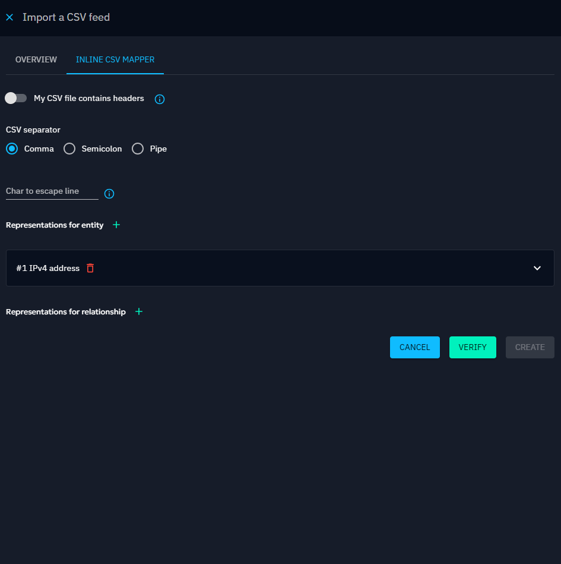

## Verify the feed

Verification retrieves and maps the first 10 CSV lines. The result displays:

- The number of mapped entities and relationships.
- The generated STIX objects as JSON.
- Mapping or source errors that must be corrected.

The feed can be created only when verification returns at least one entity. Updating, duplicating, or importing a feed also requires successful verification.

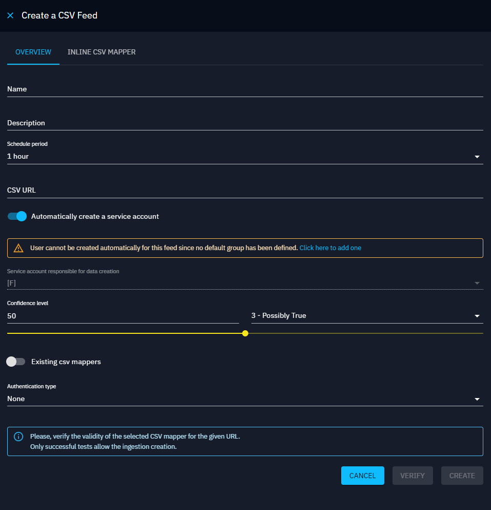

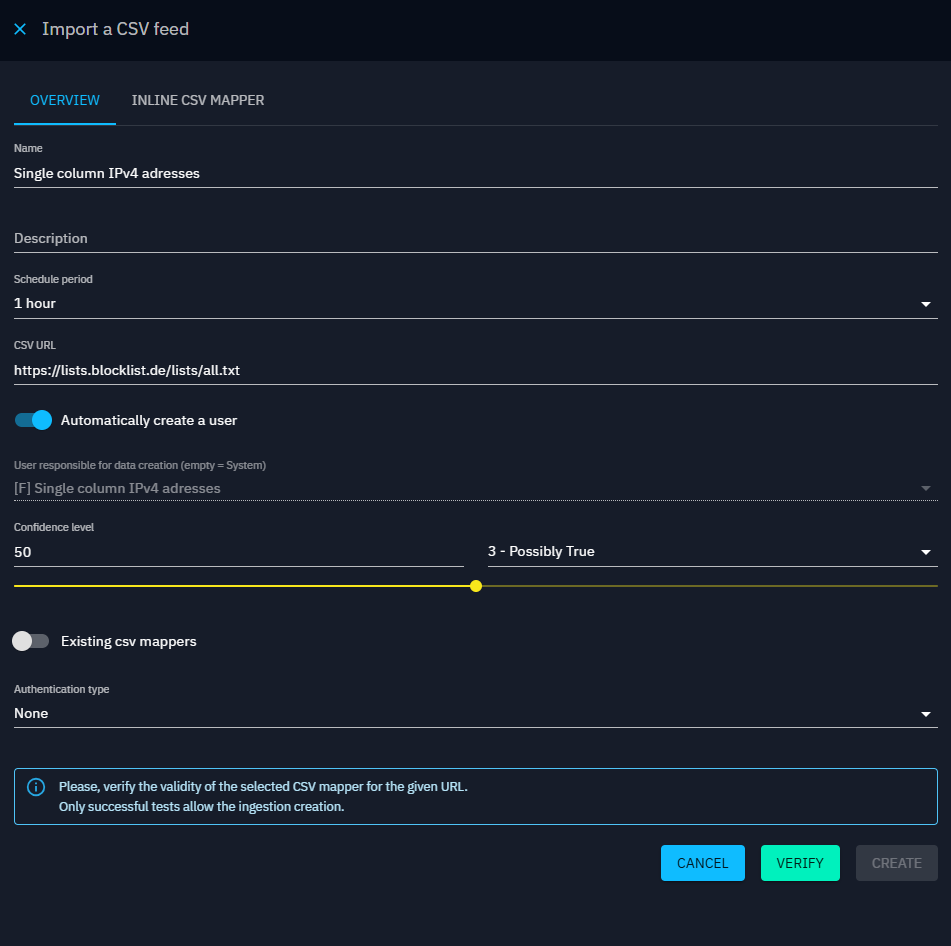

## Manage and monitor a CSV Feed

The detail action menu provides:

- **Start** and **Stop**
- **Update**
- **Duplicate**
- **Export**
- **Reset state**
- **Delete**

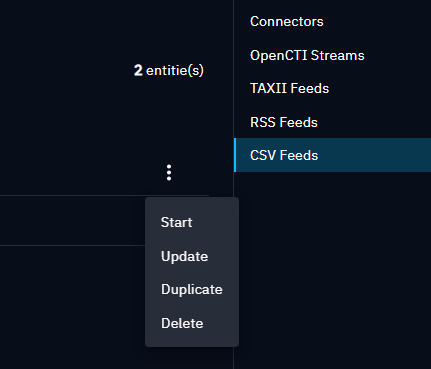

Duplication creates a prefilled `<name> - copy` configuration, including its mapper. Verify the duplicate before creating it.

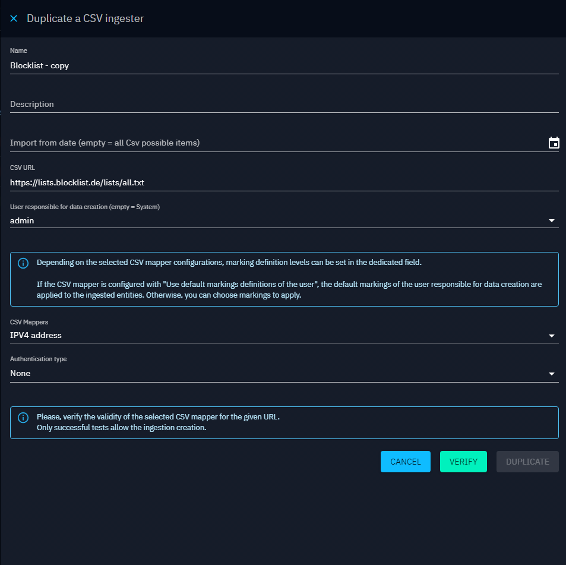

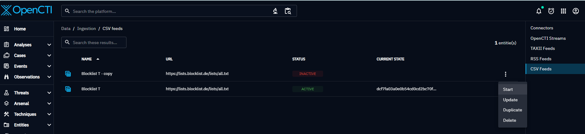

Reset state restarts ingestion from the beginning of the source. Use it carefully because previously processed rows can be evaluated again.

The detail page provides **Overview** and **Works**. When ingestion-feed logs are enabled, **Logs** displays timestamp, severity, message, and expandable or copyable metadata.

The CSV Feed's technical connector is represented inside the feed detail and is not listed as a separate deployed connector.

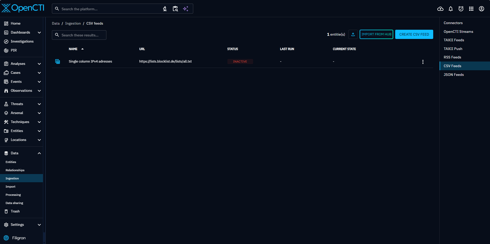

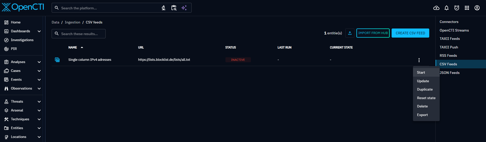

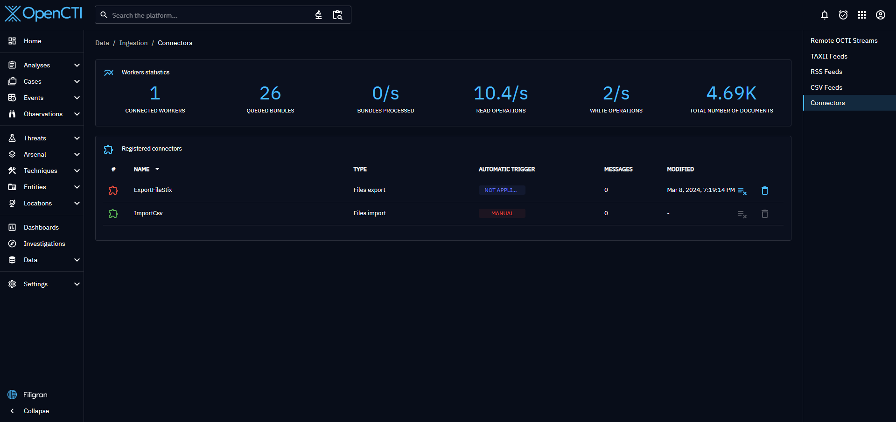

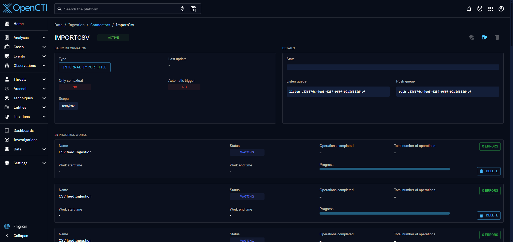

## Import and export

Export downloads a JSON configuration. If the feed references a platform CSV mapper, its mapper configuration is embedded in the file so it can be recreated on another platform.

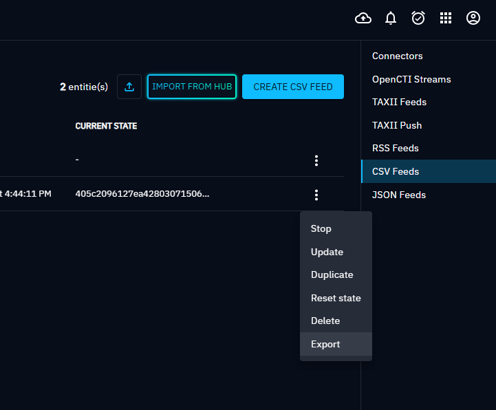

To import:

1. Open **Integrations > Available** and find **CSV Feed**.
2. Select the file-import action and choose the JSON file.
3. Review authentication, markings, schedule, and the embedded mapper.
4. Choose or create the local service account.
5. Verify, create, and start the feed.

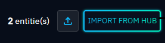

When XTM Hub is configured and accessible, the card also displays **Import from Hub**. Hub deployment downloads the configuration and opens a prefilled creation drawer; you must still verify, create, and start the feed.

## Best practices

- Use a dedicated service account and organization for each source.
- Verify the mapper whenever the source changes its columns or delimiter.
- Use an import schedule appropriate for the file's update frequency.
- Review Works and Logs before resetting state.
- Keep authentication secrets out of exported configurations.

For the platform-wide CSV minimum interval, see [Advanced feed configuration](advanced-feed-configuration.md#csv-feed-settings).
