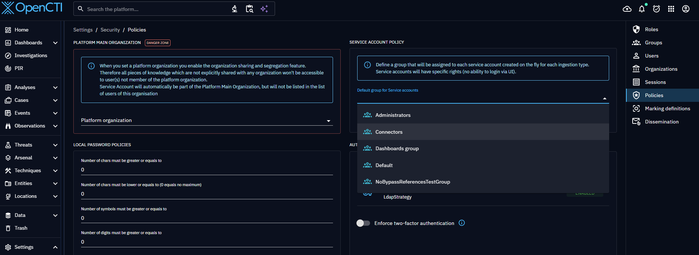

# Automated import

Users can streamline the data ingestion process using various automated import capabilities. Each method proves beneficial in specific circumstances.

- [Connectors](external-connectors.md) act as bridges to retrieve data from diverse sources and format it for seamless ingestion into OpenCTI.
- [Streams enable](internal-streams.md) collaborative intelligence sharing across OpenCTI instances, fostering real-time updates and efficient data synchronization.
- [TAXII Feeds](taxii-feed.md) provide a standardized mechanism for ingesting threat intelligence data from TAXII servers or other OpenCTI instances.
- [TAXII Push](taxii-push.md) provide a standardized mechanism for ingesting STIX 2.1 formatted intelligence data by pushing the data into dedicated TAXII collections exposed by OpenCTI.
- [RSS Feeds](rss-feed.md) facilitate the import of items in report form from specified RSS feeds, offering a straightforward way to stay updated on relevant intelligence.
- [CSV Feeds](csv-feed.md) facilitate the ingestion of data exposed in the form of CSV files, offering a straightforward way to ingest any CSV feeds.
- [JSON Feeds](json-feed.md) facilitate the ingestion of data exposed in JSON format, offering a straightforward way to ingest any JSON feeds.
- [Form intake](../form-intake.md) provides guided forms for creating curated STIX entities, observables, and relationships.

By leveraging these automated import functionalities, OpenCTI users can build a comprehensive, up-to-date threat intelligence database. The platform's adaptability and user-friendly configuration options ensure that intelligence workflows remain agile, scalable, and tailored to the unique needs of each organization.

## The Integrations menu

All import methods are managed from the **Integrations** entry in the main navigation bar on the left. The page is organized in two tabs — **Deployed** and **Available** — sharing the same layout: a faceted filter sidebar on the left and the results (as cards or as a list) on the right.

Both tabs provide the same controls above the results:

- **Search**: free-text search on the name and description of the items.
- **Sort by**: changes the ordering of the results (the available sort modes differ per tab, see below).
- **View toggle**: switch between a **Cards view** and a compact **Lines view**. The chosen view is remembered across navigations.
- **Result count**: the number of items matching the active filters.

In the filter sidebar, each facet displays the number of matching items next to it, and a **Clear all** action appears as soon as at least one filter is active. Results are grouped into collapsible sections by type.

Automatic service-account creation for supported built-in feeds requires a default ingestion group under **Settings > Accesses > Policies**.

### Available tab (catalog)

The **Available** tab is the catalog of everything you can deploy on your platform: connectors published in the [XTM Hub Integrations Library](https://hub.filigran.io/cybersecurity-solutions/open-cti-integrations) and the built-in ingestion methods shipped with the platform (OpenCTI Streams, TAXII Feeds, TAXII Push, RSS Feeds, CSV Feeds, JSON Feeds, and Form intake). From a connector card you can start a deployment; from a built-in method card you can create a new instance.

Built-in cards also provide configuration import when the integration supports it. OpenCTI Streams, TAXII Feeds, RSS Feeds, and CSV Feeds can additionally display **Import from Hub** when the platform is connected to XTM Hub and the user has access.

The filter sidebar of the catalog offers the following facets:

- **Kind**: filter between **Connectors** and **Built-in** ingestion methods.
- **Connector type**: filter connectors by their type (e.g. External import, Stream, Internal enrichment, etc.).
- **Use cases**: filter by the use cases declared in the connector manifests.
- **Solution categories**: filter by the solution categories declared in the connector manifests.
- **License type**: filter by license (e.g. Free, Commercial), when declared.
- **Status**: filter by the support origin of the item, either **Supported by Filigran** or **Supported by Community** (see below).

The **Sort by** control on this tab offers **Name (A-Z)**, **Most deployed** (items with the most running instances first) and **Verified first** (Filigran-supported items first).

!!! note "Supported by Filigran vs Supported by Community"

    In the catalog, each item carries a support origin, surfaced through the **Status** facet:

    - **Supported by Filigran**: the built-in ingestion methods and the verified connectors, maintained by Filigran.
    - **Supported by Community**: the connectors contributed and maintained by the community.

### Deployed tab

The **Deployed** tab lists the integrations currently running on your platform: the registered connectors and the instances of the built-in feeds you have created. Each item shows live monitoring information, and its status is refreshed automatically. New feeds are created from the **Available** tab. When no integration is deployed yet, a shortcut lets you jump to the catalog on the **Available** tab.

The filter sidebar of this tab offers the following facets:

- **Kind**: filter between **Connectors** and **Built-in** feed instances.
- **Type**: filter by connector type or built-in kind (OpenCTI Streams, TAXII Feeds, TAXII Push, RSS Feeds, CSV Feeds, JSON Feeds, and Form intake).
- **Status**: filter by runtime status — **Active**, **Processing** or **Inactive**.

The **Sort by** control on this tab offers **Name (A-Z)**, **Status**, **Last run** and **Queued messages** (integrations with the largest backlog first).

## Connector behaviors

The behavior of each connector is defined by its development, determining the types of data it imports and its configuration options. This flexibility allows users to customize the import process to their specific needs, ensuring a seamless and personalized data integration experience.
The level of configuration granularity regarding the imported data type varies with each connector. Nevertheless, connectors empower users to specify the date from which they wish to fetch data. This capability is particularly useful during the initial activation of a connector, enabling the retrieval of historical data. Following this, the connector operates in real-time, continuously importing new data from the source.

## Stream / Push / Feed import behaviors

An ingestion manager runs periodically in the background and, for each running feed:

- Fetches new data from the source. When data is paginated, it fetches the next page.
- Creates a STIX bundle and sends it to the queue for processing by workers.

!!! note "Data ingestion timeline"

    Depending on worker load, some time can pass between fetching data from a source and displaying it in the platform.

Periodicity interval is configured with the manager with `ingestion_manager:interval`.
Each feed can use the platform default interval or a longer polling schedule.