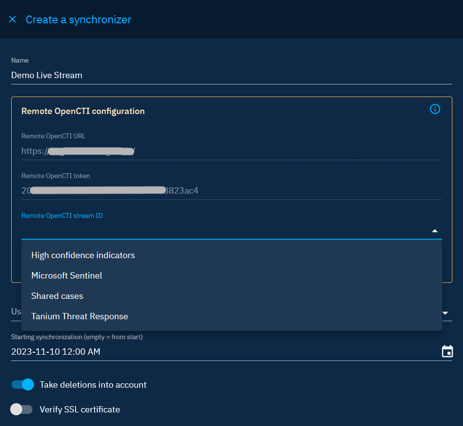
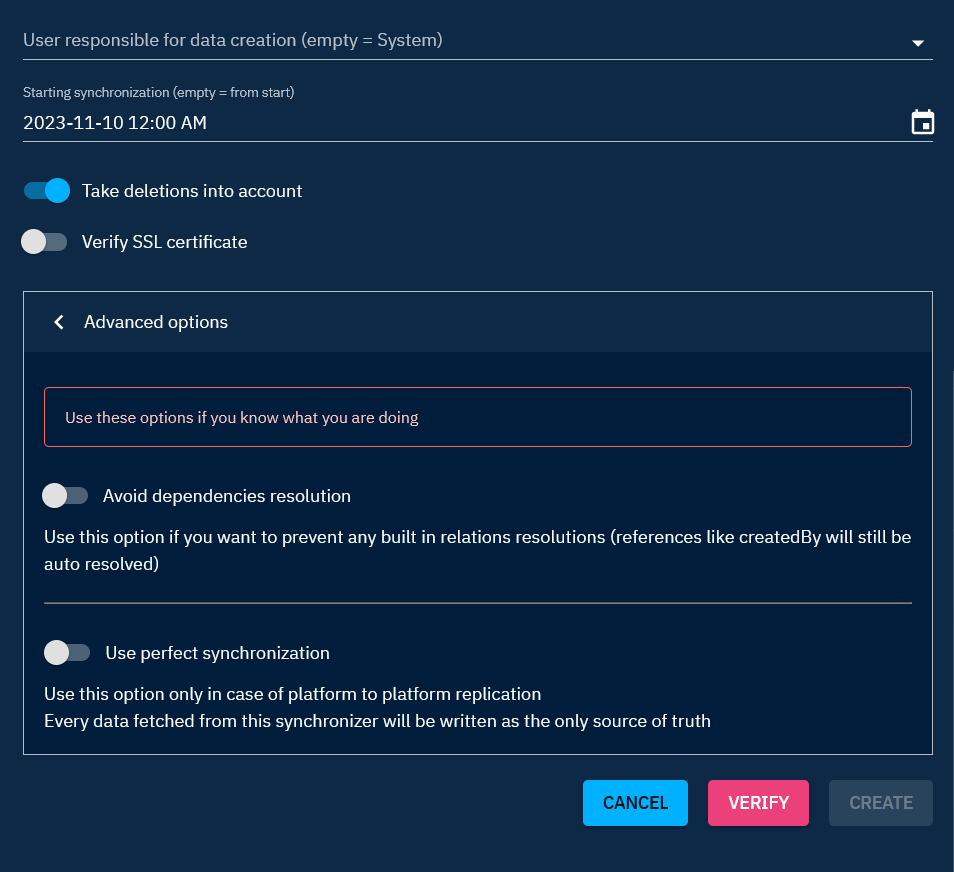
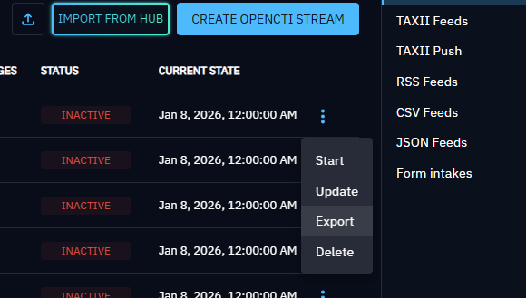
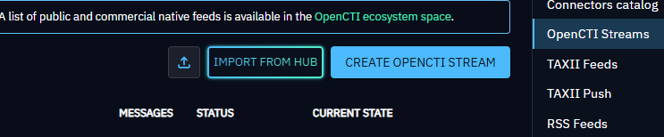

# OpenCTI Streams

OpenCTI Streams synchronize knowledge from a live stream exposed by another OpenCTI platform. Use them for continuous platform-to-platform intelligence sharing while preserving source traceability.

## Prerequisites

The remote platform must expose a live stream that the importing platform can access. Private streams require a token from a remote user with the **Access data sharing** capability. Public streams can be accessed without a token.

Creating and managing a stream requires **Manage ingestion**. For shared guidance about service accounts and source organizations, see [Automated import](getting-started.md).

## Create an OpenCTI Stream

1. Go to **Integrations > Available**.
2. Select **Built-in ingestion**, then find **OpenCTI Stream**.
3. Select **Create**.
4. Enter a name and the remote OpenCTI URL, without a path.
5. Enter a remote token when the stream is not public.
6. Choose whether to verify the remote SSL certificate, then select **Validate**.
7. Select an accessible remote stream. Its name, description, and filters are displayed for confirmation.
8. Complete the synchronization settings.
9. Select **Verify**, then **Create**.

The complete configuration must be verified successfully before it can be created.

## Configuration

| Setting | Description |
| --- | --- |
| Name | Name displayed for the deployed integration. |
| Remote OpenCTI URL | Base URL of the remote platform, such as `https://opencti.example`. |
| Remote OpenCTI token | Optional for public streams; required for private streams. |
| Remote OpenCTI stream ID | Stream selected after validating the remote connection. |
| Service account responsible for data creation | Local account attributed as the creator of synchronized data. |
| Starting synchronization | Oldest event to retrieve. New configurations default to the beginning of the current day; clear the value to synchronize from the beginning of the stream. |
| Take deletions into account | Deletes local data when the remote stream emits a deletion, unless another source still references the data. Enabled by default. |
| Verify SSL certificate | Validates the certificate of the remote platform. Disabled by default. |
| Avoid dependencies resolution | Avoids resolving built-in relationships while still resolving required references such as the author. Disabled by default. |
| Use perfect synchronization | Treats the remote stream as the only source of truth for synchronized data. Use only for controlled platform replication. Disabled by default. |

!!! note

    Remote processing-status identifiers are not valid on the local platform. To synchronize statuses by name, enable [Entity status sync](../../administration/entities.md#workflow-section) for the applicable entity types.

## Configure the service account

By default, OpenCTI creates a service account named `[S] <stream name>` with confidence level `50`. Disable **Automatically create a service account** to select an existing account instead.

Automatic account creation requires a default ingestion group under **Settings > Accesses > Policies**. The form displays a warning when no default group is configured.

## Manage and monitor a stream

Created streams appear under **Integrations > Deployed**. Open a stream to inspect its URL, stream identifier, creator, synchronization options, queue metrics, state, and activity.

The action menu provides:

- **Start** and **Stop**
- **Update**
- **Export**
- **Delete**

Update and Delete are unavailable while the stream is running. OpenCTI Streams do not have a Logs tab; use the activity and consumer metrics to monitor processing.

## Import and export

Select **Export** from a deployed stream to download its JSON configuration.

To import a configuration:

1. Open **Integrations > Available**.
2. Find **OpenCTI Stream**.
3. Select the file-import action and choose the exported JSON file.
4. Enter the remote token and choose a local service account.
5. Validate and verify the connection, then create the stream.

The imported file can prefill the name, URL, stream identifier, start date, and synchronization options. It does not contain the remote token or local service account.

When XTM Hub is configured and accessible, the card also displays **Import from Hub**.

## Best practices

- Use a dedicated local service account and organization for each remote source.
- Enable SSL verification for production endpoints with trusted certificates.
- Use perfect synchronization only when the remote platform must fully control the synchronized objects.
- Test deletion synchronization with non-production data before enabling it for an existing stream.
