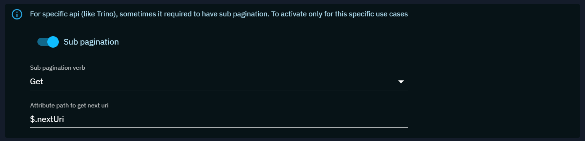

# JSON Feeds

JSON feed ingester enables users to import any Web JSON API.

<a id="best-practices-section"></a>
## Best practices

In OpenCTI, the "Data > Ingestion" section provides users with built-in functions for automated data import. These functions are designed for specific purposes and can be configured to seamlessly ingest data into the platform. Here, we'll explore the configuration process for the five built-in functions: Live Streams, TAXII Feeds, TAXII Push, RSS Feeds, and JSON/CSV Feeds.

Ensuring a secure and well-organized environment is paramount in OpenCTI. Here are two recommended best practices to enhance security, traceability, and overall organizational clarity:

1. Create a dedicated user for each source: Generate a user specifically for feed import, following the convention `[F] Source name` for clear identification. Assign the user to the "Connectors" group to streamline user management and permission related to data creation. Please [see here](../../deployment/connectors.md#connector-token-section) for more information on this good practice.
2. Establish a dedicated Organization for the source: Create an organization named after the data source for clear identification. Assign the newly created organization to the "Default author" field in feed import configuration if available.

By adhering to these best practices, you ensure independence in managing rights for each import source through dedicated user and organization structures. In addition, you enable clear traceability to the entity's creator, facilitating source evaluation, dashboard creation, data filtering and other administrative tasks.

## Configuration

Configuring a JSON feed will be simple or complex depending on the needs of pagination.
So we will show be example of its different and how to configure it in the two cases.

### Simple API

Here's a step-by-step guide to configure JSON ingesters:

1. Schedule period: As the API is not paginated, its recommended to configure a longer polling period
2. HTTP JSON URL: Provide the URL of the JSON API from which items will be imported.
3. HTTP Verb: Provide the type of verb that will be GET by default.
4. JSON Mappers: Choose the JSON mapper to be used to import the data.
5. Authentication type (if necessary): Enter the authentication type.

### Paginated API

For paginated API its more difficult to configure the JSON feed. You have more elements.

#### Verb and variables

You need to start to configure the verb to use and the variables.

**GET**

When you use a GET API, a majority of case will use query parameters to be able to setup variables for the pagination.
For example lets take an api where the get command need to specify the page number to consume.
There is a part of the URI that need to be dynamic.

```https://services.nvd.nist.gov/rest/json/cves/2.0?resultsPerPage=20&startIndex=$offset```

You can see in this example that the page query parameter need to be associated with the pagination.

So to be able to do this, you have to configure this parameter as a variable, here **${offset}**

**POST**

When you use a POST API, you need to specify the body of the post. Depending on the API it could be JSON or any other body content.

Like the previous example in the get, you can specify variables in the body configuration.

``` { "page": "$offset" }```

or for example this kind of command for a Trino query that define a $created variable.

```SELECT * FROM observables WHERE created_at > TIMESTAMP '$created' ORDER BY created_at ASC LIMIT 10```

#### Query attributes

The query attribute will be the definition of how to setup the required variable.

Let's take the previous example with the GET uri.

```https://services.nvd.nist.gov/rest/json/cves/2.0?resultsPerPage=20&startIndex=$offset```

For the uri of the GET example, we need to configure the **offset** variables.


Lets describe each configuration:
- Resolve from: **Data**

Where the variable will be parsed from. You can choose between Header and Data.

- Exposed attribute to: **Query parameter**

How the attribute will be exposed in the next http call. You can choose between Body / Query parameter and Header

- Resolve operation: **Count**

Apply an operation on the resolved data. You can choose between Data and Count.

- State operation: **Sum**

How to compute the state for the next execution. You can choose between Replace and Sum.

- Get from path: **$.vulnerabilities**

How to extract the data from the data result. 

- To attribute name: **offset**

The name of the attribute that will contain the value and so **to use in the query / body or headers**

- Default value: **0**

The default value for the target attribute.

#### Headers

If your API require some specific headers, you can simply add some.


#### Sub pagination

This one is a very specific option that will be used in some really rare use case. For example Trino is a system that require sub pagination to get the data.



#### Mapper and verify

With the correct mapper configured you can click on the verify button to get an idea of what you can get.


In the result you will be able to see the result of the query parameters computing (state) and the data mapped to STIX (objects). 

The state is a json object that represent information that will be injected in the parameters / body or headers for the next execution.

You need to be careful and really take the time to adapt your configuration to obtain the expected mapping.

