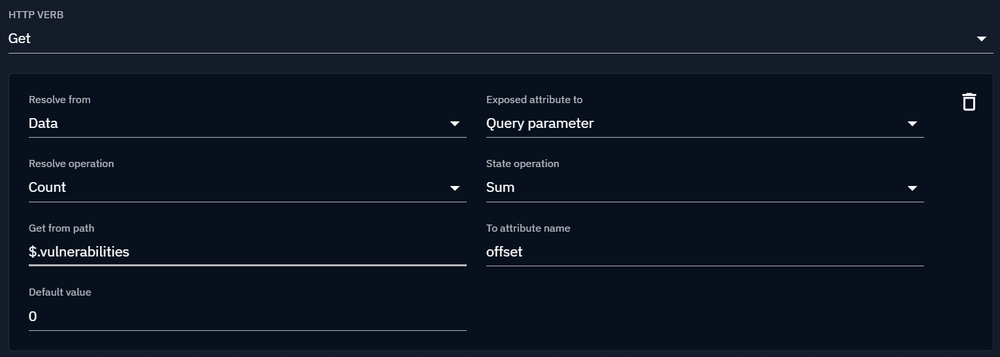
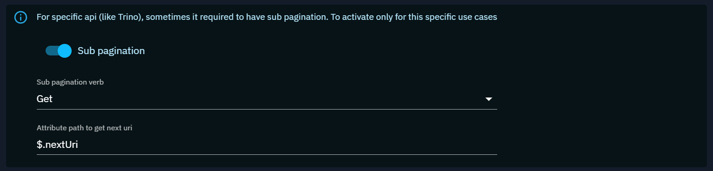
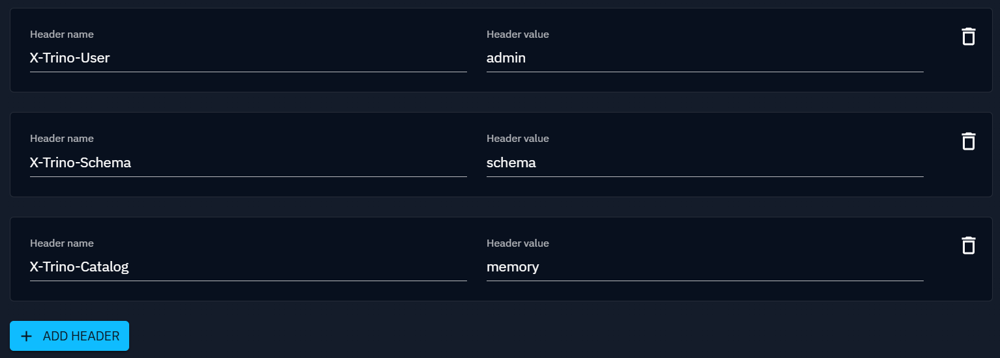
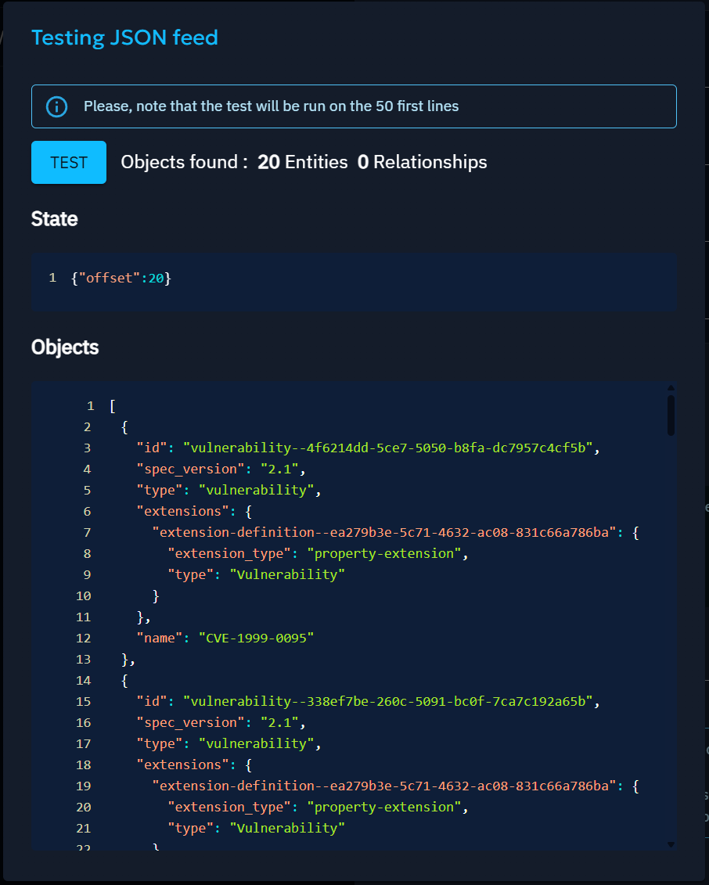

# JSON Feeds

JSON Feeds periodically call a JSON web API and convert its response to STIX objects with a JSON mapper. They support simple endpoints, stateful pagination, custom headers, and GET or POST requests.

## Prerequisites and permissions

Creating and managing JSON Feeds requires **Manage ingestion**. Create a compatible [JSON mapper](../../administration/json-mappers.md) before configuring the feed; JSON Feeds do not provide an inline mapper editor.

## Create a JSON Feed

1. Go to **Integrations > Available**.
2. Select **Built-in ingestion**, then find **JSON Feed**.
3. Select **Create**.
4. Enter a name, schedule, URL, and HTTP verb.
5. Configure the request body, headers, pagination, and authentication as required.
6. Select the JSON mapper and creator.
7. Select **Verify** to test the request and mapping.
8. After a successful test, select **Create**, then start the feed from **Integrations > Deployed**.

## Basic configuration

| Setting | Description |
| --- | --- |
| Name | Required name displayed for the integration. |
| Description | Optional purpose or source information. |
| Schedule period | Platform default of approximately 30 seconds, or 5, 15, or 30 minutes; 1, 6, or 12 hours; or 24 hours. |
| HTTP JSON URL | Required API URL. It can reference pagination variables. |
| HTTP VERB | GET by default, or POST. |
| HTTP BODY POST | Request body displayed for POST requests. It can reference pagination variables. |
| User responsible for data creation | Local creator assigned to imported objects. Empty uses System. |
| JSON mapper | Required mapper used to convert the response. |
| Marking definition levels | Displayed when the mapper lets the ingestion user choose markings. |
| Verify SSL certificate | Validates the source certificate. Enabled by default. |

Unlike OpenCTI Stream, TAXII Feed, RSS Feed, and CSV Feed creation, JSON Feed does not automatically create a service account.

## Configure authentication

| Mode | Required values |
| --- | --- |
| None | No credentials |
| Basic | Username and password |
| Bearer token | Token |
| Client certificate | Base64-encoded certificate, private key, and certificate authority certificate |

Authentication defaults to None.

## Configure pagination

Use variables in the URL, POST body, or headers to carry state between requests. A variable named `offset`, for example, can be referenced as `${offset}`:

```text
https://services.nvd.nist.gov/rest/json/cves/2.0?resultsPerPage=20&startIndex=${offset}
```

For a POST request:

```json
{
  "page": "${offset}"
}
```

Each query attribute defines how OpenCTI obtains and updates a variable:

| Setting | Description |
| --- | --- |
| Resolve from | Read the value from response Data or Header. |
| Exposed attribute to | Insert the next value into the request Body, Query parameter, or Header. |
| Resolve operation | Use the resolved Data or its Count. |
| State operation | Replace the previous value or add to it with Sum. |
| Get from path | JSON path used to extract the response value, such as `$.vulnerabilities`. |
| To attribute name | Variable name referenced by the next request. |
| Default value | Initial value before the first request. |



### Sub-pagination

Enable **Sub pagination** when the response provides another URI that must be followed before advancing the main state, as with some Trino APIs.

Configure:

- Sub-pagination HTTP verb: GET or POST.
- Attribute path used to retrieve the next URI.

Sub-pagination is disabled by default.



## Configure headers

Add request headers for API-specific values or pagination state. Do not duplicate credentials in custom headers when an authentication mode already supplies them.



## Verify the feed

Verification requires a URL and JSON mapper. It retrieves up to the first 50 response items and displays:

- Mapped entity and relationship counts.
- The computed pagination state.
- Generated STIX objects.
- Request or mapping errors.

The feed can be created only when verification returns at least one entity. Updates, duplicates, and imports must also pass verification.



## Manage and monitor a JSON Feed

The detail action menu provides:

- **Start** and **Stop**
- **Update**
- **Duplicate**
- **Export**
- **Reset state**
- **Delete**

Duplication opens a prefilled `<name> - copy` configuration. Reset state clears the stored pagination state, causing processing to resume from its configured defaults.

The detail page provides the feed overview and technical connector Works when the user can access them. JSON Feeds do not have an ingestion Logs tab.

## Import and export

Export downloads a dated JSON configuration containing the feed and embedded mapper settings.

To import:

1. Open **Integrations > Available** and find **JSON Feed**.
2. Select the file-import action and choose the JSON configuration.
3. Review the imported mapper and request settings.
4. Re-enter credentials and choose the local creator and markings.
5. Verify, create, and start the feed.

JSON Feed supports configuration-file import but not **Import from Hub**.

## Best practices

- Test pagination with a small response before enabling a short schedule.
- Use explicit default values for every pagination variable.
- Choose a dedicated creator rather than System when source traceability is important.
- Keep SSL verification enabled for trusted production APIs.
- Review the computed state during verification and before resetting a running feed.
- Update the mapper when the upstream response structure changes.
