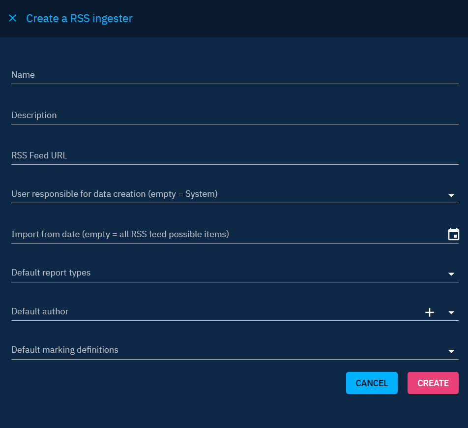
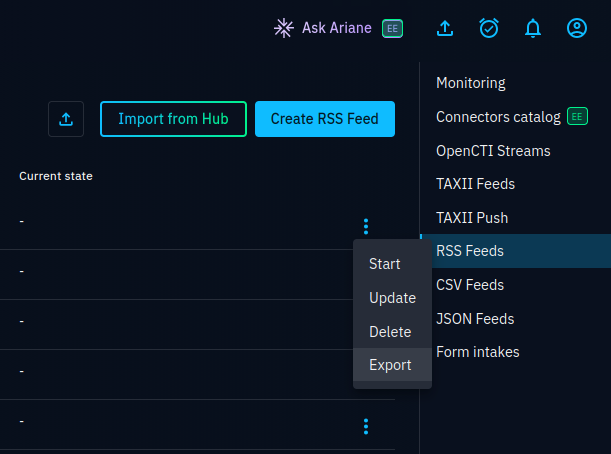

# RSS Feeds

RSS Feeds functionality enables users to seamlessly ingest items in report form from specified RSS feeds.

<a id="best-practices-section"></a>
## Best practices

In OpenCTI, the "Data > Ingestion" section provides users with built-in functions for automated data import. These functions are designed for specific purposes and can be configured to seamlessly ingest data into the platform. Here, we'll explore the configuration process for the five built-in functions: Live Streams, TAXII Feeds, TAXII Push, RSS Feeds, and JSON/CSV Feeds.

Ensuring a secure and well-organized environment is paramount in OpenCTI. Here are two recommended best practices to enhance security, traceability, and overall organizational clarity:

1. Create a dedicated user for each source: Generate a technical user (or Service account) specifically for feed import, following the convention `[F] Source name` for clear identification. Assign the user to the "Connectors" group to streamline user management and permission related to data creation. Please [see here](../../deployment/connectors.md#connector-token-section) for more information on this good practice.
2. Establish a dedicated Organization for the source: Create an organization named after the data source for clear identification. Assign the newly created organization to the "Default author" field in feed import configuration if available.

By adhering to these best practices, you ensure independence in managing rights for each import source through dedicated user and organization structures. In addition, you enable clear traceability to the entity's creator, facilitating source evaluation, dashboard creation, data filtering and other administrative tasks.


## Configuration

Here's a step-by-step guide to configure RSS ingesters:

1. RSS Feed URL: Provide the URL of the RSS feed from which items will be imported.

Additional configuration options:

- User responsible for data creation: Define the user responsible for creating data received from this RSS feed. Best practice is to dedicate one user per source for organizational clarity. Please [go to the page ](../getting-started.md) for more information.
- Import from date: Specify the date of the oldest data to retrieve. Leave the field empty to import everything.
- Default report types: Indicate the report type to be applied to the imported report.
- Default author: Indicate the default author to be applied to the imported report. Please [go to the page](../getting-started.md) for more information.
- Default marking definitions: Indicate the default markings to be applied to the imported reports.



## Export a RSS feed
You can export your existing RSS feed from the platform, making it easy to share your configuration with others.

To export your ingester, click on "Export", in the burger menu.


## Import a RSS feed ingester

If you have a JSON RSS feed file you can import it by clicking on the icon next to "Import from hub"


When you click, you can select the desired file. After that, a drawer will open with the form pre-filled with the relevant information.
By default, a user is already provided.

Finally, you need to click on create to create your new ingester.


You can select RSS Feeds from the XTM Hub by clicking the ```Import from Hub``` button. 

If your OpenCTI instance is registered on the XTM Hub, you can directly import RSS Feeds in 1 click from XTM Hub. After a confirmation popup, it will open the creation drawer with everything prefilled where you can adjust the config before creating the ingester.
