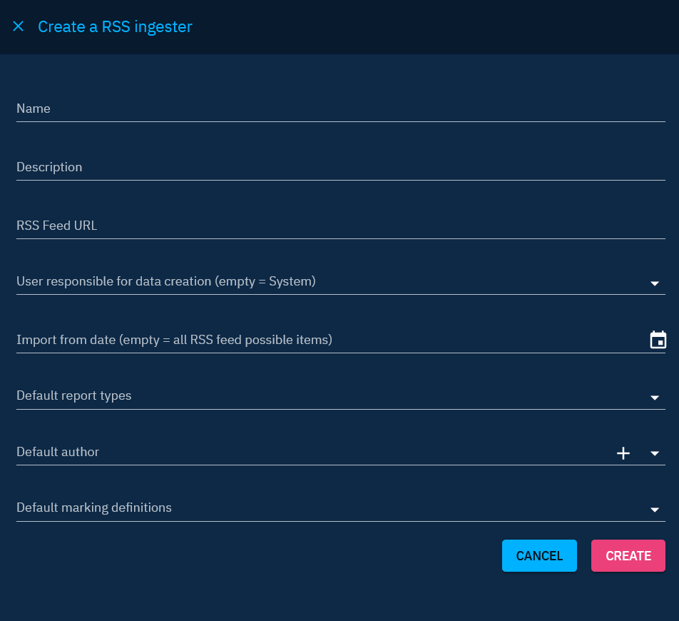
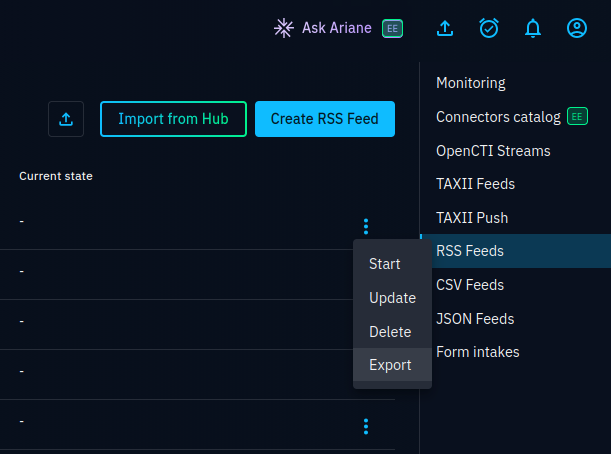
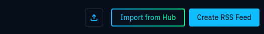

# RSS Feeds

RSS Feeds poll an RSS or Atom source and create an OpenCTI Report for each imported item. Use them to monitor publications and news sources without deploying a separate connector.

## Prerequisites and permissions

Obtain the RSS or Atom feed URL. Creating and managing RSS Feeds requires **Manage ingestion**.

For source-account recommendations, see [Automated import](getting-started.md).

## Create an RSS Feed

1. Go to **Integrations > Available**.
2. Select **Built-in ingestion**, then find **RSS Feed**.
3. Select **Create**.
4. Enter a name and feed URL.
5. Configure the schedule, service account, and import start date.
6. Set defaults for the generated Reports.
7. Select **Create**, then start the feed from **Integrations > Deployed**.

## Configuration

| Setting | Description |
| --- | --- |
| Name | Required name displayed for the integration. |
| Description | Optional purpose or source information. |
| Schedule period | Platform default of approximately 30 seconds, or 5, 15, or 30 minutes; 1, 6, or 12 hours; or 24 hours. |
| RSS Feed URL | Required RSS or Atom endpoint. |
| Service account responsible for data creation | Creator assigned to imported Reports. |
| Import from date | Oldest entries to retrieve. Leave empty to retrieve all available items. |
| Default report types | Report types applied to generated Reports. |
| Default author | Author identity applied to generated Reports. |
| Default marking definitions | Markings applied to generated Reports. |
| Verify SSL certificate | Validates the feed server certificate. |

## Configure the service account

By default, OpenCTI creates a service account named `[F] <feed name>` with confidence level `50`. Disable **Automatically create a service account** to select an existing account.

Automatic creation requires a default ingestion group under **Settings > Accesses > Policies**.

## Manage and monitor an RSS Feed

The deployed feed action menu provides:

- **Start** and **Stop**
- **Update**
- **Export**
- **Delete**

The detail page shows its configuration, schedule, status, activity, and technical connector Works when the user can access them. RSS Feeds do not provide Duplicate, Reset state, or ingestion Logs actions.

## Import and export

Export downloads a dated JSON configuration containing the feed settings.

To import a configuration:

1. Open **Integrations > Available** and find **RSS Feed**.
2. Select the file-import action and choose the JSON configuration.
3. Review the prefilled schedule, URL, import date, Report defaults, and markings.
4. Choose or create the local service account.
5. Create and start the feed.

When XTM Hub is configured and accessible, the card also displays **Import from Hub**. A Hub configuration opens the same prefilled creation drawer for review; it does not start the feed automatically.

## Best practices

- Use a dedicated service account and source organization.
- Apply default markings appropriate for all content from the feed.
- Set an import date to avoid creating Reports for irrelevant historical posts.
- Choose a polling schedule that respects the source and the platform-wide minimum interval.

For the RSS minimum interval and HTTP user agent, see [Advanced feed configuration](advanced-feed-configuration.md#rss-feed-settings).
