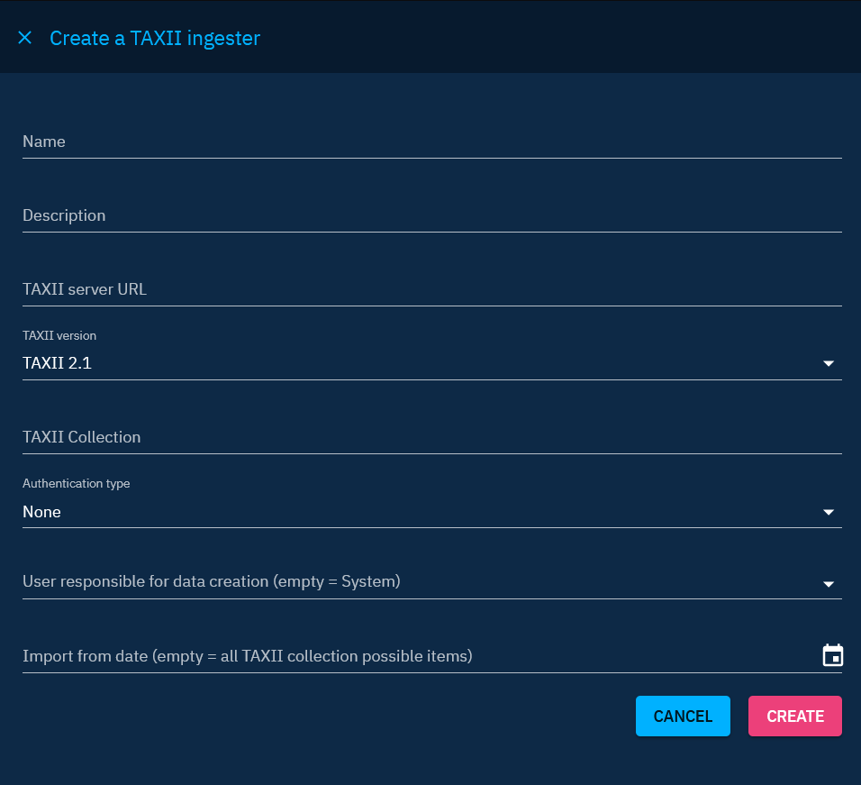
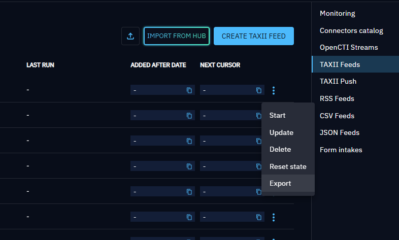
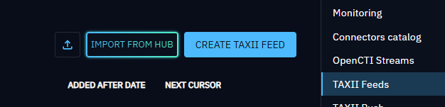

# TAXII Feeds

TAXII Feeds poll a TAXII 2.1 collection and ingest its STIX objects into OpenCTI. Use them to consume standards-based threat intelligence from an ISAC, vendor, or another OpenCTI platform.

## Prerequisites

Obtain the TAXII server root URL, collection identifier, and any required credentials. For an OpenCTI TAXII collection, the root URL is typically `https://<domain>/taxii2/root`.

Creating and managing TAXII Feeds requires **Manage ingestion**.

## Create a TAXII Feed

1. Go to **Integrations > Available**.
2. Select **Built-in ingestion**, then find **TAXII Feed**.
3. Select **Create**.
4. Enter a name, server URL, TAXII version, and collection identifier.
5. Configure authentication and the service account.
6. Set the schedule and import start date.
7. Select **Create**, then start the feed from **Integrations > Deployed**.

!!! note "TAXII root URL"

    Enter the TAXII API root, not a collection URL. For example, use `https://example.org/taxii2/root` rather than `https://example.org/taxii2/root/collections/<id>`.

## Configuration

| Setting | Description |
| --- | --- |
| Name | Required name displayed for the integration. |
| Description | Optional purpose or source information. |
| Schedule period | Platform default of approximately 30 seconds, or 5, 15, or 30 minutes; 1, 6, or 12 hours; or 24 hours. |
| TAXII server URL | Required TAXII root API URL. |
| TAXII version | Required protocol version. The current form supports TAXII 2.1. |
| TAXII Collection | Required collection identifier. |
| Authentication type | None, Basic, bearer token, or client certificate. |
| Import from date | Oldest collection items to retrieve. Leave empty to retrieve all available items. |
| Copy confidence level to OpenCTI scores for indicators | Maps STIX Indicator confidence to OpenCTI score. Disabled by default. |
| Verify SSL certificate | Validates the TAXII server certificate. Enabled by default. |

Authentication fields depend on the selected mode:

| Mode | Required values |
| --- | --- |
| None | No credentials |
| Basic | Username and password |
| Bearer token | Token |
| Client certificate | Base64-encoded certificate, private key, and certificate authority certificate |

## Configure the service account

By default, OpenCTI creates a service account named `[F] <feed name>` with confidence level `50`. Disable **Automatically create a service account** to select an existing account.

Automatic creation requires a default ingestion group under **Settings > Accesses > Policies**.

## Manage and monitor a TAXII Feed

The deployed feed action menu provides:

- **Start** and **Stop**
- **Update**
- **Export**
- **Reset state**
- **Delete**

Resetting state makes the feed restart collection ingestion from the beginning, subject to its import date.

The detail page provides **Overview** and **Works**. When ingestion-feed logs are enabled on the platform, a **Logs** tab displays timestamp, severity, message, and expandable JSON details.

## Import and export

Export downloads the feed configuration as JSON. Authentication secrets and the local service account are not exported.

To import a configuration, use the file-import action on the **TAXII Feed** card under **Integrations > Available**. The file can prefill the name, description, URL, schedule, version, collection, authentication type, and import date. Re-enter credentials, choose or create the service account, verify SSL behavior, and create the feed.

When XTM Hub is configured and accessible, the card also displays **Import from Hub**.

## Best practices

- Use a dedicated service account and organization for each TAXII source.
- Keep SSL verification enabled for trusted production endpoints.
- Use a conservative schedule for large collections.
- Set an import date for the first run when ingesting the complete collection would be unnecessary.
- Review feed logs and Works before resetting ingestion state.

For platform-wide TAXII polling limits, see [Advanced feed configuration](advanced-feed-configuration.md#taxii-feed-settings).
