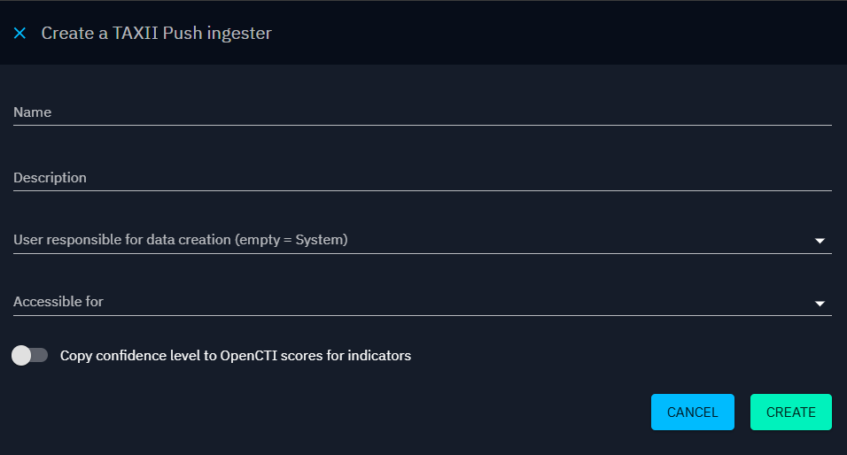

# TAXII Push

TAXII Push ingester enables users to import STIX 2.1 objects in OpenCTI through an exposed TAXII collection.

## Best practices

In OpenCTI, the "Data > Ingestion" section provides users with built-in functions for automated data import. These functions are designed for specific purposes and can be configured to seamlessly ingest data into the platform. Here, we'll explore the configuration process for the five built-in functions: Live Streams, TAXII Feeds, TAXII Push, RSS Feeds, and JSON/CSV Feeds.

Ensuring a secure and well-organized environment is paramount in OpenCTI. Here are two recommended best practices to enhance security, traceability, and overall organizational clarity:

1. Create a dedicated user for each source: Generate a user specifically for feed import, following the convention `[F] Source name` for clear identification. Assign the user to the "Connectors" group to streamline user management and permission related to data creation. Please [see here](../../deployment/connectors.md#connector-token-section) for more information on this good practice.
2. Establish a dedicated Organization for the source: Create an organization named after the data source for clear identification. Assign the newly created organization to the "Default author" field in feed import configuration if available.

By adhering to these best practices, you ensure independence in managing rights for each import source through dedicated user and organization structures. In addition, you enable clear traceability to the entity's creator, facilitating source evaluation, dashboard creation, data filtering and other administrative tasks.

## Configuration

TAXII Push ingester enables users to import STIX 2.1 objects in OpenCTI through an exposed TAXII collection, in compliance with the [“Add objects” part of the TAXII 2.1 specification](https://docs.oasis-open.org/cti/taxii/v2.1/os/taxii-v2.1-os.html#_Toc31107540).
Here's a step-by-step guide to configure TAXII Push ingesters:

1. Name: Enter a name for the TAXII Push ingester.
2. Description (optional): Enter a description for the TAXII Push ingester.
3. User responsible for data creation: Define the user responsible for creating data received from this TAXII Push ingester. Best practice is to dedicate one user per source for organizational clarity. Please [see the section "Best practices" below](import-automated.md#best-practices-section) for more information.
4. Accessible for: Enter the user, group or organization authorized to push data in the TAXII collection.
5. Copy confidence level to OpenCTI scores for indicators: Enable this option to map the confidence level associate to STIX indicators to the OpenCTI scoring system.

After creating a new TAXII Push ingester, a TAXII endpoint is generated, which can be used to publish data in STIX 2.1 format.
To start your new ingester, click on "Start", in the burger menu.

