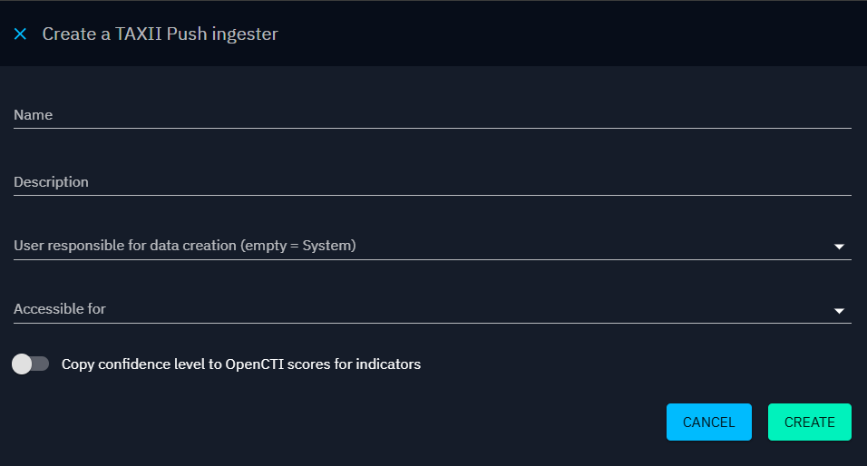
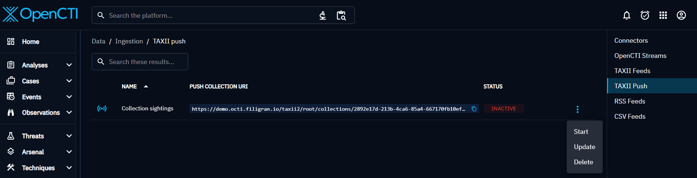

# TAXII Push

TAXII Push exposes a TAXII 2.1 collection endpoint that authorized clients can use to add STIX objects to OpenCTI. Use it when an external producer must push intelligence rather than wait for OpenCTI to poll a source.

The endpoint implements the TAXII 2.1 [Add Objects](https://docs.oasis-open.org/cti/taxii/v2.1/os/taxii-v2.1-os.html#_Toc31107540) operation.

## Prerequisites and permissions

Creating and managing a TAXII Push instance requires **Manage ingestion**. Before creation, identify the users, groups, or organizations that can authenticate to the generated collection.

## Create a TAXII Push instance

1. Go to **Integrations > Available**.
2. Select **Built-in ingestion**, then find **TAXII Push**.
3. Select **Create**.
4. Enter a name and optional description.
5. Optionally select the user responsible for created data. Leave it empty to use the System account.
6. Under **Accessible for**, select at least one user, group, or organization authorized to push data.
7. Choose whether to copy STIX Indicator confidence to OpenCTI scores.
8. Select **Create**, then start the instance from **Integrations > Deployed**.



## Configuration

| Setting | Description |
| --- | --- |
| Name | Required name displayed for the integration. |
| Description | Optional purpose or producer information. |
| User responsible for data creation | Local creator assigned to imported objects. Empty uses System. |
| Accessible for | Required users, groups, or organizations allowed to push objects. |
| Copy confidence level to OpenCTI scores for indicators | Maps STIX Indicator confidence to OpenCTI score. |

TAXII Push controls authentication through **Accessible for**. It does not expose the authentication-mode selector used by polling feeds.

## Use the generated endpoint

After creation, OpenCTI generates a collection endpoint in this form:

```text
https://<opencti-base-url>/taxii2/root/collections/<ingester-id>/objects/
```

Start the TAXII Push instance before sending STIX 2.1 bundles to the endpoint.



## Manage and monitor TAXII Push

The deployed instance action menu provides:

- **Start** and **Stop**
- **Update**
- **Export**
- **Delete**

The detail page shows its status, description, creator, confidence-mapping option, dates, and technical connector Works when the user can access them. TAXII Push does not have an ingestion Logs tab.

## Import and export

Export downloads a JSON configuration named with the date and TAXII Push name.

To import a configuration:

1. Open **Integrations > Available** and find **TAXII Push**.
2. Select the file-import action.
3. Choose the JSON configuration.
4. Select the local creator and authorized members.
5. Create and start the instance.

The file prefills the name, description, and confidence-mapping option. The creator and **Accessible for** values remain platform-specific and are not imported.

TAXII Push supports file import but not **Import from Hub**.

## Best practices

- Grant access only to dedicated producer accounts or narrowly scoped groups.
- Use a dedicated creator identity to make pushed data easy to audit and filter.
- Distribute the collection endpoint only to authorized producers.
- Stop the instance immediately if a producer credential is compromised.
