# Knowledge curation

Knowledge curation keeps the knowledge graph clean after ingestion. Detectors continuously look for duplicates across vendor naming, contradictions, stale knowledge and conflicting relationships, and turn each finding into a proposal that explains its confidence with evidence. Analysts work these proposals in a curation inbox, policies can apply the safest ones automatically, every merge stays reversible for the retention period of its merge record, and a Knowledge health score tracks the quality of the graph over time.

This page explains what the detectors find, how a proposal is scored, how to review and apply proposals, how merges are reverted, how policies and adjudication by the OpenCTI Curator (an XTM One agent) work, and how to read the Knowledge health score.

!!! tip "Enterprise edition"

    The detectors, the curation inbox, reversible merges, the Knowledge health score and its weekly digest, field authority and the `curationResolve` query are available in the Community Edition. Adjudication by the OpenCTI Curator (an XTM One agent) and curation policies (automatic apply) require the **OpenCTI Enterprise Edition**. Please read the [dedicated page](../administration/enterprise.md) for full details.

## What is knowledge curation?

Knowledge curation lives in three places: **Data > Curation**, the data-quality hub, with the **Inbox**, **Merges** and **Knowledge health** tabs; the **Changes** tab of every entity, whose **Merges** view lists the merges the entity took part in; and **Settings > Customization > Curation**, with the curation **Settings** and **Policies** tabs. A **Knowledge health** dashboard template and three dashboard widgets show the score on any dashboard. It relies on the following concepts:

| Concept          | Description                                                                                                                                                                       |
|:-----------------|:----------------------------------------------------------------------------------------------------------------------------------------------------------------------------------|
| Proposal         | A finding of a detector: its kind (for example `merge` or `stale`), its subjects (the entities or relationships concerned), the recommended action, the evidence and a confidence. |
| Evidence         | One signal that supports (or contradicts) a proposal, with a score, a weight and a plain-language description.                                                                    |
| Confidence       | A value between 0 and 1 computed from the evidence. It decides whether a proposal is ambiguous, and whether a policy may apply it.                                                |
| Ambiguous band   | The confidence range in which a proposal can be sent to an XTM One agent for adjudication (Enterprise Edition).                                                                    |
| Merge record     | A snapshot taken around every merge, which makes the merge reversible (unmerge) during a retention window.                                                                        |
| Curation policy  | A rule that applies eligible proposals automatically, through background tasks (Enterprise Edition).                                                                              |
| Knowledge health | A daily snapshot of the quality of the graph, summarized as a score from 0 to 100.                                                                                                |

## Why use it?

Every source names threats its own way. When one connector imports the malware `Cl0p` and another one imports `Clop Ransomware`, the platform holds two entities: their relationships are split, their behavior is hidden, and every analysis built on them is incomplete. The same goes for sources overwriting each other's fields, indicators revoked while the observables they are based on are still active, or procedures lost when a source replaces the description of a `uses` relationship.

Knowledge curation addresses these problems on the stored graph:

- **Analysts work an inbox instead of hunting duplicates.** Each proposal explains why it exists, with the evidence that produced its confidence.
- **Merges are no longer final.** Every merge is recorded and can be reverted, entirely or for some of the merged entities, during a retention window.
- **Automation stays safe.** Policies only apply proposals above their thresholds, never merge or add aliases across markings or organizations, and every automatic action is reversible.
- **Managers get a measure.** The Knowledge health score and its trend show whether the graph gets cleaner.
- **Agents get a graph they can reason over.** XTM One agents and importers bind names to existing entities instead of creating new duplicates.

!!! note "Curation, deduplication and data consistency"

    [Deduplication](deduplication.md) prevents duplicates at creation time, when two objects share the same identifier. Knowledge curation finds the duplicates deduplication cannot see (different names for the same object), along with contradictions and stale knowledge, after ingestion. The [data consistency manager](dataSanityManager.md) handles technical operations, such as identifiers computed by older versions. Curation never adds knowledge from outside the graph: it reconciles what already exists.

## How does it work?

### When detection runs

The curation manager detects findings in two ways:

- **Live detection.** The manager listens to the platform stream. When an entity of a curated type is created, merged, or has its name, aliases or description updated, the manager compares it with the similar entities found by a full text search on its names and, when the behavior detector is enabled, with the 20 entities of its family that use the most ATT&CK techniques in common with it, whatever their names. Inverted dates are detected on every created or updated object, procedure conflicts on every updated `uses` relationship towards an Attack Pattern, and fields overwritten by another source on every updated entity of a curated type. An event that still cannot be processed after five attempts is kept aside and tried again at the next manager cycles (up to ten more times, and again after a restart that interrupted a retry), while the stream moves on.
- **Scheduled scans.** A full scan runs every 24 hours, or at the next manager cycle (every minute) after an administrator clicks **Run a scan now** in the settings. For each curated entity type, a scan compares the most recently updated entities with a rotating slice of the others, within the configured scan size (5,000 per type by default, half for each): each scan takes the next slice in creation order, so successive scans go through every entity. Each scan also compares a rotating page of 500 entities per type with the whole graph, through the same candidates as the live detection (names and shared techniques), so two old duplicates loaded in different slices are still found over successive scans, including a pair found by its behavior alone. Entities that change are compared with the whole graph by the live detection. The contradiction and staleness detectors read their candidates by pages of up to 2,000 (5,000 for revoked Indicators) and also continue where the previous scan stopped, so a large graph is covered over successive scans.

Turning curation off in the settings stops both: no new proposal is raised, and the open proposals stay in the inbox. A larger scan size covers more entities at each scan, and the scan takes longer.

A finding detected again refreshes the open proposal (its confidence and evidence) instead of creating a new one. A finding that was rejected, reverted or acknowledged is never proposed again. A finding whose fix was applied (dates fixed, aliases added, entity revoked...) is only detected again when the problem came back, for example when the inverted dates are written again: it then gets a new proposal. For duplicates, a pair of entities decided distinct (rejected or reverted) is never proposed again, whatever the detector that compares them later.

### The six detectors

| Detector                                     | What it finds                                                                                                                                                                                                                                                                                                                                                                                                                                                                             | Proposal kinds                     |
|:---------------------------------------------|:------------------------------------------------------------------------------------------------------------------------------------------------------------------------------------------------------------------------------------------------------------------------------------------------------------------------------------------------------------------------------------------------------------------------------------------------------------------------------------------|:-----------------------------------|
| Normalization and alias graph (`normalization`) | Entities whose names or aliases have the same canonical form. The canonical form ignores case, diacritics, punctuation and separators, reads digits used as letters (`Cl0p` and `B1ackCat`, but not `APT28` or `LockBit 3.0`), and removes vendor suffixes and qualifiers (`Group`, `Team`, `Ransomware`, `Loader`, `Operation`, text in parentheses...). It also uses a vendor taxonomy shipped with the platform, built from MITRE ATT&CK Enterprise, the MISP galaxy `threat-actor` cluster (vendor naming, including the ETDA threat group cards) and the MISP galaxy `malpedia` cluster: two entities listed as names of the same object are compared, and names the taxonomy lists for an entity but that it does not carry yet are proposed as aliases - one proposal per entity, citing every catalogue that lists the names. A name carried by another entity of the platform, a catalogue identifier (such as `G0007`) and a name a catalogue also gives to another object (such as `Grizzly Steppe`, listed by the MISP galaxy for both APT28 and APT29) are never proposed. | `merge`, `type_mismatch`, `alias` |
| Similarity (`similarity`)                    | Entities of the same type whose names or aliases (5 characters or more) are similar but not identical, using trigram similarity above the similarity threshold (0.8 by default). Optionally, descriptions of at least 80 characters are compared (TF-IDF cosine similarity above 0.92 by default). Description similarity only reinforces or reveals a pair: it is never enough on its own to create a proposal.                                                                                            | `merge`                            |
| Behavior anchoring (`behavior`)              | Intrusion Sets, Threat Actors, Campaigns, Malware and Tools with overlapping behavior: shared ATT&CK techniques, tools and malware, infrastructure (including IP addresses, domain names, URLs, email addresses and hostnames), victimology (targeted sectors, locations and organizations), and campaigns or incidents attributed to both. A pair found on behavior alone needs at least 5 shared techniques and a technique overlap of at least 60%.                                                         | `merge`                            |
| Contradictions (`contradiction`)             | Impossible dates (`first_seen` after `last_seen`, `valid_from` after `valid_until`, `start_time` after `stop_time`), an object that different sources attribute to two actors decided distinct - each source naming one of them, none both, since distinct actors can share an attribution; each scan checks a rotating share of the pairs decided distinct, so every pair is checked over successive scans - and revoked Indicators still based on active Observables (updated after the Indicator was revoked - manually, at the end of its validity or by decay - with a score of at least 50). When the subject of a contradiction results from a recorded merge, a `split` proposal suggests to revert that merge.                                                                                 | `contradiction`, `split`           |
| Staleness (`staleness`)                      | Non-revoked entities with no update and no new or updated relationship for a number of months (24 by default, 12 for Infrastructure and Indicators, 36 for Campaigns), and Indicators whose decayed score fell to or below the revoke score of their decay rule but which are still not revoked.                                                                                                                                                                                                             | `stale`                            |
| Relationship conflicts (`relationship_conflict`) | A `uses` relationship towards an Attack Pattern whose description (the procedure) was replaced by a different text written by another source. A text that only extends the previous one is an enrichment, not a conflict. The writer of each procedure is remembered from the creation of the relationship on; when it is not known, a writer that was not yet a creator of the relationship counts as another source.                                                                            | `relationship_conflict`            |

Duplicates are only compared within the same type, or within the same family for type mismatches: actors (Intrusion Set, Threat Actor Group, Threat Actor Individual), software (Malware, Tool) and campaigns. A Malware and a Tool with the same name produce a `type_mismatch` proposal, not a `merge` proposal. Indicators are never compared for duplicates.

One more kind of proposal, `field_precedence`, comes from the [field authority](#field-authority) rules rather than from a detector.

### Proposal kinds and actions

Accepting a proposal executes its recommended action with the rights of the user who accepts it.

| Kind                    | Recommended action                         | What accepting the proposal does                                                                                                                                                                                                                            |
|:------------------------|:-------------------------------------------|:------------------------------------------------------------------------------------------------------------------------------------------------------------------------------------------------------------------------------------------------------------|
| `merge`                 | `merge`                                    | Merges the subjects into the surviving entity. The suggested surviving entity is the one with the most relationships, then the most names; you can choose another subject. The merge is [reversible](#reversible-merges-and-unmerge).                        |
| `alias`                 | `add_aliases`                              | Adds, as aliases of the entity, the names that the public name catalogues shipped with OpenCTI (MITRE ATT&CK, MISP galaxy) list for it and that it does not carry yet. The names come from these catalogues only: never from your data, and never from another OpenCTI platform. |
| `type_mismatch`         | `acknowledge`                              | Changes nothing: it records that the two entities of different types were reviewed. Rejecting it records that they are distinct.                                                                                                                             |
| `contradiction`         | `fix_dates`                                | Swaps the two inverted dates, as they are under the entity lock when the proposal is accepted: dates that are not inverted any more are left untouched (reject the proposal). |
| `contradiction`         | `resolve_attribution`                      | Keeps the attribution you choose and deletes the other ones. You must choose the attribution to keep, and you need the `Delete knowledge` capability. When both attributions hold, reject the proposal: the conflict is not proposed again. |
| `contradiction`         | `unrevoke_indicator`                       | Reactivates the Indicator as an edit of the Indicator does: with a decay rule, its decay restarts from its base score for the decay lifetime, so the decay manager does not revoke it again; without one, it takes the default score and validity; under a decay exclusion, it is valid for its original lifetime, bounded between 30 and 365 days. Reverting the proposal puts back the score, validity and decay state it had. Accepting checks the contradiction again: when no Observable the Indicator is based on is still active (updated after the Indicator was revoked, with a score of at least 50), the Indicator stays revoked (reject the proposal). |
| `split`                 | `unmerge`                                  | Reverts the merge that produced the entity.                                                                                                                                                                                                                 |
| `stale`                 | `revoke`                                   | Revokes the entity (an Indicator as an edit of the Indicator does: revoke score, no detection, validity ending now), after checking the staleness rule again on the current entity: an entity updated or given a relationship within the period, or a decayed indicator whose score recovered, is left untouched (reject the proposal). The check and the revocation run under the entity lock, and an entity given a relationship while it is revoked is put back as it was. |
| `relationship_conflict` | `preserve_procedure`                       | Keeps the overwritten procedure, according to the relationship conflict mode of the settings: in an analysis Note attached to the relationship and authored by the previous source. Reverting the proposal deletes only the Note its acceptance created, never a matching Note written by someone else. In the **Detect only** mode, accepting only records the decision. |
| `field_precedence`      | `set_field`                                | Restores the value that a less authoritative source overwrote, only while the field still holds the overwritten value (checked and written under the entity lock): a later write is kept (reject the proposal). |

### How a proposal explains itself

Every proposal explains itself in the same structure, on its page and in its approval:

- a **title** saying what will change, for example **Add 24 aliases to APT28**;
- **What changes**: each value before and after the change, the added values highlighted;
- **Evidence**: the entities and sources that justify the change, with links (an entity of the platform, the MITRE ATT&CK page of a group, the MISP galaxy file) and counts;
- **Why**: one plain-language sentence;
- the **confidence** in words (high, medium or low) with what it means;
- **What happens when you decide**: what **Accept**, **Reject** and **Decide later** do, including whether an accepted change can be reverted.

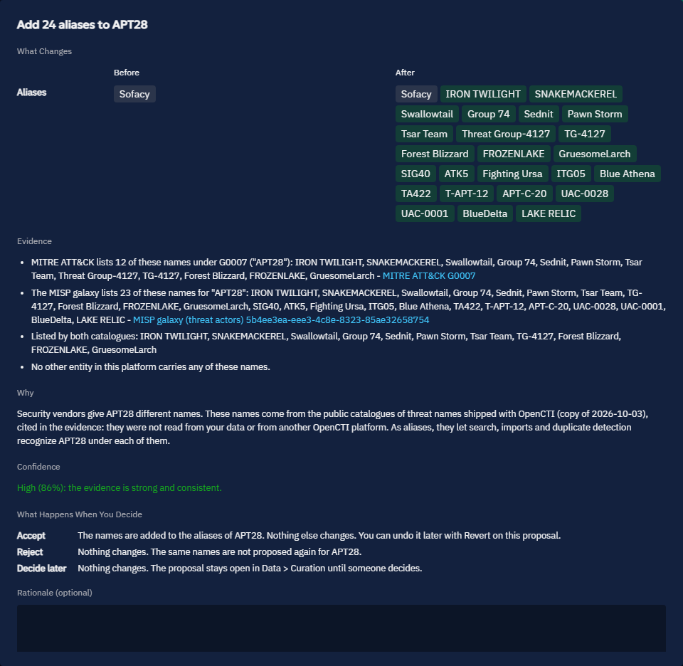

The explanation is built by the platform once and read by everyone: the user interface translates it, and API clients read it from the `explanation` field of a proposal (its `text` gives the whole explanation in English, each part also gives its translation template and values). The OpenCTI Curator receives the same text with every adjudication request.

One example per proposal kind:

| Kind                    | Title                                                                  | What changes                                                    | Why (excerpt)                                                                                                                         |
|:------------------------|:-----------------------------------------------------------------------|:----------------------------------------------------------------|:--------------------------------------------------------------------------------------------------------------------------------------|
| `alias`                 | Add 24 aliases to APT28                                                | Aliases: Sofacy -> Sofacy, Sednit, Pawn Storm, Forest Blizzard... | Security vendors give APT28 different names. These names come from the public catalogues of threat names shipped with OpenCTI (copy of 2026-10-03), cited below: they were not read from your data or from another OpenCTI platform. |
| `merge`                 | Merge "APT 28" into "APT28"                                            | Entities: APT28, APT 28 -> APT28; Aliases of APT28: + APT 28      | The Intrusion Set entities "APT28" and "APT 28" carry the same name written differently, so they very likely describe the same thing. |
| `merge`                 | Merge "Fancy Bear" into "APT28"                                        | Entities: APT28, Fancy Bear -> APT28                            | "APT28" and "Fancy Bear" are listed as two names of the same Intrusion Set by a public catalogue of threat names shipped with OpenCTI. |
| `type_mismatch`         | Check the type of "Cobalt Strike" (Malware) and "Cobalt Strike" (Tool) | Nothing in the knowledge                                        | Two entities of different types carry the same name. One of them is probably typed wrongly.                                            |
| `contradiction`         | Swap the First seen and Last seen dates of "Operation X"               | First seen: 2024-05-01 -> 2023-01-01; Last seen: the reverse    | The date that marks the start comes after the date that marks the end, which cannot be.                                               |
| `contradiction`         | Keep one attribution of "Operation X"                                  | Attributed to: APT28, APT29 -> the one you choose                | "Operation X" is attributed to several actors that were decided to be distinct entities, and no single source attributes it to all of them. |
| `contradiction`         | Reactivate the indicator "[ipv4-addr:value = '1.2.3.4']"               | Revoked: Yes -> No                                              | The indicator was revoked, but observables it detects were seen active since then (updated with a score of 50 or more).               |
| `split`                 | Undo the merge of "APT28"                                              | Entities: APT28 -> APT28, Sofacy                                | "APT28" was produced by merging several entities and is now involved in a contradiction.                                              |
| `stale`                 | Revoke "Old campaign"                                                  | Revoked: No -> Yes                                              | Nothing about "Old campaign" changed for more than 24 months: no update and no new relationship.                                      |
| `relationship_conflict` | Keep both procedures of "APT28 uses Mimikatz"                          | Notes: none -> a note with the replaced one                         | Two sources describe differently how "APT28" uses "Mimikatz", and the later description replaced the earlier one.                    |
| `field_precedence`      | Restore the description of "APT28"                                     | description: Unknown -> Russian actor                           | The field authority rules say which source is trusted for this field: a less trusted source replaced the value written by a more trusted one. |
### Evidence and confidence

Every proposal lists the evidence that produced its confidence. Each evidence has:

- a **score** between 0 and 1: how strongly the signal is present (for example 0.87 for names that are 87% similar);
- a **weight**: how much this kind of signal counts. A negative weight means the signal argues against the proposal;
- a **description** in plain language, such as `"Cl0p" and "Clop Ransomware" are the same name once vendor suffixes and qualifiers are removed ("clop")`.

The confidence combines the evidence with a noisy-OR: every independent signal raises the confidence without ever exceeding 1, then negative evidence discounts the result.

```
confidence = (1 - (1 - w1 x s1) x (1 - w2 x s2) x ...) x (1 - |wn| x sn) x ...
             positive evidence                         negative evidence
```

The weights of the duplicate evidence are:

| Evidence                                 | Weight | Score                                                                                         |
|:-----------------------------------------|:-------|:----------------------------------------------------------------------------------------------|
| `canonical_collision`, `shared_alias`    | 0.92   | 1, when a name or an alias has the same canonical form                                        |
| `canonical_collision`, `shared_alias`    | 0.75   | 1, when the names are the same once vendor suffixes and qualifiers are removed                |
| `taxonomy`                               | 0.8    | Reliability of the taxonomy source: 0.85 for MITRE ATT&CK, 0.75 for the MISP galaxy `malpedia` cluster, 0.70 for the MISP galaxy `threat-actor` cluster |
| `trigram`                                | 0.6    | Trigram similarity of the closest names                                                       |
| `attack_overlap`                         | 0.5    | Overlap of the ATT&CK technique sets (each entity needs at least 3 techniques)                 |
| `description_similarity`                 | 0.45   | Cosine similarity of the descriptions                                                         |
| `shared_infrastructure`                  | 0.45   | Overlap of the infrastructure sets                                                            |
| `graph_similarity`                       | 0.4    | Structural similarity, when the platform provides a graph similarity analysis                 |
| `co_attribution`                         | 0.35   | 0.5 per campaign or incident attributed to both, up to 1                                      |
| `shared_tools`                           | 0.3    | Overlap of the tools and malware sets                                                         |
| `victimology`                            | 0.2    | Overlap of the targeted sectors, locations and organizations                                  |
| `source_agreement` (different sources)   | 0.15   | 1: entities coming from different sources are a typical pattern of vendor naming              |
| `source_agreement` (same source)         | -0.3   | Share of common sources (the author of each entity): a source that maintains both entities separately suggests they are distinct (not used when the names collide exactly) |

A `type_collision` evidence (same name, different types of the same family) uses the weights of the canonical forms or of the taxonomy. The other detectors produce fixed evidence: `date_inversion` (0.95), `attribution_conflict` (0.9), `revoked_indicator` (0.8), `merged_entity` (0.6, for split proposals), `staleness` (0.7), `decayed_indicator` (0.6), `procedure_conflict` (0.75) and `field_conflict` (0.8).

Duplicate proposals (`merge` and `type_mismatch`) need at least one name-based evidence, or a technique overlap of at least 60%, and a confidence of at least the minimum proposal confidence (0.45 by default). When several detectors contributed to a proposal, its detector is `combined`.

Raising a threshold of the settings (name similarity, description similarity, behavior overlap) or the minimum proposal confidence gives fewer and surer proposals; lowering it finds more pairs and leaves more proposals to reject in the inbox.

### Ambiguous band and adjudication by the OpenCTI Curator

Proposals whose confidence falls in the **ambiguous band** (from 0.55 included to 0.85 excluded by default) are flagged as such in the inbox. The band marks the proposals that are neither clearly right nor clearly wrong: this is where the judgement of an agent is worth its cost, and adjudication is limited to them to keep that cost bounded. Analysts and policies decide the proposals outside the band.

!!! tip "Enterprise edition"

    Adjudication requires the OpenCTI Enterprise Edition and a platform registered with XTM One (see [XTM Suite configuration](../deployment/configuration.md#xtm-suite)).

When adjudication is enabled in the settings, the curation manager sends the open duplicate proposals (`merge` and `alias` kinds) of the ambiguous band that have no adjudication yet to the XTM One agent in charge of curation adjudication: the **OpenCTI Curator** out of the box, or the agent selected in the settings (the list shows the XTM One agents bound to curation adjudication, highest priority first). OpenCTI calls XTM One as the **Run as** account of the settings, the platform administrator when it is empty. The OpenCTI Curator writes nothing in OpenCTI: when it needs more than the request carries, it reads the knowledge around the subjects with that account, and OpenCTI records the decision itself. The account therefore needs the **Access knowledge** capability, and access to the markings and organizations of the knowledge the Curator should read. OpenCTI also reads the proposal and its subjects with that account before sending them: a proposal the account cannot read in full is not sent. A selected account that no longer exists, is disabled or lacks the **Access knowledge** capability pauses adjudication, without falling back to the platform administrator, until the settings name another account. It sends up to 5 proposals per manager cycle, highest confidence first, within a daily limit (50 by default, counted per UTC day for automatic and manual requests together). A request that failed is retried after 24 hours. An adjudication judges the proposal as it was sent: an answer that comes back after the proposal was refreshed with other subjects' names, evidence or confidence is discarded, and a proposal refreshed that way loses its earlier adjudication, so it is adjudicated again before a policy that requires the Curator's agreement can apply it. Accepting a proposal marks its adjudication applied only when the action that ran is the one the adjudication decided.

The agent receives the proposal kind, confidence, detector, evidence, the [explanation](#how-a-proposal-explains-itself) analysts read (as plain text) and the decisions the proposal takes, and for each subject its type, name, aliases, description (the first 1,500 characters), author, first and last seen dates and creation date. A merge proposal has two or more subjects. An alias proposal raised by the normalization detector has a single subject and comes with the names to add (`proposed_aliases`, the names a public taxonomy gives the entity that it does not carry yet): it takes `alias` (add the names), `distinct` (refuse them) or `skip`, never `merge`. The agent answers with one JSON object:

```json
{
  "decision": "merge",
  "rationale": "Same ransomware family: identical name once normalized, shared infrastructure.",
  "target_id": "<identifier of the subject to keep>"
}
```

| Decision   | Meaning                                                                                 | Effect when the decision is applied                                                           |
|:-----------|:----------------------------------------------------------------------------------------|:----------------------------------------------------------------------------------------------|
| `merge`    | The subjects are the same real-world object.                                            | The subjects are merged into the subject named by `target_id`, or into the suggested target. |
| `alias`    | The names designate the same object, but the records should stay apart (sub-groups, overlapping clusters); on a one-subject alias proposal, the proposed names belong to the subject. | The names of the other subjects (the proposed names on a one-subject alias proposal) become aliases of the target, once no other entity carries them (see below). |
| `distinct` | The subjects are different objects; on a one-subject alias proposal, the proposed names designate another object. | The proposal is rejected and the pair (or the names) is never proposed again.                  |
| `skip`     | The evidence supports no decision.                                                      | The proposal stays open for an analyst.                                                       |

An answer that is not a valid decision is recorded as `skip`, and so is an answer whose `target_id` is not a subject of the proposal or a `merge` of a single subject, whatever agent is bound to the intent; the API refuses a `merge` decision on a single subject. The adjudication is **advisory**: OpenCTI records the decision, the rationale, the agent, the model when the adjudicator provides it, and the date on the proposal, but does not apply it. A decision is applied by an analyst who accepts the proposal, by a curation policy that [requires adjudication agreement](#curation-policies-and-auto-apply), or by the XTM One `decide_opencti_curation_proposal` tool when its user approves the action. Decisions resolve duplicates: only `merge` and `alias` proposals take one, through the adjudication or the API, and the other kinds are accepted or rejected in the inbox. A decision applied through the API makes the change it states, whatever the proposal recommended (an `alias` decision on a merge proposal adds the aliases instead of merging, a `merge` decision on an alias proposal of two or more subjects merges them and needs the `Merge knowledge` capability), on the target it names. In OpenCTI an alias designates a single entity, so an `alias` decision on a merge proposal is refused while the other subjects still exist under those names: merge the subjects, or reject the proposal to keep them apart. Once the other subjects are gone (deleted or merged elsewhere), their names are free and the decision applies. Accepts, rejections, decisions and reverts of the same proposal run one at a time, so a proposal changes the graph only once. A decision can carry the `updated_at` of the proposal it was taken on (`expected_updated_at`): it is then refused, and nothing changes, when a detector or another decision changed the proposal since it was read - the XTM One tool sends it, so an approved decision never applies to subjects or aliases its approver did not see.

The **Ask the Curator** action of a proposal requests an adjudication on demand, for an open duplicate proposal (`merge` or `alias` kind) of the ambiguous band. The other kinds (contradictions, staleness, relationship conflicts) stay with the analysts: the Curator resolves entities. It requires the `Create / Update knowledge` capability and counts towards the daily limit.

## How do I curate the knowledge graph?

### Work the curation inbox

1. Go to **Data > Curation > Inbox**. The counters at the top give the open proposals, the proposals that **need your decision** (the open proposals of the ambiguous band), the reversible merges, the Knowledge health score out of 100 and the time of the last scan (hover it for the exact date). Click **Open proposals** or **Needs your decision** to filter the list; the other two open their tabs. The list shows the proposals with their kind, confidence, subjects and recommended action. Filter by status, kind, detector, or ambiguous band; when no proposal matches, **Clear filters** brings the full list back.
2. Open a proposal. Its header states what will change and why, with the recommendation and its confidence, and holds the primary action: **Review the merge** (or **Review the change**) while the proposal is open, **Open the merge record** once a merge is applied. Below come **What this proposal does** (the [explanation](#how-a-proposal-explains-itself)), the recommendation with what found the proposal, the comparison, the evidence details, the decision and the adjudication. The comparison shows the subjects side by side (type, name, aliases, description, author, markings, creation and modification dates), with the suggested surviving entity highlighted; select another subject to keep it instead. A subject or relationship end you cannot read shows as **Restricted**.
3. Read the evidence: each signal gives its score, its share of the decision (hover it for its weight) and its description, which together explain the confidence. A signal with a negative weight lowers the confidence. When the proposal was adjudicated, the adjudication shows the decision, the rationale, the agent, the model and the date. Use **Ask the Curator** to request one (Enterprise Edition).
4. Decide:
    - **Review the merge** (or **Review the change**) opens the approval of the change with its explanation: what it does (for example **Merge 2 objects into APT28** or **Add 24 aliases to APT28**), what changes (for a merge, what moves to the surviving entity you chose: relationships, new aliases, external references), the evidence, why, the confidence and what each decision does. Confirm to execute the recommended action. When a subject of a merge proposal changed since the proposal was raised (renamed, aliases or identifiers edited), a merge runs the duplicate detectors again on the entities as they are, whether you accept it, bulk accept it or apply a `merge` decision through the API: if they no longer find the entities duplicates, the merge is refused, nothing changes, and you can reject the proposal.
    - **Reject** closes the proposal; the optional reason helps calibrate the next proposals. The finding is never proposed again.
    - **Revert** undoes an accepted or auto-applied proposal (see below).
5. To process many proposals at once, select rows and use **bulk accept** or **bulk reject** (up to 500 proposals at a time; the toolbar warns when the selection is larger or holds proposals that are already decided). Bulk accept runs as a [background task](background-tasks.md) with your rights, and applies each proposal as it was when you started it: a proposal a detection refreshed before the workers reached it is left open and reported in the errors of the task, for you to review again. The toolbar leaves out of the accept the selected proposals that need a capability you do not have (merge knowledge for a merge or a split, delete knowledge for an attribution conflict) and says how many it left out, and the API refuses upfront a bulk accept that holds one. An attribution conflict needs the attribution to keep, which you choose on the proposal itself: the toolbar leaves these proposals out of a bulk accept and says how many it left out, and the API refuses a bulk accept that holds one. Bulk reject is immediate, applies to every open selected proposal, and can carry a rationale.

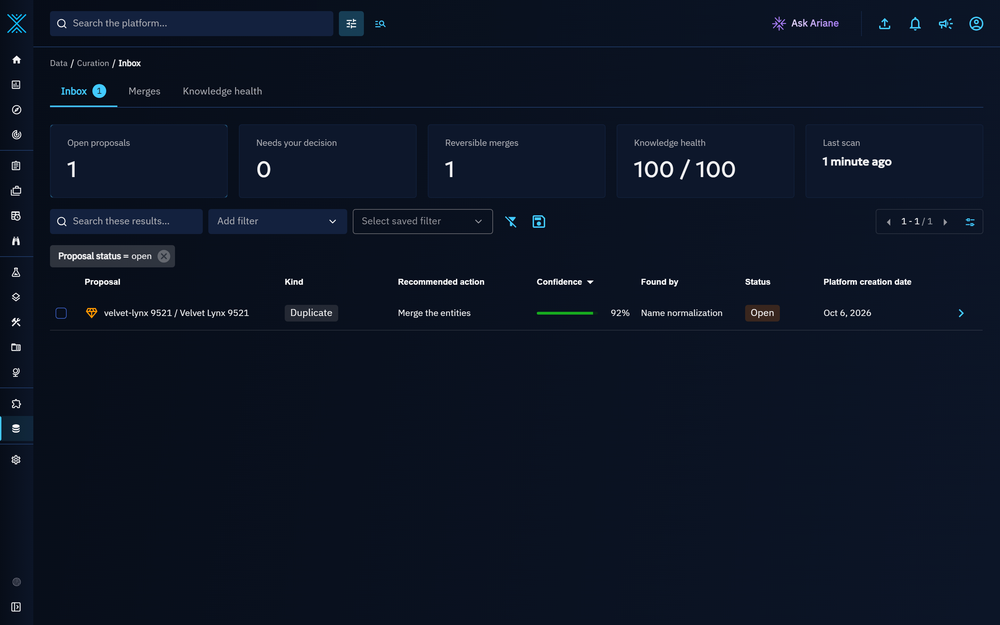

Before the first scan has raised any proposal, the Inbox explains what fills it and when the next scan runs, and links to the curation settings (users without the `Manage customization` capability are invited to ask their administrator).

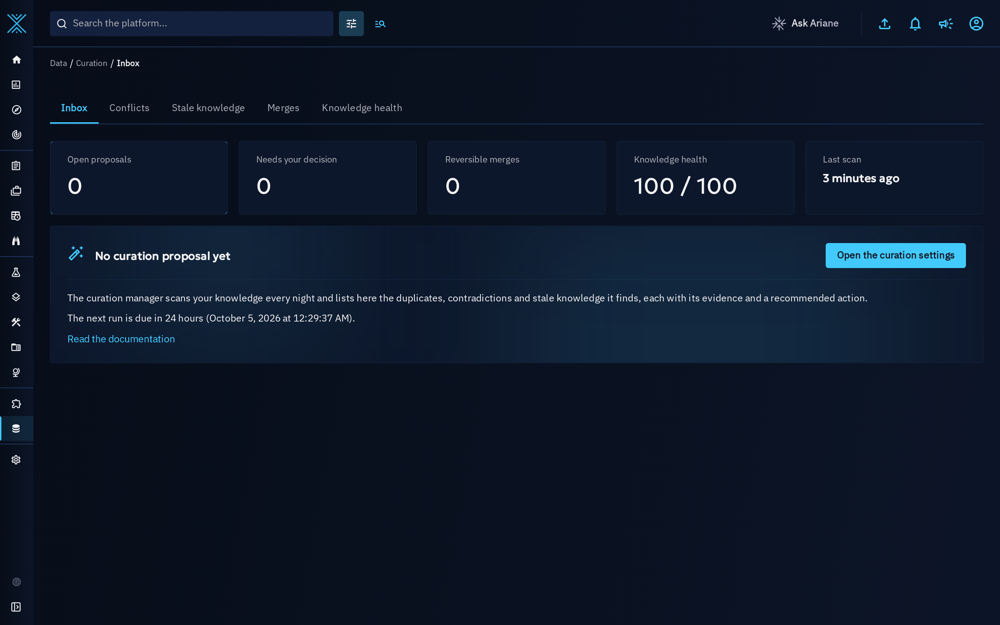

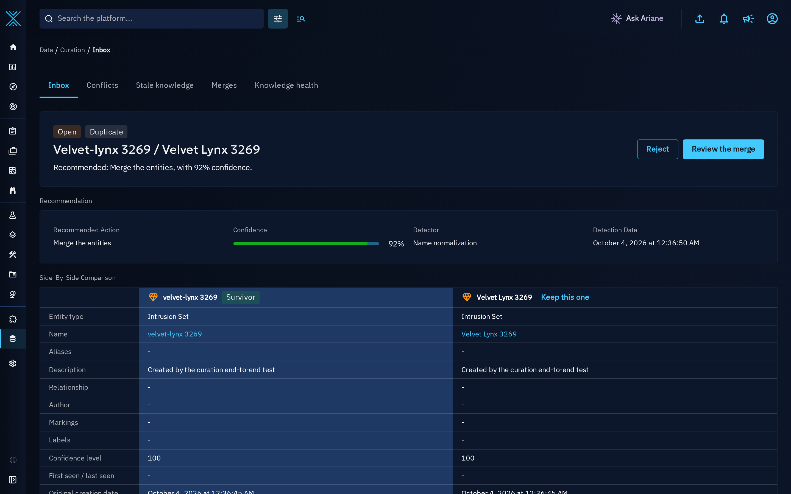

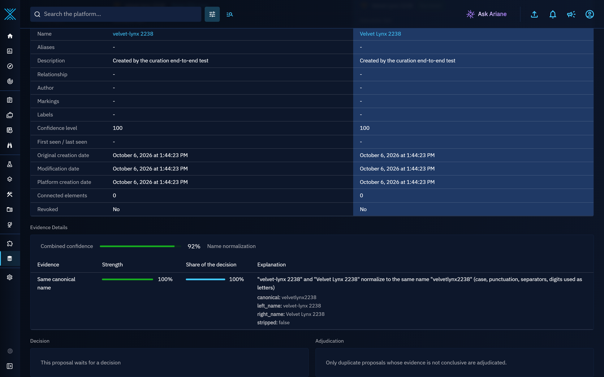

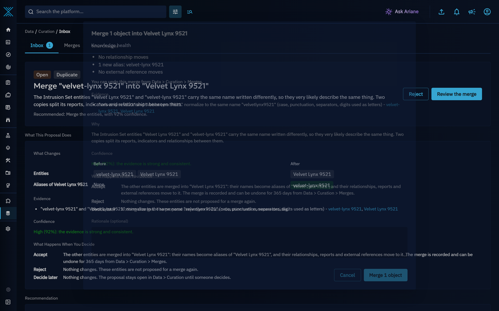

On an entity, a **Possible duplicate** chip in the header signals an open `merge` proposal, names the other entity (or the number of possible duplicates when there are several) and links to the proposal. An open `alias` proposal shows an **Aliases to review** chip instead: it adds names, it never says the entity is duplicated. The tooltip of each chip gives the title of the proposal, its confidence and its date.

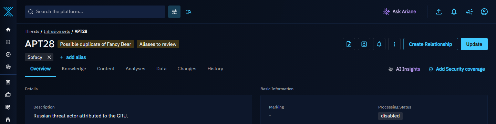

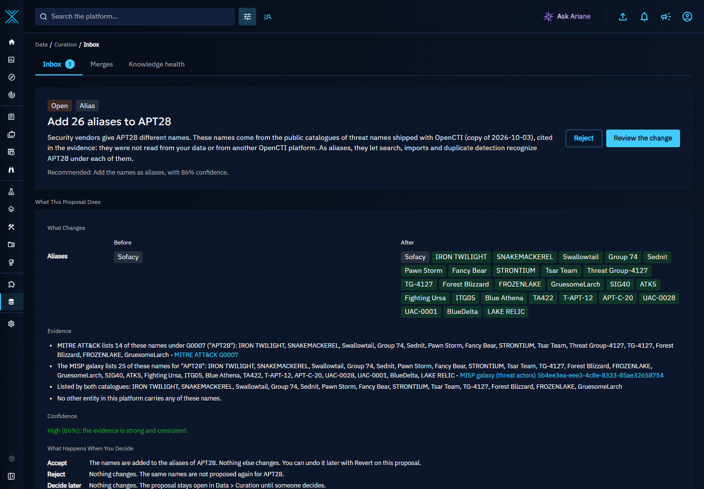

!!! note "Visibility and rights"

    A proposal carries the markings of all its subjects, and of the relationships its action names (the attributions of an attribution conflict), and is shared only with the organizations every restricted subject or relationship is shared with, so it never reveals an entity or an attribution to a user who cannot read it. When a subject of an open proposal, or one of these relationships, is reclassified, the curation records manager gives the proposal the new restrictions, and until it does every read checks the subjects, and the relationships its action names, themselves: a user who just lost access to a subject no longer finds the proposal, in a list or by its link, and cannot decide on it. The counters (the inbox counters and the list totals) follow the stored restrictions and catch up once the manager has refreshed them; they never show the content of a proposal. When a subject of an open proposal, or a relationship its action names, is deleted, the curation records manager removes the proposal, which could no longer be applied as raised (unless an acceptance already started applying it, so that accepting it again records what was done); until then, its restrictions are only ever narrowed. An attribution conflict is only resolved by a user who can read every attribution in conflict: otherwise accepting it is refused and nothing is deleted. Accepting it also checks the conflict again, so that it never deletes the last attribution left: when the attribution you keep, or every other attribution in conflict, was deleted since the proposal was raised, the acceptance is refused, nothing is deleted, and you can reject the proposal; a contradiction that still holds is raised again by the next scan. When you cannot access some subjects, the proposal shows how many are restricted. Applying a proposal also checks your confidence level against the subjects, like any update (see [Reliability and confidence](reliability-confidence.md)).

Reverting a proposal undoes what its apply changed:

- For a merge, the [merge record](#reversible-merges-and-unmerge) restores every merged entity.
- For the other actions, OpenCTI replays the recorded change backwards. A value is restored only if the entity still holds the value written by the apply: later edits are kept, and reported in the activity log. The check and the restore run under the entity lock, so an edit made at the same time is never overwritten. Notes created by the apply are deleted, and attributions deleted by the apply are restored from the [trash](delete-restore.md) as long as they are still in it. Only the deletion made by the apply is restored: an attribution restored and deleted again since stays deleted.
- Two proposals cannot be reverted: a date fix, since the platform refuses an end date before the start date, and a split, which already undid a merge (merge the restored entities again instead).

Accepting a proposal applies exactly the change it describes: through the API, the only choice a caller adds is the attribution to keep for an attribution conflict. A detection refreshes an open proposal in place, so the inbox accepts the proposal as you read it: when it changed since it was shown, OpenCTI refuses the acceptance, changes nothing and shows the proposal again with its current content. API callers get the same guard by sending the `updated_at` of the proposal they read as `expected_updated_at`. Once an acceptance started, the detections no longer refresh or replace the proposal, so accepting it again after an interruption applies or records the content that acceptance started from. If the change is made but the proposal cannot be updated afterwards, OpenCTI says so and the proposal stays open: accepting it again records the change that was made, with what is needed to revert it, instead of applying it a second time. For a merge, what was made is read from the graph: a merge that stopped before its first change runs again, and a merge that stopped halfway is kept as not reversible.

A reverted proposal is never proposed again. Every decision (accept, reject, revert, adjudication) is recorded in the [activity log](../administration/audit/overview.md).

### Reversible merges and unmerge

Every merge is recorded in a **merge record**, whatever triggered it: the Merge action of **Data > Entities**, the API, the platform deduplication at creation, a data consistency operation or a curation proposal. Merges done inside a [draft](draftWorkspaces.md) are not recorded: they are reverted with the draft.

Before the merge runs, the merge record snapshots the surviving entity and every merged entity (attributes, references such as markings, labels or author, relationships and files), along with what each merged entity brings to the survivor. Go to **Data > Curation > Merges** to see every merge record, or open the **Changes** tab of an entity and its **Merges** view to see the merges the entity took part in, as the surviving entity or as a merged one. A merge record shows: merged entity, merged sources, status, merged by, date, reversible until, and number of relationships redirected. Opening a record shows each source with its aliases and its relationship counts, and the alias provenance: for each source, its name, its aliases and the relationships it brought to the merged entity. A merge record carries the markings of every entity it merged and is shared only with the organizations every restricted entity of the merge is shared with, so a merge across organizations never shows the snapshot of one entity to the members of another. You only see a record while you can also read each of its entities that still exists: the surviving entity, and any source an unmerge restored. When one of them is reclassified later, the merge history follows: the [curation records manager](../deployment/advanced/managers.md#curation-records-manager) gives the record the new markings and narrows its organization sharing accordingly (sharing the merged entity with a new organization does not open the record to it), so lists and counts only include the records you may read.

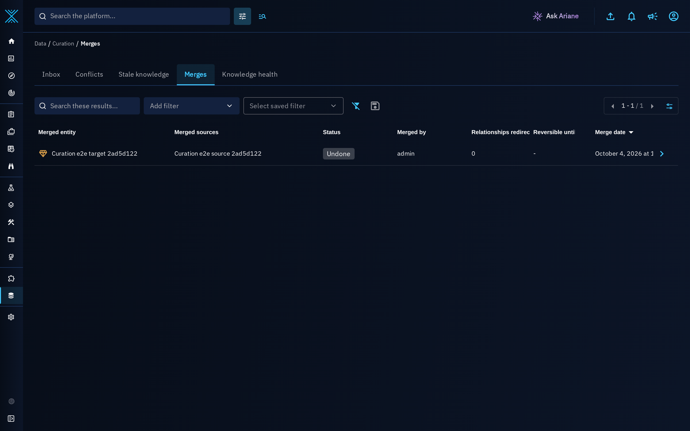

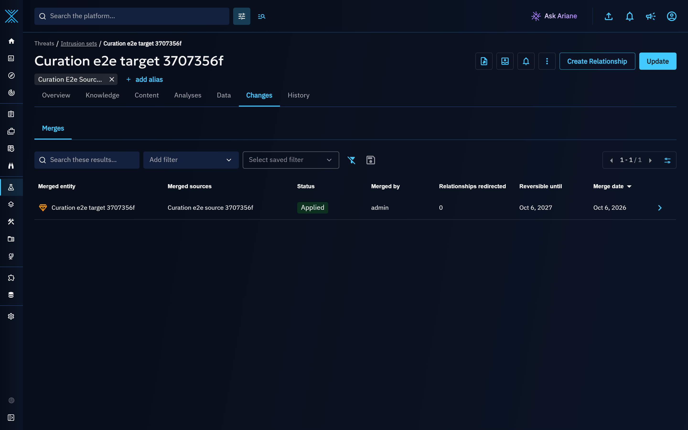

| Status (API value)                      | Meaning                                                                                                   |
|:----------------------------------------|:----------------------------------------------------------------------------------------------------------|
| **Applied** (`active`)                  | The merge can be undone until the **reversible until** date.                                              |
| **Partially undone** (`partially_reverted`) | Some sources were restored; the other ones can still be restored.                                     |
| **Undone** (`reverted`)                 | Every source was restored.                                                                                |
| **Expired** or **Not reversible** (`irreversible`) | The merge can no longer be undone: **Expired** when the retention window is over, **Not reversible** when the merge exceeded the snapshot limits or could not be recorded completely. The header of the record says why in one sentence (see below). |

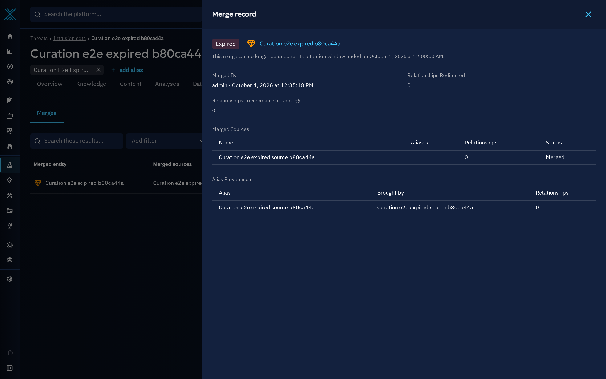

The reason a merge cannot be undone is exposed by the API in the `irreversible_reason` field of the merge record, as a stable code:

| `irreversible_reason`            | Meaning                                                                                          |
|:---------------------------------|:-------------------------------------------------------------------------------------------------|
| `retention_over`                 | The retention window is over; the header gives the date it ended.                               |
| `too_many_removed_relationships` | The merge removed more duplicated relationships than a merge record can keep.                    |
| `too_many_moved_relationships`   | The merge moved more relationships than a merge record can keep.                                 |
| `file_name_collision`            | A file of a merged entity had the name of a file of the surviving entity and was not kept.       |
| `merge_interrupted`              | The merge was interrupted before all the entities were merged.                                   |
| `merge_rerun_after_interruption` | The merge completed, on a new acceptance, a merge that had been interrupted, whose changes it cannot restore. |
| `merged_entity_deleted`          | The merged entity was deleted before the merge record was completed.                            |
| (empty)                          | The merge can be undone, or its retention window is over and the daily closing has not run yet. |

The header of a merge record shows its status, the surviving entity and, while the merge can be undone, **Undo the merge**. To revert a merge, open its record and click **Undo the merge**, for all the sources or only the ones you select; the confirmation names the entities that come back. A selection is restored as a whole or not at all: when it names an entity the record no longer waits to restore (restored meanwhile by someone else), nothing is restored and the record asks you to refresh it and select again. Undoing only some sources of a merge applied from a proposal leaves the proposal applied, so reverting it later undoes the rest. Undoing a merge requires the `Merge knowledge` capability. It:

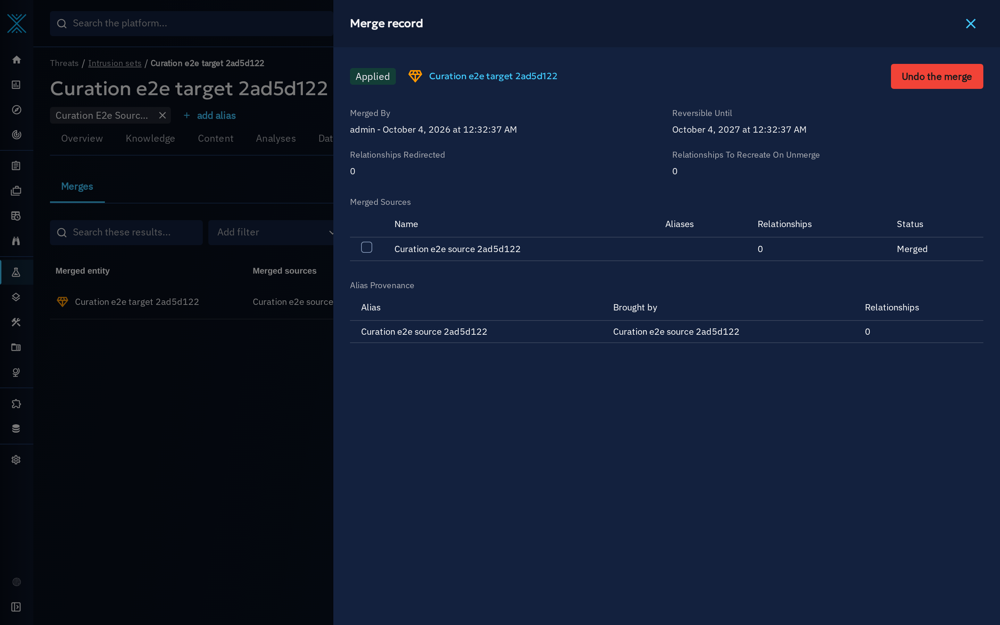


1. removes from the merged entity what the restored sources brought (their names, aliases, identifiers and references), without touching the values that were there before the merge, the values that other merged sources still contribute, or the values changed by users after the merge;
2. recreates each restored source with its original internal identifier, standard identifier and STIX identifiers, attributes and references, so that external references to it resolve again, along with the source recorded for each attribute governed by a [field authority](#field-authority) rule, so that later updates are ranked as before the merge;
3. moves back the relationships the source carried, recreates the relationships the merge had removed as duplicates, and moves back its files. When only some sources are restored, a relationship between a restored source and one still merged links the restored source to the merged entity, unless the merged entity already holds an equivalent relationship, and it is moved back to the other source when that one is restored;
4. marks the record (and the curation proposal that triggered the merge, if any) as reverted.

Each of these changes is published in the stream like any other change, so platforms that consume this one through a [live stream](import/internal-streams.md) follow the unmerge: the restored entity is created again there too, and the merged entity loses the identifiers and aliases the restored entity takes back.

!!! warning "What unmerge cannot restore"

    - **Merges past their retention window.** The retention is 365 days by default (**Merge record retention** in the settings). Once a day, the curation records manager closes the expired records: they become `irreversible`, their snapshot is dropped to free storage, and the participants and alias provenance stay for the history. Changing the retention only applies to the merges recorded afterwards.
    - **Very large merges.** A merge that removes more than 10,000 duplicated relationships, or moves more than 100,000 relationships, is recorded as `irreversible` at merge time (both limits are configurable).
    - **Files with the same name.** The merge keeps the file of the surviving entity when a merged entity has a file with the same name, and deletes the other one with the merged entity: such a merge is recorded as `irreversible` at merge time.
    - **A merged entity that no longer exists.** If the entity produced by the merge was deleted or merged again, revert its most recent merge first.
    - **Deleted elements.** References to elements deleted since the merge are dropped, and relationships that cannot be moved back or recreated are skipped and reported in the logs.
    - **Inferred relationships** are not part of the snapshot: the rules engine recomputes them.
    - **Merges without a merge record**, such as merges done before this feature was installed, cannot be reverted.

### Curation policies and auto-apply

!!! tip "Enterprise edition"

    Curation policies are available under the **OpenCTI Enterprise Edition** licence. Creating, editing, deleting, testing and applying a policy requires the `Manage customization` capability.

A curation policy applies eligible proposals automatically. Create policies in **Settings > Customization > Curation**, tab **Policies**:

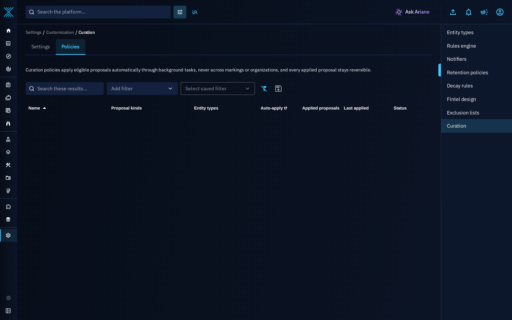

Click **Create a curation policy** to open the policy form; each field says what it does and what an empty value means:

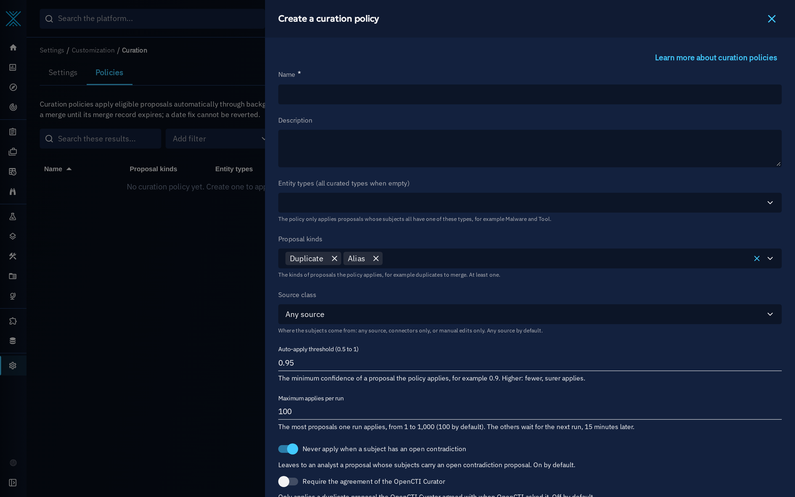

| Field                                  | Description                                                                                                                                                                                          |
|:---------------------------------------|:-----------------------------------------------------------------------------------------------------------------------------------------------------------------------------------------------------|
| Name, description                      | How the policy is identified in lists, in the rationale of applied proposals and in background tasks.                                                                                                 |
| Entity types                           | The types the policy covers: every subject of a proposal must have one of these types. Leave empty to cover every type.                                                                              |
| Proposal kinds                         | The kinds the policy applies (at least one). `split` proposals are never applied automatically.                                                                                                       |
| Source class                           | `Any`, `Connector` (every subject was created by connectors) or `Manual` (every subject was created by users). A subject counts for the source that created it: later updates by other sources do not change it.                                                                                        |
| Auto-apply threshold                   | The minimum confidence, between 0.5 and 1.                                                                                                                                                           |
| Never apply with an open contradiction | On by default: a proposal whose subjects are involved in an open contradiction proposal is excluded.                                                                                                  |
| Require adjudication agreement         | Off by default. When on, the adjudication that OpenCTI itself requested from the XTM One agent (shown as **Requested by OpenCTI**) must agree with the proposal - a decision recorded through the API, for example by an agent's decision tool, never counts: `merge` for a merge proposal, any decision but `distinct` for an alias proposal. The other kinds are never adjudicated, so the option does not apply to them. A proposal without adjudication, or adjudicated `skip`, is excluded. A policy never applies more than the proposal it covers: an alias proposal is never merged by a policy, whatever the adjudication, and a merge proposal adjudicated `alias` is left to an analyst (`manual_choice_required`), with or without this option, since its names cannot become aliases while both entities exist. |
| Max applies per run                    | The maximum number of proposals applied by one run, between 1 and 1,000 (100 by default).                                                                                                             |
| Enabled                                | A new policy is disabled until you enable it.                                                                                                                                                        |

Before enabling a policy, click **Dry run**. The dry run evaluates every open proposal without changing anything - the proposals of the policy kinds at any confidence (up to 10,000, highest confidence first), and the proposals of other kinds, counted as not covered - and shows the number of eligible and excluded proposals, the estimated impact (per kind and subject types, such as `merge:Malware`), the exclusion reasons and a sample of eligible proposals. The sample lists proposals only to users with the `Access knowledge` capability, which every proposal needs; with `Manage customization` alone, the dry run shows the counts. Like a manual run of the policy, it only counts the proposals you can read, and an eligible proposal whose action needs a capability you do not have is excluded (`missing_capability`). The last dry run stays visible on the policy to the user who ran it.

| Exclusion reason          | Meaning                                                                                       |
|:--------------------------|:----------------------------------------------------------------------------------------------|
| `not_open`                | The proposal is already decided.                                                              |
| `kind_not_covered`        | The policy does not cover the proposal kind.                                                  |
| `entity_type_not_covered` | A subject has a type the policy does not cover.                                               |
| `manual_choice_required`  | The action needs a human choice (attribution conflicts, splits, merge proposals adjudicated `alias`). |
| `subject_missing`         | A subject no longer exists.                                                                   |
| `below_threshold`         | The confidence is below the auto-apply threshold.                                             |
| `source_class_mismatch`   | The subjects do not come from the source class of the policy.                                 |
| `cross_markings`          | A proposal (merge or alias) whose subjects do not carry the same markings.                    |
| `cross_organizations`     | A proposal (merge or alias) whose subjects are not shared with the same organizations.        |
| `open_contradiction`      | A subject is involved in an open contradiction.                                               |
| `adjudication_missing`    | Agreement is required but there is no adjudication, or the agent answered `skip`.             |
| `adjudication_disagrees`  | Agreement is required and the adjudication disagrees with the proposal.                       |
| `missing_capability`      | Otherwise eligible, but you cannot apply it yourself: every action needs `Create / Update knowledge`, and a merge `Merge knowledge`. **Apply now** leaves it out; a scheduled run applies it. |

The enabled policies run automatically every 15 minutes, with the rights of the internal curation manager. **Apply now** runs an enabled policy immediately with your rights (a disabled policy applies nothing; its dry run shows what it would apply): it needs the `Create / Update knowledge` capability in addition to `Manage customization`, and applies only the eligible proposals you can read and accept yourself (a merge needs `Merge knowledge`); the others wait for a scheduled run or an analyst. In both cases, the eligible proposals (up to the maximum per run) are applied by a [background task](background-tasks.md) executed by the workers; a proposal that a background task still queued or running already holds (another policy run, a bulk accept) is left out, so a backlog of the workers never queues the same proposal twice. Each proposal is checked again when the task applies it: a proposal that is no longer eligible, or whose policy was disabled or deleted in the meantime, is skipped. A merge proposal is also run through the duplicate detectors again on its entities as they are at that moment: when the detectors no longer find the pair, or find it below the policy threshold (an entity was renamed or changed since the proposal was raised), the policy skips it and leaves it to an analyst. Applied proposals get the `auto_applied` status, the policy, and the rationale `Applied by curation policy <name>`. When the XTM One agent answered `alias` on a merge proposal, the policy leaves the proposal to an analyst.

!!! warning "Guardrails no policy can disable"

    - A merge is never applied automatically between subjects that do not carry exactly the same markings, or that are not shared with exactly the same organizations.
    - Choices that need a human are never applied automatically: which attribution to keep in an attribution conflict, and split (unmerge) proposals.
    - Every automatic apply is recorded in the activity log and reversible like any accepted proposal: revert it from the inbox, or unmerge it from its merge record (**Data > Curation > Merges**). The proposal names the policy that applied it to users who can manage the policies (`Customization` capability).

### Read the Knowledge health score

Go to **Data > Curation > Knowledge health**. The page shows the score from 0 to 100, its trend (the difference with the previous snapshot), the score breakdown per component, the counters and the score history. To follow the score on a dashboard, create one from the built-in template (**Dashboards**, **Create from template**, **Knowledge health**), or add the **Knowledge health score**, **Knowledge health trend** and **Open curation proposals by kind** widgets to an existing dashboard. These widgets take no filters: the score covers every curated entity of the platform. A widget without data says why: no snapshot yet, or a user who cannot access knowledge. Before the first snapshot, the Knowledge health tab says when the curation manager computes it.

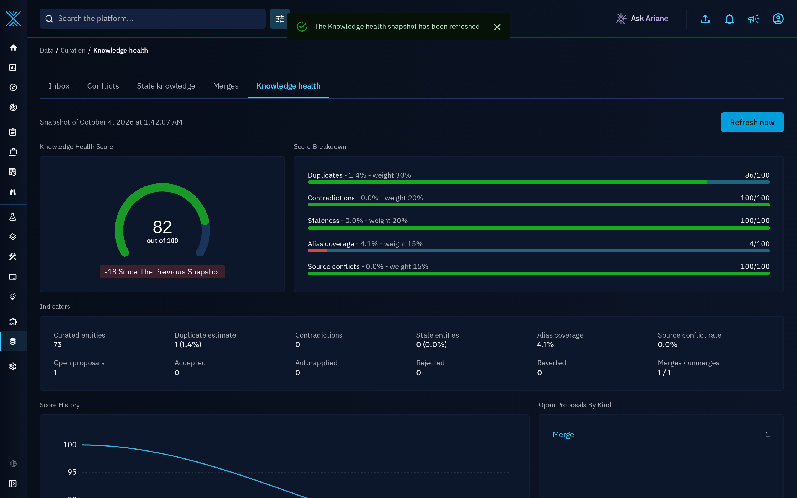

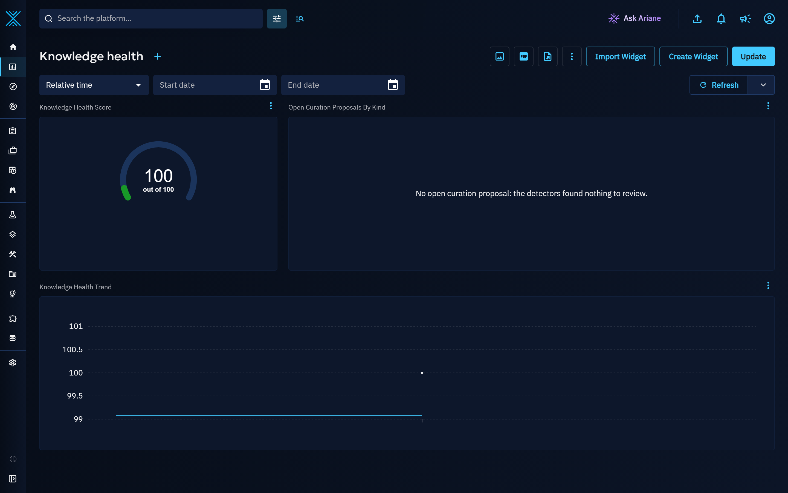

The curation manager takes a snapshot once a day. Click **Refresh now** to take one immediately (this requires the `Manage customization` capability, in addition to `Access knowledge`); a snapshot taken meanwhile by the manager or another refresh is shown instead of taking a second one. The score is the weighted average of five components, each scored from 100 (healthy) to 0:

| Component          | What it measures                                                                                                                       | Weight | Scores 0 when             |
|:-------------------|:---------------------------------------------------------------------------------------------------------------------------------------|:-------|:--------------------------|
| `duplicates`       | Duplicate estimate divided by the number of curated entities                                                                           | 30%    | 10% of duplicates         |
| `contradictions`   | Open contradiction proposals divided by the number of curated entities                                                                 | 20%    | 2% of contradictions      |
| `staleness`        | Stale entities divided by the number of curated entities and Indicators (the staleness detector always examines Indicators)            | 20%    | 100% of stale entities    |
| `alias_coverage`   | Share of the curated entities supporting aliases that have at least one alias (scored 100 at full coverage)                             | 15%    | No alias at all           |
| `source_conflicts` | Fields overwritten by another source during the last 7 days, divided by the number of curated entities updated during the same period | 15%    | 20% of conflicts          |

The **duplicate estimate** is the number of entities that would disappear if every open merge proposal with a confidence of at least the ambiguous band minimum were accepted; a subject deleted or merged elsewhere since its proposal was raised is not counted. The other counters are the open proposals, the proposals accepted, auto-applied, rejected and reverted since the previous snapshot, the merges and unmerges since the previous snapshot (during the last 24 hours for the first snapshot, which has no trend), the contradictions, the stale entities, the alias coverage and the source conflict rate.

#### Weekly digest

Enable the **weekly digest** in the settings to send the latest snapshot to a list of recipients (users, groups or organizations) on the chosen day of the week (UTC), at most once every six days. Only the recipients with the **Access knowledge** capability, which the Knowledge health page requires, receive it: a member of a selected group or organization without it is skipped. Each recipient receives a platform [notification](notifications.md), and an email with a link to the Knowledge health page when [SMTP is configured](../administration/smtp-configuration.md). The digest gives the open proposals at the snapshot and, on a separate line, the decisions, merges and unmerges since the previous snapshot. A recipient the platform could not notify gets the same digest at a later manager cycle (every 15 minutes, for a day), and the recipients already notified never receive its notification twice, even when a newer snapshot was computed in the meantime. The email is sent at least once: when the platform cannot record that it was sent (an unavailable cache right after the mail server accepted it), the retry sends it again.

With the Enterprise Edition and XTM One, the **OpenCTI Knowledge Health Analyst** agent of XTM One can also write a commented digest, with the components that weigh on the score and recommended next actions, through its **Weekly Knowledge Health digest** assignment.

### Field authority

Field authority lets you decide which source wins on a given attribute, whatever the confidence of the data. It is a **merge policy**, consulted when incoming data updates an existing entity (the [update behavior of deduplication](deduplication.md#update-behavior)); it is **not an ingestion transformation**: it never rewrites incoming data, and never creates or drops objects.

Configure it in **Settings > Customization > Curation**, tab **Settings**: enable field authority (off by default: the confidence comparison then decides alone), then add rules. A rule targets one attribute of one entity type (for example `description` of `Intrusion-Set`) and lists sources in order, the first one being the most authoritative. A source is either an **author** (the identity set as author of the data) or a **connector**.

When incoming data matches an existing entity, for each attribute that has a rule:

- if the incoming source ranks higher than the source of the current value, the incoming value is written, whatever its confidence;
- if it ranks lower, the current value is kept, whatever the incoming confidence;
- if both rank the same, or neither is listed, the usual confidence comparison applies.

The incoming source is the author of the incoming data and the connector that sends it. The source of the current value is recorded each time a listed source writes the attribute; until then, the author of the entity and the connector that created it are considered as its sources. Empty fields are always filled, attributes without a rule keep the confidence behavior, and requests in synchronized upsert mode (used to mirror another platform) bypass field authority.

When a value written by a more authoritative connector is overwritten outside of this resolution (for example by a manual edit), the curation manager raises a `field_precedence` proposal to restore it. When the field is edited again while that proposal is open (by the same analyst or another one), the proposal is refreshed with the new value it replaces, so it can still be accepted. Every field overwritten by another source also counts in the source conflict rate of the Knowledge health score.

You can define up to 200 rules, one per entity type and attribute, each listing between 1 and 20 sources. Rules only apply to business attributes of knowledge entity types.

### Bind importer names with curationResolve

Importers extract names from documents ("Clop", "Graceful Spider", "USA") and, without help, create a new entity whenever the spelling differs from the existing one. The `curationResolve` GraphQL query resolves a name to an existing entity of a given type, with the access rights of the caller (`Access knowledge` capability):

```graphql
query CurationResolve($name: String!, $type: String!) {
  curationResolve(name: $name, type: $type) {
    entity_id
    standard_id
    entity_type
    name
    match_type
    score
    matched_value
  }
}
```

```json
{
  "name": "Cl0p",
  "type": "malware"
}
```

The `type` accepts an OpenCTI type (`Intrusion-Set`) or a STIX type (`intrusion-set`; `threat-actor` covers both Threat Actor types). The name must contain between 1 and 512 characters. The query tries, in this order:

| Match type   | When                                                                                     | Score                                                                    |
|:-------------|:-----------------------------------------------------------------------------------------|:-------------------------------------------------------------------------|
| `exact`      | The name of an entity                                                                    | 1                                                                        |
| `alias`      | An alias of an entity                                                                    | 0.98                                                                     |
| `canonical`  | A name or an alias with the same canonical form                                          | 0.95, or 0.86 when equal only once vendor suffixes and qualifiers are removed |
| `taxonomy`   | A name the vendor taxonomy lists for the same object                                     | The reliability of the taxonomy source (0.70 to 0.85)                    |
| `similarity` | A name or an alias with a trigram similarity of at least 92%                             | The similarity multiplied by 0.95                                        |

A result is returned only when its score is at least 0.85 and a single entity has the best score: an ambiguous name returns nothing rather than binding to the wrong entity. When the name matches the name or an alias of at least one entity, the exact and alias matches decide alone: if several entities share it, nothing is returned and the other match types are not tried. In practice, only the names listed by MITRE ATT&CK bind through the taxonomy.

The [ImportDocumentAI connector](https://github.com/OpenCTI-Platform/connectors/tree/master/internal-import-file/import-document-ai) calls `curationResolve` for every named entity it extracts, before sending the bundle, so that extracted names bind to the existing entities. This behavior is controlled by its `IMPORT_DOCUMENT_AI_RESOLVE_EXISTING_ENTITIES` option (enabled by default) and is skipped on platforms that do not expose the query.

### Configure curation

Go to **Settings > Customization > Curation**, tab **Settings** (reading and changing the settings and the policies requires the `Manage customization` capability):

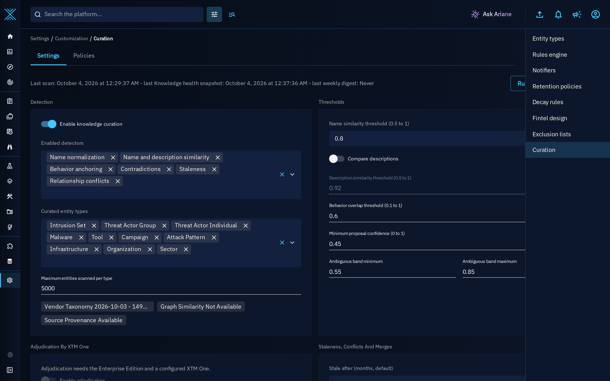

| Setting                         | Default                                                                                                                                  | Description                                                                                                                                                                                                       |
|:--------------------------------|:-----------------------------------------------------------------------------------------------------------------------------------------|:------------------------------------------------------------------------------------------------------------------------------------------------------------------------------------------------------------------|
| Enable curation                 | On                                                                                                                                       | Runs the detectors (scheduled scans and live detection). When off, no new proposal is raised and the open proposals stay in the inbox.                                                                                                                                                          |
| Enabled detectors               | All six                                                                                                                                  | The detectors that run.                                                                                                                                                                                           |
| Curated entity types            | Intrusion Set, Threat Actor Group, Threat Actor Individual, Malware, Tool, Campaign, Attack Pattern, Infrastructure, Organization, Sector | The types the detectors examine: any domain object type except containers, and Indicator. The staleness detector always examines Indicators. Leave empty to examine no other type.                                |
| Similarity threshold            | 0.8                                                                                                                                      | The minimum trigram similarity between two names (0.5 to 1).                                                                                                                                                      |
| Description similarity          | Off, threshold 0.92                                                                                                                      | Compares the descriptions in addition to the names (threshold from 0.5 to 1).                                                                                                                                     |
| Behavior threshold              | 0.6                                                                                                                                      | The minimum ATT&CK technique overlap to pair two entities on behavior (0.1 to 1). A pair without name-based evidence is only proposed when its overlap reaches this threshold.                                    |
| Minimum proposal confidence     | 0.45                                                                                                                                     | Duplicate proposals below this confidence are not created.                                                                                                                                                        |
| Ambiguous band                  | 0.55 to 0.85                                                                                                                             | The minimum is included, the maximum excluded, and the minimum must be lower than the maximum. Open proposals follow a change as the scans find them again.                                                       |
| Adjudication (Enterprise Edition) | Off, daily limit 50                                                                                                                    | Enables adjudication, selects the XTM One agent (by default the highest priority agent bound to curation adjudication, the OpenCTI Curator), the run-as account OpenCTI uses to call XTM One (the platform administrator by default; the Curator reads OpenCTI with it, so it needs **Access knowledge**) and the daily limit (0 to 10,000). When adjudication is not available, the card says whether the Enterprise Edition or XTM One is missing. |
| Staleness                       | 24 months; Infrastructure 12, Indicator 12, Campaign 36                                                                                  | The number of months without activity after which an entity is stale, by default and per entity type (1 to 240): an override sets another delay for one entity type, for example 12 months for Infrastructure.                                                                                                  |
| Relationship conflict mode      | Note                                                                                                                                     | `Note` (the replaced procedure is kept in a note attached to the relationship) or `Detect only`.                                                                                                                |
| Merge record retention          | 365 days                                                                                                                                 | How long a merge stays reversible from its merge record (1 to 3,650 days). After that, the merge is final.                                                                                                                                                              |
| Weekly digest                   | Off, Monday                                                                                                                              | Enables the digest, its day of the week (UTC) and its recipients.                                                                                                                                                 |
| Field authority                 | Off                                                                                                                                      | Enables [field authority](#field-authority) and its rules.                                                                                                                                                        |
| Scan size                       | 5,000                                                                                                                                    | The entities read per entity type at each scan (100 to 100,000): half the most recently updated ones, half a rotating slice of the others.                                                                        |

**Run a scan now** requests a full scan at the next manager cycle. The settings also show the dates of the last scan, snapshot and digest, and the version of the vendor taxonomy.

Platform administrators can tune the manager schedules and the merge record limits in the [configuration](../deployment/configuration.md#engines-schedules-managers) (`curation_manager:*` and `curation:*` keys).

### Editions and capabilities

| Feature                                                                         | Community Edition | Enterprise Edition |
|:--------------------------------------------------------------------------------|:------------------|:-------------------|
| Detectors, curation inbox, bulk accept and reject, revert                       | Yes               | Yes                |
| Reversible merges and unmerge                                                   | Yes               | Yes                |
| Knowledge health score and weekly digest (notification and email)               | Yes               | Yes                |
| Field authority and `curationResolve`                                           | Yes               | Yes                |
| Adjudication by the OpenCTI Curator (automatic and Ask the Curator)             | No                | Yes                |
| Curation policies (dry run, apply now, automatic apply)                         | No                | Yes                |

| Action                                                                                           | Required capability                                    |
|:-------------------------------------------------------------------------------------------------|:-------------------------------------------------------|
| See the proposals, the merges and the Knowledge health                                           | `Access knowledge`                                     |
| Accept, reject or revert a proposal, bulk accept or reject, Ask the Curator                      | `Create / Update knowledge`                            |
| Accept or revert a `merge` or `split` proposal, apply a `merge` decision, unmerge from a merge record | `Merge knowledge`                                  |
| Accept or revert an attribution conflict (deletes, then restores, the attributions not kept)     | `Delete knowledge`                                     |
| Revert a procedure conflict accepted in note mode (deletes the Note its acceptance created)      | `Delete knowledge`                                     |
| See and change the settings, run a scan now, see and manage policies                             | `Manage customization`                                 |
| Refresh the Knowledge health                                                                      | `Manage customization` and `Access knowledge`          |
| Apply a policy now                                                                                | `Manage customization` and `Create / Update knowledge`, plus the capability of each action it applies |

A revert needs the capability of what it undoes: reverting a proposal applied as a merge is an unmerge (`Merge knowledge`), while a `merge` proposal applied as an alias addition only needs `Create / Update knowledge` to revert.

See [Users and RBAC](../administration/users.md) for the capabilities.

## Example

Two connectors import the same ransomware: the first one creates the Malware `Cl0p`, the second one creates the Malware `Clop Ransomware`.

1. When the second entity is created, the curation manager compares it with similar Malware and Tools. Both names normalize to `clop` once the digit used as a letter is read and the `Ransomware` suffix is removed. The proposal `Cl0p / Clop Ransomware` appears in the inbox with two pieces of evidence:
    - `canonical_collision`, score 1, weight 0.75: the names are the same once vendor suffixes and qualifiers are removed;
    - `source_agreement`, score 1, weight 0.15: the entities come from different sources.

    Its confidence is `1 - (1 - 0.75) x (1 - 0.15) = 0.79`, inside the default ambiguous band. Had the second connector named it `Clop`, both names would have had the same full canonical form (weight 0.92) and the confidence would have reached `1 - (1 - 0.92) x (1 - 0.15) = 0.93`, above the band.
2. With the Enterprise Edition and adjudication enabled, the OpenCTI Curator receives the proposal and answers `merge`, with a rationale citing the evidence and naming `Cl0p` as the entity to keep. The adjudication appears on the proposal.
3. An analyst opens the proposal, compares the two entities side by side, keeps `Cl0p` as the surviving entity and clicks **Accept**. `Clop Ransomware` becomes an alias of `Cl0p`, and its relationships move to `Cl0p`.
4. The merge record appears in **Data > Curation > Merges** and in the **Merges** view of the **Changes** tab of `Cl0p`, reversible for 365 days. If a later report shows that the two names designated different families, the analyst clicks **Undo the merge**: `Clop Ransomware` comes back with its original identifiers, aliases and relationships, and the proposal becomes `reverted`, so it is never proposed again.
5. The next Knowledge health snapshot counts one accepted proposal and one merge, and the duplicate estimate decreases.

To let such merges happen without an analyst, an administrator creates a policy covering `merge` proposals for `Malware` and `Tool`, with a threshold of 0.9 and **Require adjudication agreement** enabled, runs a **Dry run** to check the eligible proposals and the exclusion reasons, then enables it.

## What's next?

- [Merge objects](merging.md) and [Merging](../administration/merging.md): how a merge works.
- [Deduplication](deduplication.md): how the platform avoids duplicates at creation, and how updates are resolved.
- [Background tasks](background-tasks.md): follow bulk accepts and policy applies.
- [Delete and restore knowledge](delete-restore.md): the trash used when reverting deleted attributions.
- [Platform managers](../deployment/advanced/managers.md): the curation manager and the other managers.
- [Usage telemetry](../reference/usage-telemetry.md): the anonymous curation metrics sent to Filigran.
