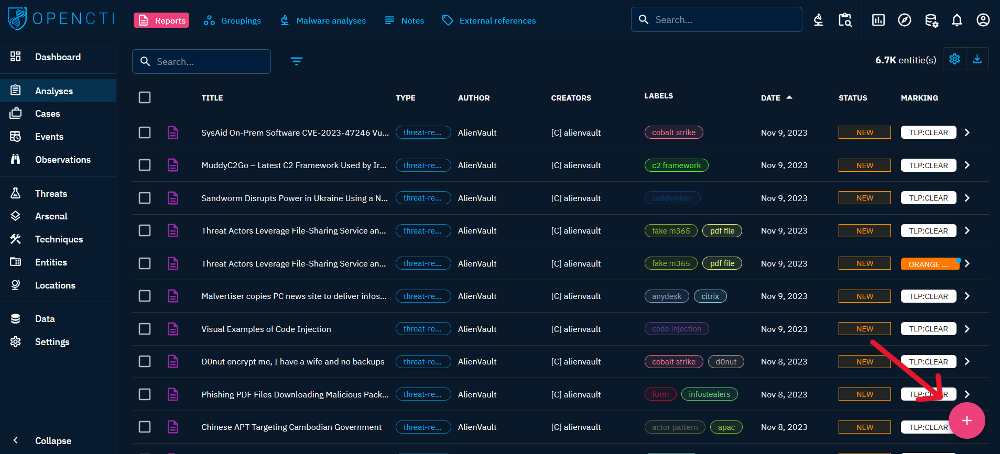
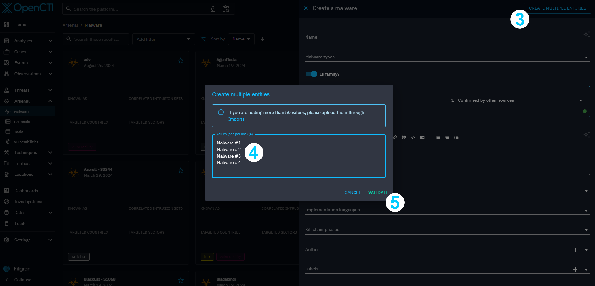
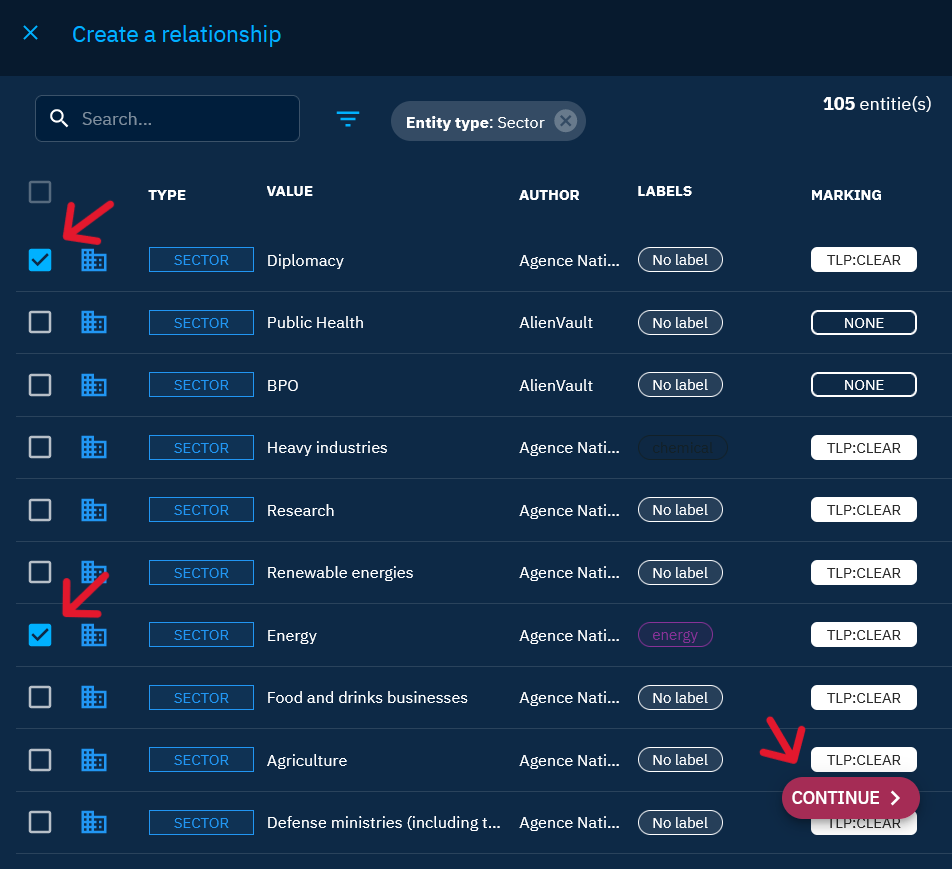

# Manual creations

Manual data creation in OpenCTI is an intuitive process that occurs throughout the platform. This page provides guidance on two key aspects of manual creation: Entity creation and Relationship creation.

## Entity creation

### Simple creation

To create an entity:

1. Navigate to the section of the platform related to the object type you want to create (for example Reports).
2. Click on the "+" button located at the bottom right of the window.

3. A form on the right side of the window will appear. Fill in specific fields of the entity. Certain fields are inherently obligatory, and administrators have the option to designate additional mandatory fields ([See here](../administration/entities.md#attributes-section) for more information).
4. Once you've filled in the desired fields, click on "Create" button to initiate the entity creation process.

### Bulk creation

You also have the possibility to create multiple entities by filling the form only one time.

> Note that bulk creation is not available for all entities for now. For example you cannot create Reports in bulk. So for our example we will use Malwares.

1. Navigate to the section of the platform related to the object type you want to create in bulk.
2. Click on the "+" button located at the bottom right of the window.

3. Click on the top-right "Create multiple entities" button.
4. A modal opens with a textarea input. You can fill multiple lines, each line will be an entity to create. In the example below, we will create four malwares with respectively names: Malware #1, Malware #2, Malware #3 and Malware #4.
5. Validate the different names (it will not submit the form yet).

6. You can see the different values filled in the input _Name_.

7. Fill other fields if necessary. Pay attention that for others fields than _Name_, all the created entities will have the same values. For example if I set a _Marking_ to TLP:GREEN, all four malwares will have this marking.

8. Submit the form by clicking on "Create" button.

9. A progress bar opens to show how many entities have been created. When the process is finished, you can close it.

## Relationship creation

Before delving into the creation of relationships between objects in OpenCTI, it's crucial to grasp some foundational concepts. Here are key points to understand:

- On several aspects, including relationships, two categories of objects must be differentiated: [containers](containers.md) (e.g., Reports, Groupings, and Cases) and others. **Containers aren't related to but contains objects**.
- Relationships, like all other entities, are objects. They possess fields, can be linked, and share characteristics identical to other entities.
- Relationships are inherently directional, comprising a "from" entity and a "to" entity. Understanding this directionality is essential for accurate relationship creation.
- OpenCTI supports various relationship types, and their usage depends on the entity types being linked. For example, a "target" relationship might link malware to an organization, while linking malware to an intrusion set might involve a different relationship type.

Now, let’s explore the process of creating relationships. To do this, we will differentiate the case of containers from the others.

### For container

When it comes to creating relationships within containers in OpenCTI, the process is straightforward. Follow these steps to attach objects to a container:

1. Navigate to the container: Go to the specific container to which you want to attach an object. This could be a Report, Grouping, or Cases.
2. Access the "Entities" tab: Within the container, locate and access the "Entities" tab.
3. Click on the "+" icon: Find the "+" icon located at the bottom right of the window. 
4. Search for entities: A side window will appear. Search for the entities you want to add to the container.
5. Add entities to the container: Click on the desired entities. They will be added directly to the container.

### For other

When creating relationships not involving a container, the creation method is distinct. Follow these steps to create relationships between entities:

1. Navigate to one of the entities: Go to one of the entities you wish to link. Please be aware that the entity from which you create the relationship will be designated as the "from" entity for that relationship. So the decision of which entity to choose for creating the relationship should be considered, as it will impact the outcome.
2. Access the "Knowledge" tab: Within the entity, go to the "Knowledge" tab.
3. Select the relevant categories: In the right banner, navigate to the categories that correspond to the object to be linked. The available categories depend on the type of entity you are currently on. For example, if you are on malware and want to link to a sector, choose "victimology."
4. Click on the "+" icon: Find the "+" icon located at the bottom right of the window. 
5. Search for entities: A side window will appear. Search for the entities you want to link.
6. Add entities and click on "Continue": Click on the entities you wish to link. Multiple entities can be selected. Then click on "Continue" at the bottom right. 
7. Fill in the relationship form: As relationships are objects, a creation form similar to creating an entity will appear.
8. Click on "Create": Once you've filled in the desired fields, click on "create" to initiate the relationship creation process.

## Additional methods

While the aforementioned methods are primary for creating entities and relationships, OpenCTI offers versatility, allowing users to create objects in various locations within the platform. Here's a non-exhaustive list of additional places that facilitate on-the-fly creation:

- Creating entities during relationship creation: During the "Search for entities" phase (see above) of the relationship creation process, click on the "+" icon to create a new entity directly.
- Knowledge graph: Within the knowledge graph - found in the knowledge tab of the containers or in the [investigation functionality](pivoting.md) - users can seamlessly create entities or relationships.
- Inside a workbench: [The workbench](workbench.md) serves as another interactive space where users can create entities and relationships efficiently.

These supplementary methods offer users flexibility and convenience, allowing them to adapt their workflow to various contexts within the OpenCTI platform. As users explore the platform, they will naturally discover additional means of creating entities and relationships.

!!! note "Max confidence level"

When creating knowledge in the platform, the maximum confidence level of the users is used. Please navigate to this [page](reliability-confidence.md) to understand this concept and the impact it can have on the knowledge creation.
