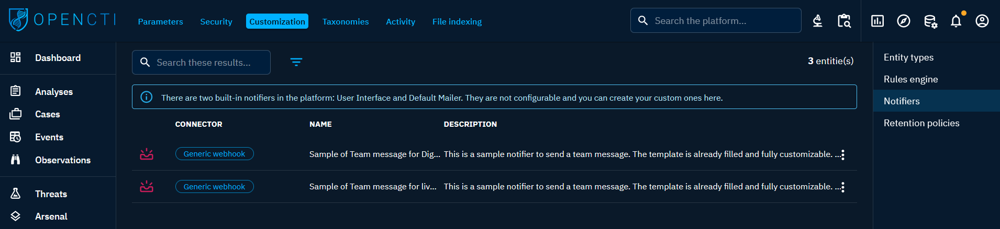

# Notifications and alerting

In the evolving landscape of cybersecurity, timely awareness is crucial. OpenCTI empowers users to stay informed and act swiftly through its robust notifications and alerting system. This feature allows users to create personalized triggers that actively monitor the platform for specific events and notify them promptly when these conditions are met.

From individual users tailoring their alert preferences to administrators orchestrating collaborative triggers for Groups or Organizations, OpenCTI's notification system is a versatile tool for keeping cybersecurity stakeholders in the loop.

The main menu "Notifications and triggers" for creating and managing notifications is located in the top right-hand corner with the bell icon.

  

## Triggers

In OpenCTI, triggers serve as personalized mechanisms for users to stay informed about specific events that align with their cybersecurity priorities. Users can create and manage triggers to tailor their notification experience. Each trigger operates by actively listening to events based on predefined filters and event types, promptly notifying users via chosen notifiers when conditions are met.

### Trigger management

**Individual user triggers:** Each user possesses the autonomy to craft their own triggers, finely tuned to their unique preferences and responsibilities. By setting up personalized filters and selecting preferred notifiers, users ensure that they receive timely and relevant notifications aligned with their specific focus areas.

**Administrative control:** Platform administrators have the capability to create and manage triggers for Users, Groups and Organizations. This provides centralized control and the ability to configure triggers that address collective cybersecurity objectives. Users within the designated Group or Organization will benefit from triggers with read-only access rights. These triggers are to be created directly on the User|Group|Organization with whom to share them in "Settings > Security > Users|Groups|Organizations".

### Trigger filters

Leveraging the filters, users can meticulously **define the criteria that activate their triggers**. This level of granularity ensures that triggers are accurate, responding precisely to events that matter most. Users can tailor filters to consider various parameters such as object types, markings, sources, or other contextual details. They can also allow notifications for the assignment of a Task, a Case, etc.

Beyond filters, a trigger can be configured to **respond to three event types**: creation, modification, and deletion.

### Instance triggers

Instance triggers offer a targeted approach to live monitoring by allowing users to set up triggers specific to one or several entities. These triggers, when activated, keep a vigilant eye on a predefined set of events related to the selected entities, ensuring that you stay instantly informed about crucial changes.

#### Creating instance triggers

**Method 1:** Using the general trigger creation form

1. Go on the "Notifications and triggers" window.
2. Navigate to the "Triggers and digests" tab.
3. Access the general trigger creation form.
4. Toggle the switch "Instance trigger".
5. Choose the entities to monitor.

**Method 2:** Quick subscription

1. On an entity's overview, locate the "Instance trigger quick subscription" button with the bell icon at the top right.
2. Click on the button to create the instance trigger.
3. (Optional) Click on it again to modify the instance trigger created.

#### Events monitored by instance triggers

An instance trigger set on an entity X actively monitors the following events:

- Update/Deletion of X: Stay informed when the selected entity undergoes changes or is deleted.
- Creation/Deletion of relationships: Receive notifications about relationships being added or removed from/to X.
- Creation/Deletion of related entities: Be alerted when entities that have X in its refs - i.e. contains X, is shared with X, is created by X, etc. - are created or deleted.
- Adding/Removing X in ref: Stay in the loop when X is included or excluded from the ref of other entities - i.e. adding X in the author of an entity, adding X in a report, etc.).

!!! note "Entity deletion notification"

    It's important to note that the notification of entity deletion can occur in two scenarios:
        - Real entity deletion: When the entity is genuinely deleted from the platform.
        - Visibility loss: When a modification to the entity results in the user losing visibility for that entity.

## Digest

Digests provide an efficient way to streamline and organize your notifications. By grouping notifications based on selected triggers and specifying the delivery period (daily, weekly, monthly), you gain the flexibility to receive consolidated updates at your preferred time, as opposed to immediate notifications triggered by individual events.

### Creating digests

1. Go on the "Notifications and triggers" window.
2. Navigate to the "Triggers and digests" tab.
3. Create a new digest.
4. Configure digest: Set the parameters, including triggers to be included and the frequency of notifications (daily, weekly, monthly). 
5. Choose the notifier(s): Select the notification method(s) (e.g. within the OpenCTI interface, via email, etc.).

### Benefits of digests

- Organized notifications: Digests enable you to organize and categorize notifications, preventing a flood of individual alerts.
- Customized delivery: Choose the frequency of digest delivery based on your preferences, whether it's a daily overview, a weekly summary, or a monthly roundup.
- Reduced distractions: Receive notifications at a scheduled time, minimizing interruptions and allowing you to focus on critical tasks.

Digests enhance your control over notification management, ensuring a more structured and convenient approach to staying informed about important events.

## Notifiers

In OpenCTI, notifiers serve as the channels for delivering notifications, allowing users to stay informed about critical events. The platform offers two built-in notifiers, "Default mailer" for email notifications and "User interface" for in-platform alerts.

### Notifier connectors

OpenCTI features built-in notifier connectors that empower users to create personalized notifiers for notification and activity alerting. Three essential connectors are available:

- Platform mailer connector: Enables sending notifications directly within the OpenCTI platform.
- Simple mailer connector: Offers a straightforward approach to email notifications with simplified configuration options.
- Generic webhook connector: Facilitates communication through webhooks.

OpenCTI provides two samples of webhook notifiers designed for Teams integration.

### Configuration and Access

Notifiers are manageable in the "Settings > Customization > Notifiers" window and can be restricted through Role-Based Access Control (RBAC). Administrators can restrict access to specific Users, Groups, or Organizations, ensuring controlled usage.

For guidance on configuring custom notifiers and explore detailed setup instructions, refer to the [dedicated documentation page](../administration/notifiers.md).
