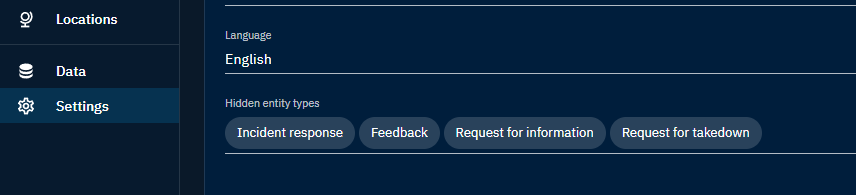
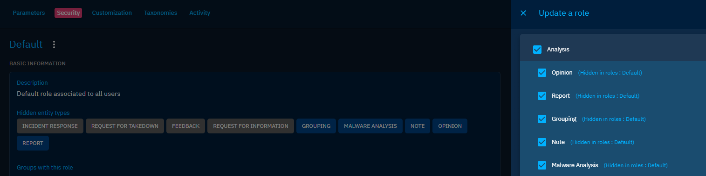

# Overview

## Introduction

The following chapter aims at giving the reader a step-by-step description of what is available on the platform and the meaning of the different tabs and entries.

When the user connects to the platform, the home page is the `Dashboard`. This `Dashboard` contains several visuals summarizing the types and quantity of data recently imported into the platform.

!!! note "Dashboard"
    
    To get more information about the components of the default dashboard, you can consult the [Getting started](getting-started.md).

The left side panel allows the user to navigate through different windows and access different views and categories of knowledge.

<figure markdown>
  
</figure>

## Structure

### The "hot knowledge"

The first part of the platform in the left menu is dedicated to what we call the "hot knowledge", which means this is the entities and relationships which are added on a daily basis in the platform and which generally require work / analysis from the users.

* `Analysis`: all containers which convey relevant knowledge such as reports, groupings and malware analysis.
* `Cases`: all types of case like incident responses, requests for information, for takedown, etc.
* `Events`: all incidents & alerts coming from operational systems as well as sightings.
* `Observations`: all technical data in the platform such as observables, artifacts and indicators.

### The "cold knowledge"

The second part of the platform in the left menu is dedicated to the "cold knowledge", which means this is the entities and relationships used in the hot knowledge. You can see this as the "encyclopedia" of all pieces of knowledge you need to get context: threats, countries, sectors, etc.

* `Threats`: all threats entities from campaigns to threat actors, including intrusion sets.
* `Arsenal`: all tools and pieces of malware used and/or targeted by threats, including vulnerabilities.
* `Techniques`: all objects related to tactics and techniques used by threats (TTPs, etc.).
* `Entities`: all non-geographical contextual information such as sectors, events, organizations, etc.
* `Locations`: all geographical contextual information, from cities to regions, including precise positions.

### Hide categories

You can customize the experience in the platform by hiding some categories in the left menu, whether globally or for a specific role.

#### Hide categories globally

In the `Settings > Parameters`, it is possible for the platform administrator to hide categories in the platform for all users.

### Hide categories in roles

In OpencTI, the different roles are highly customizable. It is possible to defined default dashboards, triggers, etc. but also be able to hide categories in the roles:

## Presentation of a typical page in OpenCTI

Although there are many different entities in OpenCTI and many different tabs, most of them are quite similar and only have minor differences from the other, mostly due to some of their characteristics, which requires specific fields or do not require some fields which are necessary for the other. 

In this part will only be detailed a general outline of a "typical" OpenCTI page. The specifies of the different entities will be detailed in the corresponding pages below (Activities and Knowledge).

<figure markdown>
  
</figure>

### Overview

In the `Overview` tab on the entity, you will find all properties of the entity as well as the recent activities.

First, you will find the `Details` section, where are displayed all properties specific to the type of entity you are looking at, an example below with a piece of malware:

Thus, in the `Basic information` section, are displayed all common properties to all objects in OpenCTI, such as the marking definition, the author, the labels (ie. tags), etc.

Below these two sections, you will find latest modifications in the Knowledge base related to the Entity :
- `Latest created relationships`: display the latest relationships that have been created <u>from</u> or <u>to</u> this Entity. For example, latest Indicators of Compromise and associated Threat Actor of a Malware.
- `latest containers about the object`: display all the Cases and Analysis that contains this Entity. For example, the latest Reports about a Malware.
- `External references`: display all the the external sources associated with the Entity. You will often find here links to external reports or webpages from where Entity's information came from.
- `History`: display the latest chronological modifications of the Entity and its relationships that occured in the platform, in order to traceback any alteration.

Last, all Notes written by users of the platform about this Entity are displayed in order to access unstructured analysis comments.
