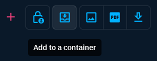
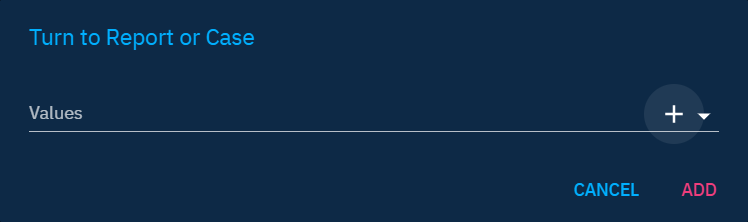
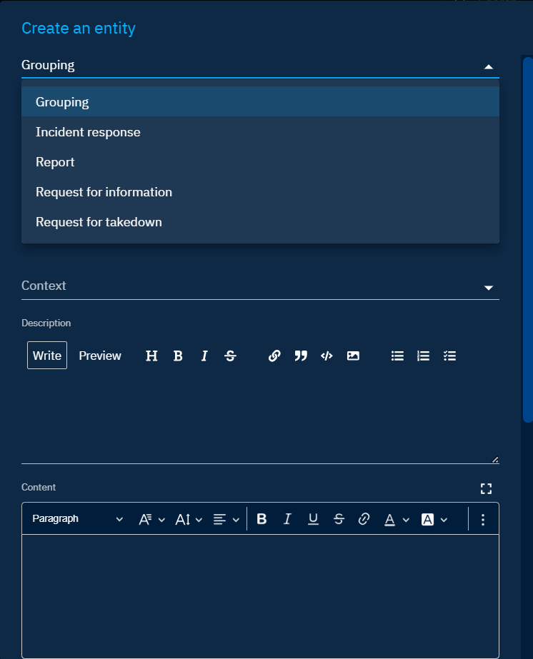
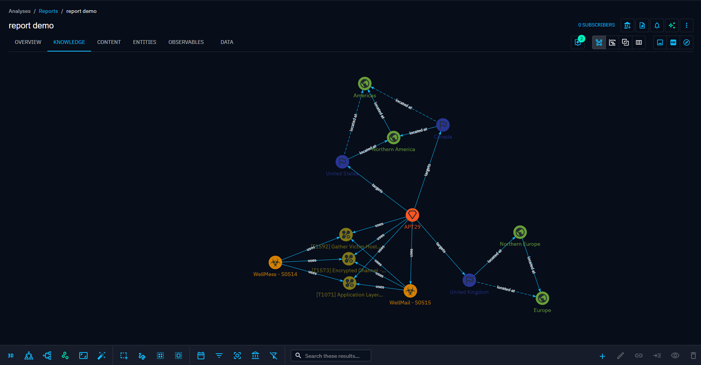

# Pivot and investigate

In OpenCTI, all data are structured as an extensive knowledge graph, where every element is interconnected. The investigation functionality provides a powerful tool for pivoting on any entity or relationship within the platform. Pivoting enables users to explore and analyze connections between entities and relationships, facilitating a comprehensive understanding of the data.

To access investigations, navigate to the top right corner of the toolbar:

!!! note "Access restriction"

    When an investigation is created, it is initially visible only to the creator, allowing them to work on the investigation before deciding to share it. The sharing mechanism is akin to that of dashboards. For further details, refer to the [Access control section](dashboards.md#access-control-section) in the dashboard documentation page.

## Perform investigation

### Manipulate entity

We can add any existing entity of the platform to your investigation.

After adding an entity, we can choose the entity and view its details in the panel that appears on the right of the screen.

On each node, we'll notice a bullet with a number inside, serving as a visual indication of how many entities are linked to it but not currently displayed in the graph. Keep in mind that this number is an approximation, which is why there's a "+" next to it. If there's no bullet displayed, it means there's nothing to expand from this node.

To incorporate these linked entities into the graph, we just have to expand the nodes. Utilize the button with a 4-arrows logo in the mentioned menu, or double-click on the entity directly. This action opens a new window where we can choose the types of entities and relationships we wish to expand.

For instance, in the image above, selecting the target _Malware_ and the relationship _Uses_ implies expanding in my investigation graph all _Malware_ linked to this node with a relationship of type _Uses_.

### Manipulate relationship

We can create a relationship between entities directly within our investigation. To achieve this, select multiple entities by clicking on them while holding down the shift key. Subsequently, a button appears at the bottom right to create one (or more, depending on the number of entities selected) relationships.

!!! note "Relationship creation"

    Creating a relationship in the investigation graph will generate the relationship in your knowledge base.

## Capitalize on an investigation

### Export investigation

Users have the capability to export investigations, providing a way to share, document, or archive their findings.

- PDF and image formats: Users can export investigations in either PDF or image format, offering flexibility in sharing and documentation.
- STIX bundle: The platform allows the export of the entire content of an investigation graph as a STIX bundle. In the STIX format, all objects within the investigation graph are automatically aggregated into a Report object.

### Turn investigation into a container

Users can efficiently collect and consolidate the findings of an investigation by adding the content into dedicated [containers](containers.md). The contents of an investigation can be imported into various types of containers, including:

- Grouping
- Incident Response
- Report
- Request for Information
- Request for Takedown

We have the flexibility to choose between creating a new container on the fly or adding investigation content to an existing container. 

After clicking on the `ADD` button, the browser will redirect to the Knowledge tab of the container where we added the content of our investigation. If we added it to multiple containers, the redirection will be to the first of the list.

