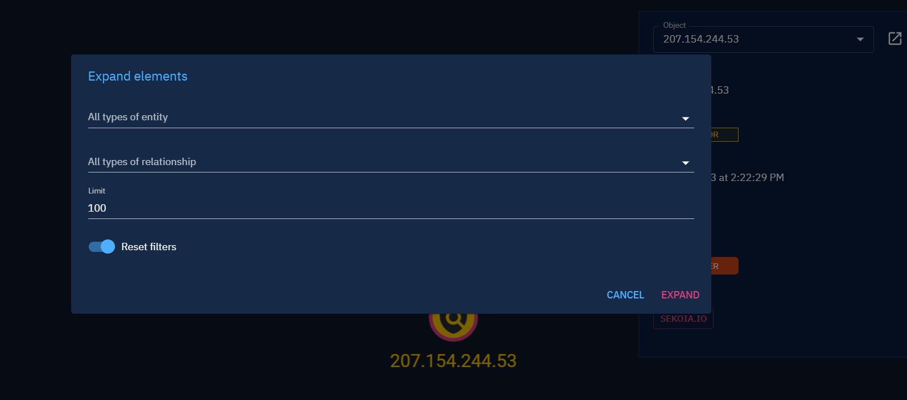

# Pivot and investigate

In Opencti, all data can be represented as a large knowledge graph: everything is linked to something. 
You can pivot on any entity and on any relationship you have in your platform, using investigations.

Investigations are available on the top right of the top bar:

Investigations are organized by workspace. When you create a new empty workspace, it will only be visible by you and enables you to work on your investigation before sharing it.

In your workspace, you can add entities that you want to investigate, visualize the data linked to these entities, add relationships, and export your investigation graph in pdf, image or as new stix report.

You can see next to them a bullet with a number inside. It is a visual indication showing you how many entities are linked to this one and not displayed in the graph yet.
Note that this number is an approximation of the number of entities. That's why there is a `~` next to the number.

No bullet displayed means there is nothing to expand from this node.

## Add and expand an entity

You can add any existing entity of the platform to your investigation.

Once added, you can select the entity, and see its details in the panel that appears on the right of the screen.

In the same menu as above, right next to "Add en entity", you can expand the selected entity. Clicking on the menu icon open a new window where you can choose which type of entities and relationships you want to expand.

For each type of entity or relationship, the number of elements that will be added into the investigation graph is displayed in parentheses. This time there is no `~` symbol as the number is exact.

For example, in the image above, selecting target _Malware_ and relationship _Uses_ means: expand in my investigation graph all _Malwares_ linked to this node with a relationship of type _Uses_.

## Add a relationship

You can add a relationship between entities directly in your investigation.

## Export your investigation

You can export your investigation in PDF or image format. 
You can also download all the content of your investigation graph in a **Report** stix bundle (investigation is automatically converted).

