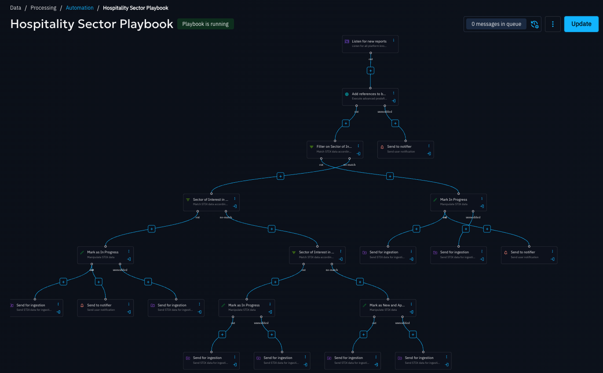
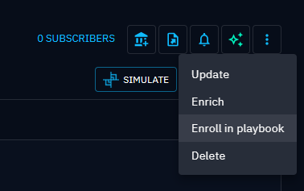
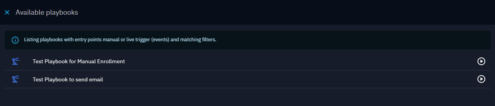

# Playbook Automation

!!! tip "Enterprise edition"

    Playbook automation is available under the **OpenCTI Enterprise Edition** licence. Please read the [dedicated page](../administration/enterprise.md) for full details.

OpenCTI playbooks are automated data processing flows that allow platform administrators to enrich, filter, transform, and route data as it is created or updated in the platform.

Playbooks operate on **STIX 2.1 bundles** and can be fully customised to implement intelligence workflows such as enrichment, qualification, normalisation, routing, or automated response.

Playbook automation is accessible from **Data ▸ Processing ▸ Automation**.

!!! note "Required capability"

    You need the **Manage Playbooks** [capability](../administration/users.md) to configure and run playbooks, as they allow controlled manipulation of knowledge that standard users cannot perform.

With playbooks, you can for example:

- add labels or markings based on enrichment results,
- create reports, cases, or other objects when specific conditions are met,
- trigger enrichments or webhooks conditionally,
- modify attributes such as `first_seen` and `last_seen`,
- route data into specific workflows or downstream systems.

## Playbook philosophy

A playbook can be considered as a **STIX 2.1 bundle processing pipeline**.

A playbook starts with an **event source** that listens to a specific data stream (for example knowledge creation, updates, or manual triggers). Each component then receives a STIX bundle, processes it, and forwards the resulting bundle to the next component. For details of the available components see [**playbook components**](playbook-components).

Components can:

- inspect the content of the bundle,
- modify or enrich it,
- branch execution to multiple paths based on conditions,
- send notification messages.

This branching capability allows a single playbook to implement complex logic while remaining readable and modular.

A playbook typically **ends with an execution or persistence action**, such as writing knowledge, triggering an external system, or emitting the bundle into another data stream.

## Using playbooks

Playbooks can be triggered automatically by configured event sources, or manually by users when appropriate.

Playbooks can be used to assist in a variety of use cases such as: 

- Rapid creation of Incident Response cases from a report
- Manage Indicator of Compromise scores based on specific creators
- Support Vulnerability Management use cases, from triage to investigation and response
- Data quality review to assess the unique and value of different data feeds
- Automate the tracking of specific threat groups infrastructure through enrichment automation

### Manually enrolling an entity in a playbook

You can enroll an individual entity into a playbook using the **“Enroll in playbook”** action from the entity detail view.

This opens a drawer where you can select the playbook to trigger.

The list includes:

- active playbooks configured as **Available for manual enrolment / trigger**,
- active playbooks listening to **knowledge events** whose filters match the selected entity.

For details on how event sources and filters work, see **Playbook Creation**.

## Creating playbooks

Playbooks are built by chaining **components**, each responsible for a specific operation (filtering, manipulation, enrichment, routing, or execution).

The [**playbook creation**](playbook-creation.md) page explains:

- how to create a playbook,
- how event source / trigger components work,
- how to build components,
- common design patterns and best practices.

Refer to the **Components** documentation for a complete description of each available component and its configuration options.

## Monitoring playbook activity

Once a playbook is running, you can monitor its execution directly from the playbook view.

From the top‑right of an open playbook, you can access **execution traces**, which show:

- the last 20 executions,
- up to 90 days of history,
- each executed step with its corresponding input and output data.

This allows you to validate behaviour and troubleshoot issues efficiently.
