# Provenance and corroboration

Every piece of knowledge in OpenCTI records who said it. Each time a source creates or re-asserts an entity, an observable or a relationship, the platform keeps an assertion for that source. From these assertions, OpenCTI derives how many independent sources corroborate the knowledge, when it was last confirmed, and whether sources disagree on its values.

Provenance is available in the Community Edition. It is deterministic: no AI is involved, and it never changes the score of indicators.

## Entity types tracked

Provenance is recorded only on the entity types where it is enabled, so that knowledge re-sent over and over by sources (attack patterns, locations, sectors...) does not weigh on ingestion. By default, it is enabled on indicators, intrusion sets, threat actors (groups and individuals) and malware, and on the `uses`, `targets` and `attributed-to` relationships (see [Relationship types](#relationship-types)).

To enable or disable it on a type, open "Settings > Customization > Entity types", select the type and use the "Track sources and corroboration" switch of the "Provenance" card. Next to the switch, the card shows how many elements of the type already have sources, how many of them are corroborated by at least two sources, and when the last assertion was recorded. Sightings and observables are configured on their "Sighting" and observable types; relationships are configured per relationship type. Disabling provenance on a type stops recording it immediately; the provenance already recorded is kept but no longer displayed: neither on the elements of that type nor in the Conflicts and Stale knowledge tabs of the Curation hub, and the knowledge decay rules no longer apply to them. It can no longer be curated either: adopting or dismissing a conflicting value, using a procedure as the description and confirming an element is still valid are refused, on that type and on every type while provenance is disabled on the platform.

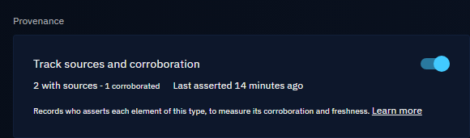

??? example "Light theme"

    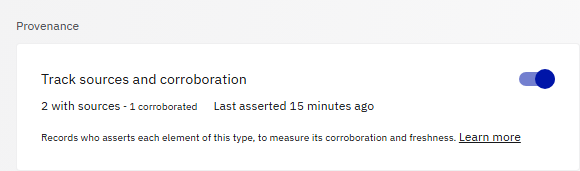

The default set of tracked types can be changed with the `provenance:default_tracked_types` parameter (see [Configuration](#configuration)): it applies to the types whose setting was never changed in the interface.

### Relationship types

Relationships are tracked per relationship type, in the "Provenance" card of "Settings > Customization > Entity types > Relationships". Each row shows a relationship type, the relationships of that type with sources and the corroborated ones, the date of the last assertion, and the tracking switch. The list can be searched by name and filtered on the tracked or the not tracked types.

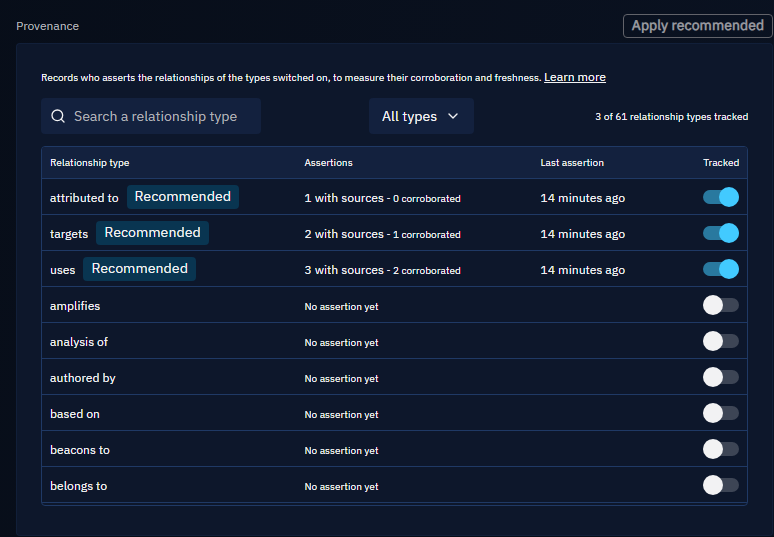

Three relationship types are tracked out of the box, on new and on existing platforms, as part of the default value of `provenance:default_tracked_types`:

- `uses`: the techniques, tools and malware of a threat, the knowledge sources disagree on most; the procedures described by each source are kept on these relationships (see [Procedures](#procedures)).
- `targets`: the victimology of a threat (sectors, countries, organizations), where corroboration tells a confirmed targeting from a single claim.
- `attributed-to`: the attribution of a campaign or an intrusion set, the most disputed claim of threat intelligence, with few relationships to write.

`indicates` is not tracked by default: indicator feeds re-send this relationship with every indicator, which would double their writes for a corroboration the indicator itself already carries. Every other relationship type is off by default as well.

To turn a type off, or on, use its switch: recording stops or starts immediately, and the other types are unchanged. The "Apply recommended" action switches the three recommended types back on, without changing the others. The same change can be made through the API with the `provenanceRelationshipTrackingEdit` mutation, for example `provenanceRelationshipTrackingEdit(relationship_types: ["uses"], tracked: false)`. A type turned off stays off on upgrades.

??? example "The page, keyboard focus, filtering, search without result, loading and light theme"

    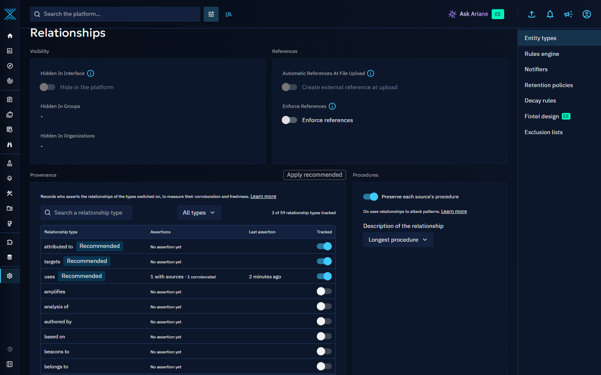

    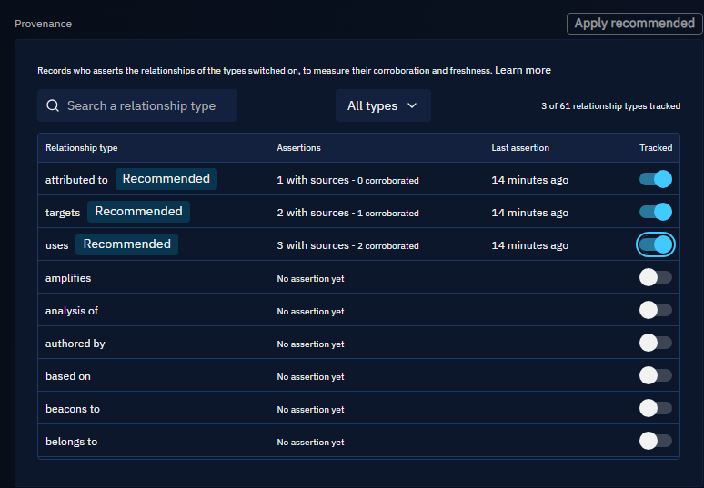

    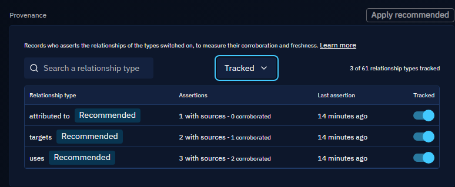

    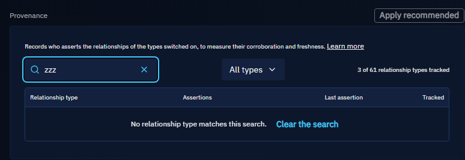

    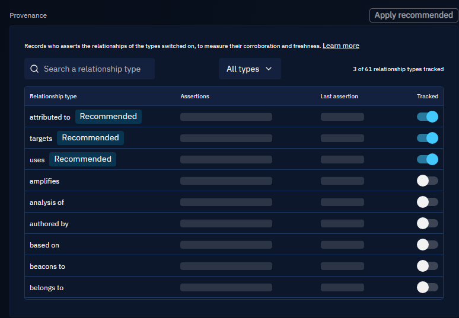

    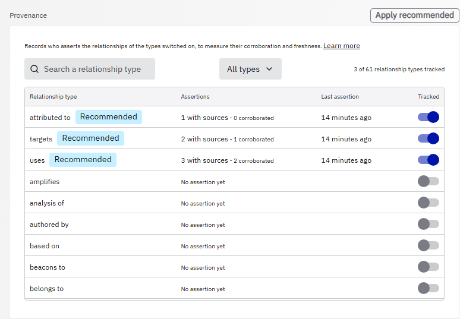

??? example "Before per relationship type tracking"

    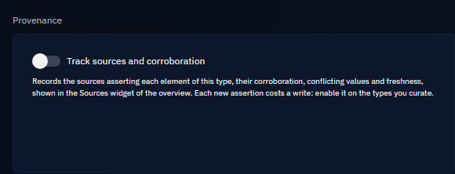

## Assertions

An assertion links a piece of knowledge to one source. A source can be:

| Source kind | Meaning                                                                     |
|:------------|:----------------------------------------------------------------------------|
| Connector   | A connector, identified through the work that ingested the data              |
| Feed        | A TAXII, RSS, CSV or JSON ingestion feed, or a synchronizer of a platform    |
| Author      | The author of knowledge written by a user, when an author is set             |
| User        | A user who created, updated or confirmed the knowledge                       |
| Inference   | An inference rule of the rule engine                                         |
| Emulation   | A security coverage result sent by OpenAEV                                   |

For each source, OpenCTI keeps the first and last assertion dates, the number of times the source asserted the knowledge and the confidence it provided. When a source sends the same knowledge again, only its assertion is updated: no new history entry is written, and the modification date of the knowledge does not change.

To keep ingestion fast, a source repeating an assertion within the re-assertion window (24 hours by default) is not written again, unless it brings a new conflicting value or a new procedure, resolves a stored conflict (the value it sends is now the current value of the field, so it is no longer listed as an alternative), or the knowledge is flagged as stale. The last assertion date of a source is therefore refreshed at most once per window, and its number of assertions counts these refreshes. A new source is always recorded immediately, so corroboration is never delayed.

The details of up to 200 sources are kept per element: the earliest source and the most recently active ones. Every source that ever asserted the element is still counted in its corroboration and can be used in the "Asserted by" filters. Once the 200 details are kept, a counted source without details is compared with the latest assertion of the element instead of its own: besides the cases above, it is written again, and detailed again, only when no source asserted the element within the re-assertion window, so knowledge asserted by many sources is not rewritten on every assertion.

Assertions are recorded after deduplication, on the stored object. A source asserting a duplicate of an existing entity therefore corroborates the existing entity. When entities are merged, their assertions are merged too.

!!! note "Data created before provenance tracking"

    The provenance of the knowledge created before the upgrade is rebuilt in the background by the provenance backfill, from the history and the works of the platform, for the tracked entity types only. Its progress is visible in "Data > Processing > Tasks", where an administrator can also restart it, for instance after enabling provenance on a new type. The backfill reads the history written before it started and adds it to the assertions recorded since, so a source asserting an element while the backfill runs keeps every assertion. Replays are idempotent: existing assertions are merged, never duplicated.

    The card shows the state of the backfill (Pending, Running or Completed), a progress bar with the number of elements processed and, once done, how long ago it completed (the exact date is in its tooltip). When an element has no source yet, its sources panel shows the same state with a link to the card.

    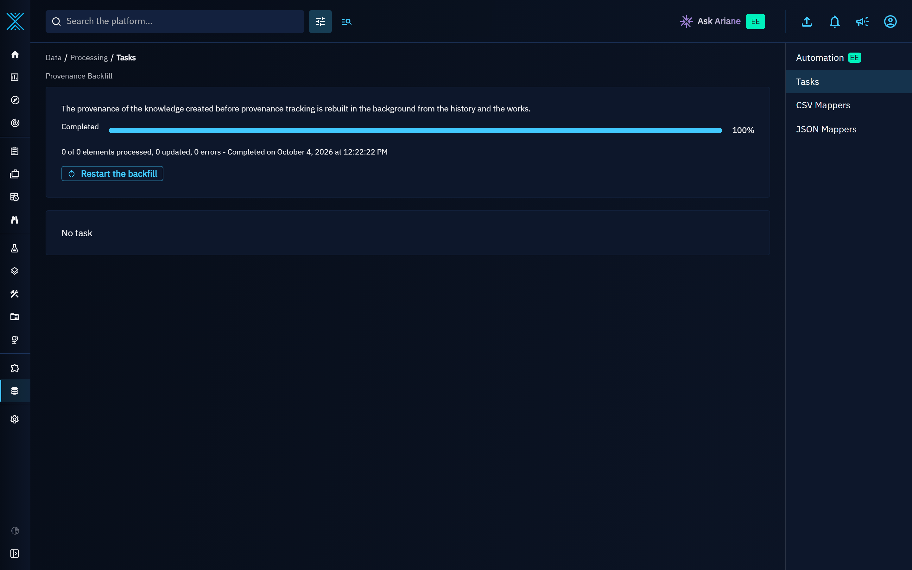

## Corroboration and freshness

From the assertions, OpenCTI derives:

- **Corroboration**: the number of distinct sources asserting the knowledge. Knowledge with a single source is flagged as single sourced.
- **Last assertion date**: the last time any source asserted the knowledge.
- **Freshness**: the number of days since the last assertion.

These values are available as columns, sorts and filters in the lists of entities and relationships ("Corroboration", "Last assertion date", "Freshness (days since last assertion)", "Single sourced", "Has source conflicts" and "Stale knowledge"). They can be used in triggers, retention policies, dashboards and CSV exports.

In the lists, the corroboration is a badge with the number of sources ("7 sources"), green when corroborated; the freshness reads "Fresh" or "Stale", with the time since the last assertion in its tooltip; the last assertion date is relative ("3 months ago"), with the exact date in its tooltip.

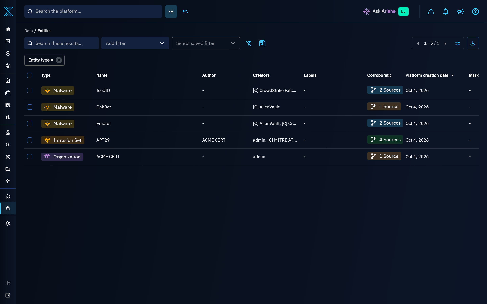

??? example "The same list in the light theme"

    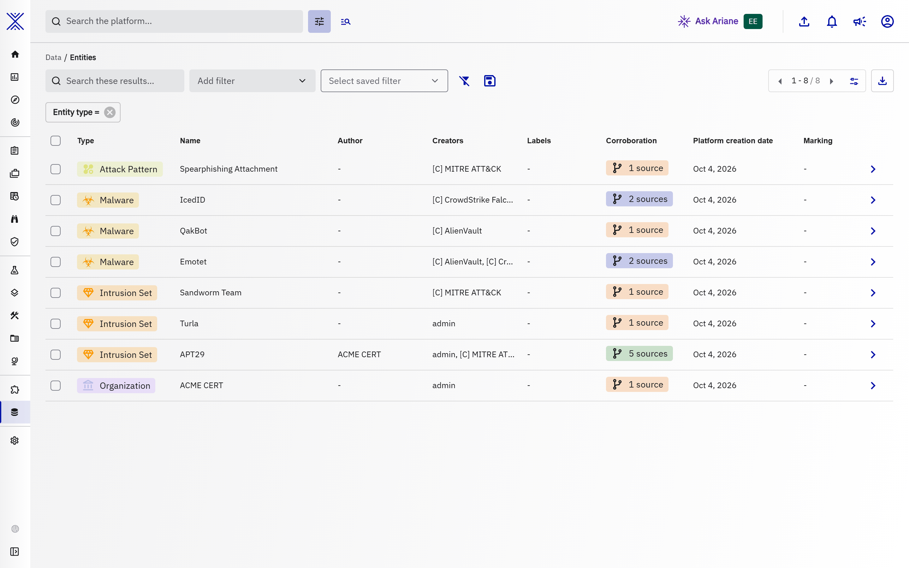

In investigation graphs, nodes are surrounded by a ring whose width grows with their corroboration, and relationship labels show the number of sources between brackets.

## Sources card and sources panel

The overview of the elements of a tracked type shows a "Sources" card. On the entity types with a customizable overview, it is the "Sources" widget of the overview layout ("Settings > Customization > Entity types > Overview Layout"), where it can be moved and resized like any other widget; it is only part of the layout while provenance is tracked on the type. By default it is half width and opens the second row of the overview, right after the basic information (after the timeline on cases), so it pairs with the next half-width widget; a layout customized before receives it at that position. On the other types (indicators, observables, relationships and sightings), the card is displayed below the basic information as soon as a source asserted the element. The card displays:

- the corroboration badge ("7 sources") and how long ago the knowledge was last asserted, with the exact date in the tooltip;
- the five most recent sources, each with its kind, when it first and last asserted the knowledge (a single date when both are the same, exact dates in the tooltip) and its confidence. A source links to the page that describes it when there is one, for instance the organization or individual of an author;
- the fields on which sources disagree, with a "Review conflicts" button;
- in its footer, the number of sources not listed and "View all N sources".

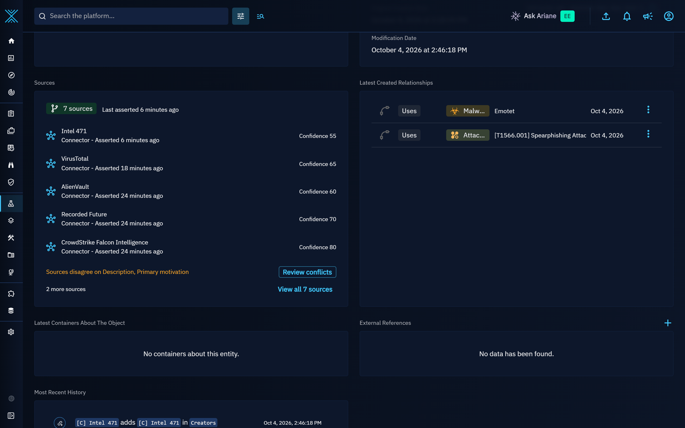

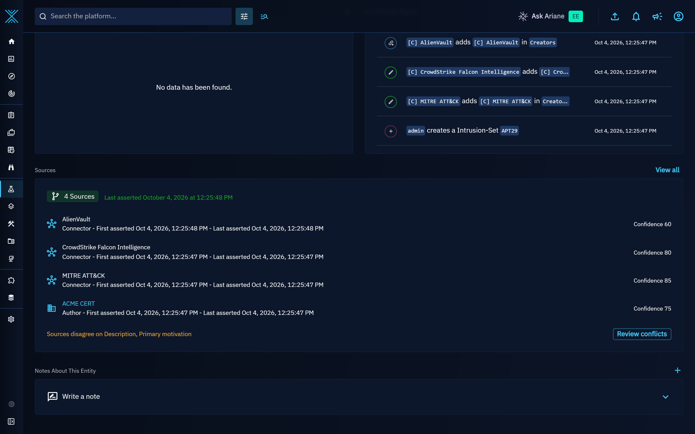

??? example "A single source, no source, and the light theme"

    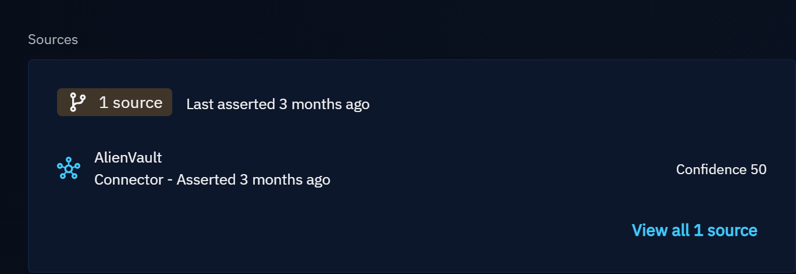

    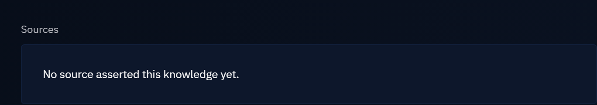

    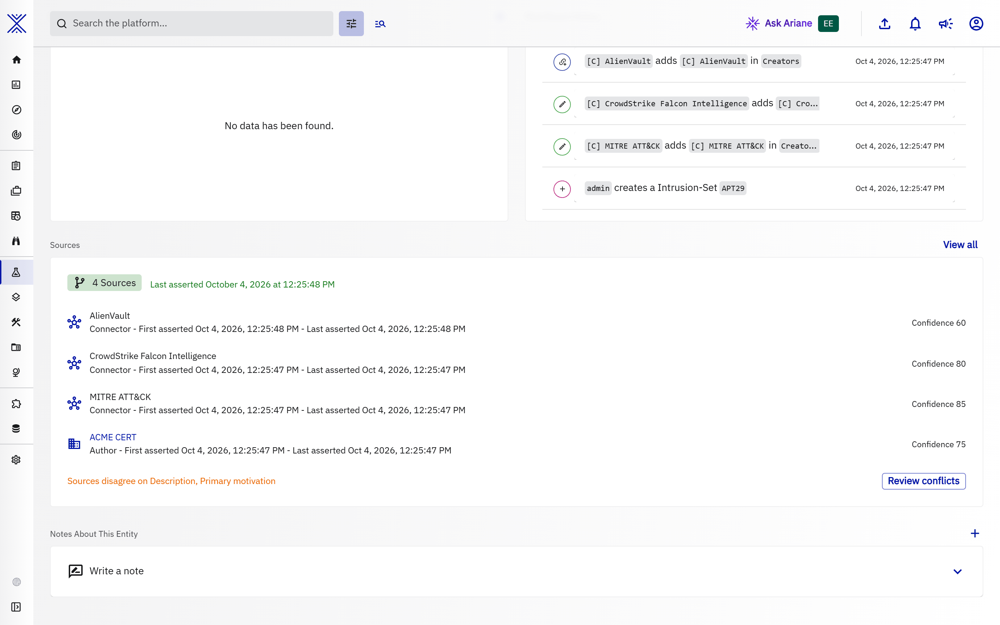

    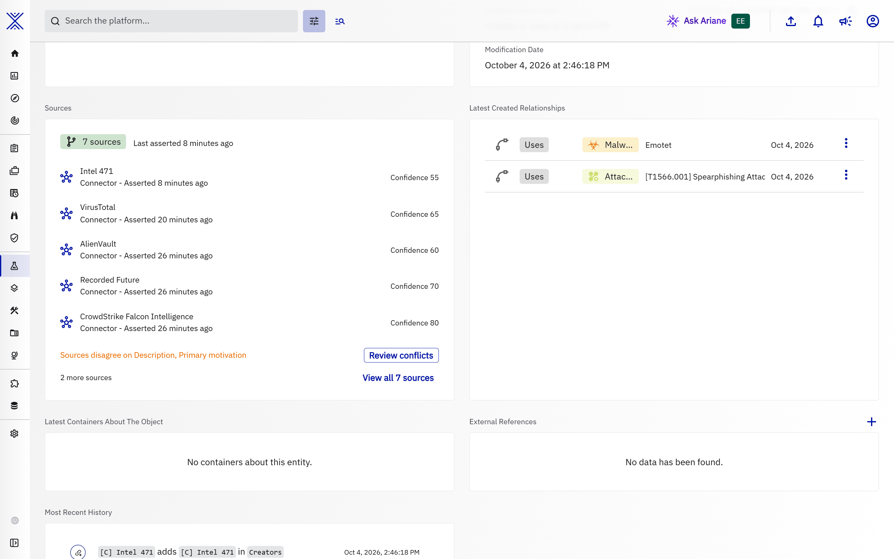

When no source asserted the element yet, the widget says so in one sentence; outside the overview layout, the card is not displayed.

The "View all N sources" and "Review conflicts" buttons of the card open the sources panel, which lists:

- **Sources**: every source with its kind, first and last assertion dates, number of assertions and confidence ("Not recorded" when the source gave none).
- **Conflicting values**: the values proposed by sources for a field that differ from the current value (see below).
- **Procedures**: for `uses` relationships, the procedures described by each source (see below).

When the element has no source yet, the panel says so with the state of the provenance backfill; when provenance is not available, it says that the type is not tracked or that the sources are restricted for your account.

The "Confirm still valid" button re-asserts the knowledge in your name. It adds or refreshes your own assertion and clears a stale flag.

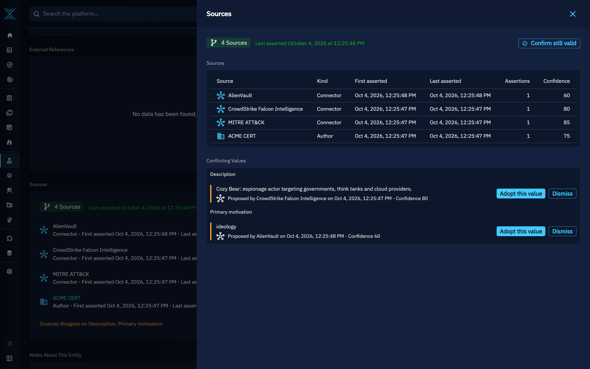

??? example "The same panel in the light theme"

    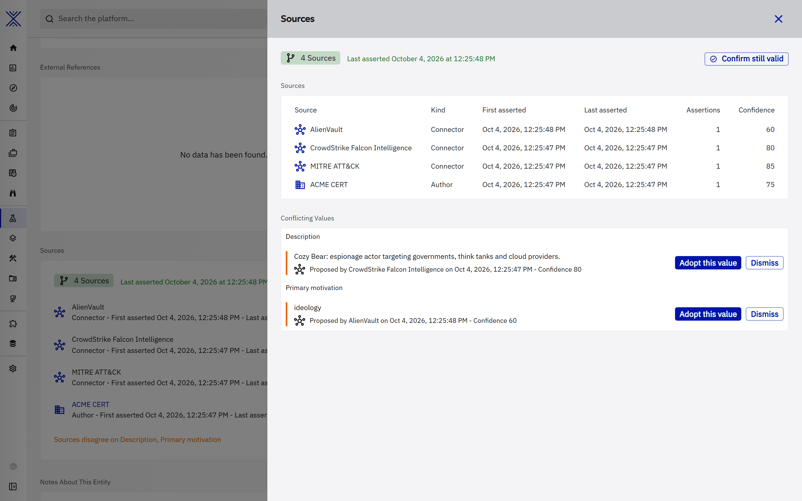

## Source conflicts

When a source proposes a value that differs from the current value of a single-value field (for instance the description or the primary motivation), the platform keeps the current value, as the deduplication and confidence rules decide, and records the alternative value as a conflict. At most 10 alternative values are kept per field by default.

Each alternative value is kept per source: when several sources propose the same value, the panel shows it once, with one line per source (its name, when it proposed the value and its confidence).

In the sources panel, a user allowed to update the knowledge can:

- **Adopt this value**: replace the current value with the alternative value. The value previously in place becomes an alternative of its source.
- **Dismiss**: remove the alternative value.

Both actions apply to every source that proposed the value, and the history names them all. Very large values cannot be adopted from the panel and must be edited directly.

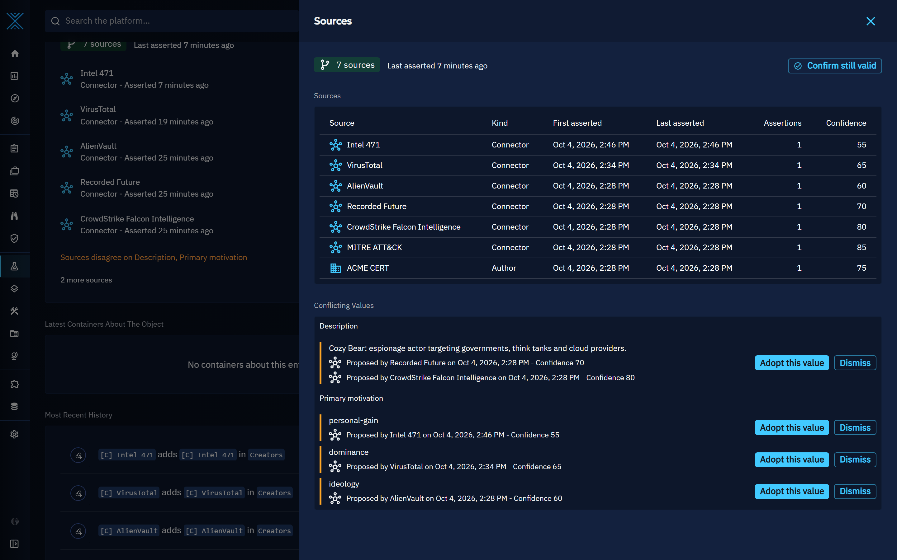

??? example "The same conflicts in the light theme"

    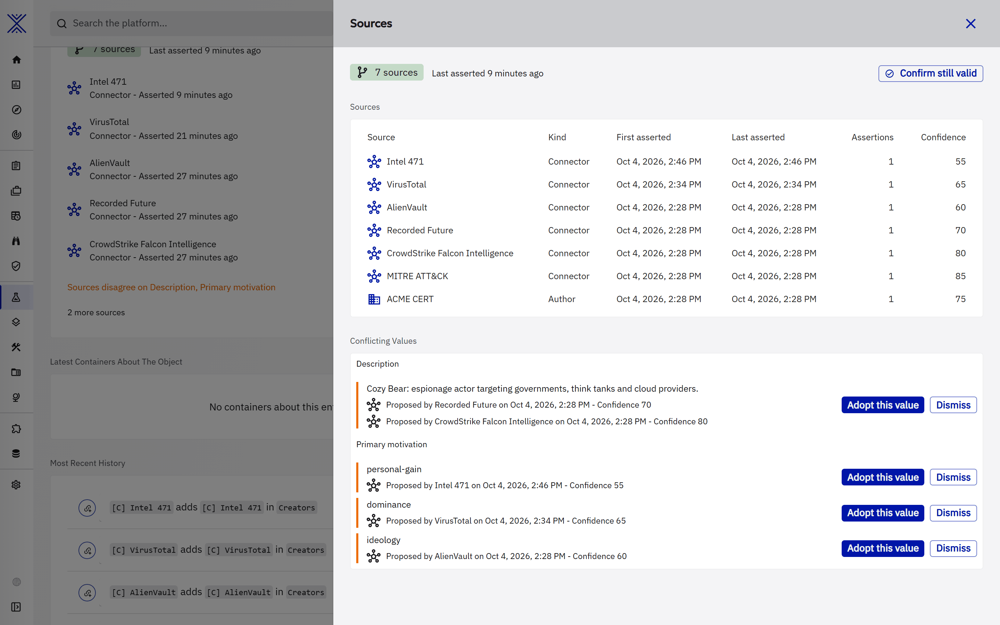

Dates, counters, scores, confidence and technical fields never produce conflicts. Outdated conflicts can be purged automatically with a retention policy whose scope is "Source conflicts": the elements are kept, and only the conflicting values that no source re-asserted during the retention period are purged.

## Procedures

When several sources describe how a threat uses a technique, each `uses` relationship to an attack pattern keeps the procedure provided by every source instead of overwriting the description. A procedure is kept per source: the same text from two sources is shown once in the sources panel, with both sources. The "Use as description" action of the sources panel makes a procedure the description of the relationship.

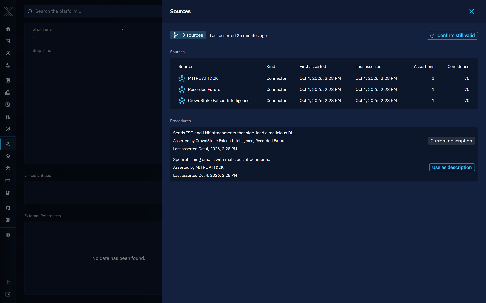

Procedures are recorded with the provenance of relationships: they are only preserved while provenance is tracked on the `uses` relationship type (tracked by default, see [Relationship types](#relationship-types)). Two parameters are available in the "Procedures" card of "Settings > Customization > Entity types > Relationships":

- **Preserve each source's procedure**: on `uses` relationships to attack patterns, keep the procedure of every source instead of overwriting the description (enabled by default). The switch is disabled while the `uses` relationship type is not tracked.
- **Description of the relationship**: when a new procedure arrives, keep the "Longest procedure" or the "Most recent procedure" as the description (longest by default).

## Curation tabs

The "Data > Curation" hub gathers the data-quality views of the platform. Provenance adds two tabs to it:

- **Conflicts**: the entities, relationships and sightings with source conflicts, with direct access to their sources panel to adopt or dismiss the alternative values.
- **Stale knowledge**: the entities, relationships and sightings flagged as stale by a [knowledge decay rule](../administration/decay-rules.md#knowledge-decay-rules), with direct access to their sources panel to confirm them.

The tab bar shows the number of elements waiting on each tab (open conflicts, stale elements), and the Curation entry of the menu their sum. Under the purpose of each tab, counters give the number of elements by kind of knowledge (entities, relationships, sightings); each counter selects the list below. The Stale knowledge tab also tells how many knowledge decay rules currently flag knowledge, with a link to them. Like the lists, these counts only cover the tracked types: an element of a type whose tracking was switched off keeps its flag but is neither listed nor counted. When nothing is listed, the tab says why: "No conflict - your sources agree on every field.", "No stale knowledge - every element was re-asserted within its decay rule.", or "No result for these filters" when your filters exclude everything.

Once the sources panel of a row is closed after a change, the list is refreshed: a row whose conflicts are all resolved, or which is confirmed, leaves the tab. Elements of a type whose provenance tracking is switched off are not listed.

The **Curation** entry appears in the **Data** menu, right after **Relationships**, for users with access to the knowledge while provenance is enabled on the platform. Each tab keeps its own address under "Data > Curation", so a link to a tab can be bookmarked and shared, and the breadcrumb and the tab bar stay on screen while a tab loads. Opening a link to Curation without access to any of its tabs shows a page that says so, with a way back to **Data**.

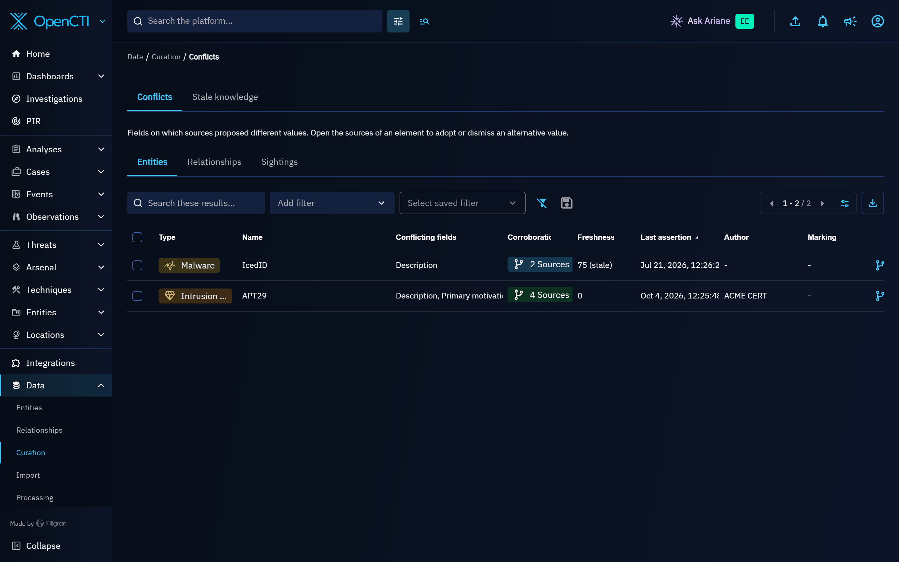

??? example "The same page in the light theme"

    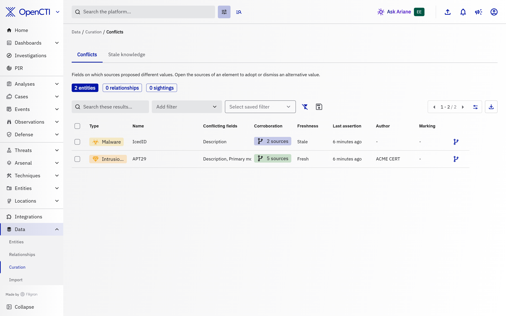

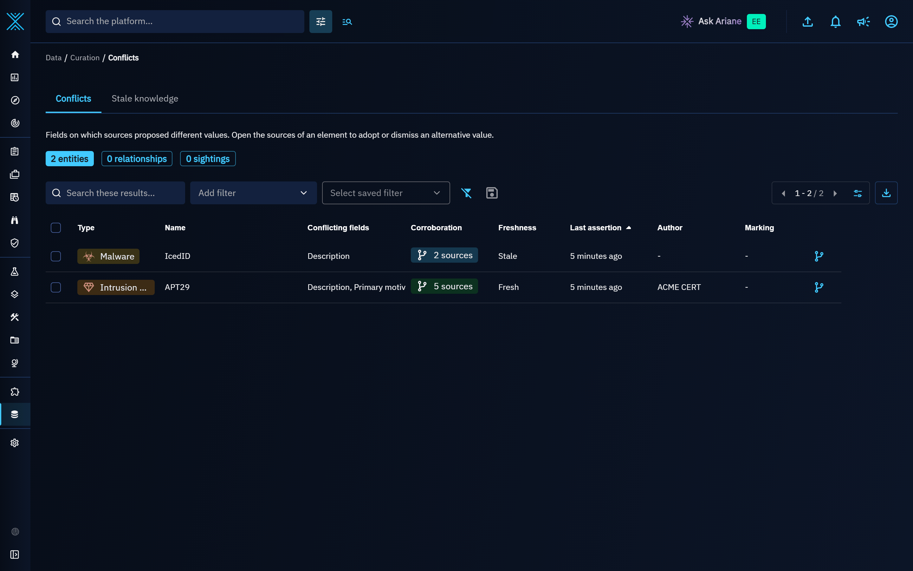

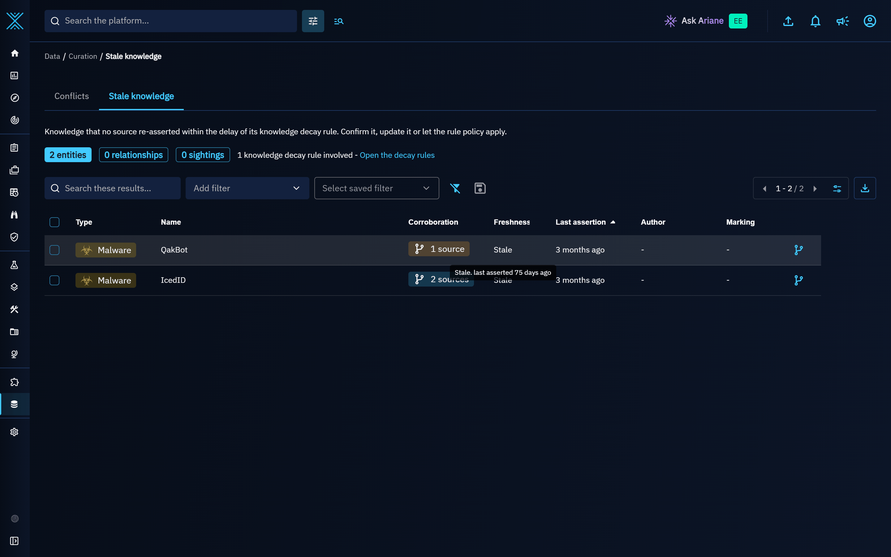

??? example "Empty states and the light theme"

    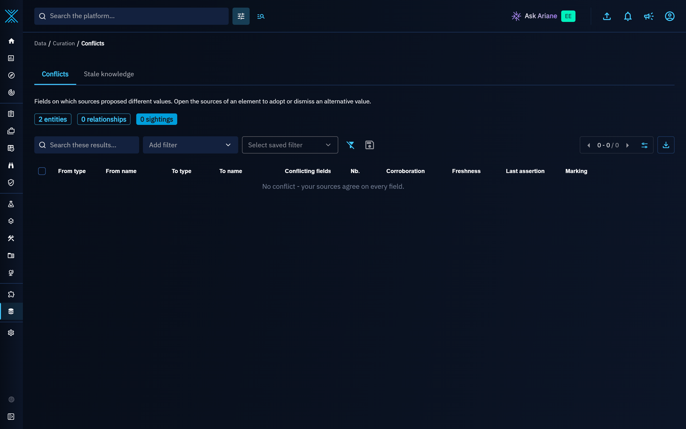

    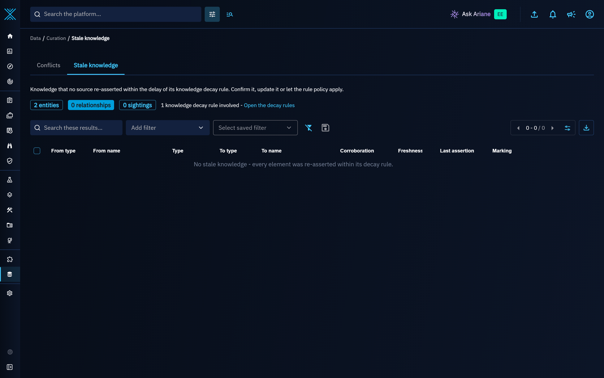

    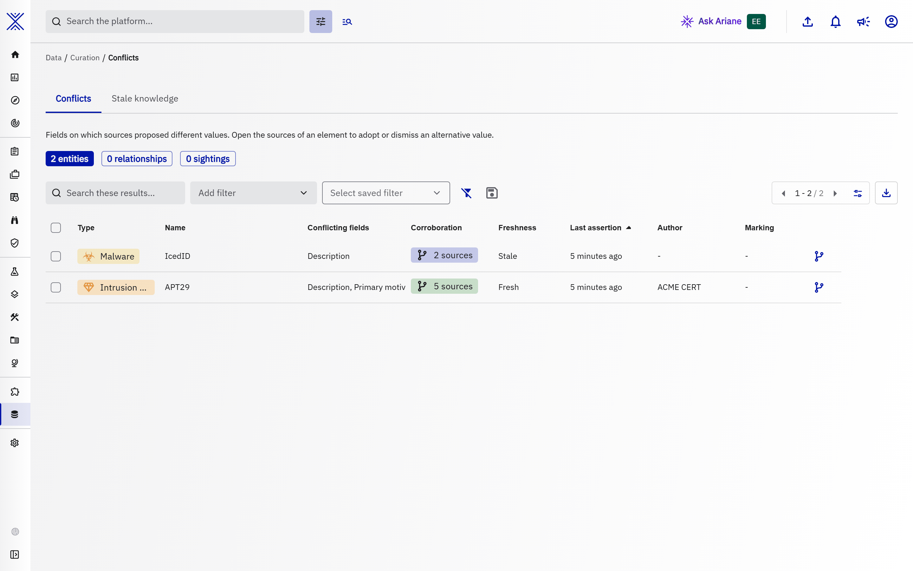

    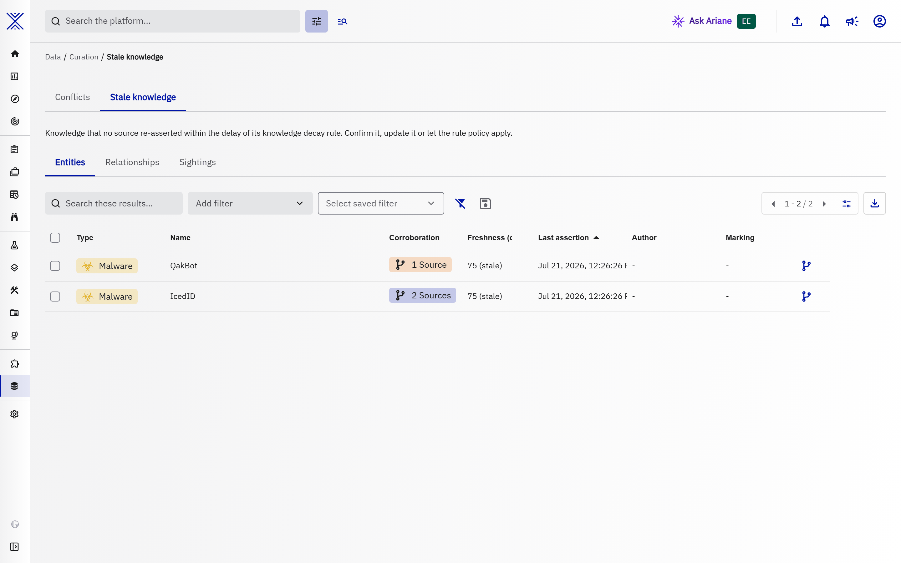

## Widgets

Two visualizations are available in the widget catalog of dashboards, for the entities and the relationships perspectives. Both honor the filters of the widget and the dates of the dashboard:

- **Knowledge freshness - days since the last assertion**: the knowledge per time elapsed since its last assertion by any source (0-30 days, 31-90 days, 91-180 days, 181-365 days, over 365 days, never asserted).
- **Single-sourced share by entity type**: per entity or relationship type, the knowledge asserted by a single source versus the corroborated knowledge. The "Number of results" parameter limits the number of types displayed.

Both only count the types on which provenance is tracked: the knowledge of an untracked type has no source to show and never weighs on the "never asserted" share. When no assertion matches the widget yet, it says so: "No assertion recorded yet. Provenance appears as connectors and users create knowledge."

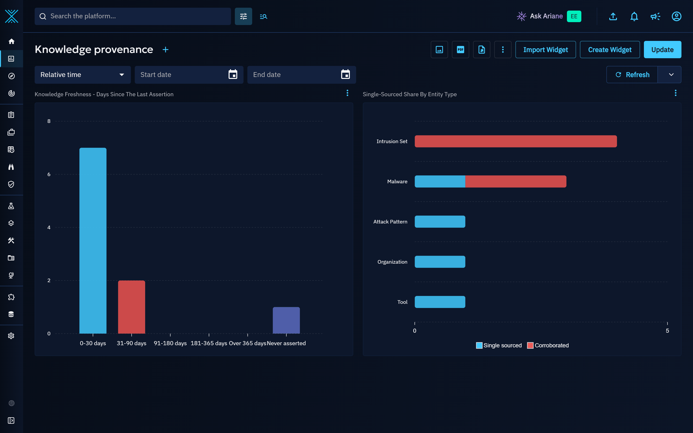

??? example "The same widgets in the light theme"

    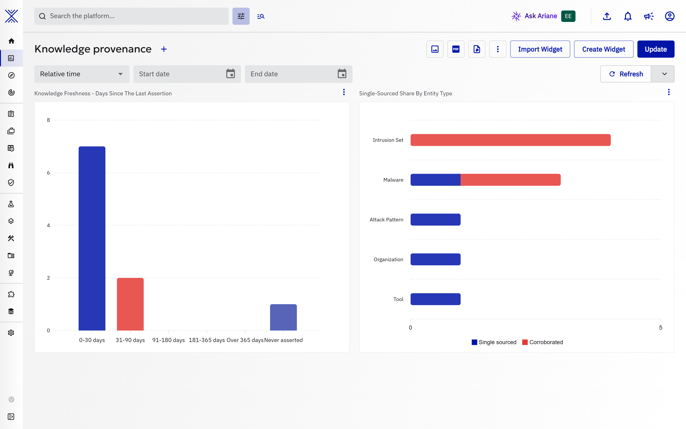

While provenance is disabled (see [Configuration](#configuration)), a provenance widget already saved on a dashboard keeps its place and runs no query: it states that provenance is disabled, that an administrator enables it in the platform configuration, and links to this documentation.

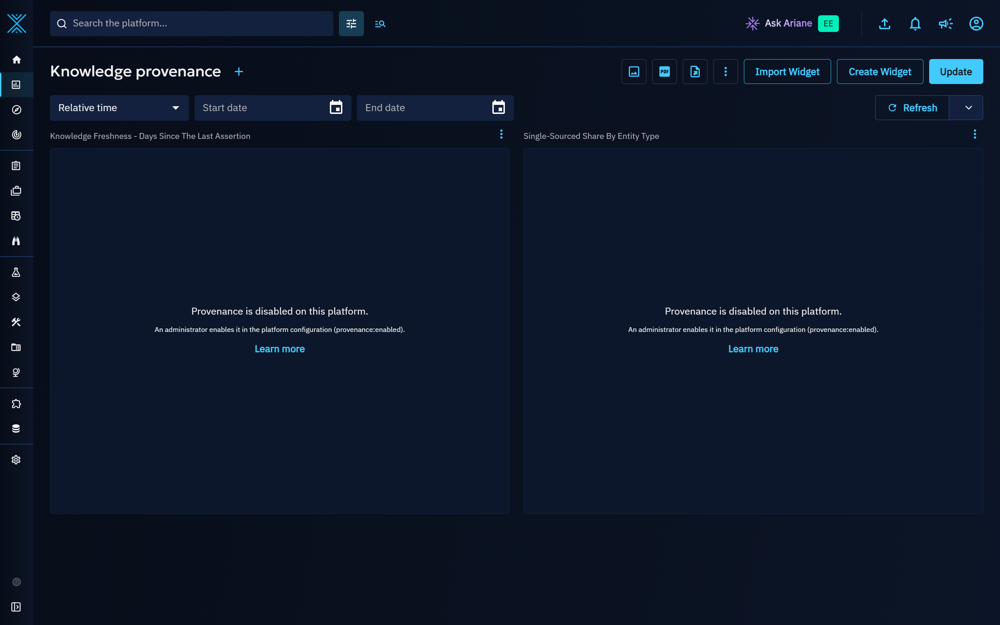

??? example "The same dashboard in the light theme"

    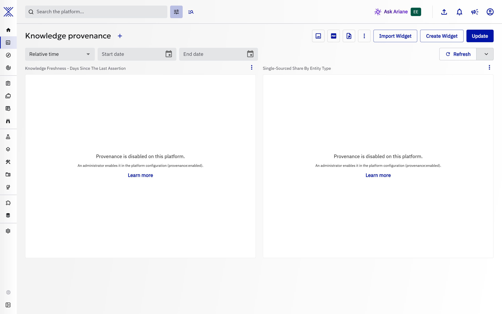

## Notifications

Two trigger event types are dedicated to provenance in [live triggers](notifications.md#triggers):

- **Corroboration reached**: notifies when the number of sources of a matching element reaches the configured threshold (2 by default, up to 200).
- **Source conflict detected**: notifies when a source proposes a value conflicting with the current value of a matching element.

In the notification center, these notifications read "Corroboration" and "Source conflict", with the element and what changed ("Volt Typhoon is now corroborated by 3 sources", "APT29 has conflicting values from sources on Primary motivation").

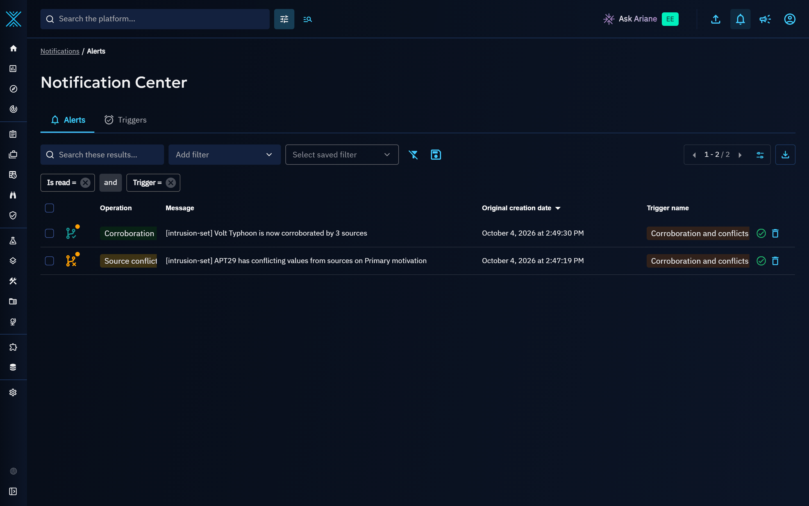

??? example "The same notifications in the light theme"

    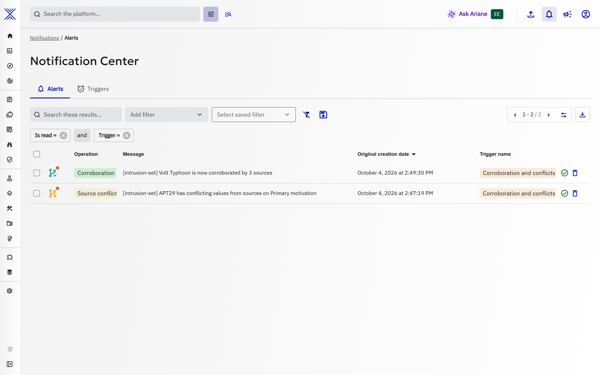

## STIX export

Provenance travels in STIX bundles, streams and exports as a summary only, in the extension `extension-definition--283daa2f-7739-5345-a110-19d73676f670`:

```json
{
  "extension_type": "property-extension",
  "corroboration_count": 3,
  "assertions_count": 12,
  "first_asserted": "2026-01-12T09:30:00.000Z",
  "last_asserted": "2026-09-30T18:02:00.000Z",
  "single_sourced": false,
  "has_conflicts": true,
  "conflicting_fields": ["description"],
  "freshness_stale": false,
  "sources_by_kind": { "connector": 2, "feed": 0, "author": 0, "user": 1, "inference": 0, "emulation": 0 }
}
```

Source names and identifiers never leave the platform. The extension is computed by the platform and ignored on import. `corroboration_count` and `single_sourced` count every source of the element. `assertions_count` and `sources_by_kind` are computed from the sources whose details are kept.

In the Python client, `OpenCTIApiClient.get_provenance_extension(stix_object)` reads this summary from a STIX object, and `stix_object_or_stix_relationship.read_provenance(id=...)` returns the assertions, conflicts and procedures of an element.

## Configuration

| Parameter                                | Environment variable                       | Default value | Description                                                         |
|:-----------------------------------------|:-------------------------------------------|:--------------|:--------------------------------------------------------------------|
| provenance:enabled                       | PROVENANCE__ENABLED                        | `true`        | Record assertions on every write                                    |
| provenance:reassertion_window_hours      | PROVENANCE__REASSERTION_WINDOW_HOURS       | 24            | Window within which a source repeating an assertion is not written again (0 writes every assertion) |
| provenance:default_tracked_types         | PROVENANCE__DEFAULT_TRACKED_TYPES          | Indicator, Intrusion-Set, Threat-Actor-Group, Threat-Actor-Individual, Malware, uses, targets, attributed-to | Entity and relationship types tracked while their setting was never changed (`*` tracks every type) |
| provenance:max_conflict_values_per_field | PROVENANCE__MAX_CONFLICT_VALUES_PER_FIELD  | 10            | Maximum number of alternative values kept for a conflicting field  |
| provenance:refresh_on_write              | PROVENANCE__REFRESH_ON_WRITE               | `false`       | Refresh the index after each provenance update, slows down writes   |

When provenance is disabled, nothing is recorded, no provenance extension is exported, the provenance backfill and knowledge freshness managers do not run, and a "Source conflicts" retention policy purges nothing (its check counts no element). The provenance surfaces are hidden as well, even for the provenance a platform recorded before it was disabled: the Sources card and the sources panel, the corroboration column of the "Data > Entities" and "Data > Relationships" lists, the corroboration rings and source counts of graphs, the Conflicts and Stale knowledge tabs of the Curation hub and their counts, the Provenance and Procedures settings of the entity types and the per-relationship-type tracking, the Knowledge decay rules tab of "Settings > Customization > Decay rules", the "Source conflicts" scope of a new retention policy, the provenance widgets of the widget catalog (a provenance widget already saved on a dashboard keeps its place, states that provenance is disabled and that an administrator enables it with `provenance:enabled`, without querying anything) and the provenance events of the notification triggers (an existing trigger keeps the provenance events it already had, so they can be removed). The provenance backfill and the knowledge freshness managers are described in the [managers](../deployment/advanced/managers.md) page.
