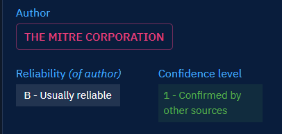

# Reliability and Confidence

## Generalities
In (Cyber) Threat Intelligence, evaluation of information sources and of information quality is one of the most important aspect of the work. It is of the utter most importance to assess situations by taking into account reliability of the sources and credibility of the information.

This concept is foundational in OpenCTI, and have real impact on:

* the data [deduplication process](deduplication.md)
* the data stream filtering for ingestion and sharing

### What is the Reliability of a source?

Reliability of a source of information is a measurement of the trust that the analyst can have about the source, based on the technical capabilities or history of the source. Is the source a reliable partner with long sharing history? A competitor? Unknown?

Reliability of sources are often stated at organizational level, as it requires an overview of the whole history with it. 

In the Intelligence field, Reliability is often notated with the [NATO Admiralty code](https://en.wikipedia.org/wiki/Admiralty_code).

### What is Confidence of an information?

Reliability of a source is important but even a trusted source can be wrong. Information in itself has a credibility, based on what is known about the subject and the level of corroboration by other sources.

Credibility is often stated at the analyst team level, expert of the subject, able to judge the information with its context.

In the Intelligence field, Confidence is often notated with the [NATO Admiralty code](https://en.wikipedia.org/wiki/Admiralty_code).

!!! info "Why Confidence instead of Credibility?"

    Using both Reliability and Credibility is an advanced use case for most of CTI teams. It requires a mature organization and a well staffed team. For most of internal CTI team, a simple confidence level is enough to forge assessment, in particular for teams that concentrate on technical CTI. 

    Thus in OpenCTI, we have made the choice to fuse the notion of Credibility with the Confidence level that is commonly used by the majority of users. They have now the liberty to push forward their practice and use both Confidence and Reliability in their daily assessments.

## Reliability open vocabulary

Reliability value can be set for every Entity in the platform that can be Author of Knowledge:

* `Organizations`
* `Individuals`
* `Systems`
* and also `Reports`

Reliability on `Reports` allows you to specify the reliability associated to the original author of the report if you received it through a provider.

For all Knowledge in the platform, the reliability of the source of the Knowledge (author) is displayed in the Overview. This way, you can always forge your assessment of the provided Knowledge regarding the reliability of the author.

You can also now filter entities by the reliability of its author.

!!! tip "Tip"

    This way, you may choose to feed your work with only Knowledge provided by reliable sources.

Reliability is an open vocabulary that can be customized in Settings -> Taxonomies -> Vocabularies : reliability_ov. 

!!! info
    
    The setting by default is the Reliability scale from NATO Admiralty code. But you can define whatever best fit your organization.

## Confidence scale

Confidence level can be set for:

* Analyses: `Report`, `Grouping`, `Malware analysis`, `Notes`
* Cases: `Incident Response`, `Request for Information`, `Request for Takedown`, `Feedback`
* Events: `Incident`, `Sighting`, `Observed data`
* Observations: `Indicator`, `Infrastructure`
* Threats: `Threat actor (Group)`, `Threat actor (Individual)`, `Intrusion Set`, `Campaign`
* Arsenal: `Malware`, `Channel`, `Tool`, `Vulnerability`

For all of these entities, the Confidence level is displayed in the Overview, along with the Reliability. This way, you can rapidly assess the Knowledge with the Confidence level representing the credibility/quality of the information.

### Confidence scale customization

Confidence level is a numerical value between 0 and 100. But Multiple "Ticks" can be defined and labelled to provide a meaningful scale.

Confidence level can be customized for each entity type in Settings > Customization > Entity type.

As such customization can be cumbersome, three confidence level templates are provided in OpenCTI:

* Admiralty: corresponding to the [Admiralty code's credibility scale](https://en.wikipedia.org/wiki/Admiralty_code)
* Objective: corresponding to a full objective scale, aiming to leave any subjectivity behind. With this scale, an information confidence is:
    * "Cannot be judged": there is no data regarding the credibility of the information
    * "Told": the information is known because it has been told to the source. The source doesn't verify it by any means.
    * "Induced": the information is the result of an analysis work and is based on other similar information assumed to be true.
    * "Deduced": the information is the result of an analysis work, and is a logical conclusion of other information assumed to be true.
    * "Witnessed": the source have observed itself the described situation or object.
* standard: the historic confidence level scale in OpenCTI defining a Low, Med and High level of confidence.

It is always possible to modify an existing template to define a custom scale adapted to your context.

!!! tip "Tip"

    If you use the Admiralty code setting for both reliability and Confidence, you will find yourself with the equivalent of NATO confidence notation in the Overview of your different entities (A1, B2, C3, etc.)

## Usage in OpenCTI

### Example with the admiralty code template

Your organization have received a report from a CTI provider. At your organization level, this provider is considered as reliable most of the time and its reliability level has been set to "B - Usually Reliable" (your organization uses the Admiralty code).

This report concerns ransomware threat landscape and have been analysed by your CTI analyst specialized in cybercrime. This analyst has granted a confidence level of "2 - Probably True" to the information. 

As a technical analyst, through the cumulated reliability and Confidence notations, you now know that the technical elements of this report are probably worth consideration.

### Example with the Objective template

As a CTI analyst in a governmental CSIRT, you build up Knowledge that will be shared within the platform to beneficiaries. Your CSIRT is considered as a reliable source by your beneficiaries, even if you play a role of a proxy with other sources, but your beneficiaries need some insights about how the Knowledge has been built/gathered. 

For that, you use the "Objective" confidence scale in your platform to provide beneficiaries with that. When the Knowledge is the work of the investigation of your CSIRT, either from incident response or attack infrastructure investigation, you set the confidence level to "Witnessed", "Deduced" or "Induced" (depending on if you observed directly the data, or inferred it during your research). When the information has not been verified by the CSIRT but has value to be shared with beneficiaries, you can use the "Told" level to make it clear to them that the information is probably valuable but has not been verified.

