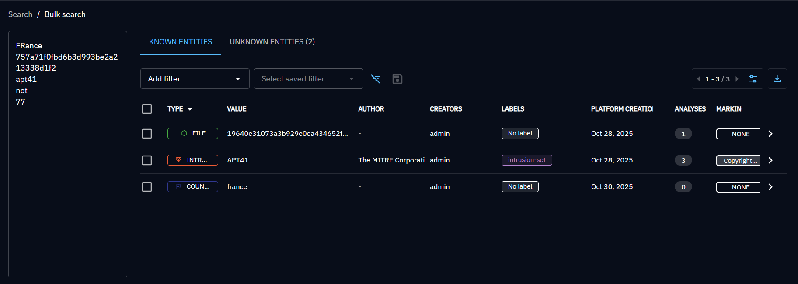
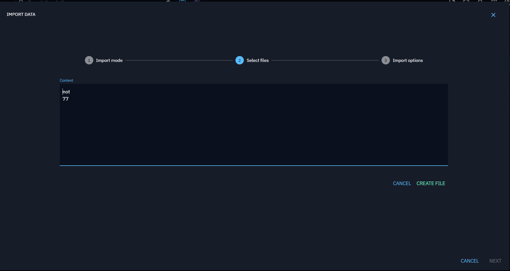

# Search for knowledge

In OpenCTI, you have access to different capabilities to be able to search for knowledge in the platform. In most cases, a search by keyword can be refined with additional filters for instance on the type of object, the author etc.

> **Note:**
> OpenCTI automatically cleans and normalizes indicator search terms, including common defanged patterns (such as `[.]`, `hxxp://`, etc). This means you can safely paste indicators as you receive them—no need to manually "refang" before searching.

## Global search

The global search is always available in the top bar of the platform.

This search covers all [STIX Domain Objects (SDOs)](data-model.md#stix-model-section) and [STIX Cyber Observables (SCOs)](data-model.md#stix-model-section) in the platform. The search results are sorted according to the following behaviour:

* Priority 1 for exact matching of the keyword in one attribute of the objects.
* Priority 2 for partial matching of the keyword in the `name`, the `aliases` and the `description` attributes (full text search).
* Priority 3 for partial matching of the keyword in all other attributes (full text search).

If you get unexpected result, it is always possible to add some filters after the initial search:

Also, using the `Advanced search` button, it is possible to directly put filters in a global search:

!!! info "Advanced filters"

    You have access to advanced filters all accross the UI, if you want to know more about how to use these 
    filters with the API or the Python library, [don't hesitate to read the dedicated page](../reference/filters.md)

### Full text search in files content

!!! tip "Enterprise edition"

    Full text search in files content is available under the "OpenCTI Enterprise Edition" license.

    [Please read the dedicated page to have all information](../administration/enterprise.md)

It's possible to extend the global search by keywords to the content of documents uploaded to the platform via the Data import tab, or directly linked to an entity via its Data tab.

It is particularly useful to enable ``Full text indexing`` to avoid missing important information that may not have been structured within the platform. This situation can arise due to a partial automatic import of document content, limitations of a connector, and, of course, errors during manual processing.

In order to search in files, you need to configure [file indexing](../administration/file-indexing.md).

## Bulk search

The bulk search capabilities is available in the top bar of the platform and allows you to copy paste a list of keyword or objects (ie. list of domains, list of IP addresses, list of vulnerabilities, etc.) to search in the platform:

When searching in bulk, OpenCTI is only looking for an case-insensitive exact match in some properties:

* `name`
* `aliases`
* `x_opencti_aliases`
* `x_mitre_id`
* `value`
* `subject`
* `abstract`
* `x_opencti_additional_names`
* `account_login`
* `account_type`
* `attribute_key`
* `card_number`
* `iban`
* `hashes.MD5`
* `hashes.SHA-1`
* `hashes.SHA-256`
* `hashes.SHA-512`
* `path`
* `persona_name`
* `url`
* `user_id`

Found entities are listed in the `Known entities` panel. You can export them or launch massive operations on them, like in other entities lists.

When something is not found, it appears in the `Unknown entities` tab.
You can quickly add some of these unknown values in the platform: select the wanted unknown values, and click on the 'Create unknown entities' button in the toolbar.

You are redirected to the `Import data` pop-up, prefilled with a file containing the selected unknown values. You can continue the steps, create a file, add it in a draft, etc.

## Contextual search

In most of the screens of knowledge, you always have a contextual search bar allowing you to filter the list you are on:

The search keyword used here is taken into account if you decide to export the current view in a file such as a JSON STIX bundle or a CSV file.

## Other search bars

Some other screens can contain search bars for specific purposes. For instance, in the graph views to filter the nodes displayed on the graph:

