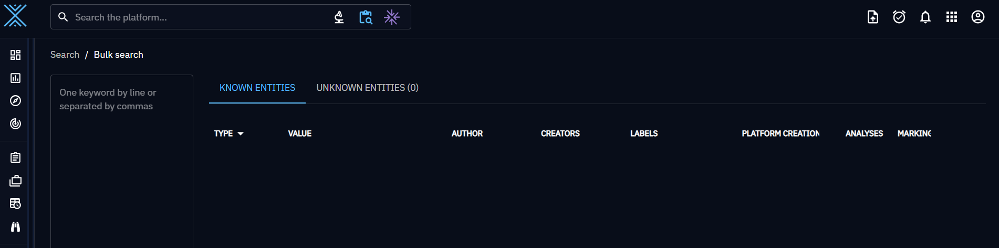

# Search for knowledge

In OpenCTI, you have access to different capabilities to be able to search for knowledge in the platform. In most cases, a search by keyword can be refined with additional filters for instance on the type of object, the author etc.

## Global search

The global search is always available in the top bar of the platform.

<figure markdown>
  
</figure>

This search covers all [STIX Domain Objects (SDOs)](data-model.md) and [STIX Cyber Observables (SCOs)](data-model.md) in the platform. The search results are sorted according to the following behaviour:

* Priority 1 for exact matching of the keyword in one attribute of the objects.
* Priority 2 for partial matching of the keyword in the `name`, the `aliases` and the `description` attributes (full text search).
* Priority 3 for partial matching of the keyword in all other attributes (full text search).

If you get unexpected result, it is always possible to add some filters after the initial search:

Also, using the `Advanced search` button, it is possible to directly put filters in a global search:

## Bulk search

The bulk search capabilities in available in the top bar of the platform and allow you to copy paste a list of keyword or objects (ie. list of domains, list of IP addresses, list of vulnerabilities, etc.) to search in the platform:

When searching in bulk, OpenCTI is only looking for an exact match in some properties:

* `name`
* `aliases`
* `x_opencti_aliases`
* `x_mitre_id`
* `value`
* `subject`
* `abstract`
* `hashes_MD5`
* `hashes_SHA1`
* `hashes_SHA256`
* `hashes_SHA512`
* `x_opencti_additional_names`

When something is not found, it appears in the list as `Unknown` and will be excluded if you choose to export your search result in a JSON STIX bundle or in a CSV file.

## Contextual search

In most of the screens of knowledge, you always have a contextual search bar allowing you to filter the list you are on:

The search keyword used here is taken into account if you decide to export the current view in a file such as a JSON STIX bundle or a CSV file.

## Other search bars

Some other screens can contain search bars for specific purposes. For instance, in the graph views to filter the nodes displayed on the graph:

