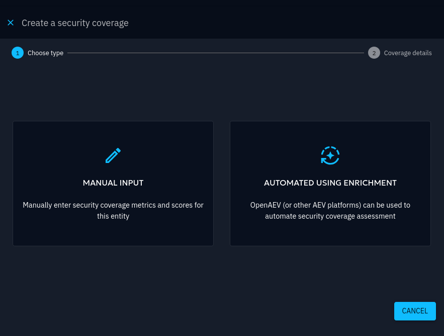
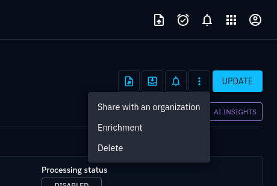
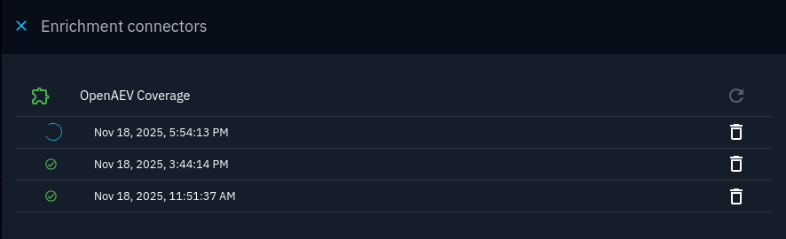

# Security Coverage

When considering an entity such as a report or an incident response, it is useful to evaluate whether 
our own computer systems are well protected against the threats described therein. A Security Coverage
models this evaluation to measure your actual exposure and validate your security posture.

A Security Coverage can be created in relation to the following entities in OpenCTI:

* Campaign
* Grouping
* Incident
* Incident Response
* Intrusion Set
* Report

Security Coverages can be found under **Analyses > Security Coverages**, and are linked to their respective
related entity.

## Creating a Security Coverage

You can create a Security Coverage from scratch under **Analyses > Security Coverages** (in which case the form will
prompt for selecting the related entity), or directly from the context of a compatible entity.

When you navigate to one of the compatible entities in OpenCTI, notice the "Add Security Coverage" button in the upper
right corner of the page.

It prompts a panel to open to create the Security Coverage. Notice that the Security Coverage can be carried out
in one of two manners: Automated and Manual.

An automated Security Coverage leverages another component of the XTM Suite: [OpenAEV](https://docs.openaev.io/).
It will be responsible for automatically performing the relevant tests and feed the results back to OpenCTI with no
human intervention.

Conversely, a manual security coverage assessment can also be performed, allowing you to conduct the analysis yourself and directly enter the results into OpenCTI.

## Automated Security Coverage via XTM Suite (OpenAEV)

As part of the XTM Suite, OpenCTI can request an automated evaluation of the exposure of computer systems
from one of the compatible entities, via a connected OpenAEV instance.

!!! note "Report entities eligible for automated coverage"

    At time of writing, the automated Security Coverage feature with OpenAEV can assess coverage for
    the following entities:
    
    * Attack Patterns

    At least one entity of this type must be present in the report for which an automated Security Coverage
    is being requested.

### Prerequisites
In order to enable this feature, you must first ensure the following items:

* An active OpenAEV instance, [here is the dedicated documentation](https://docs.openaev.io/)
* That same instance must be configured as an Enrichment Connector ([see the specific documentation](https://docs.openaev.io/latest/usage/xtm_suite_connector/))

When the above is completed, you should see OpenAEV being listed as an Enrichment Connector in **Data > Ingestion** :

### Requesting the automated Security Coverage

The automated Security Coverage is requested using the Add Security Coverage button mentioned above.

In the first step of the creation form, users wanting to leverage OpenAEV for the Security Coverage should choose the **Automated using Enrichment** option,
which becomes enabled when the "OpenAEV Coverage" connector is up and healthy and proceed to fill
in the second step of the form.

The Security Coverage is created and OpenCTI is now waiting for OpenAEV to run tests and feed the results back.

### Receiving results

OpenAEV is responsible for running the assessment. Using its own internal library of automated tests,
OpenAEV selects the best tests relevant to each of the eligible entities in the report linked to the Security Coverage
and runs a periodic simulation to assess the coverage. Please refer to the [OpenAEV documentation](https://docs.openaev.io/) for
extensive details on the inner working of this process.

!!! note "Periodic simulations"

    OpenAEV will trigger a simulation to assess the current exposure to the related threats periodically. The period
    is set to the value of the "Coverage validity period" parameter as specified during the creation of the Security
    Coverage in OpenCTI.

Whenever a simulation is completed, the coverage results are sent back to OpenCTI and displayed automatically
in the Security Coverage page.

### Checking the state of the enrichment process from an automated Security Coverage

From the Security Coverage page, you can check the status of the Enrichment Connector's work in the Enrichment menu (top-right):

This opens a panel where are listed the attempts at actioning OpenAEV for fulfilling the automated coverage assessment.
It is possible to retrigger the action manually by pressing the circular arrow icon (top right in the panel), in case
the previous attempt had failed or if it is necessary to request an updated assessment (e.g. because the contents of the
linked report has changed):

## Manual Security Coverage

If OpenAEV is not available for the automated Security Coverage, you can create a Security Coverage and provide the
assessed results manually.

### Creating the manual Security Coverage

In the Security Coverage creation form, choose **Manual Input** to create a manually driven Security Coverage.

A manual Security Coverage requires specifying which metrics are going to be manually assessed, in order for
the creation form to be valid:

The coverage assessment of these metrics is provided in the same form. Assigning a coverage score to a metric represents
the actual assessment as observed by the user. It may be updated after the fact using the Update button in the top-right
corner.

For example, assigning a coverage score of 100 to the _detection_ metric shows as such in the Security Coverage page:

