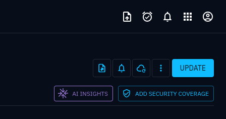
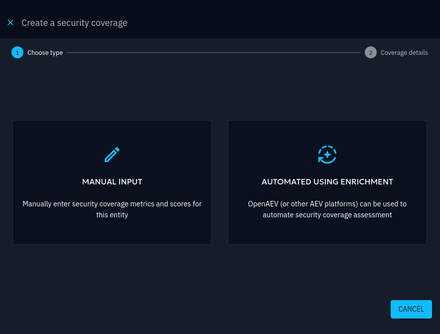
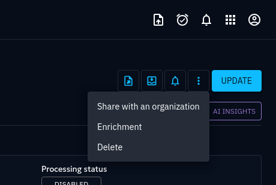
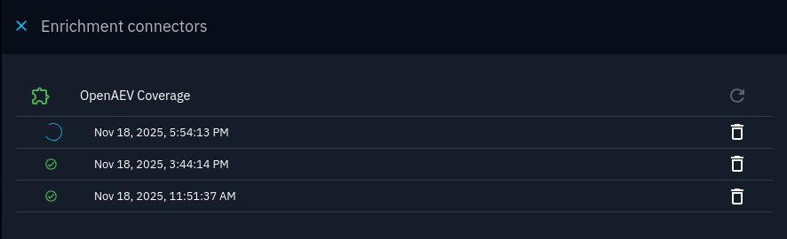
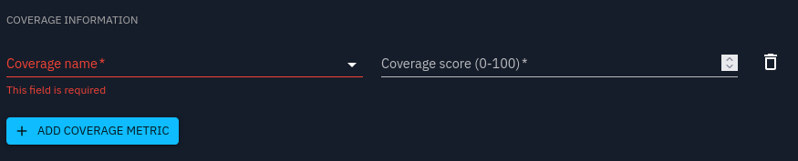
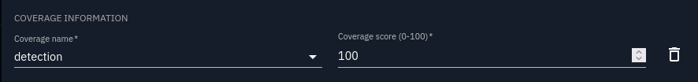
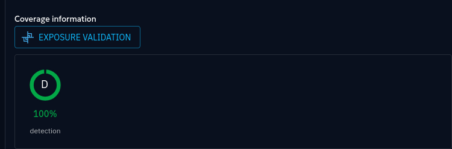

# Security Coverage

When you review a report or an incident response, it is useful to evaluate whether
your own computer systems are well protected against the threats described therein. A Security Coverage
models this evaluation, allowing you to measure your actual exposure and validate your security posture.

A Security Coverage can be created in relation to the following entities in OpenCTI:

* Campaign
* Grouping
* Incident
* Incident Response
* Intrusion Set
* Report

Security Coverages can be found under **Analyses > Security Coverages**, and are linked to the covered
entity.

## Creating a Security Coverage

You can create a Security Coverage from scratch under **Analyses > Security Coverages** (in which case the form
prompts you to select the entity to be covered), or directly from the context of a compatible entity.

When you navigate to a compatible entity in OpenCTI, the "Add Security Coverage" button is displayed in the upper
right corner of the page.

The button opens a panel where you create the Security Coverage. You can carry out the security coverage
in one of two ways: automated or manual.

An automated Security Coverage uses [OpenAEV](https://docs.openaev.io/), another component of the XTM Suite.
OpenAEV automatically performs the relevant tests (unless additional configuration is required) and sends the results back to OpenCTI with no
human intervention.

A manual security coverage allows you to conduct the analysis yourself and directly enter the results directly into OpenCTI.

## Automate a Security Coverage via XTM Suite (OpenAEV)

As part of the XTM Suite, OpenCTI can request an automated evaluation of your computer systems' exposure
from a compatible entity, through a connected OpenAEV instance.

!!! note "Report entities eligible for automated coverage"

    Currently, the automated Security Coverage feature with OpenAEV can assess coverage for
    the following entities:
    
    * Vulnerability

    At least one entity must be present in the covered entity for which an automated Security Coverage
    is being requested.

### Prerequisites for automated security coverage
To activate this feature, make sure the following requirements are met:

* An active OpenAEV instance, [here is the dedicated documentation](https://docs.openaev.io/)
* That same instance must be configured as an Enrichment Connector by a system administrator ([see the specific documentation](https://docs.openaev.io/latest/usage/xtm-suite-connector/))
 
!!! note "Compatibility requirement"

    The Security Coverage **Result** tab requires OpenAEV version **2.3.1** or later to display automated coverage results correctly.

When the above is completed, you should see OpenAEV being listed as an Enrichment Connector in **Data > Ingestion** :

### Request the automated Security Coverage

To request an automated Security Coverage, click the Add Security Coverage button mentioned above.

In the first step of the creation form, select the **Automated using Enrichment** option.
This option becomes available when the OpenAEV Coverage connector is running and healthy.
Complete the second step of the form.

After you submit the form, OpenCTI creates the security coverage and waits for OpenAEV to run tests and return the results of any completed tests.

### Receive automated results from OpenAEV

OpenAEV is responsible for running the assessment. Using its own internal library of automated tests,
OpenAEV selects the most relevant tests to each of the eligible entities in the entity covered by the Security Coverage
and runs a periodic simulation to assess the coverage. See the [OpenAEV documentation](https://docs.openaev.io/) for
details on how this process works.

!!! note "Periodic simulations"

    OpenAEV triggers a simulation to assess the current exposure to the related threats periodically. The period
    is set by the value of the "Coverage validity period" parameter specified during the creation of the Security
    Coverage in OpenCTI.

When a simulation is completed, the coverage results are sent back to OpenCTI and displayed automatically
in the Security Coverage Overview page and Result tab.

### Checking the automated Security Coverage enrichment state

From the Security Coverage page, you can check the status of the Enrichment Connector's work in the Enrichment menu in the upper-right corner:

This opens a panel that lists all attempts to task OpenAEV for the automated coverage assessment.
To retry the action manually, click the circular arrow icon (top right in the panel). You may need to retry if
the previous attempt failed or it is necessary to request an updated assessment (e.g. because the contents of the
linked report has changed):

### Result tab

The **Result tab** provides a detailed, entity-by-entity view of the simulation results for all the entities related to the Security Coverage. It provides a summary of the results of any simulations that were executed on OpenAEV. For full results you will need to navigate to OpenAEV using the **Open OpenAEV** button in the top right.
For each entity covered by the secured coverage, the table displays:

| Column       | Description                                                                                                        |
|--------------|--------------------------------------------------------------------------------------------------------------------|
| **Type**     | The entity type.                                                                                                   |
| **Name**     | The main entity label. For attack patterns, the MITRE ATT&CK ID is displayed when available.                       |
| **Coverage** | The Prevention and Detection coverage value returned for that entity. " - " if no results are currently available. |
| **Labels**   | Displays labels applied to the entity                                                                              |
| **Markings** | Displays data segregation classifications applied to the entity                                                    | 

The **Coverage Result Metric** represents both the Prevention and Detection scores for each entity involved in the executed AEV scenario, for detailed results please navigate to OpenAEV. Result will not be shown where injects were not run, these are shown instead by a " - " to represent a placeholder inject.

#### Understanding Placeholder Injects

When an entity displays a dash (`—`) in the coverage field, it means OpenAEV generated a **Placeholder Inject** instead of an executable test. This happens when one of the following conditions is not met:

1. The Attack Pattern exists in OpenAEV (matched by MITRE ATT&CK ID or name), **and**
2. A compatible payload exists for the platforms and architectures derived from the Asset Groups assigned via the **Default Asset Rules** (`opencti` tag).

#### Improving coverage results in OpenAEV
OpenAEV documentation provides complete details of how to manage injects, however here are some steps that can help resolve missing or partial coverage.

**1. Verify your Default Asset Rules**

In OpenAEV, go to **Settings → Customization → Default Asset Rules** and confirm that the `opencti` tag is correctly mapped to the relevant Asset Groups. These groups define which platforms and architectures are used to match payloads — if misconfigured, no concrete inject can be generated.
> The `opencti` tag is automatically applied to all scenarios generated from OpenCTI. This default rule cannot be removed.

**2. Check payload availability and enable collectors**

In OpenAEV, go to **Payloads** and search by the MITRE ATT&CK ID of the uncovered technique. If no payload exists for the required platform or architecture, expand your coverage by enabling one or both of the following collectors under **Integrations → Collectors**:
- **OpenAEV curated payloads** — Filigran-maintained, verified payloads mapped to MITRE ATT&CK.
- **Atomic Red Team** — A broad community-maintained library of atomic tests.

**3. Create a custom payload**
If no existing payload covers the technique you need, you can create one directly in OpenAEV:

1. Go to **Payloads** and click the **+** button.
2. Fill in the general information: name, description, and **Attack Pattern mapping** (MITRE ATT&CK ID).
3. In the **Commands** tab, select the payload type (Command Line, Executable, File Drop, DNS Resolution), specify the **target platform**, and provide the command details.
4. Optionally, add **Output Parsers** to extract findings from the execution output.

Once saved, the payload becomes immediately available for future scenario generation.

**4. Retrigger the enrichment**
Once any of the above steps are completed, return to the Security Coverage page in OpenCTI and use the **Enrichment menu** to manually retrigger the assessment. OpenAEV will rebuild the scenario using the updated payload and asset configuration.

## Manual Security Coverage

If OpenAEV is not available for the automated Security Coverage, you can create a Security Coverage and provide the
assessed results manually.

### Creating the manual Security Coverage

In the Security Coverage creation form, choose **Manual Input** to create a manually driven Security Coverage.

A manual Security Coverage requires specifying which metrics for detection, prevention and vulnerabilities are going to be manually assessed.

The coverage assessment of these metrics is provided in the same form. Assigning a coverage score to a metric represents
the actual assessment as observed by the user. It may be updated after the fact using the Update button in the top-right
corner.

For example, assigning a coverage score of 100 to the _detection_ metric is shown in the Security Coverage page, in the following screenshot:

