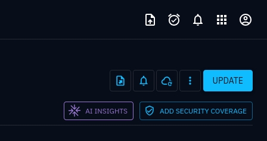
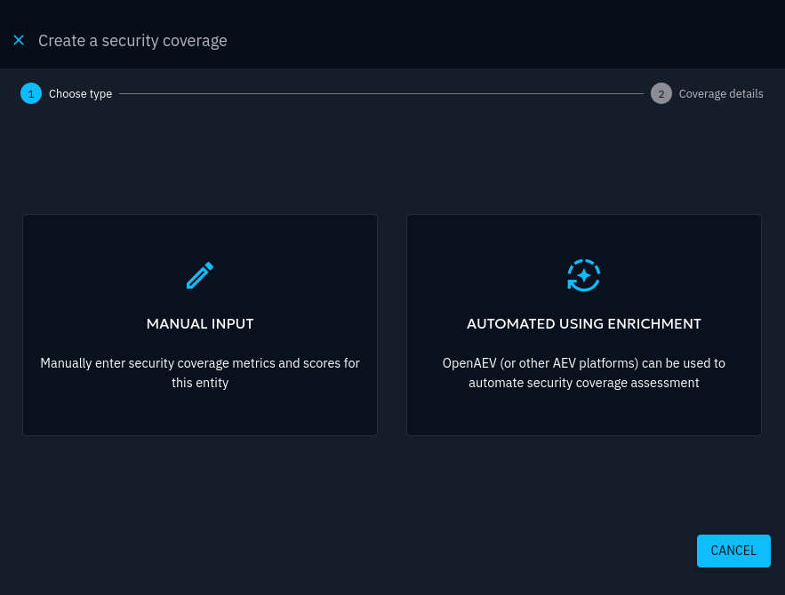
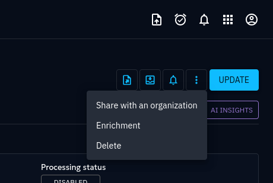
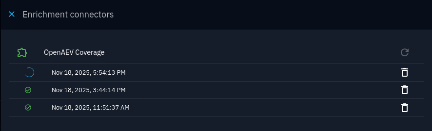
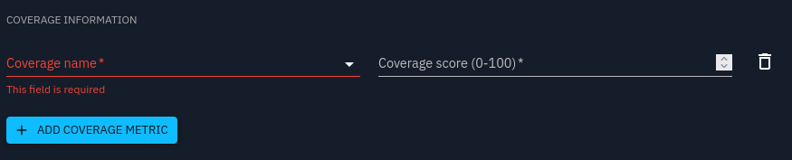
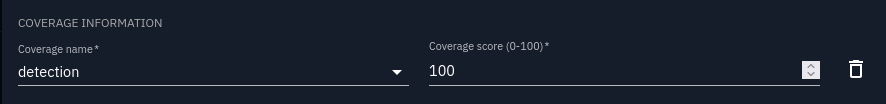
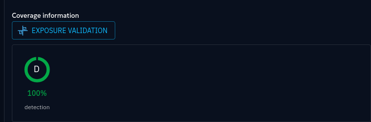

# Security Coverage

When you review a report, details of a threat actor, or involved in an incident response, one of the key tasks is to evaluate whether
your own computer systems are well protected against the threats described therein. OpenCTI's Security Coverage capability allows you to model this evaluation, either automatically with OpenAEV or manually representing tests ran elsewhere. This provides you with the details of potential exposure and allows you to validate and identify priority tasks to improve your security posture.

In OpenCTI Security Coverages can be created in relation to the following entities:

* Campaign
* Grouping
* Incident
* Incident Response
* Intrusion Set
* Report

Security Coverages can be found under **Analyses > Security Coverages**, and are linked to the covered entity.

## Creating a Security Coverage

You can create a Security Coverage from scratch under **Analyses > Security Coverages** (in which case the form
prompts you to select the entity to be covered), or directly from the upper right corner of the overview page for any of the compatible entities listed above.

Either option takes you through the steps you need to create the Security Coverage. You can carry out the security coverage
in one of two ways: automated or manual.

An automated Security Coverage uses [OpenAEV](https://docs.openaev.io/), another component of the XTM Suite.
OpenAEV automatically performs the relevant tests (unless additional configuration is required) and sends the results back to OpenCTI with no
human intervention.

A manual security coverage allows you to conduct the analysis yourself and directly enter the results directly into OpenCTI.

## Automate a Security Coverage via XTM Suite (OpenAEV)

With the XTM Suite, OpenCTI can request OpenAEV to run an automated evaluation of your computer systems' exposure to techniques, indicators and vulnerabilities linked to a compatible entity.

!!! note "Report entities eligible for automated coverage"

    Currently, the automated Security Coverage feature with OpenAEV can assess coverage for
    the following entities, when atleast one of the following entities are present:
    
    * Attack patterns
    * Vulnerability
    * Domains
    * Artifacts

### Setting up OpenAEV for automated security coverage
To activate this feature, make sure the following requirements are met:

* An active OpenAEV instance or tenant, [here is the dedicated documentation](https://docs.openaev.io/)
* That same instance must be configured as an Enrichment Connector by a system administrator ([see the specific documentation](https://docs.openaev.io/latest/usage/xtm-suite-connector/)). An OpenCTI Administrator will need to generate an API token for the connector to use.    
 
!!! note "Compatibility requirement"

    The Security Coverage **Result** tab requires OpenAEV version **2.3.1** or later to display automated coverage results correctly.

When the above steps have been completed, you should see OpenAEV being listed as an Enrichment Connector in **Data > Ingestion** :

If you need to setup multiple OpenAEV instances or tenants to a single OpenCTI instance then you need to set up an account and generate an API for each instance or tenant to use.   

### Using the automated Security Coverage

To use an automated Security Coverage, click the Add Security Coverage button mentioned above for your chosen entity.

In the first step of the creation form, select the **Automated using Enrichment** option. This option is only available when the OpenAEV Coverage connector is configured correctly, if this is not available you will need to follow the setup steps above. The second step of the form, will allow you to provide the following information: 

* Name - this will be automatically generated from the name of the covered entity
* Description - user updated description of the security coverage
* Confidence - the confidence level you want to use for the automated tests
* Coverage recurrence - the frequency of the simulations created by the scenario will run at (hours / days / weeks / months)
* Duration - how long the scenario runs for
* Type affinity - Set to Endpoint currently
* Platform affinity - Choose which platforms the scenario should run against
* Labels / Markings - set as required

After you submit the form, OpenCTI creates the security coverage and waits for OpenAEV to run tests and return the results of any completed tests.

### Receive automated results from OpenAEV

OpenAEV is responsible for running the assessment. Using its own internal library of automated tests,
OpenAEV selects tests for each of the eligible entities in the entity covered by the Security Coverage
and runs a periodic simulation to assess the coverage. See the [OpenAEV documentation](https://docs.openaev.io/) for
details on how this process works.

When a simulation is completed, the coverage results are sent back to OpenCTI as a Security Coverage Result bundle and displayed automatically in the Security Coverage Overview page and Result tab. The results displayed will be the results of the last simulation ran in OpenAEV. To support results from multiple instances, the results are stored in a Security Coverage Result entity.  

### Overview tab

The **Overview tab** provides summary information of the results of any tests ran by OpenAEV or added manually. This shows the following Security Coverage specific widgets: 
* Coverage Information: Display of the average coverage score from any security coverage result(s)
* Tested Entities: Total count of entities tested in Security Coverage Result(s)
* Entity Details: Display of the covered entities
* Vulnerabilities: Display of average coverage score per vulnerability
* Attack Patterns Coverage: Display of the average coverage score per attack patterns, available in the Mitre Matrix view and Kill Chain list view

### Result tab

The **Result tab** provides a table of the test results for all the valid entities related to the Security Coverage. Each tested entity and its coverage score is displayed for each security coverage result. In the circumstances that multiple OpenAEV instances are connected to OpenCTI then multiple security Coverage Results will be shown for each entity.   

Each detection, prevention or vulnerability score represents the number of assets that were tested and returned results. For full results detail you will need to navigate to OpenAEV using the **Open OpenAEV** button in the top right.
For each entity covered by the secured coverage, the table displays:

| Column       | Description                                                                                                        |
|--------------|--------------------------------------------------------------------------------------------------------------------|
| **Tested Entity Type**     | The type of the entity tested, e.g. Attack Pattern, Vulnerability etc.                                                                                                   |
| **Tested Entity Name**     | The main entity name. For attack patterns, the MITRE ATT&CK ID is displayed when available.                       |
| **Tested Entity Labels**   | Displays labels applied to the tested entity                                                                              |
| **Tested Entity Marking** | Displays data marking classifications applied to the entity                                                    | 
| **Coverage Score** | The Prevention and Detection coverage value returned for the tested entity. " - " if no results are currently available. This information is stored on a 'has covered' relationship between the security coverage result and the tested entity|
| **Coverage Last modified date** | The Prevention and Detection coverage value returned for the tested entity. " - " if no results are currently available. This information is stored on a 'has covered' relationship between the security coverage result and the tested entity|
| **Security Coverage Result Name** | The name of the security coverage result name, this will be represented in the format OpenAEV name - result of - security coverage name |

#### Understanding Placeholder Injects

A dash (—) in the coverage field indicates OpenAEV generated a Placeholder Inject rather than an executable test. Placeholder Injects are created when, Either:

* The Attack Pattern is not recognized — for example if you are using a custom technique, or an ATT&CK ID/name that doesn't exist in OpenAEV's library

* Or no payload is available for that technique on the platform/architecture of the assets that are set to be tested. In OpenAEV the opencti tag sets the Default Asset Rules for the injects created in a scenario), see below for further details. 
  
#### Improving coverage results in OpenAEV
OpenAEV documentation provides complete details of how to manage injects, however here are some steps that can help resolve missing or partial coverage.

**1. Verify your Default Asset Rules**

In OpenAEV, go to **Settings → Customization → Default Asset Rules** and confirm that the `opencti` tag is correctly mapped to the relevant Asset Groups. These groups define which platforms and architectures are used to match payloads — if misconfigured, no concrete inject can be generated.
> The `opencti` tag is automatically applied to all scenarios generated from OpenCTI. This default rule cannot be removed.

**2. Check payload availability and enable collectors**

In OpenAEV, go to **Payloads** and search by the MITRE ATT&CK ID of the uncovered technique. If no payload exists for the required platform or architecture, expand your coverage by enabling one or both of the following collectors under **Integrations → Collectors**:
- **OpenAEV curated payloads** — Filigran-maintained, verified payloads mapped to MITRE ATT&CK.
- **Atomic Red Team** — A broad community-maintained library of atomic tests.

**3. Create a custom payload**
If no existing payload covers the technique you need, you can create one directly in OpenAEV:

1. Go to **Payloads** and click the **+** button.
2. Fill in the general information: name, description, and **Attack Pattern mapping** (MITRE ATT&CK ID).
3. In the **Commands** tab, select the payload type (Command Line, Executable, File Drop, DNS Resolution), specify the **target platform**, and provide the command details.
4. Optionally, add **Output Parsers** to extract findings from the execution output.

Once saved, the payload becomes immediately available for future scenario generation.

**4. Retrigger the enrichment**
Once any of the above steps are completed, return to the Security Coverage page in OpenCTI and use the **Enrichment menu** to manually retrigger the assessment. OpenAEV will rebuild the scenario using the updated payload and asset configuration.

### Checking the automated Security Coverage enrichment state

From the Security Coverage page, you can check the status of the Enrichment Connector's work in the Enrichment menu in the upper-right corner:

This opens a panel that lists all attempts to task OpenAEV for the automated coverage assessment.
To retry the action manually, click the circular arrow icon (top right in the panel). You may need to retry if
the previous attempt failed or it is necessary to request an updated assessment (e.g. because the contents of the
linked report has changed):

## Manual Security Coverage

If OpenAEV is not available for the automated Security Coverage, you can create a Security Coverage and provide the
assessed results manually.

### Creating the manual Security Coverage

In the Security Coverage creation form, choose **Manual Input** to create a manually driven Security Coverage.

A manual Security Coverage requires specifying which metrics for detection, prevention and vulnerabilities are going to be manually assessed.

The coverage assessment of these metrics is provided in the same form. Assigning a coverage score to a metric represents
the actual assessment as observed by the user. It may be updated after the fact using the Update button in the top-right
corner.

For example, assigning a coverage score of 100 to the _detection_ metric is shown in the Security Coverage page, in the following screenshot:

