# Source intelligence

Source intelligence measures the operational value of everything that feeds your platform: connectors, ingestion feeds, authors and analysts. It answers questions such as "which feeds bring knowledge nobody else brings?", "which ones are mostly noise?", "what does each actionable object cost us?" and "which priority intelligence requirements are not covered by any source?". It then turns these answers into recommendations to tune collection.

You can find it in **Integrations > Sources**. Viewing sources requires the capability to access connectors or ingestion. Editing them (cost, scoring, rejecting recommendations) requires the capability to manage connectors or ingestion. Applying or reverting a recommendation requires the capability of the change it makes: managing accesses for a confidence level or the quarantine of a connector, customization for a decay rule or an exclusion list, managing ingestion for a feed, managing connectors for a connector.

!!! note "Enterprise Edition"

    Scorecards, the overlap matrix, the cost per actionable object and the dashboard perspective are available in every edition. The PIR relevance metric, collection gaps, recommendations and the autonomy policy are part of the [Enterprise Edition](../administration/enterprise.md).

## Sources

A source is created automatically by the source intelligence manager for:

- each **connector** registered on the platform,
- each **ingestion feed** (TAXII, RSS, CSV, JSON), mapped to the technical connector that runs it,
- each **author** (`created_by`) with a significant volume of knowledge over the last 90 days,
- each **analyst** writing knowledge directly, outside of any connector or feed.

The volume of an author or an analyst counts the knowledge it wrote over these 90 days.

The built-in platform connectors (background tasks, playbooks, synchronization, draft validation and file mapping) are not sources: they run work on behalf of analysts, and what they write is attributed to its authors and analysts. The minimum volume and the maximum number of author and analyst sources are configurable. When a connector or a feed is deleted, its source and its scorecards are removed; a quarantined one is released first, so the service account of the connector gets back the draft context it had before the quarantine (the quarantine draft is kept for review). Authors and analysts are the top contributors over the last 90 days: one that is no longer among them is removed with its scorecards at the next computation, unless you curated it (a cost, a description, tags, an owner, disabled or quarantined) or a change a recommendation applied to it can still be reverted; such a source stays and keeps being scored. The number of scored authors and analysts therefore never exceeds the configured maximums plus the sources you curated. What you set on a source (cost, description, tags, owner, enabled) is kept across computations. When two users are merged, their two analyst sources become one: the kept source takes over the recommendations of the other (a change applied to it can still be reverted), what was set on it where the kept source has nothing of its own, and its history for the days the kept source has none.

Connector health (status, queue, errors) is not duplicated here: the scorecard page links to the connector or feed in the integrations monitoring screens.

### How facts are attributed to sources

Scorecards attribute each object to its creators (the connectors, feeds and analysts whose users wrote it) and to its author: an object written by three connectors counts for the three of them. The first creator is dated at the creation of the object; the platform does not record when the other creators first wrote it, so their lead time is not measured, which the status header recalls (**Attribution from creators and authors, lead time approximated**). A user shared by several connectors or feeds does not tell which of them wrote an object: it credits none of them rather than all of them.

## Scorecards

Every source has a scorecard over three rolling windows: 7, 30 and 90 days. The 30-day window is the reference used by the leaderboard. A daily snapshot is kept to draw trends, and the history is backfilled over the first days after the feature is enabled. A backfilled day only counts what was known that day: the sightings, relationships and containers created by its end, and the revocations, false positive labels and decay exclusions of the objects not modified since, and the PIR scores that last changed before it (the platform keeps only the current value of these, so a later revocation never lowers the accuracy of an earlier day, nor a later PIR match raises its relevance). Snapshots older than the snapshot retention of the settings are removed by the daily computation, at most 100,000 per day, so a shortened retention takes effect over the following days.

| Metric | Meaning |
|---|---|
| Volume | Objects and relationships asserted by the source in the window, with the split per kind and the new objects. |
| Unique contribution | Share of its objects that no other source asserted. |
| Corroboration rate | Share of its objects also asserted by other sources (2 other sources by default). |
| Lead time | For the objects shared with other sources, how many hours earlier (positive) or later (negative) the source reported them, and the share of objects it reported first. |
| Accuracy | Share of its evaluated objects that were not revoked, not negatively sighted, not labelled as false positives and not excluded by a decay exclusion rule. |
| Relevance (EE) | Share of its objects matching at least one PIR. Without an Enterprise Edition license, the relevance computed earlier is not shown, and sources and widgets can be neither filtered nor sorted on it. |
| Impact | Detection impact on a 0-100 logarithmic scale. Incidents weigh 3, security platform sightings weigh 2, other sightings weigh 1. |
| Noise | Share of its objects that are never referenced, never sighted or expired. |
| Freshness | Hours since its last assertion, and median ingestion latency. |
| Cost per actionable object | When a cost is set, the cost over the window divided by the number of actionable objects (objects that are neither noise nor revoked, negatively sighted or flagged as false positives). |

The **operational value score** (0-100) is the weighted average of unique contribution, first-reporter share, accuracy, relevance, impact and the inverse of noise. Default weights are 25, 15, 20, 15, 15 and 10 percent. Metrics that cannot be computed for a source (for example lead time when it shares nothing) are left out and the remaining weights are rescaled. The weights are configurable.

Indicator scores and their decay are not changed by source intelligence: scorecards only read the knowledge.

### Status header and counters

The top of the Sources area tells you whether the scorecards are current:

| State | Meaning | Action offered |
|---|---|---|
| Up to date | The last computation succeeded; the header says when. | **Recompute** |
| Computing | A computation is running. | None, the state updates when it ends. |
| Recompute requested | A computation starts in the next minutes. | None |
| Failed | The last computation failed; the reason is shown below the header. | **Retry the computation** |
| Not computed yet | No computation has run on this platform; the first one runs at the daily recompute hour. | **Compute now** |
| Manager stopped | The computation is turned off in the source intelligence settings. | **Open settings** |
| Manager disabled | The source intelligence manager is disabled in the platform configuration (`source_intelligence_manager:enabled` set to `false` on every platform node), so nothing is computed whatever the settings say; the computation switch of the settings is greyed out and **Recompute** is not offered. | **Read the documentation** opens the [manager configuration](../deployment/advanced/managers.md#source-intelligence-manager); an administrator of the platform deployment enables the manager. |

When the scan stops at the maximum number of objects set in the settings, a warning says how many objects the scorecards cover, with **Raise the limit**. The limit is exact: the scorecards never cover more objects than it allows. In Enterprise Edition, such a computation proposes no new recommendation and applies none autonomously: tuning a source from part of the knowledge could quarantine or retire it on incomplete data, so recommendations wait for a computation that covers every object (collection gaps are still computed). While the history is backfilled, a progress bar shows how many days are computed ("Backfilling history - 6 of 14 days"); a larger backfill range set later computes the missing older days only, and a range of 0 days stops a backfill in progress. A historical day whose scan also stops at the maximum number of objects is not stored, so the trend charts never draw a partial day as a complete one: the backfill pauses on that day, a warning names it, and the backfill resumes once the limit is raised. Below the header, counters show the number of sources, quarantined sources, recommendations to review and collection gaps (the last two in Enterprise Edition). Each counter opens the list it counts.

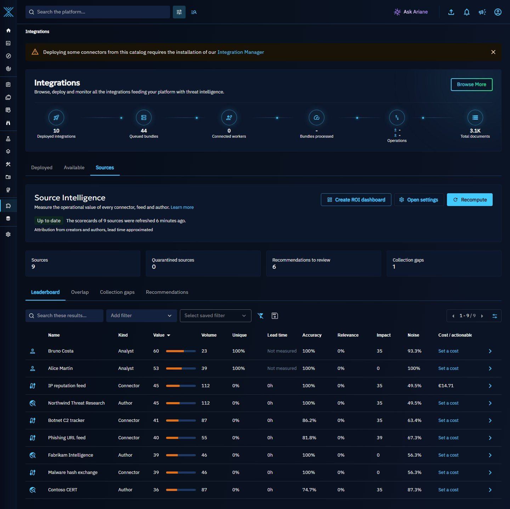

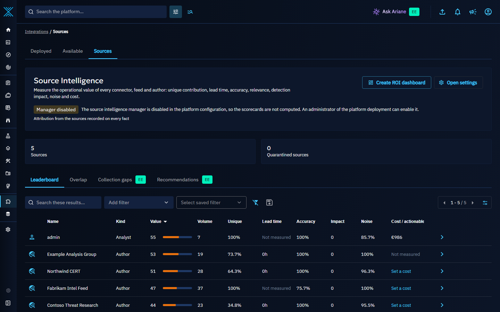

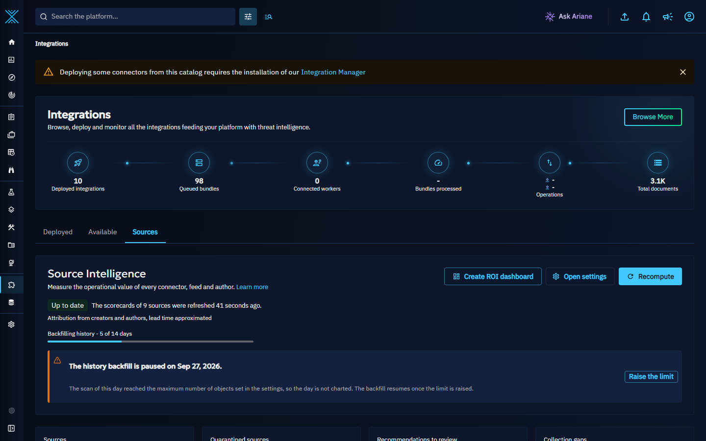

Before the first computation, or while no source has written knowledge yet, the area explains which sources it will score and when the scorecards appear:

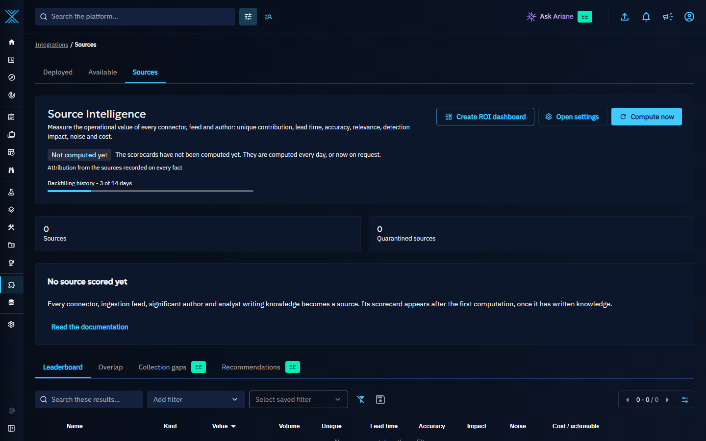

A value that could not be measured (for example lead time for a source that shares no object with another source) reads **Not measured**; hover it to see why.

### Leaderboard and scorecard page

The **Leaderboard** tab lists the sources with their value score and their main metrics. You can sort, filter and search the list, and show the corroboration and last seen columns from the column settings. Click a source to open its scorecard page. Its header answers first: the value score, how it moved over the trend window, one sentence explaining it (how often other sources confirm its objects and how often it reports them first), and the next action, **Review the recommendations** when some are pending, otherwise **Set a cost** or **Edit the cost**. Below the header:

- the value score with its components,
- trends of any metric over the selected window,
- the sources it overlaps with the most,
- its cost and the cost per actionable object,
- its open recommendations (EE),
- a switch to exclude the source from the computation.

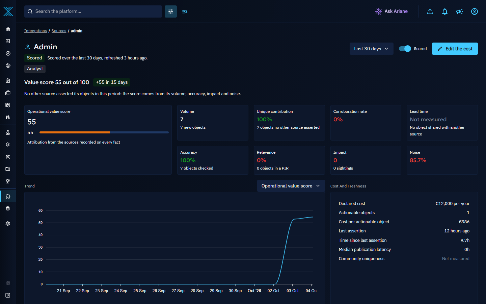

An author you cannot access (because of its markings or organization restrictions) is left out of the leaderboard and of the Sources and Quarantined sources counters, the overlap heatmap, the coverage of the collection gaps and the Sources widgets, and the overlap of the other sources does not name it, so no figure or ranking tells what it wrote: only the number of sources in the status line counts it. Opened from a link, its page reads **Restricted**, without its metrics, cost, tags or owner.

### Cost

Set a cost on a source (amount, currency, per month, quarter or year) from its scorecard page, or with **Set a cost** in the cost column of the leaderboard, which opens the same editor. The currency is picked from a list of ISO 4217 currencies (EUR when you do not change it); a cost saved earlier in a currency outside that list stays selectable. Each field of the editor says what it does, gives an example and what happens when it is left empty, and **Learn more** opens this section. Costs are shown in the currency format of your language, for example "€12,000 per year". The cost is normalized to each window to compute the cost per actionable object. A cost set while the daily computation runs is never lost: the computation writes each source with the cost it has when its scorecards are saved.

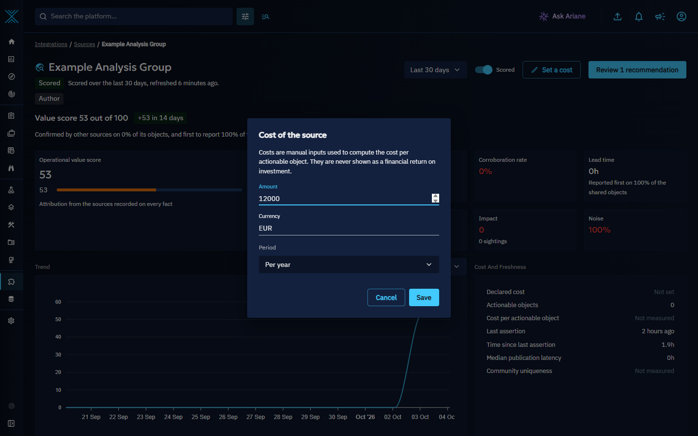

Costs are never converted between currencies. A widget showing a cost metric (number, list, bubble or trend) only aggregates the sources using the currency declared by most of the selected sources; filter the widget on a set of sources to look at another currency.

### Overlap

The **Overlap** tab shows a heatmap of the sources sharing the most knowledge over the selected window. Each cell gives the number of shared objects and the share of the row source's knowledge that the column source also asserted. A source whose knowledge is almost entirely asserted by another one is a candidate for retirement. Each scorecard keeps the sources it overlaps with the most, up to the number of overlapping sources set in the settings: a pair of sources missing from what both scorecards keep is not measured, and its cell stays empty (its tooltip reads "Not measured") rather than showing 0 %. Raising that number in the settings measures it from the next computation.

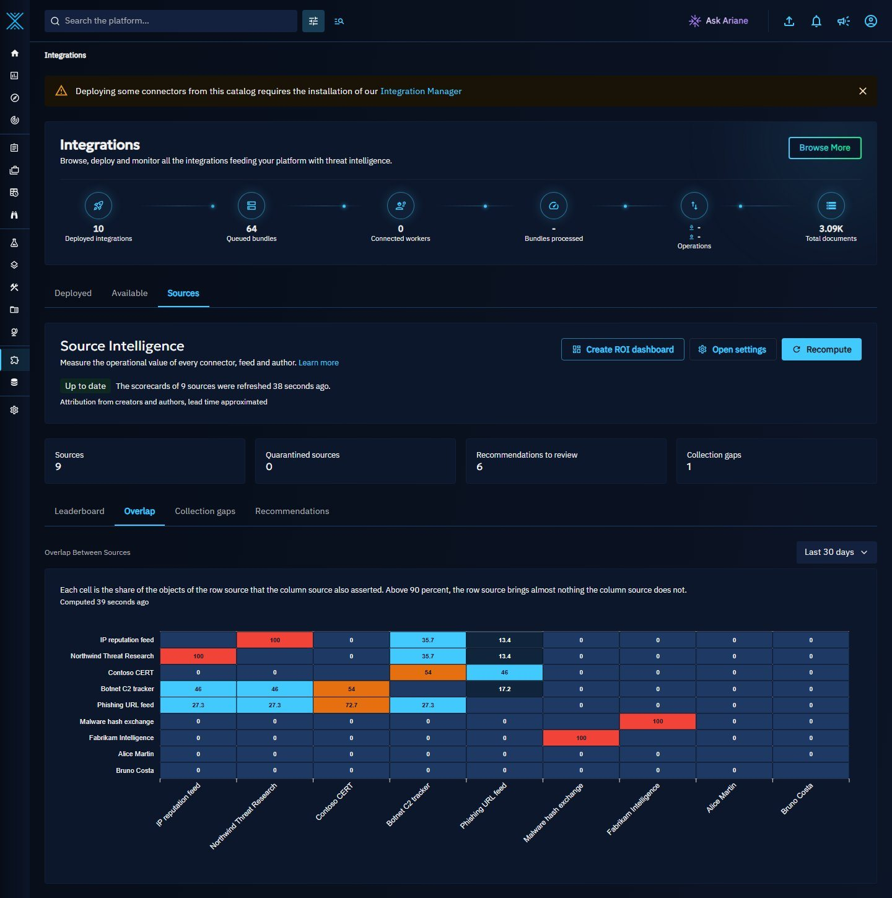

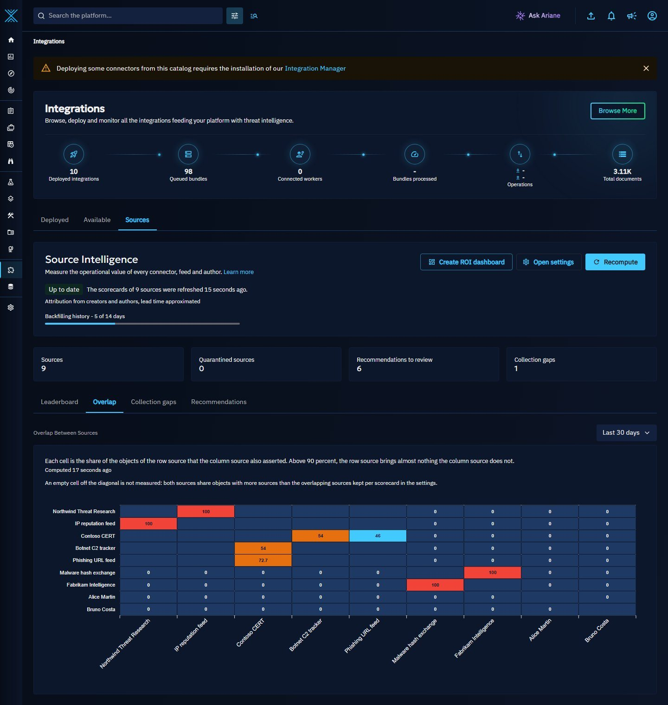

## Collection gaps (EE)

The **Collection gaps** tab checks every criterion of every [PIR](pir.md) against the knowledge collected recently. For each criterion, the coverage score (0-100) combines:

- volume (40%): relationships matching the criterion over the last 30 days, against a target of 50,
- diversity (40%): distinct sources contributing to it, against a target of 3,
- freshness (20%): share of the 90-day matches that are recent.

A criterion below the coverage threshold (50 by default) is a gap. For each gap, the platform shows the sources covering it and recommends connectors from the XTM Hub catalog whose declared coverage (object types, sectors, regions) matches the criterion. The platform must be registered on the XTM Hub for catalog recommendations; when it is not, or when the XTM Hub cannot be reached, only the connectors of the local catalog are recommended and the gap says so. The XTM Hub requests of one computation share a one-minute budget: when the XTM Hub answers too slowly, the remaining gaps of that computation use the local catalog as well, so that a slow XTM Hub never delays the scorecards. When more integrations match than the XTM Hub ranks, the gap shows that the ranking is partial: its first matches are combined with the local catalog. A recommended connector available in the local catalog as a managed connector can be deployed in one click through XTM Composer; the deployment runs as an "Add a connector" recommendation, so it is recorded in the recommendations inbox with its audit trail and can be reverted. A recommendation coming from the XTM Hub deploys the latest catalog version compatible with your platform.

**Deploy** first opens a dialog that says what the connector needs before anything is deployed:

- the settings its catalog contract requires without a default value (for example the address and API key of the platform it reads), each with the description of the contract; secrets are masked as you type. The values are sent to XTM Composer for this deployment only and are not kept with the recommendation;
- the service account the connector runs as, `[C] <connector name>`, created with a confidence level of 50;
- where to change both afterwards: the connector settings from its page in **Integrations > Deployed**, its account in **Settings > Security > Users**.

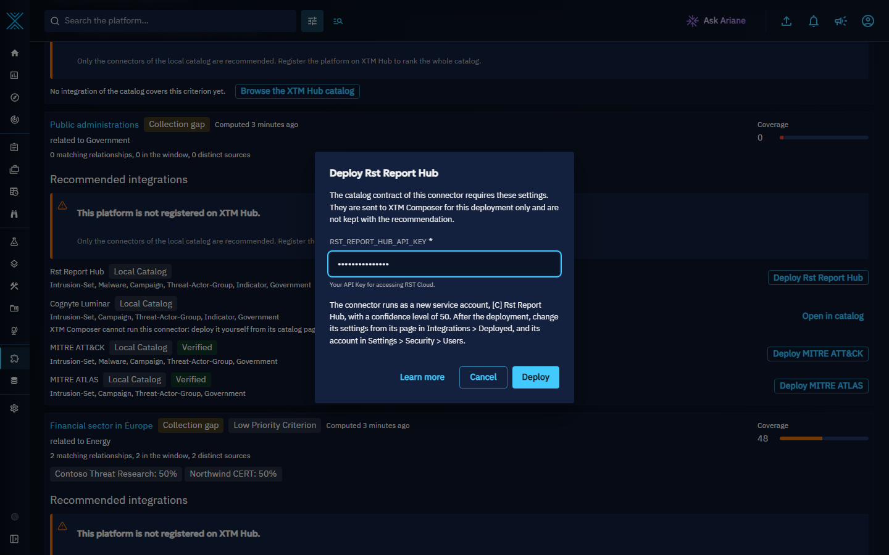

When one-click deployment is not offered for a recommended connector, the reason is shown under it, with what to do instead:

| Reason | What to do |
|---|---|
| The connector is not in the local catalog of the platform yet | Deploy it yourself from its XTM Hub page (**Open in XTM Hub**) |
| XTM Composer cannot run this connector | Deploy it yourself from its catalog page (**Open in catalog**) |
| You lack the capability to manage connectors | Ask an administrator, or open it in the catalog |
| No connector manager is registered | Register XTM Composer to deploy connectors in one click, or deploy this one from its catalog page |
| The connector needs a setting the dialog cannot collect (a list or a structured value) | Deploy it from its catalog page, which sets every kind of setting |

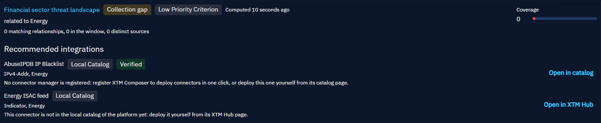

Other recommended connectors open in the catalog.

When the criteria of a PIR have different weights, each gap shows its priority (high, medium or low) relative to the other criteria of the PIR; hover it to see the weight. When no integration of the catalog covers a criterion yet, **Browse the XTM Hub catalog** opens the XTM Hub integrations filtered on the object types, sectors and regions of the criterion (**Browse the catalog** when the platform has no XTM Hub address).

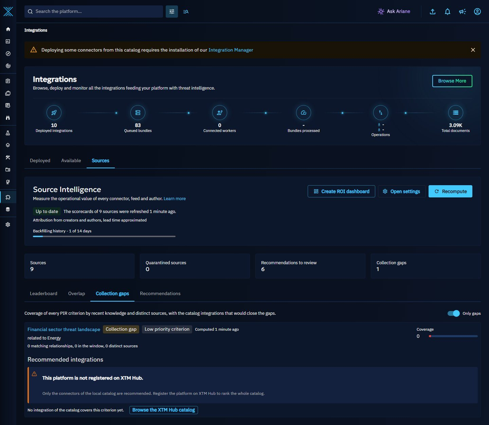

Without an Enterprise Edition license, the Collection gaps and Recommendations tabs explain how to activate it:

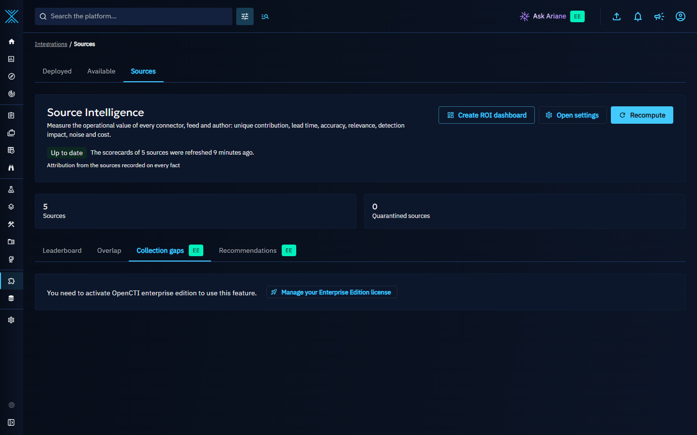

## Recommendations (EE)

The manager turns scorecards and gaps into recommendations. They are listed in the **Recommendations** tab and on the scorecard page of each source.

| Recommendation | Proposed when | Applying it |
|---|---|---|
| Lower confidence | Accuracy is below 70% | Lowers the max confidence of the source user by one step (15 by default). |
| Raise confidence | Accuracy is above 95% and at least 50% of its objects are corroborated | Raises the max confidence of the source user by one step. |
| Quarantine | Accuracy is below 40% | Routes the new knowledge of the source into a draft for review. |
| Add a decay rule | More than 60% of its objects are noise and it provides indicators | Creates a shorter decay rule (30 days by default) for its indicators. |
| Add a deny list | At least 10 of its objects are labelled as false positives | Creates an exclusion list with these values. |
| Change schedule | No new assertion for 72 hours although the source usually produces data | Runs the feed or managed connector more often. |
| Retire | At least 90% of its knowledge is also asserted by another source, it brings less than 5% unique objects and its lead time shows the other source reports them at least as early (a source whose lead time is not measured is never retired) | Stops the feed or managed connector, or disables the source. |
| Add a connector | A collection gap is detected | Deploys the recommended catalog connector, after the deployment dialog described in [Collection gaps](#collection-gaps-ee) collected the settings it needs. |

Sources below a minimum volume (50 objects) do not get recommendations. All thresholds are configurable.

Each recommendation is an approval: it shows its rationale and a preview of the change, setting by setting, with the current value ("Not set" when there is none) and the value after applying. The primary button names the change, for example **Apply - lower the confidence to 40** or **Deploy MISP**.

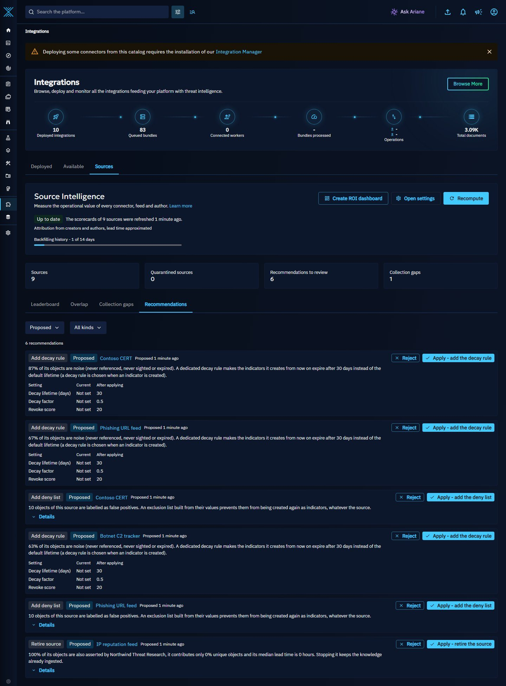

For each recommendation you can:

- **Apply** it. Applying requires the capability matching the action (for example, managing accesses to change a user confidence level). When it cannot be applied, the recommendation says that nothing was changed and offers **Retry**, and **Open the connector** when the connector refused the change; **Show details** gives the cause.
- **Reject** it, with an optional reason. A rejected recommendation is not proposed again before a cooldown (30 days by default).
- **Revert** it once applied. Reverting restores the previous state (confidence level, schedule, connector status, whether a feed was running) and removes what was created (decay rule, exclusion list). A quarantine draft is kept for review. A connector the recommendation deployed is stopped and keeps its data; a connector deployed beforehand and linked to the recommendation is left running.

An applied recommendation shows who applied it and when, with **Revert**:

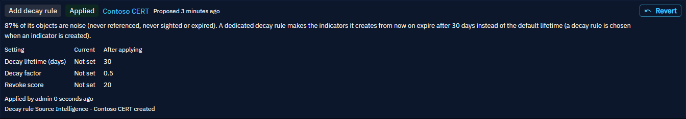

**Revert** asks for a confirmation that says what the revert restores:

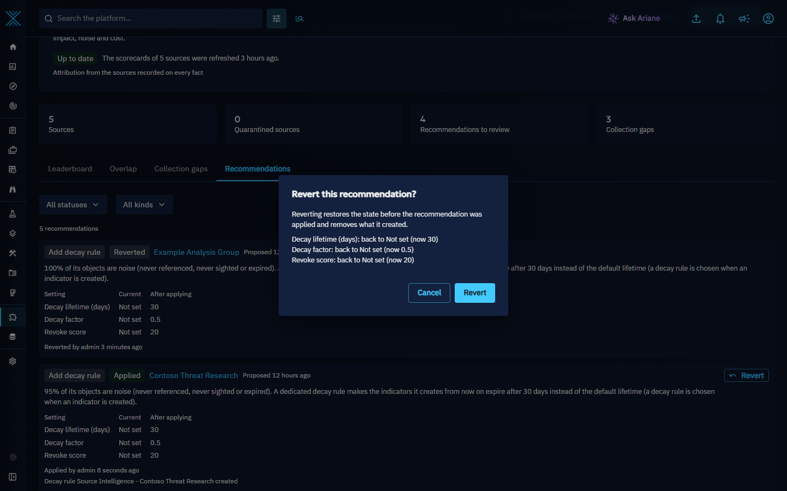

Once reverted, the recommendation keeps its history and is not proposed again automatically:

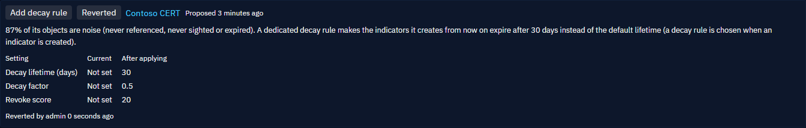

While its change runs, a recommendation shows **Applying**. A change refused before anything was written (for example, a missing setting, or a connector deployment refused because the connector is not compatible with the platform version, no connector manager is configured or a connector with the same name exists) makes it fail with **Retry**. If the change failed after something may have been written, or its outcome cannot be recorded, it stays **Applying**, with the cause behind **Show details**: it is never applied a second time and cannot be rejected, since its change may be in place. Check the target of the recommendation (user, connector, feed or settings) in that case.

A revert works the same way: while it runs, the recommendation shows **Reverting**. If the revert fails or its outcome cannot be recorded, the recommendation stays **Reverting**, with the cause behind **Show details** and **Retry**: every step of a revert can run again safely (a decay rule or an exclusion list already removed is not removed twice), and the recommendation is neither proposed again nor applied meanwhile.

While a source is quarantined, validating or deleting its quarantine draft first opens a new quarantine draft and routes the source to it, so nothing the source sends reaches the live knowledge or the draft being closed. Feed data already waiting to be processed for the closed draft goes to the new quarantine draft as well. Data the platform is already writing into the draft when you validate or delete it is written first, so the validation includes it; if it is still being written after 30 seconds, the validation or deletion is refused and you can retry a moment later. Once the quarantine is lifted, its last draft is kept for review and still receives that data; if you then validate or delete that draft, data still waiting for it is refused, with the reason recorded on the work of the connector or feed, and never reaches the live knowledge.

Recommendations quote the names of the sources they are about. For an author you cannot access (because of its markings or organization restrictions), the name shows as **Restricted** in every text of the recommendation, including recommendations proposed before the author was renamed or stopped being tracked.

A recommendation that no longer matches the situation is withdrawn automatically. Every application, rejection and revert is recorded in the [activity logs](../administration/audit/configuration.md).

### Autonomy policy

In the settings, an administrator can allow some recommendation kinds to be applied automatically, with a maximum number of automatic actions per run. Since the policy then applies them without asking anyone, allowing a kind requires the capabilities of its manual application: managing accesses for confidence changes, managing ingestions and connectors for schedule changes and retirements, managing accesses and ingestions for quarantines, managing connectors for new connectors, and the customization capability for decay rules and deny lists. After each daily computation, the proposed recommendations of the allowed kinds are applied oldest first, up to that maximum across all kinds; the ones left over are applied by the next runs. Failed, rejected and reverted recommendations are never applied automatically, and neither is a change someone reverted when the same recommendation is proposed again: it waits for a person. A connector whose catalog contract requires settings without a default value is never deployed automatically either: it waits for a person to provide them in the deployment dialog. Automatically applied recommendations are flagged as such and can be reverted like the others.

## Dashboards

Dashboard widgets can use the **Sources** perspective to display any scorecard metric: number, list, distribution, horizontal bars, donut, time series and bubble chart (for example volume against value score). The dashboard time range selects the 7, 30 or 90-day window.

Each parameter of a Sources widget (metric, axes, bubble size, aggregation, sort order) says what it does, gives an example and what the widget uses when it is left empty, and **Learn more** opens this section.

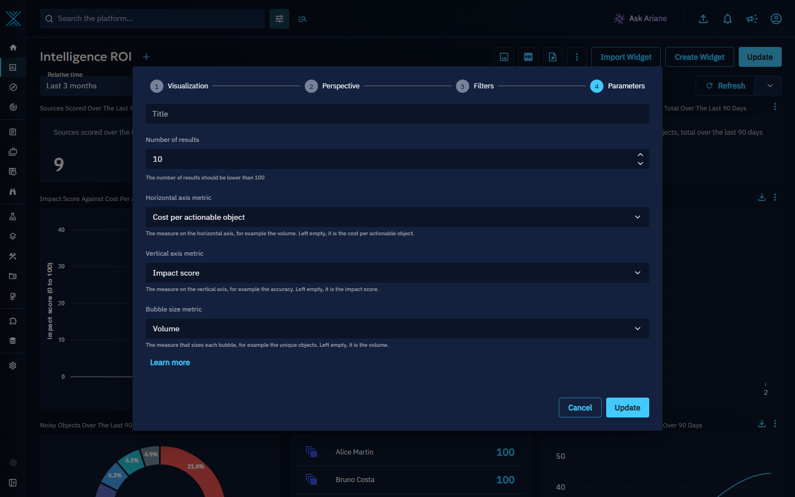

Widget titles name the metric, its aggregation and the scoring window (for example "Operational value score (0 to 100), average over the last 30 days"), axes carry their unit, and a widget without data says that no source was scored in the period.

A time series draws the daily snapshots of the days in the dashboard time range, including the days the history backfill computed later. It keeps the history of a source that is no longer scored (disabled): its past snapshots stay on the chart, and filtering the widget on disabled sources shows their history.

Click **Create ROI dashboard** in the Sources header to create the ready-made "Intelligence ROI" dashboard with the main metrics. Sources widgets are not available in public dashboards.

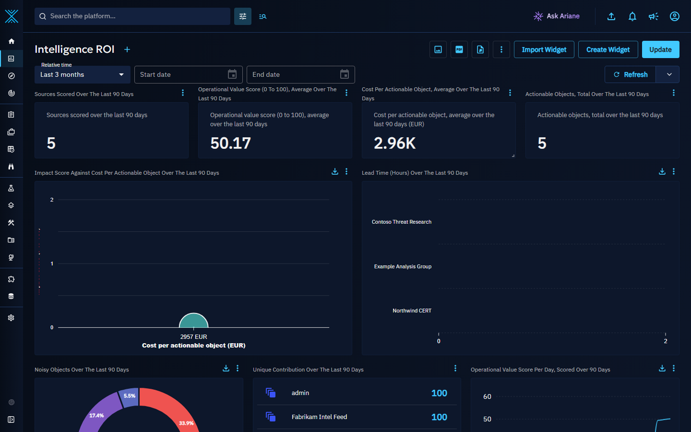

## Settings

The settings are in **Settings > Customization > Source intelligence** (also reachable from the **Open settings** button of the Sources area) and require the customization capability. They give access to:

- the computation: on or off, daily recompute hour (UTC), history backfill, snapshot retention, maximum number of scanned objects, false positive labels (picked from the labels of the platform, up to 50, matched whatever their case), corroboration and overlap parameters, author and analyst discovery,
- the value score weights,
- the recommendation thresholds and tuning steps,
- the autonomy policy and the collection gap parameters (EE).

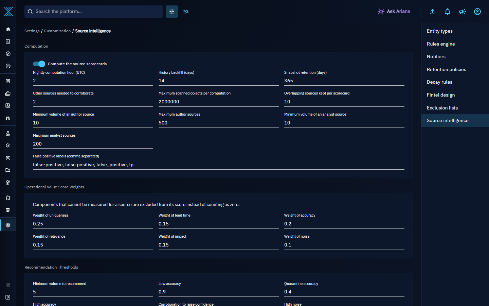

When the manager is disabled in the platform configuration, the computation switch is greyed out and says why: no setting can start a computation until the deployment enables the manager.

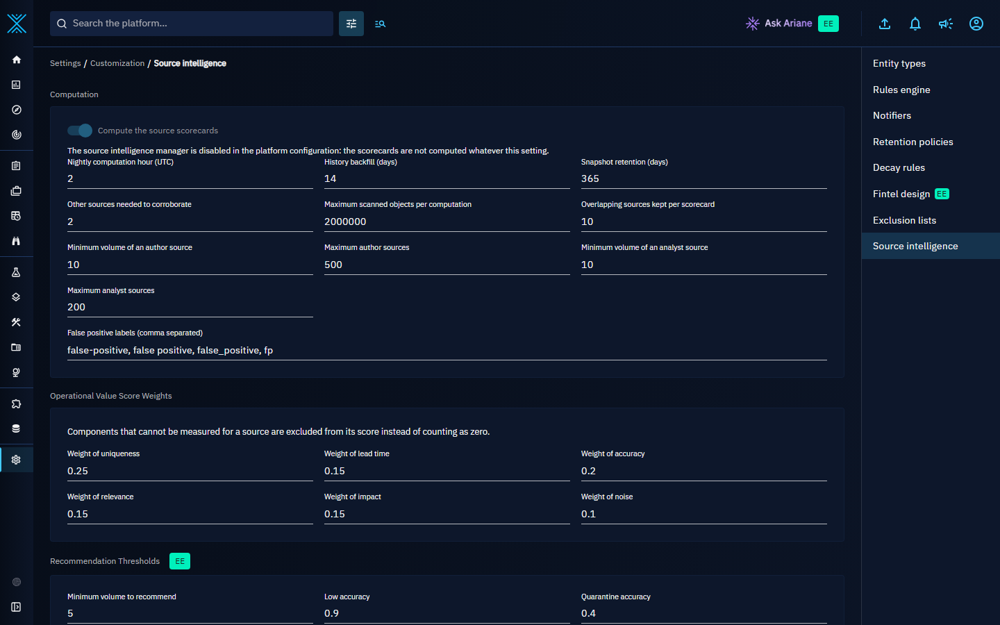

Scorecards are computed once a day. Between two computations, the counters follow the knowledge as it changes: a created object is added to its sources, and a deleted object is removed from the periods in which it was counted. Sightings, revocations and PIR links are credited to each source in the periods where it counts the object, and withdrawn when the sighting or the PIR link is removed. Ratios, scores and medians, and the counts that depend on the whole knowledge (noise, unique and corroborated objects, actionable objects, accuracy), are computed by the daily computation. The scorecard page says when its value score and ratios were computed. Use **Recompute** in the Sources header to request a computation in the next minutes after a change; it is offered unless a computation is already running or requested.
