# Threat Pulse

Threat Pulse is the collective intelligence network of the OpenCTI community, run through [XTM Hub](../administration/hub.md). It tells analysts how widespread an indicator, an attack pattern, a vulnerability, an intrusion set, a malware or a tool is across the community, since when the network sees it and whether it is rising, and it tells managers what trends in their sector and how their platform compares with the sector median.

Platforms that contribute send keyed hashes and activity counts of the objects they observe, never values. XTM Hub publishes a signal only when enough distinct platforms observed the same object (k-anonymity, 5 platforms by default).

Threat Pulse is available in the Community Edition. The Sector benchmark and the Sector Pulse Briefing require the Enterprise Edition. No AI is involved, except in the optional briefing.

## The three modes

An administrator chooses the mode of the platform in "Settings > Filigran Experience". Every change is recorded in the audit logs.

| Mode | What the platform shows | What leaves the platform |
|:-----|:------------------------|:-------------------------|
| **Preview** (default) | The coarse community signal of the local objects that are among the most prevalent of the community: prevalence and trend only, labelled "Preview". The first three ranks of "Trending in your sector". | **Nothing about your objects.** The platform downloads the daily digest and matches it locally; the download request names only the day and, once chosen with a consent, the coarse sector and region of the digest it asks for. |
| **Contribute** (full experience) | Everything: prevalence, range of contributing platforms, network first and last seen, 12-week trend, sector trend, community uniqueness, the full "Trending in your sector" list, the Sector benchmark (Enterprise Edition), the "Trending in my sector" triggers and the Sector Pulse Briefing (Enterprise Edition). | Keyed hashes and activity counts of the objects in scope, every hour (see below). |
| **Off** | Nothing. | Nothing. |

A platform that is not registered on XTM Hub shows what Threat Pulse would add and a "Connect to XTM Hub" button to its administrators. Unregistering a platform from XTM Hub removes the community data from its objects and the state of its contribution, and a contributing platform goes back to the preview: after a later registration, contributing again takes a renewed consent. A platform that cannot reach XTM Hub is never asked to connect.

### Preview

The preview is on by default on every platform registered on XTM Hub because it sends nothing about the platform's data. Once a day, the platform downloads:

- the salt of the day;
- the digest: the objects (5,000 by default) in the widest ranges of contributing platforms over the last 30 days, each as a hash with its community prevalence and trend only, and the "Trending in your sector" list, whose first three ranks are named and the next ones counted.

The sector and region are chosen with the consent to contribute: until then, the digest covers the whole network and "Trending in your sector" shows every sector. A platform that contributed before reads the digest of the sector and region it chose. The request carries the day and those coarse sector and region, when chosen, nothing else. The platform computes the hashes of its own objects locally, matches them against the digest and stores the result on the matching objects. Matching runs on every object in scope, whatever its markings, because nothing leaves the platform. On a large platform, a pass handles up to `pulse_manager:preview_max_entities` objects (1,000,000 by default) and the next pass goes on after them.

Local matching works because every platform derives the same hash for the same object. The digest is therefore readable by every connected platform for the values it can name: a platform can test whether a CVE identifier, an ATT&CK technique or a threat name it knows is among the most prevalent objects of the community. This is what the digest publishes, and only for objects that at least `k` platforms reported; it never says which platform reported them.

In preview, every Threat Pulse surface shows the real coarse signal, labelled "Preview", and lists as locked rows what contributing would add, each marked "Available when your platform contributes". It never shows fake or blurred numbers. Administrators get one "Set up contribution" button that leads to "Settings > Filigran Experience"; other users read "Ask your administrator to turn on contribution in Settings > Filigran Experience".

The first day the preview matches objects of the platform, each user sees one banner, for example "Threat Pulse preview: 42 of your objects are seen across the community." The number is counted on the platform, among the objects that user can read: a user who can read none of the matched objects sees no banner. The banner waits while another platform banner (license, trial, registration, email configuration) is shown. Dismissing it hides it for good for that user in that browser.

| Dark theme | Light theme |
|:-----------|:------------|
|  |  |

### Contribute

Contributing requires an administrator to accept the consent, which lists what is shared every hour, what never leaves the platform and what contributing unlocks, and lets the administrator choose the sector, the region, the object types and the excluded markings before anything is sent. OpenCTI records the consent with the administrator and the date. The contribution starts at that moment: no activity recorded before it is ever sent.

The consent has a version. When an upgrade of OpenCTI changes its text, the contribution pauses: nothing is sent and the platform reads the preview until an administrator accepts the new version, which "Settings > Filigran Experience" asks for with the "Consent to renew - preview" status and the "Review the new consent" button. Nothing prepared under the former version is sent once the new one is accepted.

| Dark theme | Light theme |
|:-----------|:------------|
| 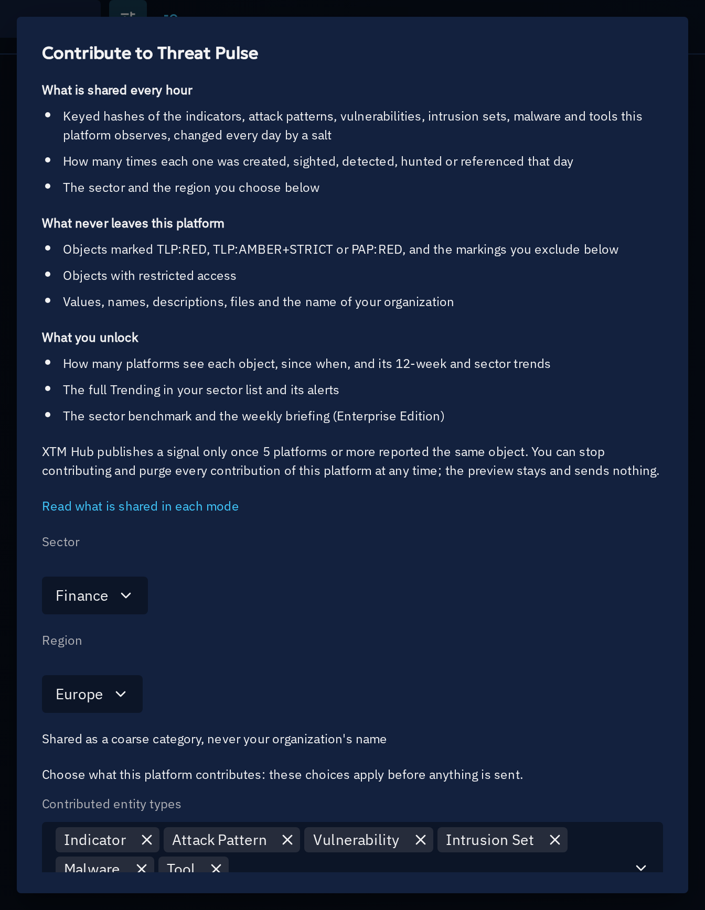 | 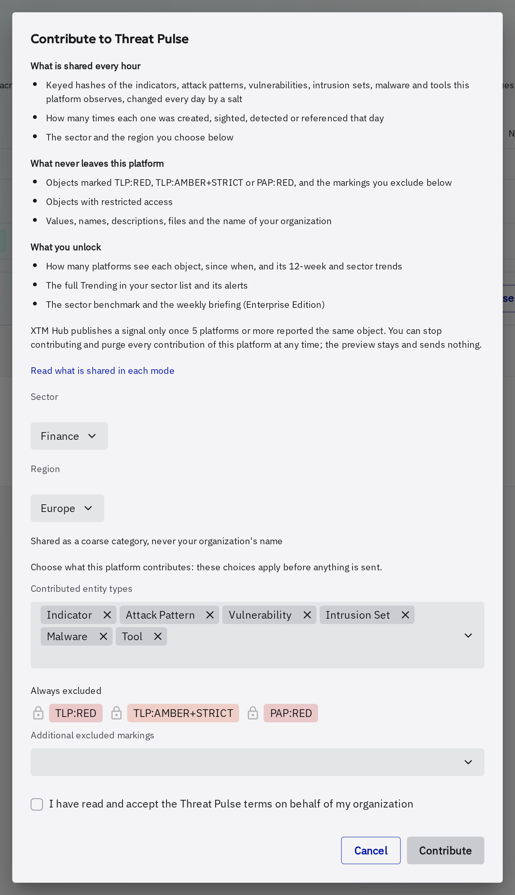 |
| 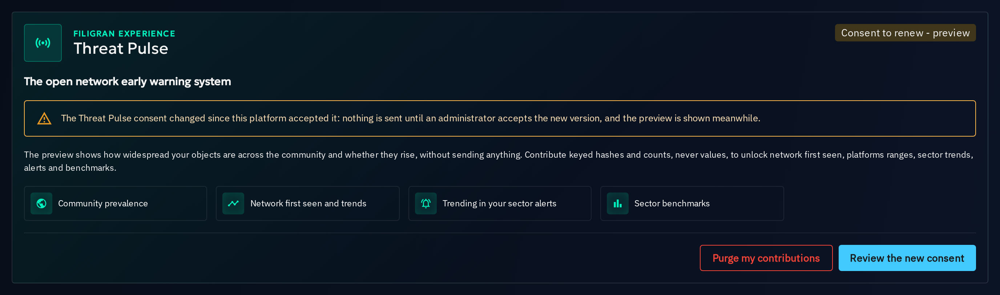 | 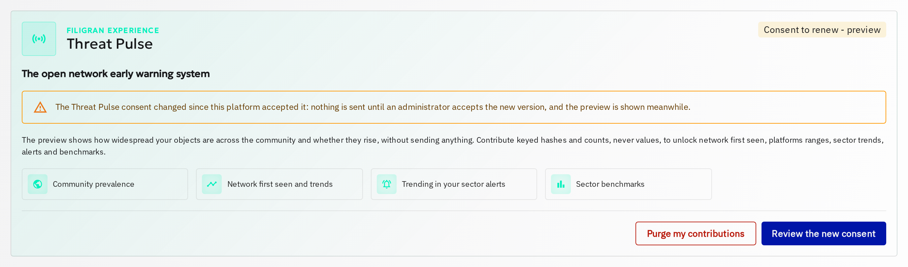 |

Reciprocity is enforced by XTM Hub, not by the user interface: network lookups, the full trending list and benchmarks are only answered to platforms that contributed recently. A platform that just accepted the consent therefore keeps the preview until XTM Hub accepts its first contribution, sent by the next hourly run that has activity to share; "Settings > Filigran Experience" shows "First contribution pending - preview" meanwhile. A platform is an active contributor while its last contribution is at most 7 days old, and it keeps the full experience for 14 days after its last contribution. Past that grace period, the platform falls back to the preview automatically and "Settings > Filigran Experience" says so; the full experience comes back with the next accepted contribution.

Stopping the contribution ("Stop contributing") switches the platform back to the preview and removes the full statistics from the objects.

## What a contributing platform shares

Every hour, a contributing platform sends to XTM Hub one record per object, activity kind and day:

| Field | Content |
|:------|:--------|
| `hash` | 32 hexadecimal characters derived from the object, encrypted under the salt of the day. Never a value, a name or an identifier. |
| `object_type` | `indicator`, `attack_pattern`, `vulnerability`, `intrusion_set`, `malware` or `tool` |
| `event_kind` | `created`, `sighted`, `detected` (sighted by a security platform) or `referenced` |
| `count` | How many such events the platform recorded that day; a sighting seen again counts again |
| `sector_bucket`, `region_bucket` | The coarse sector and region chosen by the administrator, or `undisclosed` |
| `batch_id` | A random identifier drawn for each batch of records and sent again when the batch is retried, so that XTM Hub counts it once |

The batch schema accepts no other field, on the platform and on XTM Hub. A batch that XTM Hub did not answer stays on the platform and is sent again with the next hourly run, with the same identifier; no new activity is collected while such batches wait, and a batch whose day XTM Hub no longer accepts (older than yesterday) is dropped. The contribution statistics count a batch once XTM Hub accepted it, never before.

The hash is derived in two steps:

1. A stable keyed hash of the normalized value (indicators and observables), of the MITRE ID (attack patterns: an ATT&CK or ATLAS technique ID), of the CVE identifier (vulnerabilities) or of the normalized name and each alias (intrusion sets, malware, tools). An attack pattern without a MITRE ID and a vulnerability whose name is not a CVE identifier have no key: they are never shared and show no community data. Every OpenCTI platform derives the same key for the same object, which is what lets the network match it. The key itself is never sent, only its encryption of the day (step 2).
2. The stable key is encrypted with the salt that XTM Hub draws every UTC day and serves to connected platforms only. The hashes sent therefore change every day: hashes recorded on different days (a proxy log, a copy of request bodies) cannot be linked to each other or to an object without the salts of those days, which XTM Hub deletes after 3 days. The salt is not a secret among connected platforms, and every platform derives the same stable key for the same object: a connected platform that knows a value can compute its hash for a day, exactly as the preview does. The request bodies are protected in transit by TLS, and what XTM Hub publishes is protected by k-anonymity, not by the salt.

The salts are deleted after 3 days. XTM Hub re-keys every received hash with a key only it holds, stores platform identifiers as pseudonyms, deletes contributions after 13 months and never logs Threat Pulse requests. The details are in the XTM Hub documentation.

Never shared:

- raw values, names, descriptions, files and relationships;
- objects marked `TLP:RED`, `TLP:AMBER+STRICT` or `PAP:RED` (always excluded), objects with restricted access, and objects carrying a marking the administrator excluded;
- the name or any identifier of the organization: no batch carries it and XTM Hub stores none with the contributions. XTM Hub does know which organization registered the platform (it validates the platform token against that organization's subscription), but nothing about the organization travels with Threat Pulse.

## Configure Threat Pulse

In "Settings > Filigran Experience", the Threat Pulse card shows its status ("Preview", "Contributing", "First contribution pending - preview", "Contribution lapsed - preview" or "Not connected") to every user who can open the page, and, for administrators:

- **Mode**: preview, contribute (opens the consent) or off.
- **Sector** and **Region**: the coarse categories used for sector trends and benchmarks, suggested from the platform organization; they are shared as a coarse category, never as the name of the organization. Choose "Undisclosed" to share none.
- **Scopes**: the object types that contribute (all six by default).
- **Excluded markings**: markings whose objects never contribute, in addition to the ones always excluded.
- **Statistics**: in preview, the number of local objects found in the community digest and the last refresh; when contributing, the records contributed per type, the contribution status (active, grace period, lapsed), the range of contributing platforms in the network, the anonymity threshold and the last error, in words, naming what failed: XTM Hub could not record a contribution, or a step of the hourly cycle (the contribution, the refresh of the community data, the trending notifications or the preview refresh) failed on the platform. The message disappears once that step succeeds again.
- **Purge my contributions**: deletes every contribution of the platform from XTM Hub, which recomputes its statistics. It is available in every mode while the platform is registered: stopping the contribution does not delete what XTM Hub already holds. This is the right to purge; it is recorded in the audit logs. The purge waits for a contribution being sent and drops what was collected and not sent yet, so nothing from before it reaches XTM Hub after it. XTM Hub then holds no contribution of the platform, so a contributing platform falls back to the preview until its next contribution is accepted. When XTM Hub does not confirm the purge, nothing changes on the platform and the page says so.

Narrowing the scopes or excluding a new marking removes the community statistics from the objects it takes out and drops the batches not sent yet, built under the former settings; the next hourly run contributes under the new ones. Widening the scopes or removing an exclusion only applies to the activity that follows the change: what happened while an object type or a marking was left out is never contributed afterwards. A change of the settings also stops an hourly run in progress before it records or sends anything more. Changing the Threat Pulse settings and purging require the "Manage XTM Hub" capability.

| Preview | Contributing | Off |
|:--------|:-------------|:----|
|  | 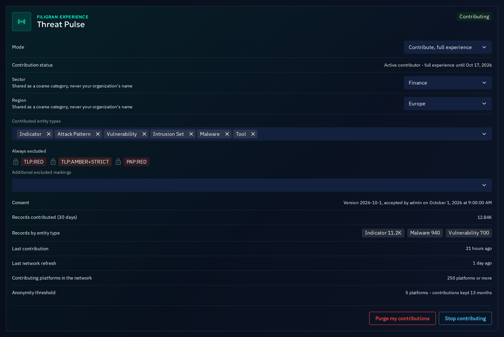 | 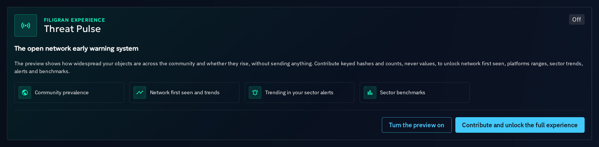 |
| 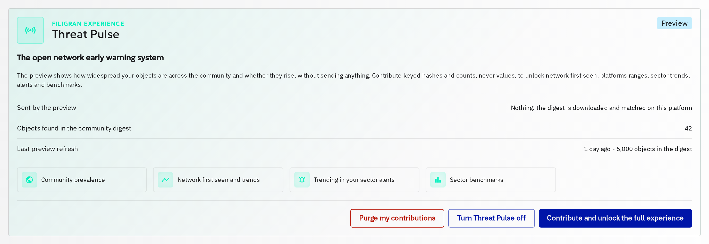 | 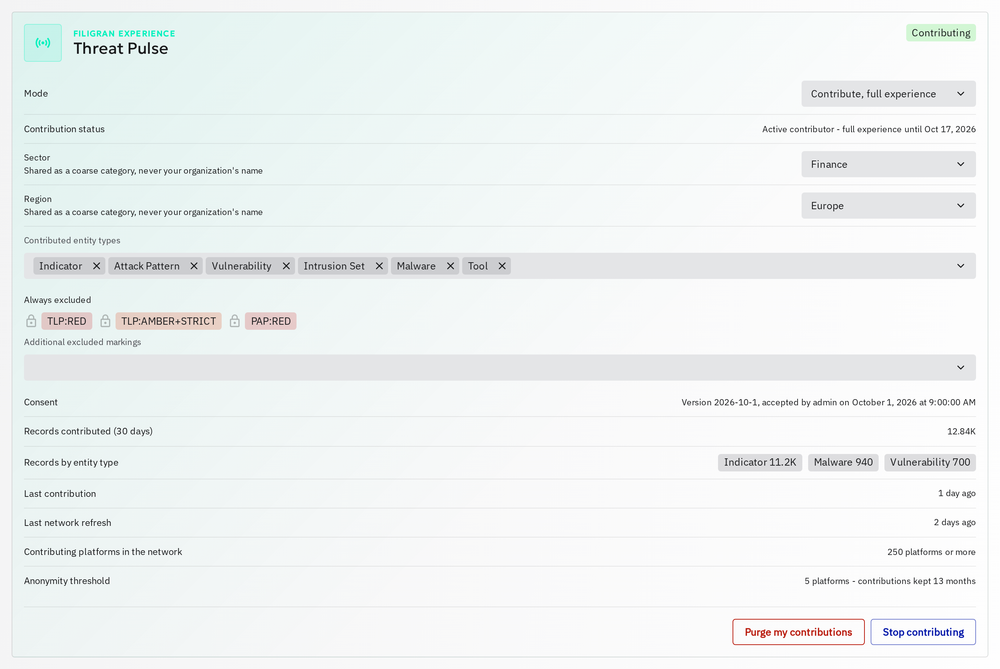 | 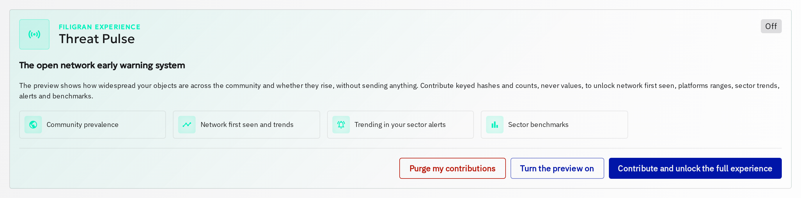 |

## Where Threat Pulse appears

### Threat Pulse widget

The overview of indicators, attack patterns, vulnerabilities, intrusion sets, malware and tools shows a "Threat Pulse" widget, half width, right after Basic information. It is a widget of the overview layout like the others: administrators move it or make it full width in "Settings > Customization > <entity type> > Overview layout", where it is listed as "Threat Pulse" (indicators get this tab with the widget). A layout customized before Threat Pulse existed receives the widget at the same place, after Basic information, with its default width; the rest of the customization is kept.

| | Dark | Light |
|:--|:--|:--|
| Overview | 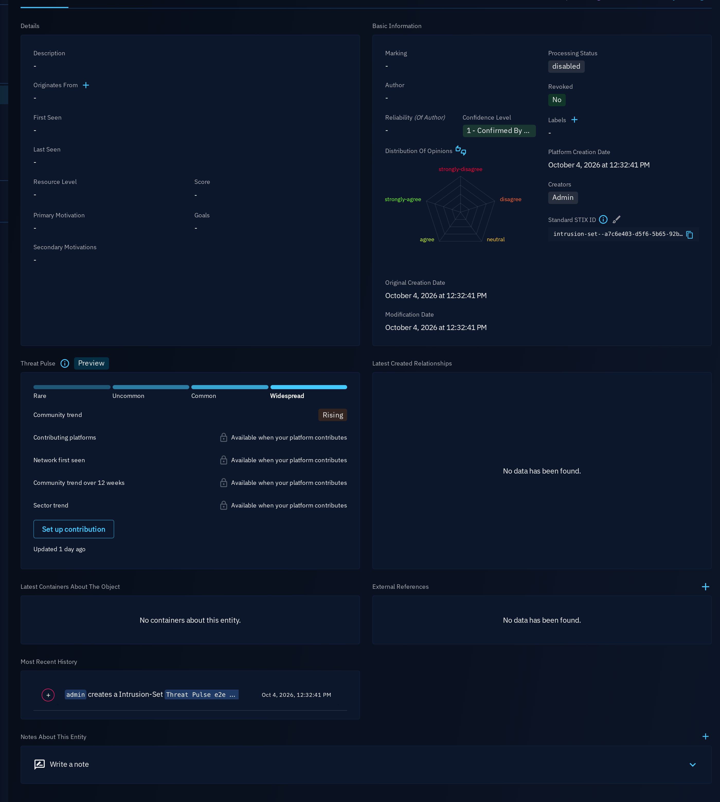 | 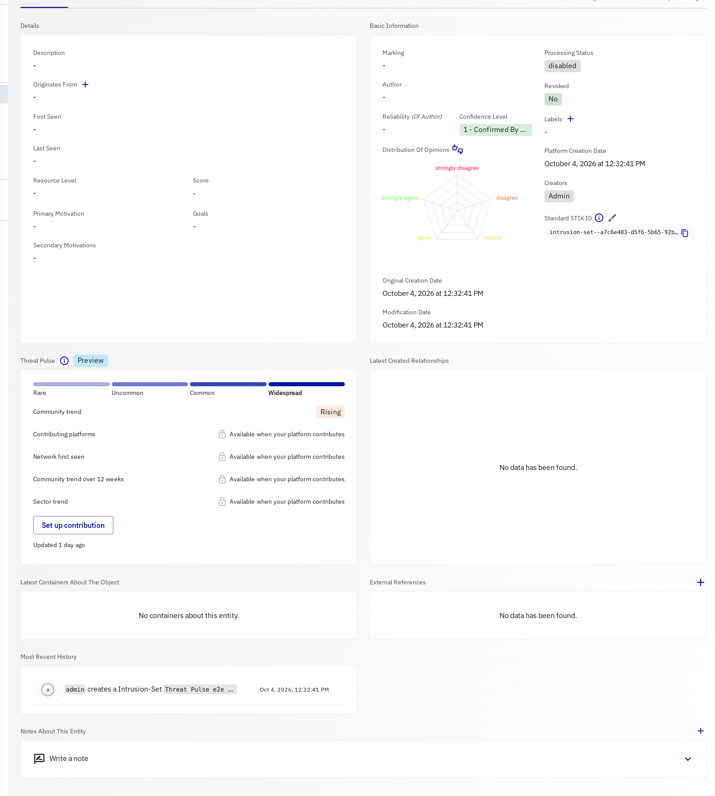 |
| Overview layout | 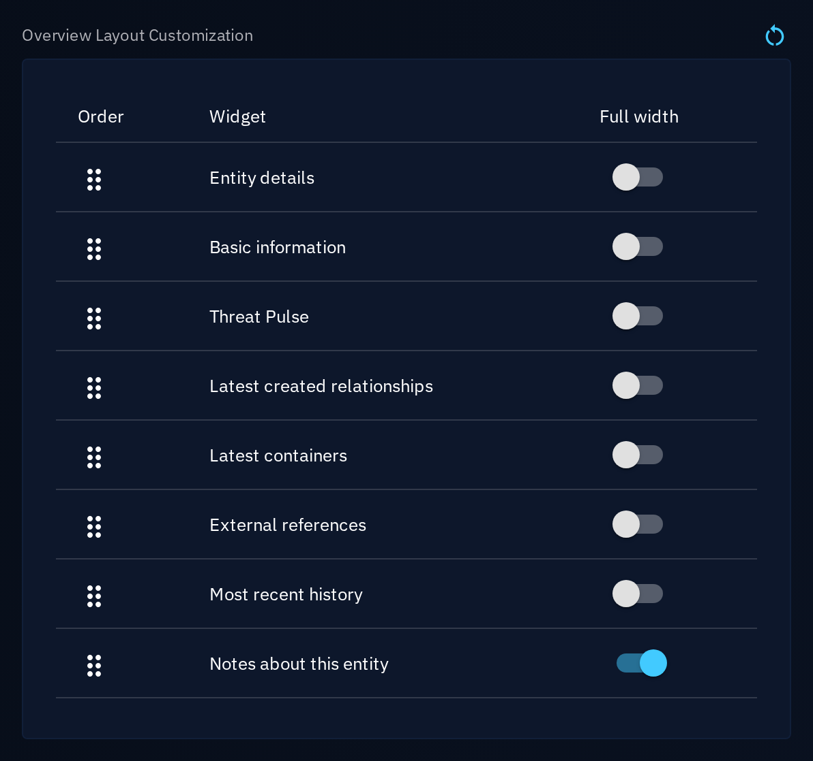 | 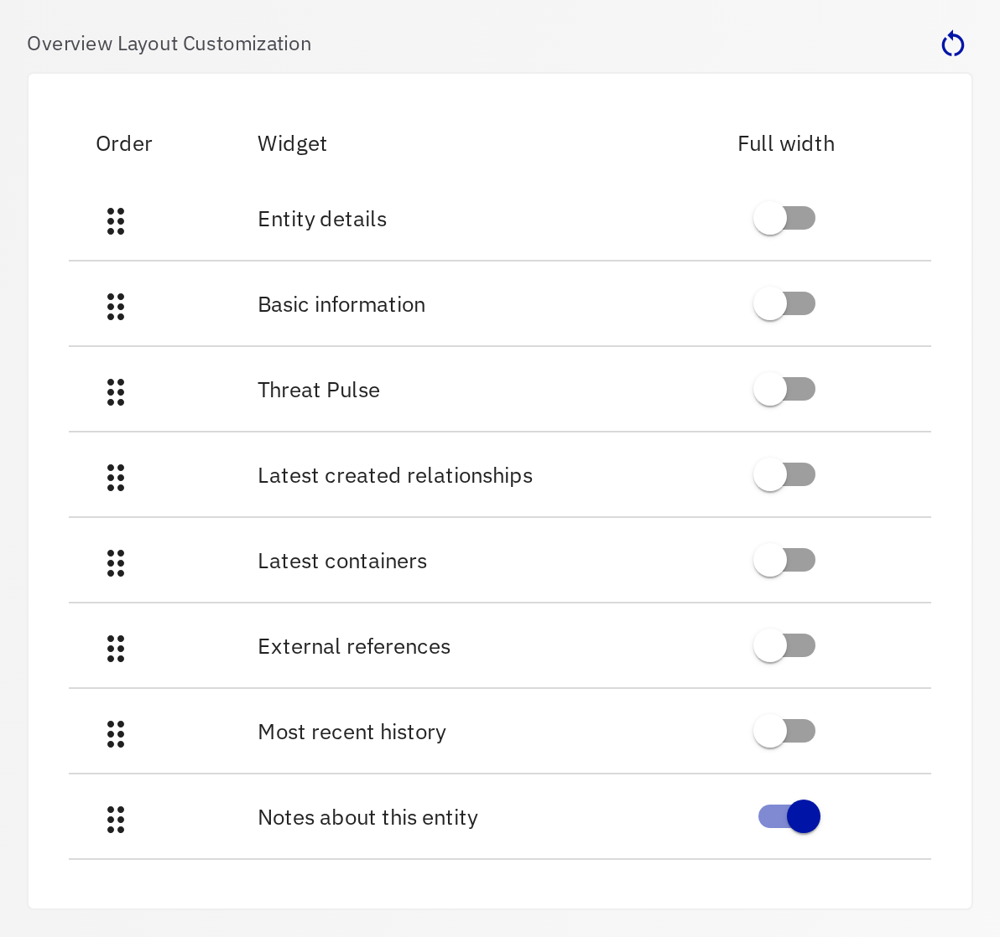 |

The widget shows:

- **Full**: the community prevalence gauge (rare, uncommon, common, widespread), the range of contributing platforms (for example "25 to 49 platforms"), the network first and last seen dates (the first and last days of the weeks in which enough platforms reported the object, never the day a single platform reported it), the 12-week trend sparkline, the sector trend and the community uniqueness. An object below the anonymity threshold is reported as such, without any count or prevalence, and with a community uniqueness of 100, a value published objects never reach (they go from 0 to 75); a value XTM Hub did not publish is left out rather than shown empty.
- **Preview**: the prevalence and trend when the object is in the digest, otherwise a short note, then the locked rows "Contributing platforms", "Network first seen", "Community trend over 12 weeks" and "Sector trend", and the unlock step.
- **Not connected**: what Threat Pulse would add and the "Connect to XTM Hub" button.

The widget always shows a card, so the overview never has a gap. With the full experience, an object without community data yet shows why instead: XTM Hub could not be reached, its rate limit is reached, the markings or restricted access of the object keep it on the platform, or the object has no name, identifier or supported pattern to compare with other platforms. When Threat Pulse is off, when the entity type is left out of its scope, or when the platform cannot reach XTM Hub, the card says so in one sentence, and administrators get the way to the Threat Pulse settings.

| Not connected | Preview | Full | Off |
|:--------------|:--------|:-----|:----|
| 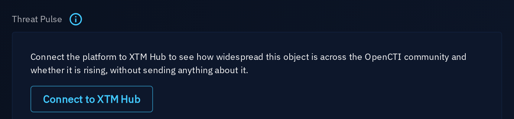 | 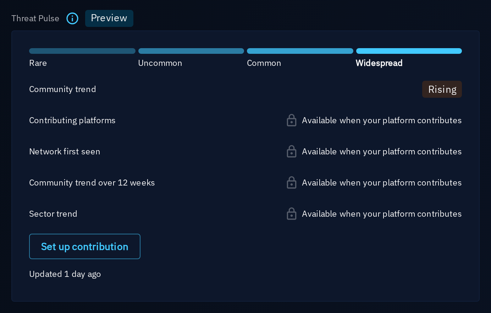 | 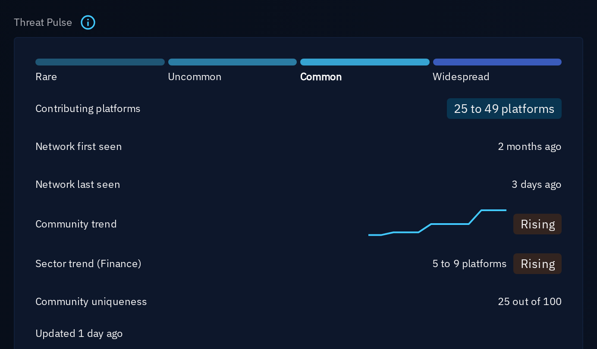 | 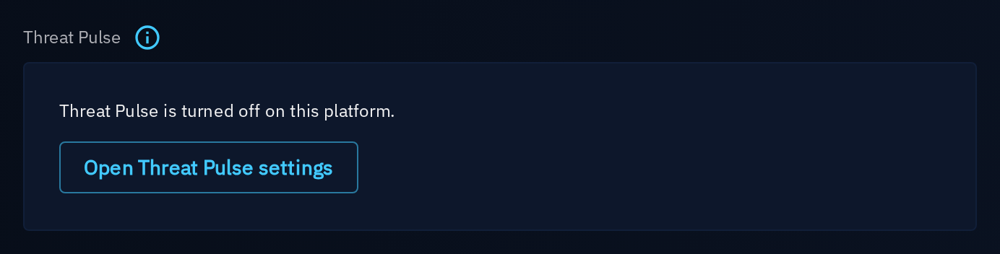 |
| 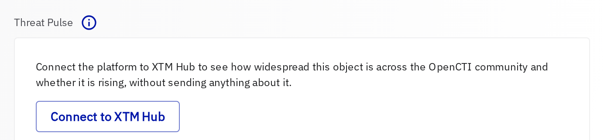 | 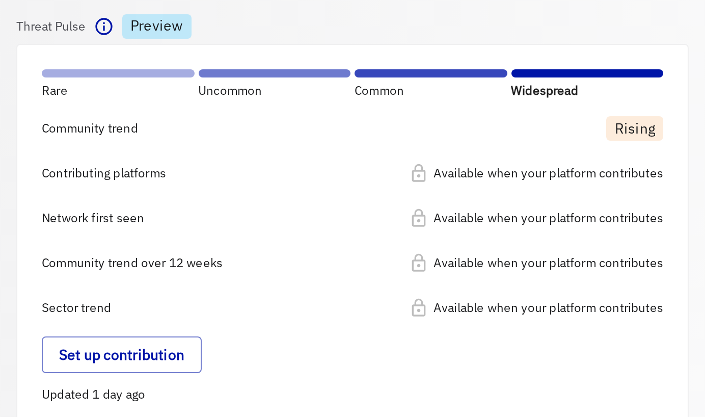 | 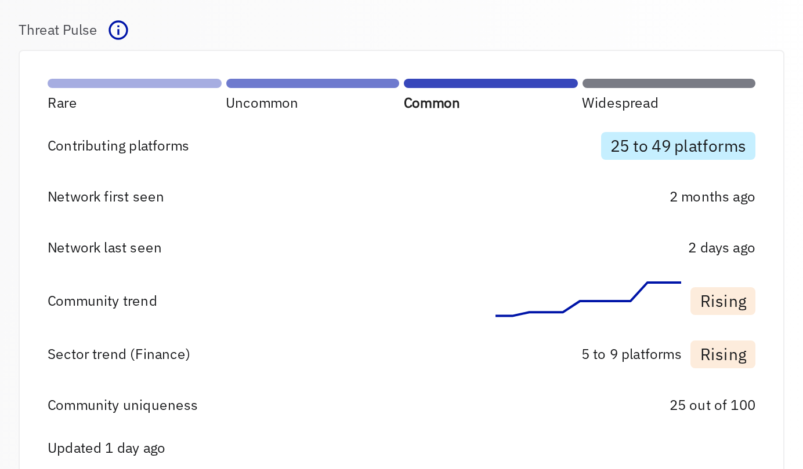 | 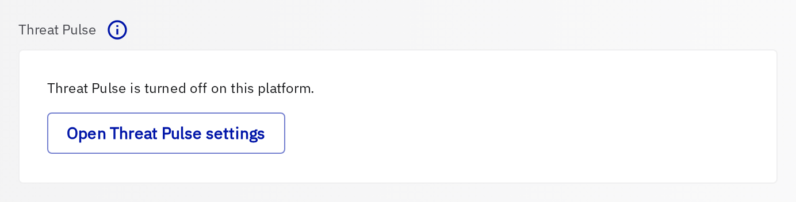 |

### Filters, columns and exports

The objects in scope carry the following attributes, available as filters, sort keys and widget attributes: "Community prevalence" (`pulse_prevalence`), "Community trend" (`pulse_trend`), "Sector trend" (`pulse_sector_trend`), "Network first seen" (`pulse_first_seen_network`) and "Community uniqueness" (`pulse_community_uniqueness`). Prevalence and trend filters also work in preview. Lists of a Priority Intelligence Requirement can be sorted by community prevalence.

A contributing platform refreshes these values every night for every object in scope, computing the keys of the objects that never contributed, matched or were read; on a large platform, a night handles up to `pulse_manager:refresh_max_entities` objects (200,000 by default) and the next one goes on after them.

These values are written without creating a history entry, a stream event or a modification date change. They are exported in the STIX representation of the six types, in the OpenCTI extension (`pulse_prevalence`, `pulse_trend`, `pulse_sector_trend`, `pulse_first_seen_network`, `pulse_community_uniqueness`, and `pulse_preview: true` when the values come from the preview), and reach streams and feeds with the next update of the object. The export follows the current settings as the screens do: nothing for a type out of scope or once Threat Pulse is turned off, the preview values only in the preview, nothing for an object excluded from the contribution (an excluded or unknown marking, restricted members, a sharing with organizations) as soon as it is, and nothing while a cleanup of the community data waits to be retried.

### Trending in your sector

"Trending in your sector" is a widget of the dashboard catalog. It lists the local objects rising in the platform's sector over 7, 30 or 90 days, with their prevalence, range of platforms and growth, and says how many of the first ranks the platform does not hold. In preview, it names the first three ranks and folds the next ones into one locked row ("7 more trending objects - available when your platform contributes"); when nothing the platform holds is trending, it says so. It is not added to the default home dashboard.

| Preview | Full |
|:--------|:-----|
| 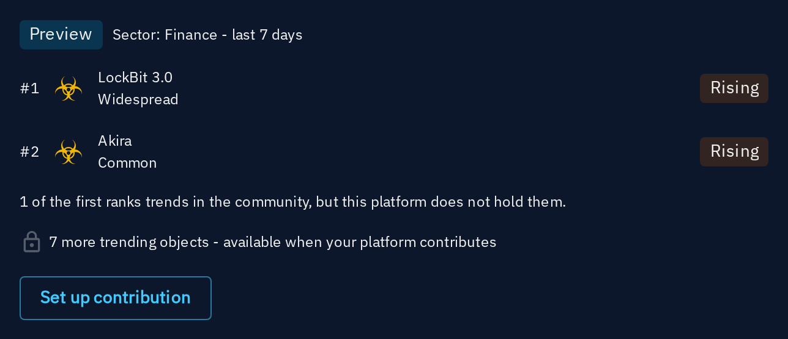 | 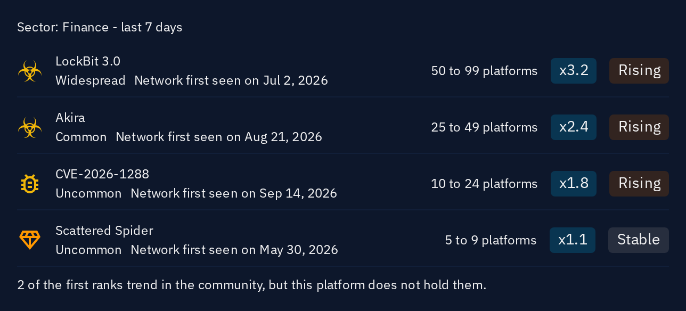 |
| 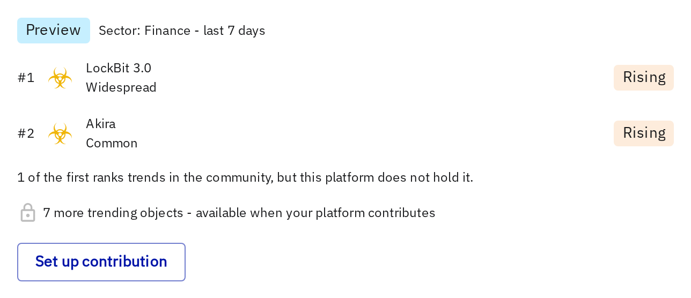 | 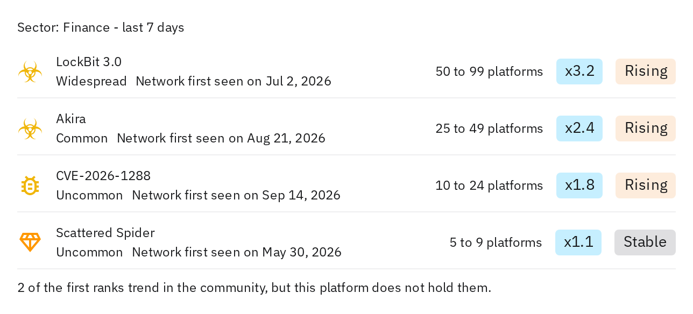 |

### Sector benchmark (Enterprise Edition)

The "Sector benchmark template" button of the dashboards list opens the template card: its purpose, the widgets it creates and "Create a dashboard from this template". The dashboard holds the trending widget, the benchmark widget (the activity of the platform per object type and activity kind compared with the median of its sector, and the objects it reports well above that median) and knowledge widgets on the community signal, each titled with its measure and period. The comparison with the sector median counts what the platform reported in its current sector only.

On a dashboard with a period, the trending and benchmark widgets follow it: they show 7 days for a dashboard period of up to a week, 30 days up to a month and 90 days beyond (XTM Hub publishes no other period), in place of their own period selector. Without a dashboard period, each widget keeps its selector.

In preview, the template stays available: its benchmark tiles name what they would show once the platform contributes, and the widgets that read the sector trend and the network first seen are left out of the dashboard and listed as locked rows on the card.

| Dark theme | Light theme |
|:-----------|:------------|
| 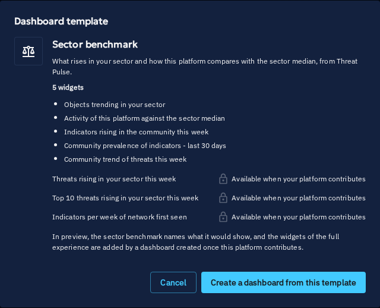 | 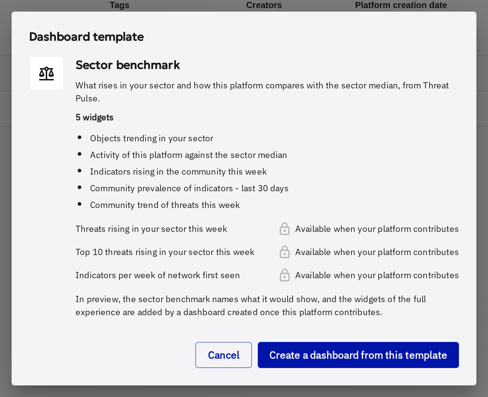 |

A median that XTM Hub does not publish, because fewer platforms than the anonymity threshold reported that activity, reads "Not published".

| Preview | Full |
|:--------|:-----|
| 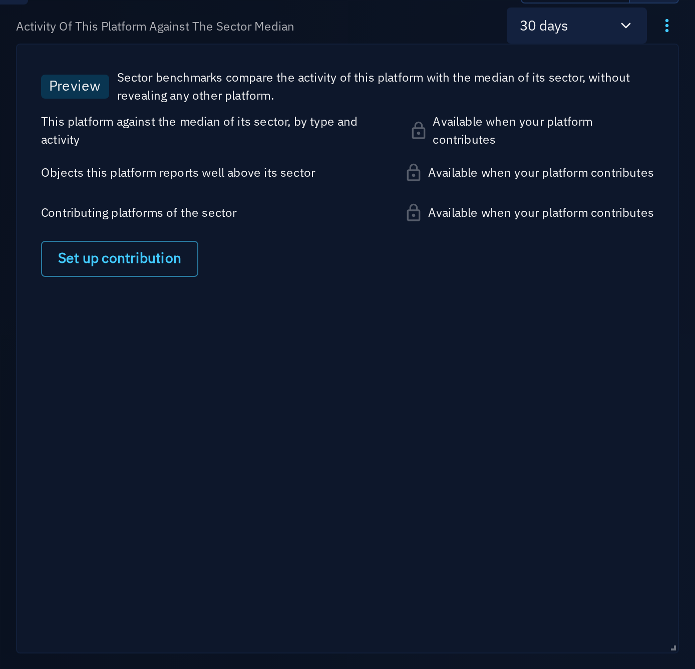 | 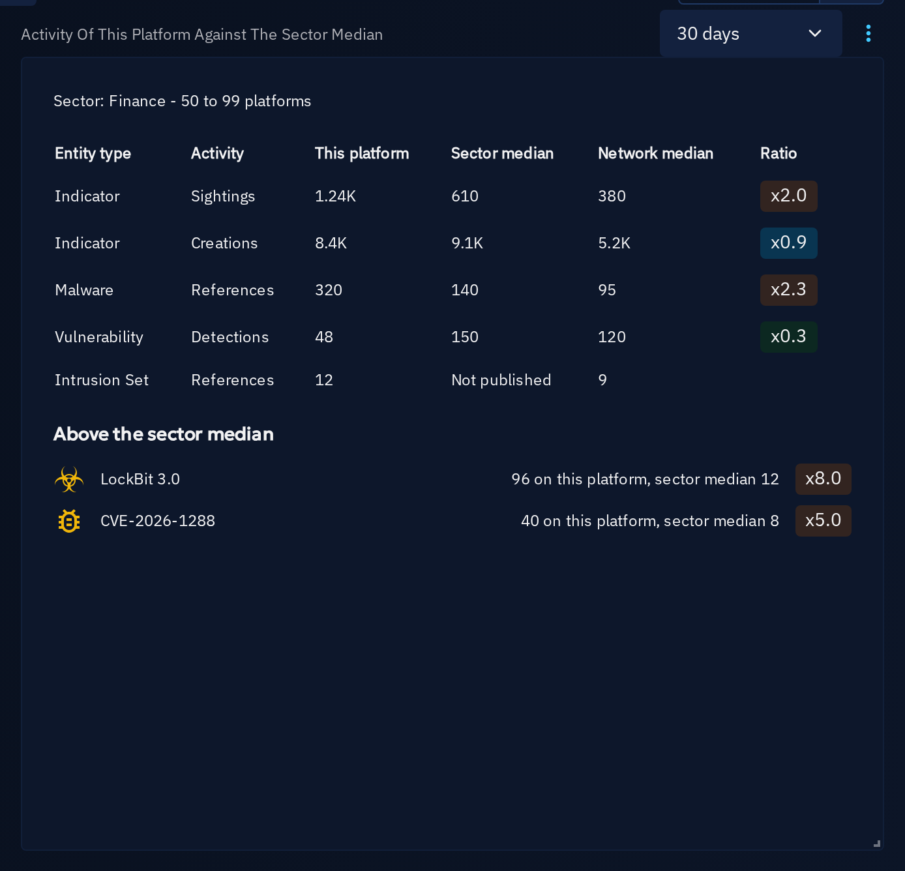 |
| 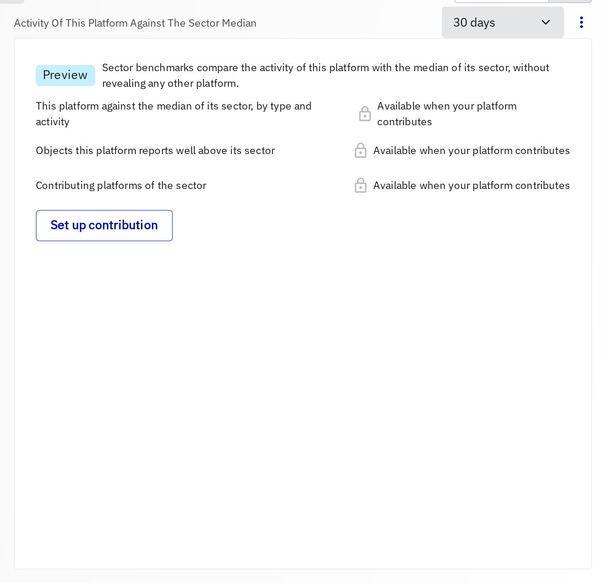 | 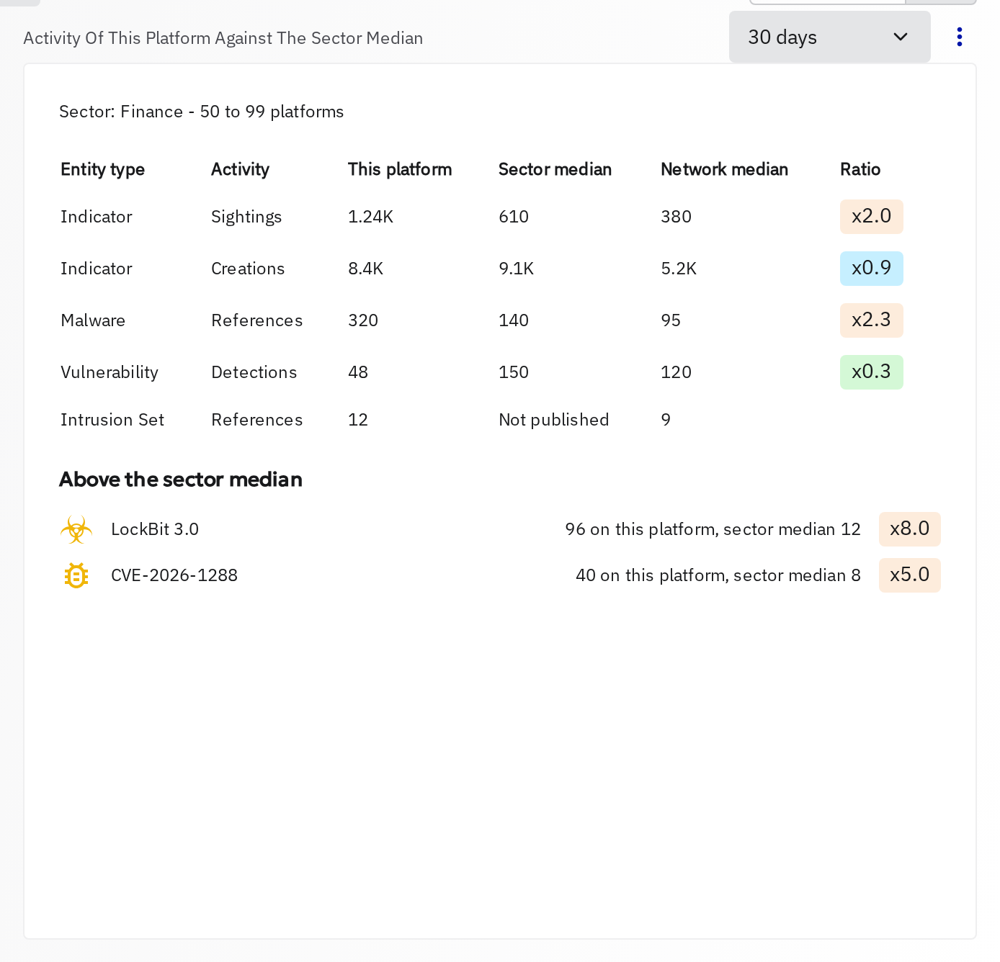 |

### Notifications

Live triggers can listen to the "Trending in my sector (Threat Pulse)" event type. See [Notifications and alerting](notifications.md).

### Sector Pulse Briefing (Enterprise Edition)

When XTM One is configured, the "Trending in your sector" widget of a contributing platform offers a weekly sector briefing written by the Sector Pulse Briefing agent of XTM One from the trending list and the local context. The briefing is not offered in preview; an XTM One assignment that runs the agent for a platform in preview receives an explanation of what the preview shows and what contributing unlocks instead of a briefing. For a Community Edition platform, the agent answers with a short notice that the briefing is part of the Enterprise Edition, and the weekly assignment sends nothing.

## Usage telemetry

The [usage telemetry](../reference/usage-telemetry.md) counts the Threat Pulse mode of the platform, the number of records and lookups sent, the preview impressions and calls to action per surface (counted only while the platform is in preview) and the mode changes. No hash and no knowledge content is ever collected.
