# Time machine and landscape changes

OpenCTI records every change made to the knowledge in its history: each update stores the patch applied to the entity and the reverse patch that undoes it. The knowledge time machine uses this history to answer "what did we know, and what changed since?":

- **Changes** tab of every entity: compare the entity between two dates (**Compare dates**) or display it as it was at a past date (**View as of**).
- **Landscape changes**: compare a whole set of entities (for example every intrusion set targeting a sector) between two dates.
- **New since your last visit**: see what changed on an entity since you last opened it.
- **Change digests**: receive the landscape changes of a set of entities on a schedule.

All these features are available in the Community Edition. They are fully deterministic: every result is computed from the history and the knowledge, without any AI.

## Why use it?

Strategic analysts regularly need to answer questions such as "what changed about this threat actor since last quarter?". Without the time machine, the answer requires scrolling through the history of many entities. The time machine turns this work into a few clicks:

- Rewind an entity to the date of a past report to understand what was known at that time.
- Brief a quarterly change section in minutes: new techniques, new tooling, new victims, new infrastructure, confidence shifts and revocations.
- Focus your daily review on the entities that changed since your last visit.
- Get the landscape changes delivered to your notifications or your mailbox every week or every month.

## The Changes tab

Every entity with a history (including reports, groupings and cases, whose history is displayed in their **Data** tab) has a **Changes** tab, the single place for its evolution over time. It has two sections:

- **Compare dates** (the default section): everything that changed between two dates.
- **View as of**: the entity as it was at a past date.

The section, the period and the date are kept in the URL of the page, so you can share any of these views with a colleague, who sees it with their own rights.

## View an entity as of a date

1. Open the **Changes** tab of the entity and select **View as of**, or choose **View as of** in the more actions menu of the entity header (the button with three dots). The view opens 30 days back, in read-only mode, and a banner reminds you of the date being displayed.
2. Pick the date:
    - type it in the **View as of** date field,
    - drag the slider, which shows a mark for every recorded change of the entity, including the creation or deletion of its relationships you can access (the 200 most recent ones for entities with a longer history, as a caption below the slider says; older dates can still be selected),
    - or jump between changes with **Previous change** and **Next change**.
3. Click **Back to the current knowledge** to return to the overview of the entity.

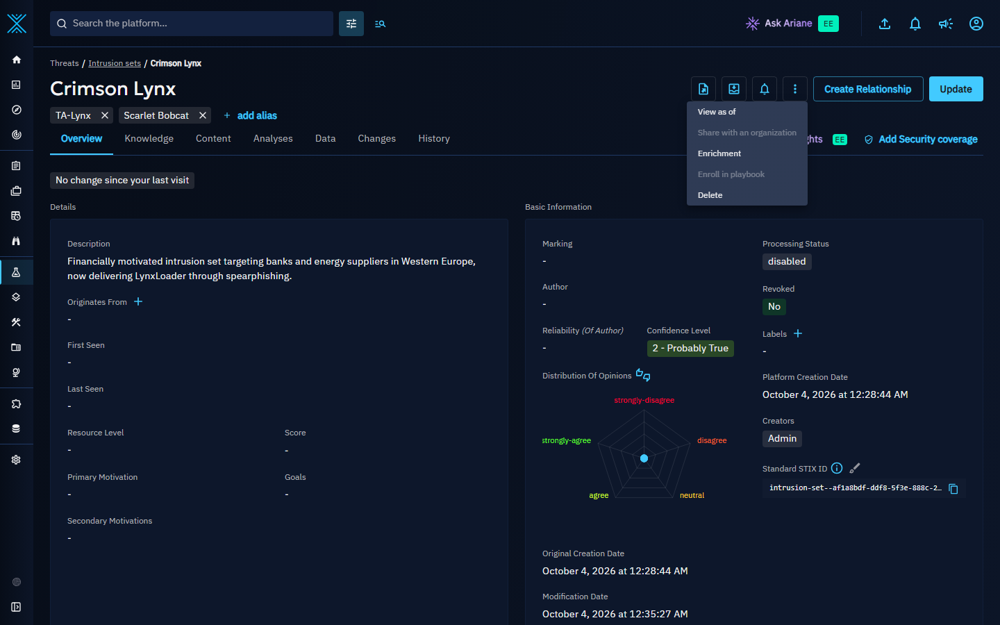

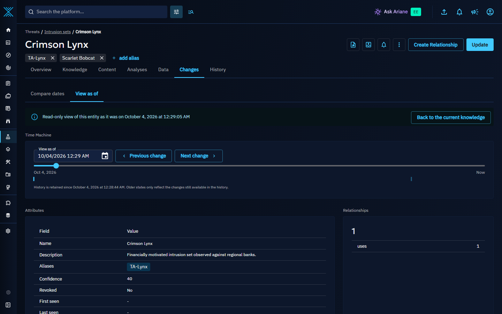

The view shows:

- the attributes of the entity at that date (name, description, aliases, confidence, score, markings, labels, author, external references, and so on),
- the number of relationships by type at that date,
- for containers, the number of objects they contained at that date and that you can access (the count is not shown when the container changed too often since that date to rebuild its content),
- a **Reconstruction** panel explaining how the view was rebuilt: from the current knowledge or from a knowledge snapshot, how many changes were replayed, and since when the history of the entity is available.

When the entity did not exist yet at the selected date, the view says so and **Go to the first recorded change** moves the date to the oldest change still in its history (usually its creation). When the entity has been deleted since, only a tombstone with the deletion date is displayed.

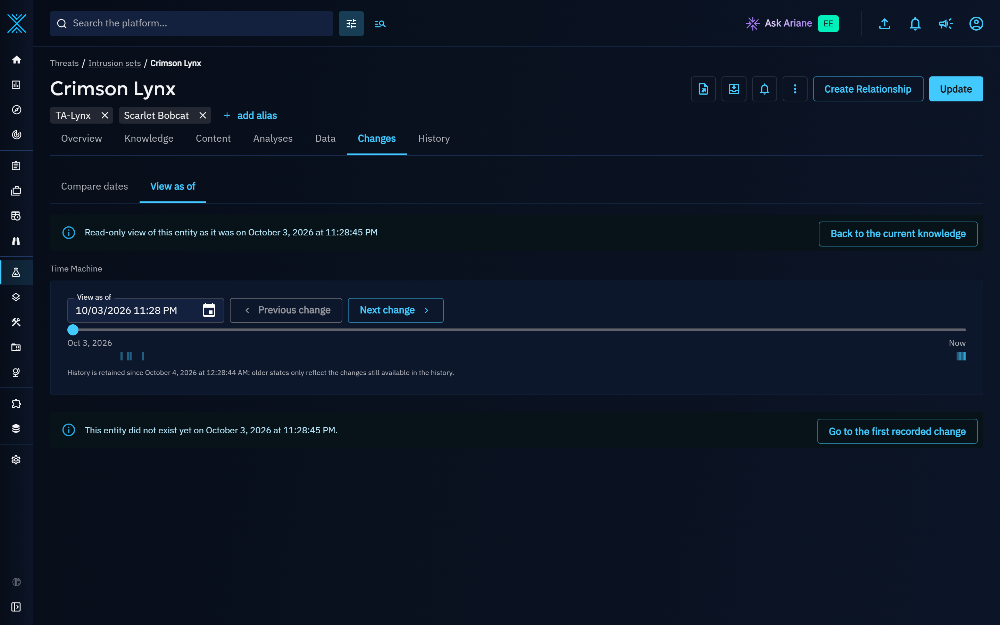

When a history [retention rule](../administration/retentions.md) deleted the changes made around the selected date, the view says that the history of the entity is not retained back to that date (see [History retention and knowledge snapshots](#history-retention-and-knowledge-snapshots)), and **Go to the first recorded change** moves to the oldest state still available.

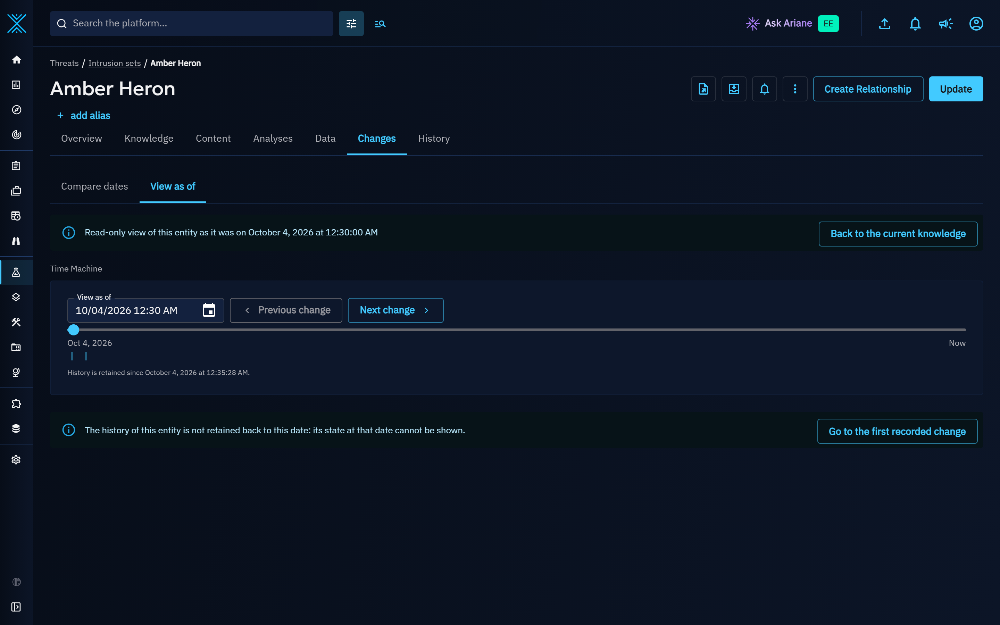

!!! note "Reconstruction warnings"

    A warning is displayed when the reconstruction is not exact:

    - a merge happened after the date: a merge cannot be undone, so the view stops at the state right after the merge,
    - too many changes happened after the date: the view stops at the oldest change that could be replayed,
    - the date is older than the replay window between two knowledge snapshots: the reconstruction relies on a long history replay,
    - too many relationship changes happened after the date (or during the period of a diff): relationship counts and changes only cover the most recent part of the history,
    - the date is older than the History retention: the relationship changes made since may have been purged, so the relationship counts and changes may not reflect all of them.

## Compare two dates

The **Compare dates** section of the **Changes** tab shows everything that changed on an entity between two dates.

1. Open the **Changes** tab of the entity: **Compare dates** is the section displayed by default.
2. Choose the period: last 7 days, last 30 days, last 90 days, last year, quarter to date, previous quarter, or a custom period with the **From** and **To** dates.
3. Review the changes:
    - **Summary**: a card for each measure that changed during the period, among the changed attributes, the relationships added, removed and revoked, the confidence and score evolution, the confidence changes on relationships and, for containers, the objects added and removed. The measures that did not change are listed on one line below the cards. A confidence or score that was never set reads **Not set**.
    - **Attributes**: every changed attribute with its operation (**Added**, **Changed** or **Removed**), its value before and after the period, and the date and author of its last change with the number of changes in the period. Removed values are struck through and shown in red, added values in green, each with an icon. Dates are relative ("3 hours ago"): hover them to see the exact date.
    - **Relationships**: every relationship added, removed, revoked, unrevoked or whose confidence changed, with its direction, the related entity, the date and the author. A relationship created during the period is listed as added, and its later revocation or confidence change during the period is listed too.
    - **Contained objects**: for containers (reports, groupings, cases...), the objects added to and removed from the container.

When nothing changed during the period, the section says so and offers **Compare the last 90 days** (then **Compare the last year**).

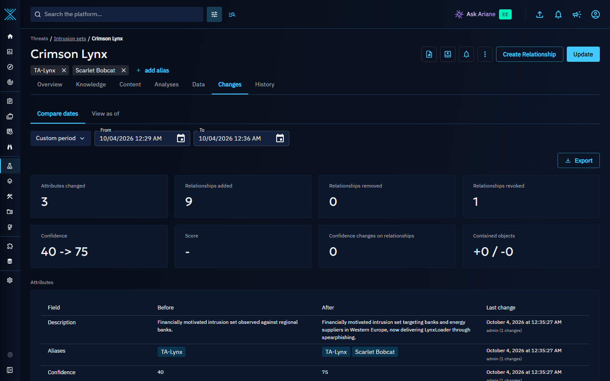

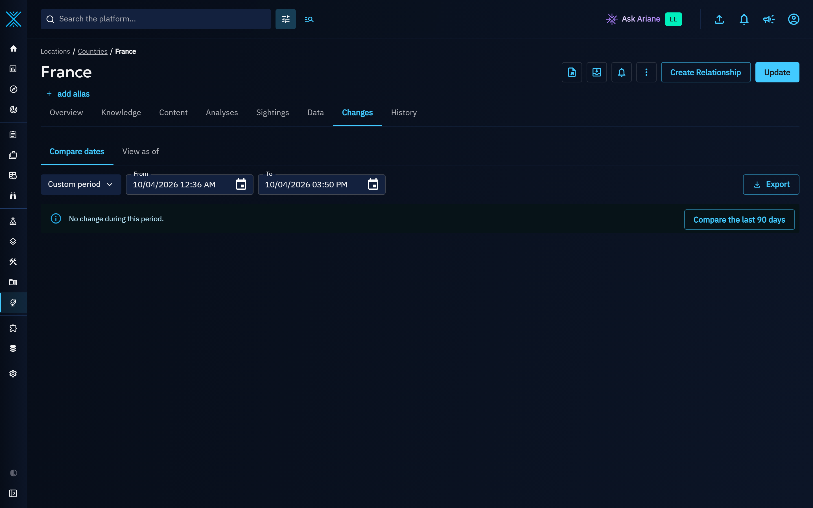

!!! note "Long periods"

    The relationship list shows the 500 most recent changes, and the counters of the summary cover the whole period. When a period holds too many relationship changes to read them all, a warning says so: the list, and the counters of removed, revoked and confidence-changed relationships, then only cover the most recent part of the period, while the number of added relationships still covers all of it.

### Export a diff

Click **Export**, on the right of the period selector of the **Compare dates** section, to download the diff:

| Format | Content |
|--------|---------|
| JSON   | The complete diff, for automation or archiving. |
| CSV    | One line per changed attribute, relationship or contained object. Values that could be interpreted as spreadsheet formulas are neutralized. |
| PDF    | A printable change report generated by the built-in PDF export of the platform. |

If you have the capability to upload knowledge files, you can also save the export in the files of the entity (**Data** tab) instead of downloading it.

## Landscape changes

The **Landscape changes** page compares a whole set of entities between two dates.

1. Go to **Analyses > Landscape changes**.
2. Choose the scope:
    - **Filters**: build filters on the fly (for example intrusion sets targeting the Finance sector),
    - **Saved filter**: reuse a filter set saved in a list; the entity type of the list is used,
    - **Custom view**: use every entity of the type targeted by a custom view.

    When no saved filter or no custom view exists yet, the page explains what Landscape changes compares and **Choose a scope** switches to filters.
3. Optionally restrict the **Entity types** (filters and saved filters only: a custom view always compares the entity type it targets) and choose how to **Group by** the results: entity type, relationship type or tactic.
4. Choose the period.
5. Click **Compute the landscape changes**.

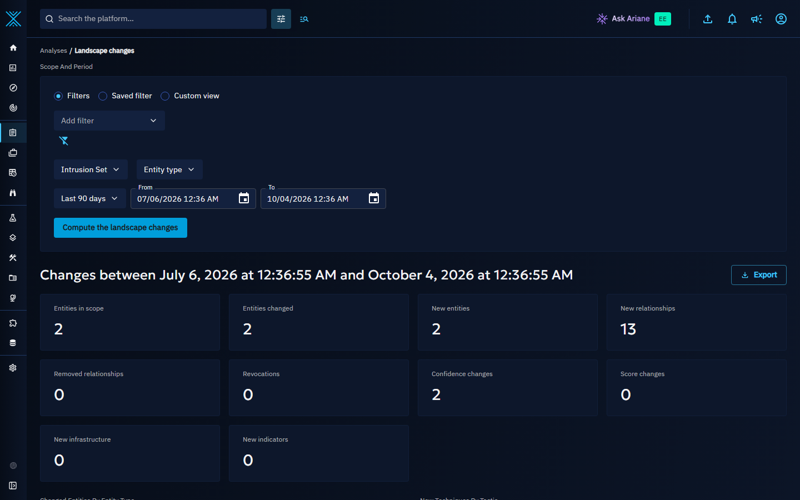

The computation runs in the background: a progress bar shows how many entities were already compared and for how long the computation has been running. Once it is finished, the result says how many entities it compared and how long it took. The result stays available for one hour: its identifier is kept in the URL of the page, so you can come back to it while it is valid. Once it has expired, **Compute again** runs it with the scope and period shown on the page.

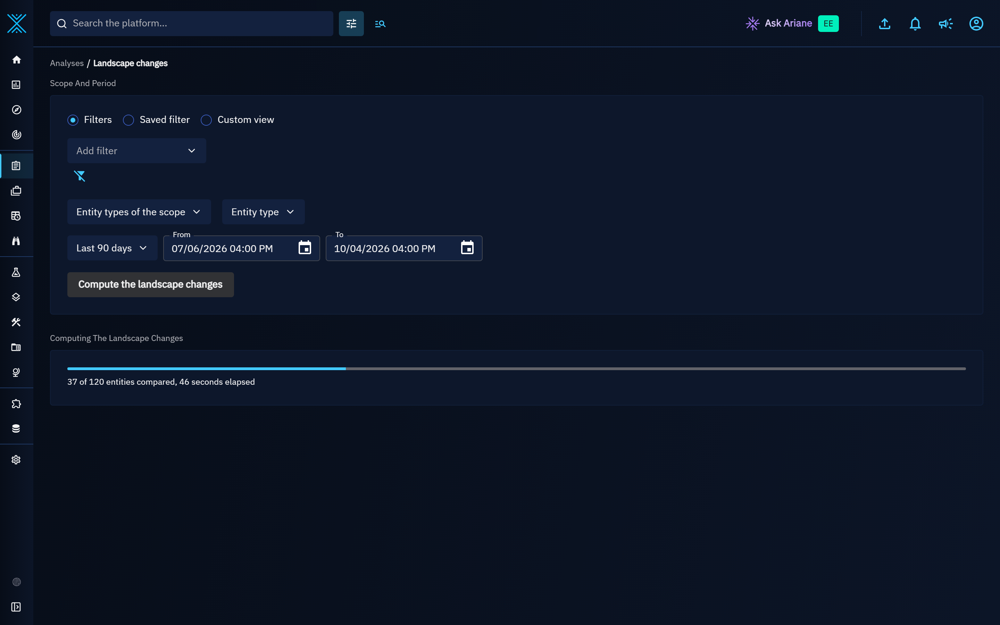

When nothing changed in the scope during the period, the page says so and **Widen the period** compares the same scope over the last year.

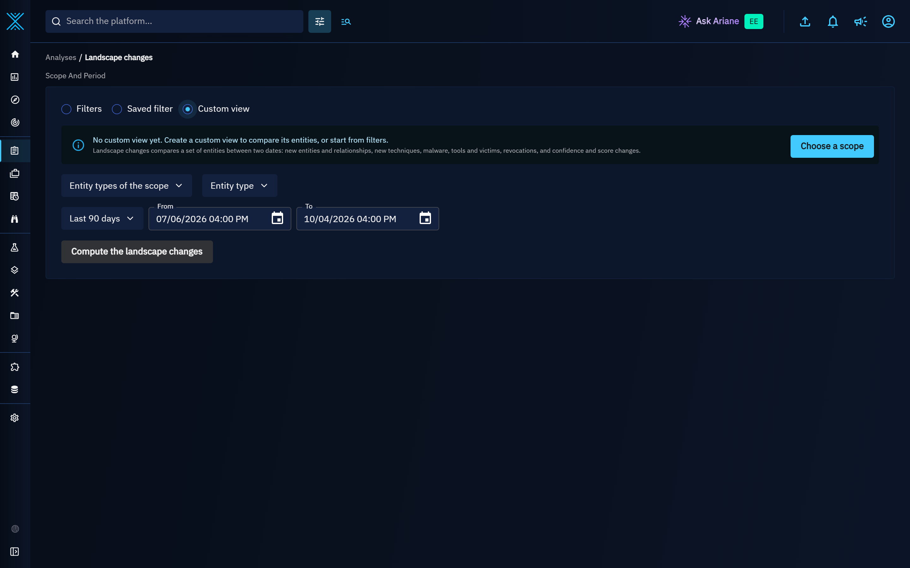

If a computation cannot complete, the page explains why (for example the platform restarted during the computation, or your access to part of the knowledge changed since it was computed) and **Compute again** runs it once more with its own scope and period. If its result cannot be read for a moment (for example a network interruption), the page says that the landscape changes could not be read, keeps trying on its own, and **Retry** reads it again right away.

The result contains:

| Section | Content |
|---------|---------|
| Key figures | Entities in scope, entities changed, new entities, new relationships, removed relationships, revocations, confidence changes (of the entities and of their relationships), score changes, new infrastructure and new indicators. |
| Group by breakdown | Displayed first: the changed entities by entity type, the new relationships by type or the new techniques by tactic, depending on the **Group by** choice. The PDF export starts with the same breakdown, and the JSON export carries it with the `group_by` value. |
| New techniques by tactic | Attack patterns newly linked with a `uses` relationship, grouped by tactic (kill chain phase). |
| New techniques, new malware and new tools | Attack patterns, malware and tools newly linked with a `uses` relationship. The 50 most frequent are listed; when there are more, the card shows the total (for example "50 most frequent of 120"), and change digests always report the totals. |
| New victims | Sectors, countries and regions newly linked with a `targets` relationship. |
| New infrastructure | Infrastructures, IP addresses, domain names, URLs and hostnames newly related to the entities. |
| New relationships by type | All relationships created in the period, by relationship type. |
| Top changed entities | The changed entities, ranked by a change score that weighs new, removed and revoked relationships, confidence changes on relationships, changed attributes, creation and revocation in the period, and confidence and score shifts. |

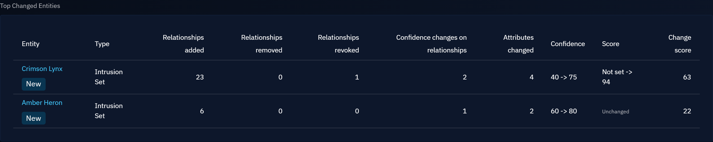

Click an entity in **Top changed entities** to open its **Changes** tab on the same period. Click **Export** to download the landscape changes in JSON, CSV or PDF.

Every figure is computed with your rights: a relationship whose change you cannot see, or that was removed from an entity you cannot access, is not counted. A stored result is only shown again while you can still access everything it counts.

!!! note "Limits"

    The scope is the set of entities you track today: the entities that currently match the filters (or the saved filter, or the custom view) and that were created before the end of the period. Filters are evaluated on the current knowledge, and entities deleted since are not part of the scope. To keep the platform responsive, a landscape diff covers at most 1,000 entities (the most recently created first) and 20,000 new relationships; when a limit is reached, the result is flagged as partial. Each user can run one landscape diff at a time. These limits are configurable (see [Configuration](#configuration)).

### Landscape widgets

Three widget visualizations bring the landscape changes to your [custom dashboards](dashboards.md):

- **New relationships by type**,
- **New techniques by tactic**,
- **Top changed entities**.

Create them with the **Entities** perspective: the filters of the widget define the set of entities, and the period of the dashboard defines the dates (the last 30 days when the dashboard has no period). Widgets cover at most 200 entities and their result is cached for one hour once their period has ended (a period that ends now is computed again at each refresh, so it never misses a recent change); when the set of entities exceeds this limit, the widget says that its result is partial. See [Widget creation](widgets.md) for details.

To start from a ready-made dashboard, go to **Dashboards > Custom dashboards**, click **Create from template** next to **Import dashboard** and choose **Threat landscape changes**. The dashboard shows the top changed threats (intrusion sets, threat actors and campaigns) with their new techniques by tactic and their new relationships by type, the top changed malware and tools with their new relationships, and the top changed vulnerabilities. Set the period of the dashboard to choose the dates compared; you can then edit every widget like any other.

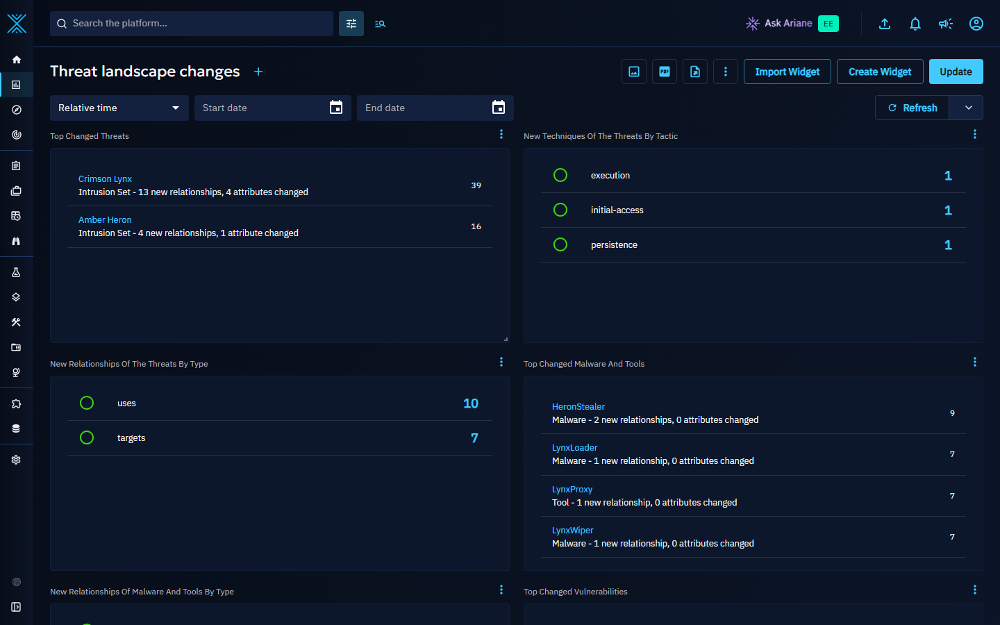

!!! note "Public dashboards"

    Landscape widgets are not rendered in public dashboards: a landscape diff is an expensive computation that anonymous visitors must not be able to trigger.

## New since your last visit

When you open the overview of an entity, the platform records your visit. These markers are private: only you can see them. Opening an entity while you work in a draft does not record a visit, so the markers always follow the knowledge they are compared with.

- On the overview, one chip says whether other users changed the entity since your previous visit. Hover it to see what they changed (new relationships, updates and, for containers, new contained objects) and when you last visited the entity. Your own changes are not counted: you have seen them. Click it to open **Compare dates** on the period since that visit, with the **Since your last visit** period selected.
- In lists, a small dot appears on the rows of the entities that other users changed since your last visit. Hover it to see the details.

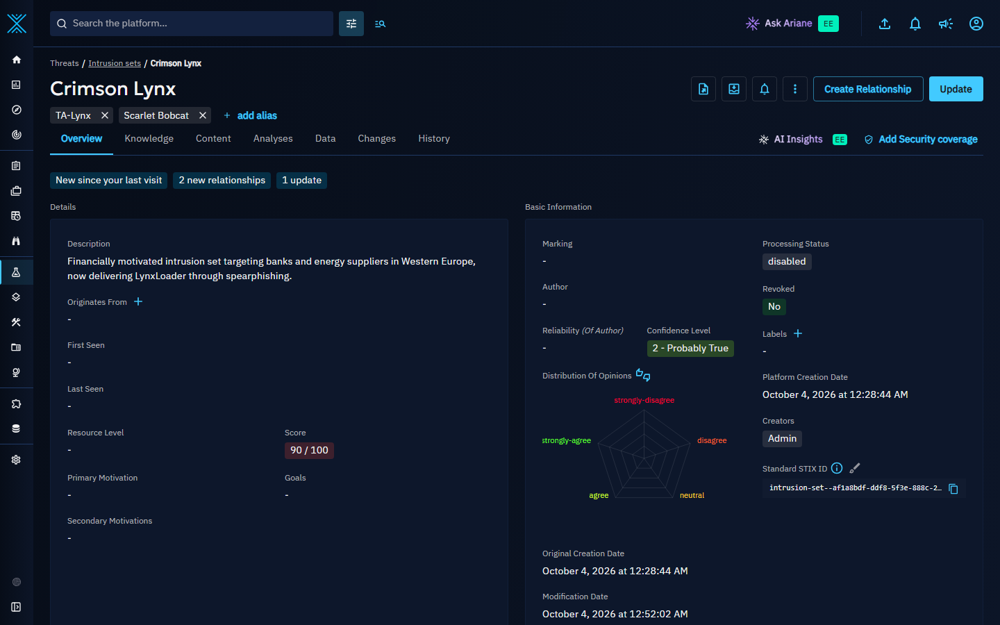

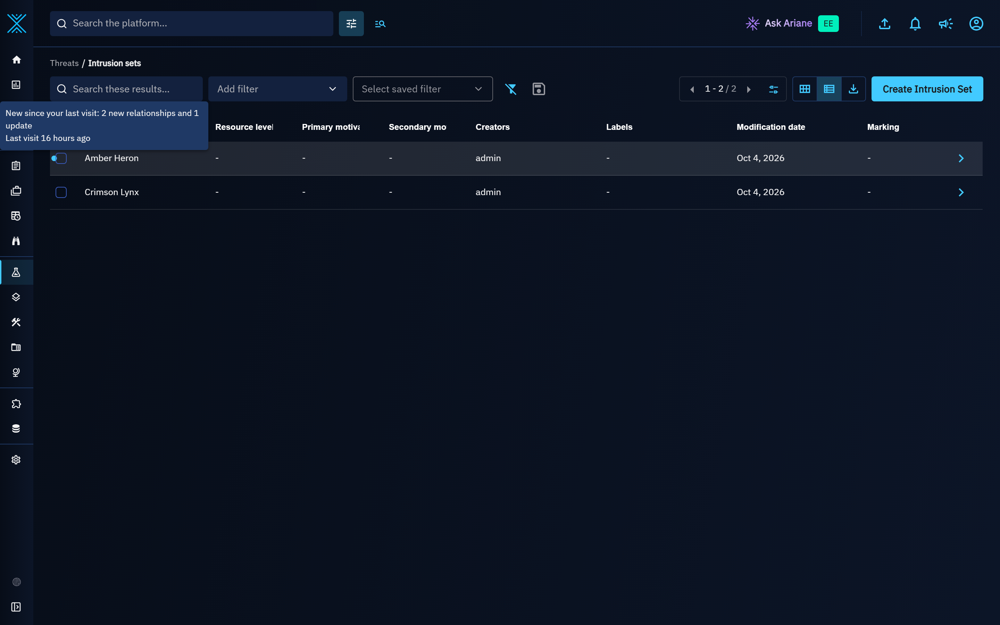

A visit session lasts 30 minutes: reopening an entity within that time does not reset the reference date, so the chip stays meaningful while you work on the entity.

You can purge your markers at any time from your profile (**Last visit markers** > **Purge my last visit markers**). Administrators with the capability to manage access can purge the markers of a user from **Settings > Security > Users**, in the menu of the user (**Purge the last visit markers**); this action is recorded in the audit log. Markers expire after one year and are removed when the user is deleted.

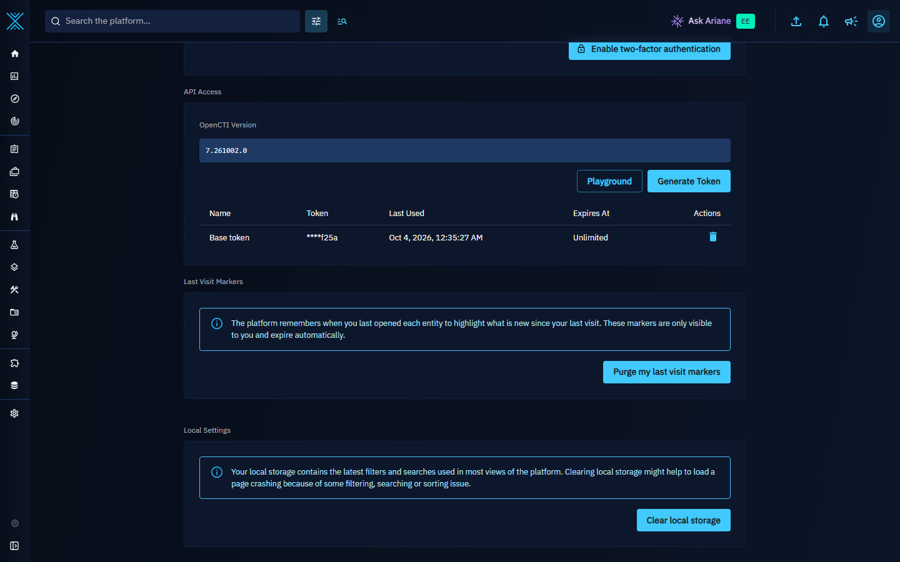

## Change digests

A change digest sends you, at each period, the landscape changes of a set of entities: new relationships, removals, revocations, confidence and score changes. Change digests are created from the **Triggers** tab of your notifications. See [Change digests](notifications.md#change-digests).

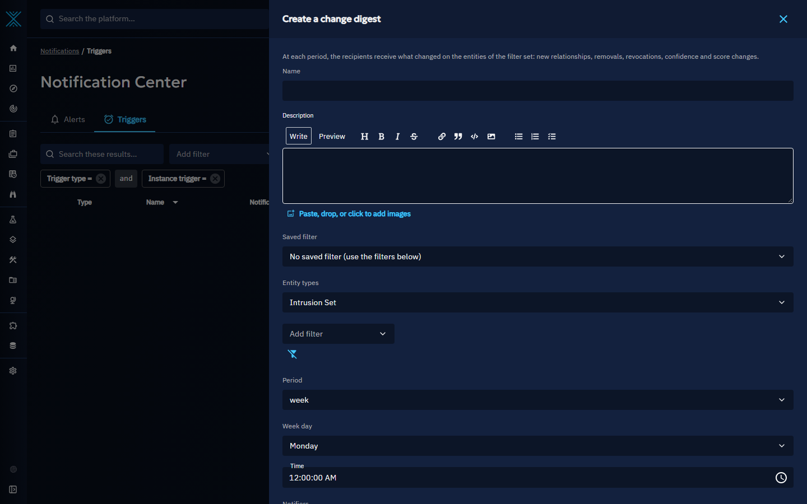

## Access control

The time machine never bypasses markings or organization restrictions:

- The time machine is only available on entities you can access today: restricting an entity also restricts its past versions.
- Every view is computed with your current rights. If, at the selected date, the entity had markings or a sharing you do not have access to, the view only says that the entity was restricted.
- Related entities you cannot access are displayed as **Restricted**, without their name.
- Entities deleted since are displayed as tombstones (**Deleted**).
- A landscape diff is computed with the rights of the user who requested it and is only visible to that user. A stored result, including a cached widget result, is discarded as soon as one of the entities it names is no longer accessible to that user (for example after a new marking): it is computed again on the next request.
- A change digest is computed with the rights of each recipient. Right before it is sent, everything it counts or names is checked again: if the access of the recipient changed during the computation, the digest is computed once more, and if it keeps changing, no digest is sent for that period.

## History retention and knowledge snapshots

The time machine relies on the history of the knowledge:

- The history is written by the [history manager](../deployment/advanced/managers.md#history-manager), which must be enabled.
- When a **History** [retention rule](../administration/retentions.md) is active, history entries older than the retention duration are deleted. A state older than the history still retained cannot be rebuilt reliably, nor its access at that date checked: unless the entity has not changed since that date, **View as of** and **Compare dates** say that the history is not retained back to that date instead of showing it, and **Go to the first recorded change** moves to the oldest state still available. The time slider and the **Reconstruction** panel show since when the history of the entity is available.

To keep the reconstruction fast, the [knowledge snapshot manager](../deployment/advanced/managers.md#knowledge-snapshot-manager) takes a compact snapshot of every entity that changed during the week, including the entities whose only change is a new, updated or deleted relationship: its attribute values and the identifiers of its relationships by type, as they were at the snapshot date. A reconstruction starts from the closest snapshot (or the current knowledge) and replays the history from there, within a bounded window. Snapshots follow the history retention: they are deleted with the shortest active History retention rule.

!!! warning "Retention and the time machine"

    Shortening the History retention also shortens how far back the Changes tab of the entities, the landscape changes and the change digests can look. Choose a History retention covering the periods your analysts compare (for example at least one year for year-over-year landscape changes).

## Configuration

The time machine works out of the box. Administrators can tune its limits with the `time_machine` and `snapshot_manager` configuration keys described in the [configuration page](../deployment/configuration.md#time-machine).

## What's next?

- [Notifications and alerting](notifications.md) to schedule change digests.
- [Custom dashboards](dashboards.md) and [Widget creation](widgets.md) to add landscape widgets.
- [Retention policies](../administration/retentions.md) to align the history retention with your analysis periods.
