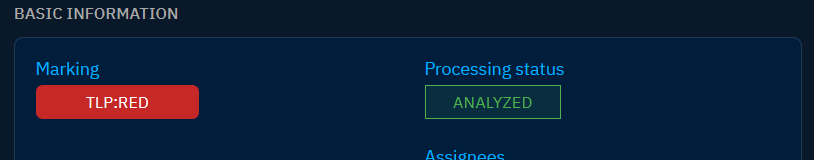

# Workflows and assignation

Efficiently manage and organize your work within the OpenCTI platform by leveraging workflows and assignment. These capabilities provide a structured approach to tracking the status of objects and assigning responsibilities to users.

## Workflows

Workflows are designed to trace the status of objects in the system. They are represented by the "Processing status" field embedded in each object. By default, this field is disabled for most objects but can be activated through the platform settings. For details on activating and configuring workflows, refer to the [dedicated documentation page](../administration/entities.md#workflow-section).

Enabling workflows enhances visibility into the progress and status of different objects, providing a comprehensive view for effective management.

## Assignment attributes

Certain objects, including Reports, Cases, and Tasks, come equipped with "Assignees" and "Participants" attributes. These attributes serve the purpose of designating individuals responsible for the object and those who actively participate in it.

Attributes can be set as mandatory or with default values, streamlining the assignment process. Users can also be assigned or designated as participants manually, contributing to a collaborative and organized workflow. For details on configuring attributes, refer to the [dedicated documentation page](../administration/entities.md#attributes-section).

Users can stay informed about assignments through [notification triggers](notifications.md). By setting up notification triggers, users receive alerts when an object is assigned to them. This ensures timely communication and proactive engagement with assigned tasks or responsibilities.