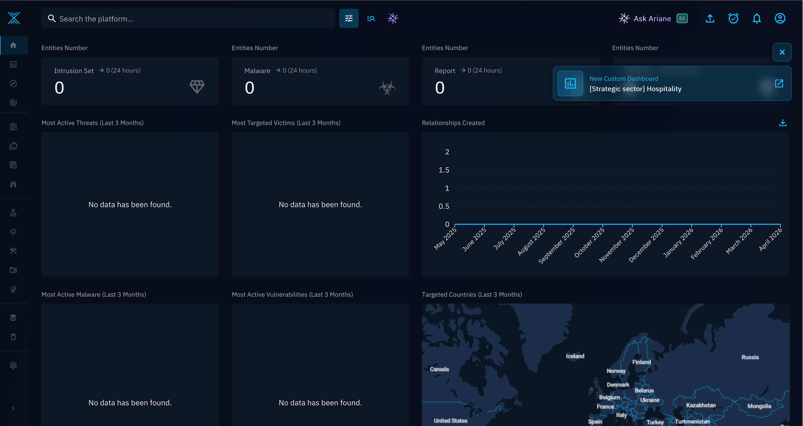
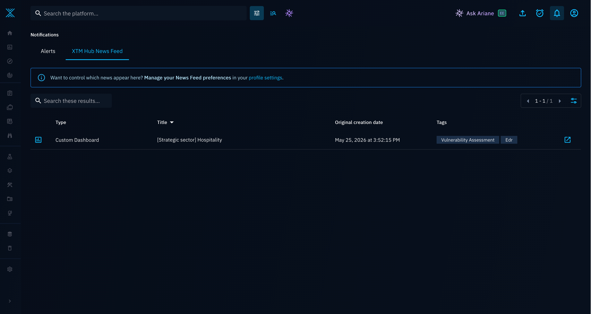
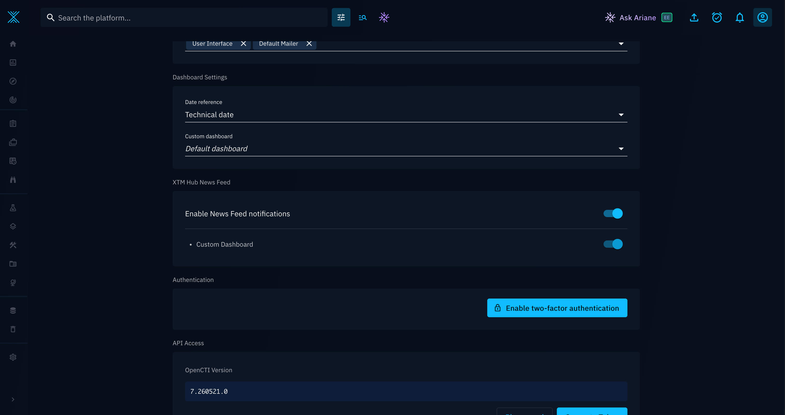

# XTM Hub News Feed

Use XTM Hub News Feed notifications to stay informed when new content is published on XTM Hub, then review and import what is relevant for your team.

## What is this?

XTM Hub News Feed sends notifications in OpenCTI when new XTM Hub content becomes available (for example, a new custom dashboard).

These notifications help you quickly detect new content and decide whether to import it.

## Why use it?

- Keep up with newly published XTM Hub content without manually checking XTM Hub.
- Centralize updates in OpenCTI notifications.
- Let each user decide which feed types they want to receive.

## How do I do it?

### 1. Register your platform to XTM Hub

Your OpenCTI platform must be registered to XTM Hub before you can receive News Feed notifications.

Follow the registration steps in [XTM Hub registration](../administration/hub.md).

After registration, OpenCTI automatically receives notifications when new content is published on XTM Hub.

### 2. View all News Feed items

1. Click the bell icon in the top-right corner.
2. Open the notifications page.
3. Review XTM Hub News Feed items in your notification list.

!!! note
    News Feed notifications are automatically marked as read when you open the News Feed notifications page.

### 3. Update your News Feed preferences

1. Open your user menu in the top-right corner.
2. Open your profile.
3. Update your News Feed preferences.

!!! warning
    If you disable all feeds in your preferences, you no longer receive XTM Hub News Feed notifications and the News Feed notifications page is hidden.

## Example

When XTM Hub publishes a new custom dashboard, OpenCTI shows a toast notification and adds a new entry in your notifications list. You can open the notifications page, review the item, and decide if you want to import it.
