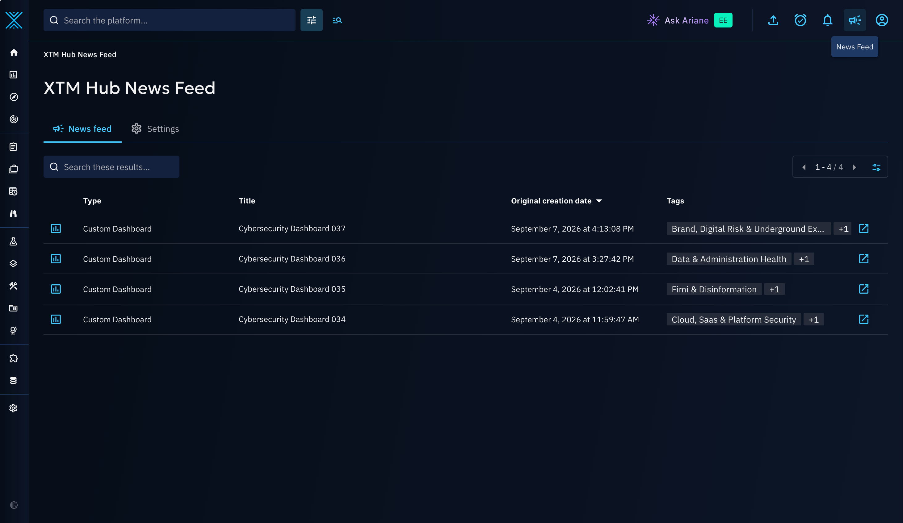
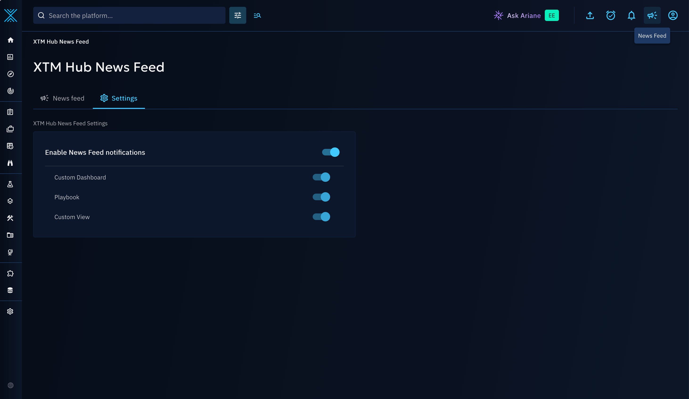

# XTM Hub News Feed

Use XTM Hub News Feed notifications to stay informed when new content is published on XTM Hub, then review and import what is relevant for your team.

## What is this?

XTM Hub News Feed sends notifications in OpenCTI when new XTM Hub content becomes available (for example, when a dashboard is published).

These notifications help you quickly detect new content and decide whether to import it.

## Why use it?

- Keep up with newly published XTM Hub content without manually checking XTM Hub.
- Centralize updates in OpenCTI notifications.
- Let each user decide which feed types they want to receive.

## How do I do it?

### 1. Connect your platform to XTM Hub

Your OpenCTI platform must be connected to XTM Hub before you can receive News Feed notifications.

Follow the connection steps in [XTM Hub connection](../administration/hub.md).

After connecting, OpenCTI automatically receives notifications when new content is published on XTM Hub every hour.

Old news feed items are deleted after 6 months.

### 2. View all News Feed items

1. Click the megaphone icon in the top-right corner.
2. Review XTM Hub News Feed items in the **News feed** tab.

!!! note
    News Feed items are automatically marked as read when you open the News Feed page.

### 3. Update your News Feed preferences

1. Click the megaphone icon in the top-right corner.
2. Switch to the **Settings** tab.
3. Update your News Feed preferences.

!!! note
    The News Feed page is always accessible, even if you disable all feeds in your preferences. If you disable all feeds, you no longer receive XTM Hub News Feed notifications.

## Example

When XTM Hub publishes a new custom dashboard, OpenCTI shows a toast notification and adds a new entry in your notifications list. You can open the notifications page, review the item, and decide if you want to import it.
