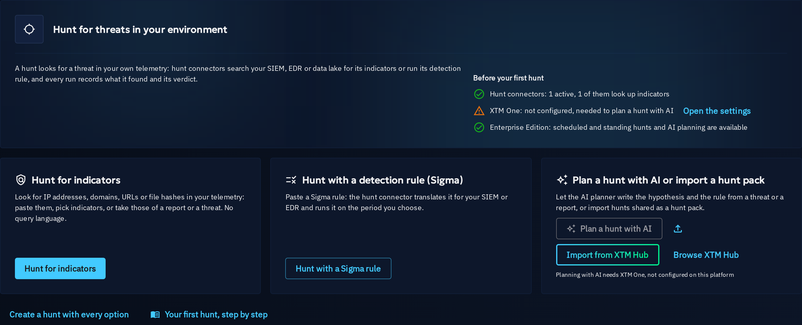
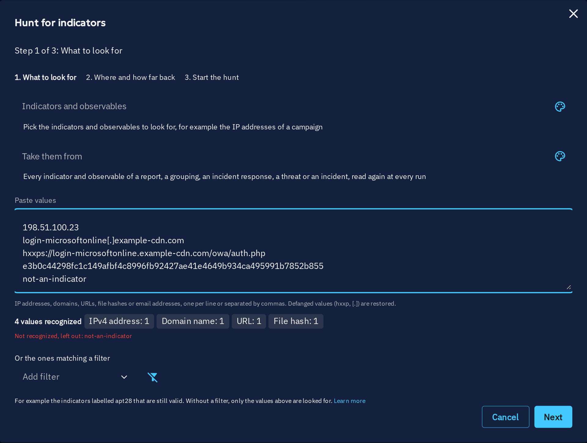
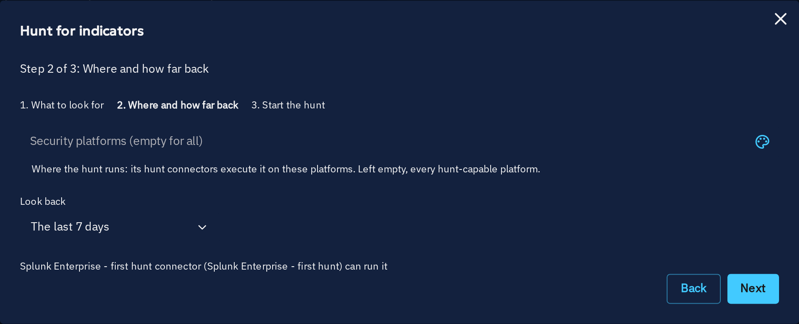
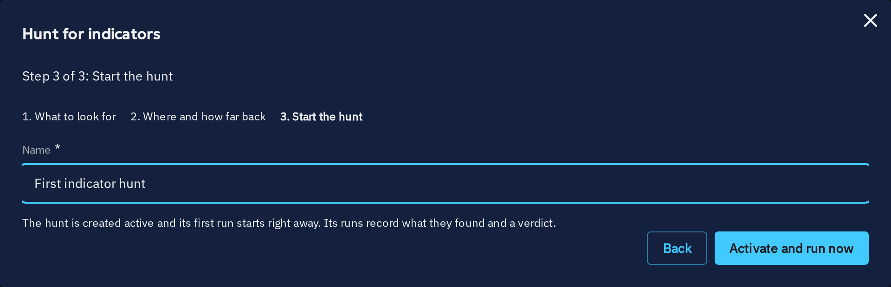
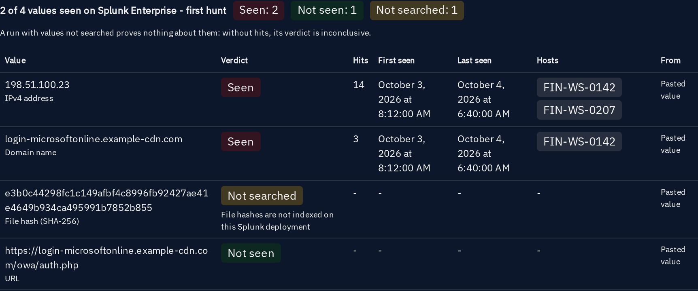
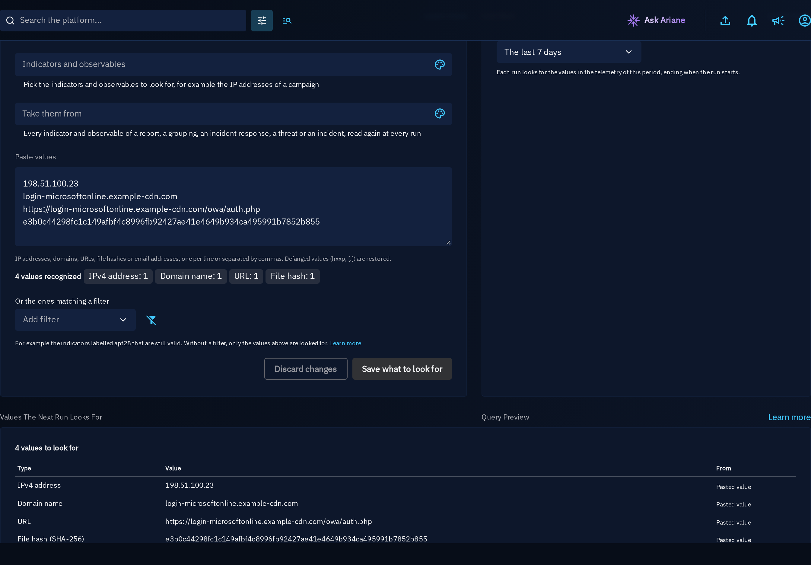
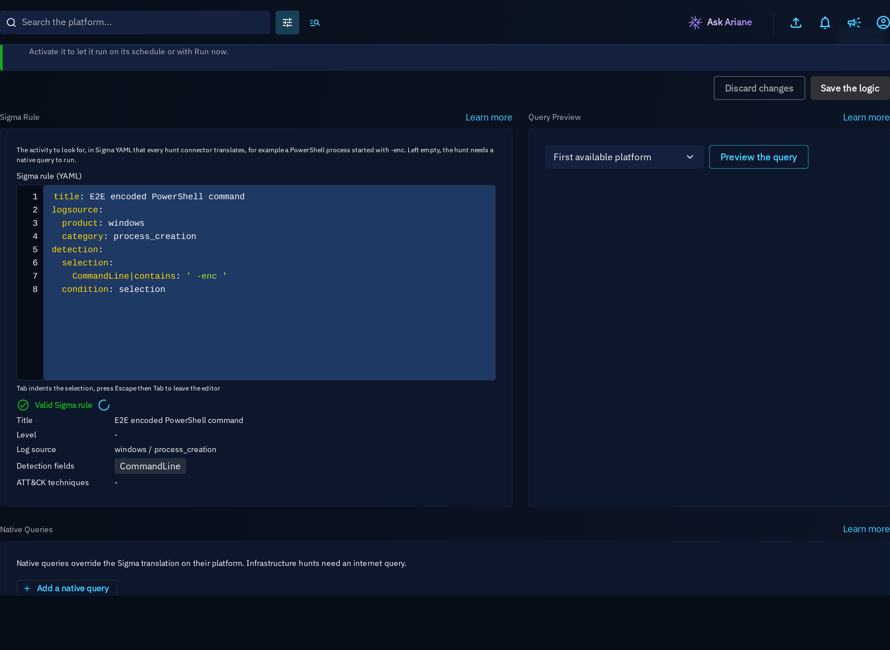
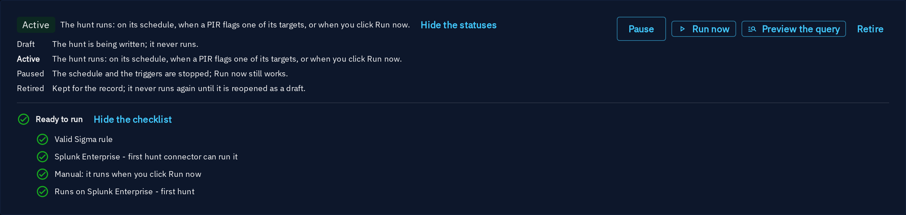

# Your first hunt

This page walks through two first hunts from **Defense > Hunts**: an indicator hunt (a list of IP addresses, domains, URLs or hashes, no query language), then a hunt with a Sigma rule. Each takes a few minutes. For the concepts behind them, see [Hunts](hunts.md); for every option of indicator hunts, see [Indicator hunts](hunt-indicators.md).

## Before you start

A hunt runs on your SIEM, EDR or data lake through a **hunt connector**. The first-use page of **Defense > Hunts** lists what the platform needs, with the live state of each prerequisite:

- **Hunt connectors**: at least one active hunt connector. For an indicator hunt, one that looks up indicators, such as the Splunk hunt connector. **Deploy a hunt connector** opens the connector catalog; the permissions each connector needs on its platform are listed in [Hunt connectors](hunt-connectors.md).
- **XTM One**: only to plan a hunt with AI.
- **Enterprise Edition**: only for scheduled and standing hunts and AI planning. Manual hunts, indicator hunts included, work without it.

You need the **Create / Update knowledge** capability to create and run hunts.

## Hunt for indicators

1. Open **Defense > Hunts** and click **Hunt for indicators**.
2. **What to look for**: paste the values, one per line or separated by commas, for example the indicators of a threat report you just read. The type of each value is detected (IPv4 and IPv6 addresses, domains, URLs, email addresses, MAC addresses, file hashes), defanged values such as `hxxps://` or `evil[.]com` are restored, duplicates are removed, and what is not a value is listed as left out. You can also pick indicators and observables, take every indicator and observable of a report, a grouping, an incident response, a threat or an incident, or match them with a filter. **Next** stays disabled with the reason "Add the indicators or observables to look for" until there is something to look for.

    

3. **Where and how far back**: leave the security platforms empty to hunt on every platform served by a hunt connector, or pick some. Choose how far back each run looks: the last 24 hours, 7 days or 30 days. The step names the hunt connectors that can run the hunt, or says what is missing.

    

4. **Start the hunt**: name the hunt and click **Activate and run now**. The hunt is created active and its first run starts; the page opens on that run. When no hunt connector can run it yet, the button reads **Save as a draft**: the hunt is saved and its page lists what it still needs.

    

When the run completes, **Results per value** lists every value with its verdict:

| Verdict | Meaning |
|---|---|
| Seen | The value was found: the number of events holding it, the first and last of them, and up to ten hosts. |
| Not seen | The platform searched the value over the period and did not find it. |
| Not searched | The platform cannot look up this type of value (for example file hashes on a deployment that does not index them), or its lookup returned partial results that did not include the value; the reason is shown. |

Each seen value is **sighted** on the hunted security platform for each indicator or observable it comes from (a pasted value is created as an observable and sighted). Without any value seen, and with every value searched, the run is **Benign**; with a value seen, it waits for your verdict, and above the escalation threshold of the hunt it proposes an incident like any hunt. When an indicator is deployed on that platform (dissemination assurance), its row says **Deployed on this platform**.

The **Logic** tab of the hunt lists the values the next run looks for, with where each comes from. Indicators taken from a report or a threat are read again at every run: new indicators added to the report are hunted at the next run.

## Hunt with a Sigma rule

1. Open **Defense > Hunts** and click **Hunt with a detection rule (Sigma)**, or create the hunt from **Create a hunt** to set every option.
2. Paste a Sigma rule, from [SigmaHQ](https://github.com/SigmaHQ/sigma) or your own, or click **Generate with AI** next to its label (Enterprise Edition, XTM One): say in a few words what to hunt, review the rule XTM One proposes, then **Accept** it. It is validated as you type with the errors of the platform, and its title, level, log source, detection fields and ATT&CK techniques are shown.
3. Choose where and how far back, then start the hunt as above.

A hunt can also start as a draft, for example a hunt created without its logic, proposed by the AI planner or imported from a hunt pack. Its page explains what it still needs:

- the status header shows **Draft** with its meaning, and **Activate** disabled with "1 item to complete" next to it;
- the checklist **Ready to run** names the missing item, here "Add a Sigma rule or a native query", with **Open the logic**;
- in the **Logic** tab, the same sentence shows until the rule is there, and **Save the logic** is at the top and the bottom of the page;
- once the logic is saved, the tab says "The logic is saved, the hunt is still a draft" and offers **Activate** right there.

Once active, **Run now** runs the hunt on its platforms, and **Preview the query** shows the query a hunt connector would run, translated from the Sigma rule, without running it.

## Plan a hunt with AI or import a hunt pack

- **Generate with AI** (Enterprise Edition, XTM One), in **Create a hunt**: **Plan with AI**, next to the hunt type, proposes the whole hunt from its name - or, on an empty form, from a few words about what to hunt: the hypothesis, the description, the Sigma rule, the observables to extract, benign patterns and techniques. Every field the planner can fill also has its own **Generate with AI**. Each proposal is shown before anything changes: edit it, **Accept** it into the form, or **Dismiss** it. See [Generate with AI](hunts.md#generate-with-ai).
- **Plan a hunt with AI** (Enterprise Edition, XTM One) writes the hypothesis, the Sigma rule and the observables to extract from hits, based on the threats, techniques, reports or indicators you pick. The proposal lands in a draft workspace you review; validating the draft creates the hunt as a **Draft**, and it runs once you activate it.
- **Import a hunt pack** creates the hunts of a pack file as drafts; **Browse XTM Hub** opens the hunt packs shared on the XTM Hub.

See [Hunts](hunts.md#ai-assistance) and [Hunt packs](hunts.md#hunt-packs).
