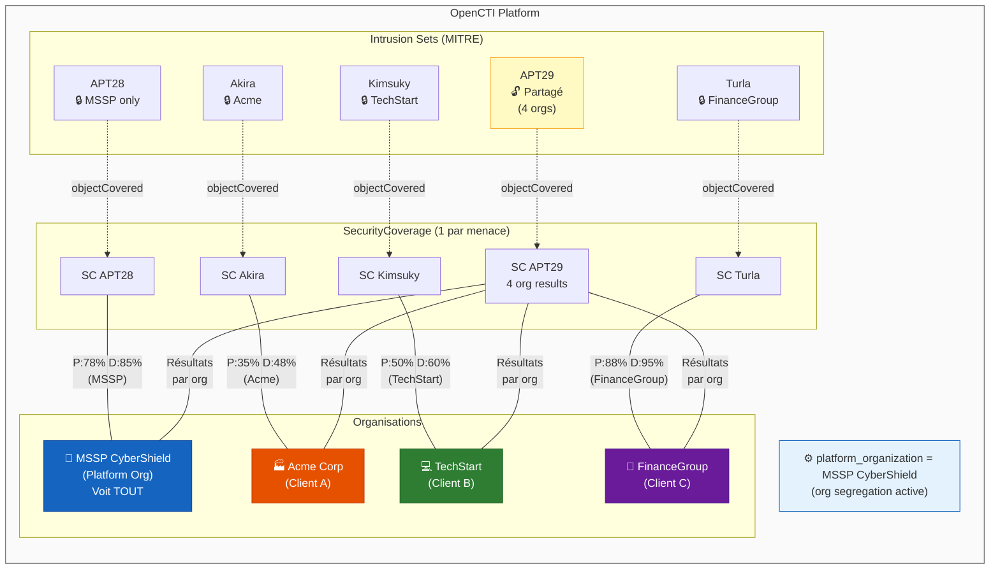
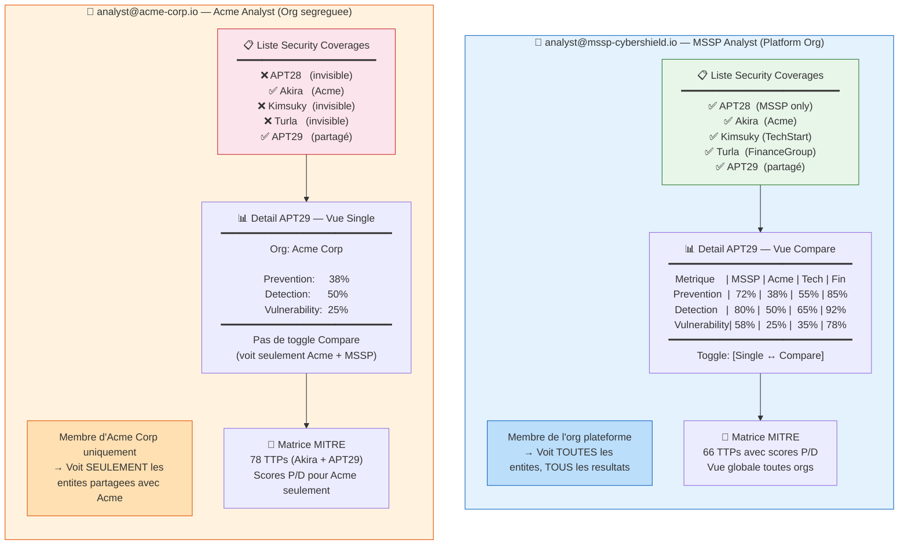
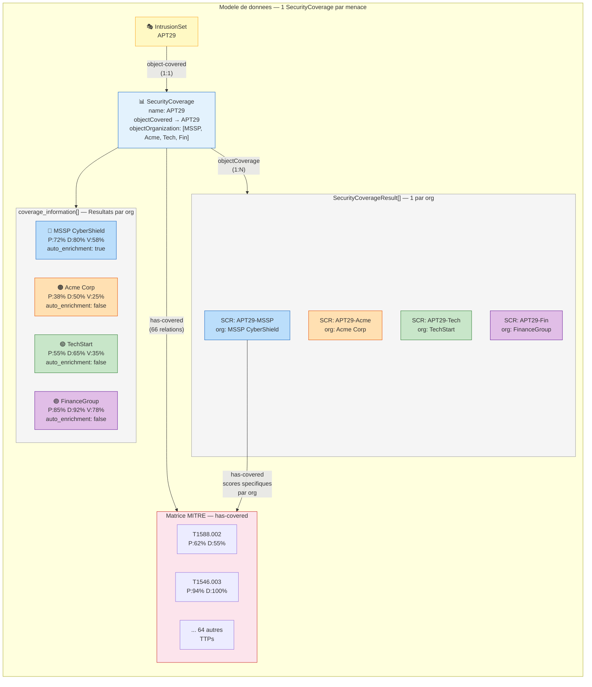
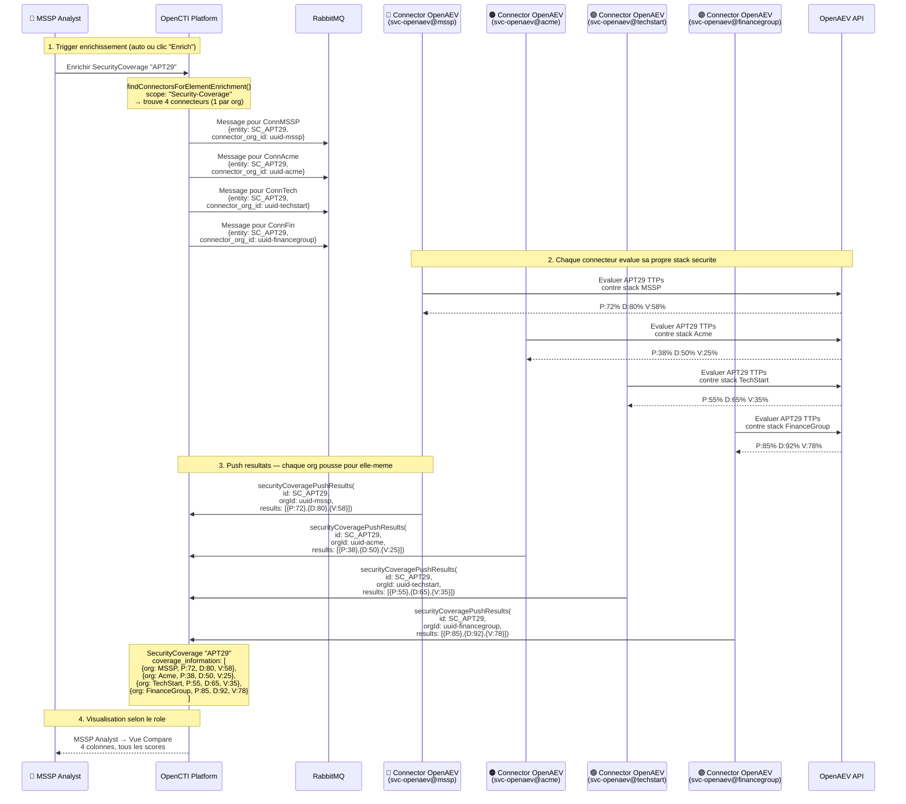
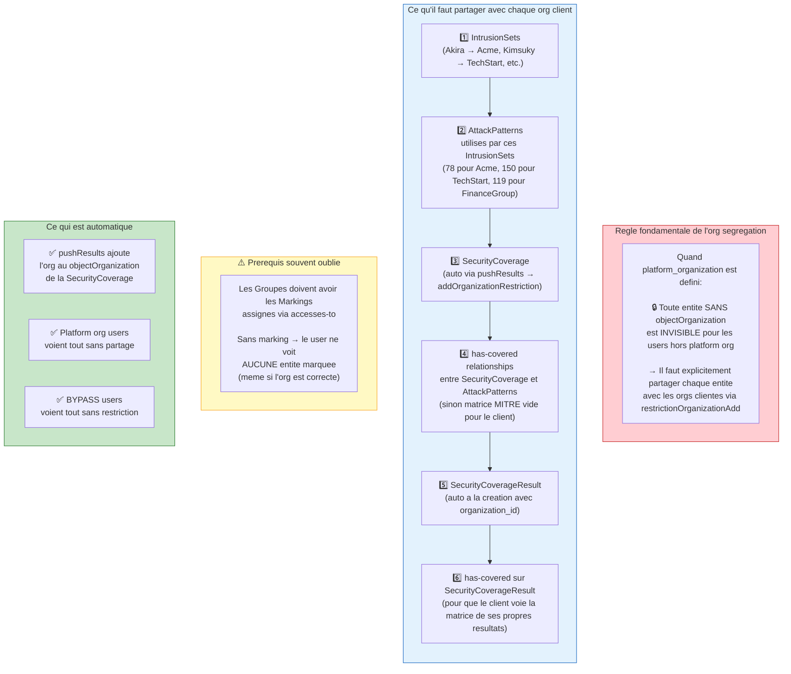

# Multi-Tenant Security Coverage — MSSP Setup

> Diagrammes de la configuration multi-tenant avec org segregation pour le Security Coverage v2.

---

## 1. Vue d'ensemble du setup

---

## 2. Experience utilisateur — MSSP vs Client

---

## 3. Architecture technique — Modele de donnees

---

## 4. Flux de controle d'acces — Org Segregation

```mermaid
flowchart TD
    REQ["📨 Requete GraphQL\nsecurityCoverages / intrusionSets / ..."]

    REQ --> AUTH["🔐 Authentification\nauthenticateUserByToken()"]
    AUTH --> RESOLVE["Resoudre user complet\nbuildCompleteUser()\n→ user.organizations\n→ user.capabilities\n→ user.allowed_marking"]

    RESOLVE --> ES_FILTER["🔍 Construction filtre Elasticsearch"]

    ES_FILTER --> CHECK_BYPASS{"user a BYPASS ?"}
    CHECK_BYPASS -->|"OUI\n(admin@opencti.io\nadmin@mssp-cybershield.io)"| NO_FILTER["Aucun filtre org\n→ voit TOUT"]

    CHECK_BYPASS -->|"NON"| CHECK_MARKING["Filtre Markings\nuser.allowed_marking\nvs entity.objectMarking"]

    CHECK_MARKING --> CHECK_PLATFORM{"platform_organization\nest defini ?"}
    CHECK_PLATFORM -->|"NON"| NO_ORG_FILTER["Pas de filtre org\n→ voit tout"]

    CHECK_PLATFORM -->|"OUI\n(MSSP CyberShield)"| CHECK_IN_PLATFORM{"user ∈ platform_org ?"}

    CHECK_IN_PLATFORM -->|"OUI\n(analyst@mssp-cybershield.io\n∈ MSSP CyberShield)"| PLATFORM_USER["✅ Platform org user\nAucun filtre org\n→ voit TOUT"]

    CHECK_IN_PLATFORM -->|"NON\n(analyst@acme-corp.io\n∈ Acme Corp)"| ORG_FILTER["🔒 Filtre org segregation"]

    ORG_FILTER --> FILTER_DETAIL["Elasticsearch must:\nbool.should [\n  entity.rel_granted ∩ user.orgs ≠ ∅\n  OU entity ∈ UNRESTRICTED types\n]\n\n→ Entite DOIT avoir objectOrganization\n   contenant au moins 1 org du user\n→ Entites SANS objectOrganization\n   sont INVISIBLES"]

    FILTER_DETAIL --> VISIBLE["Entites visibles pour Acme:\n✅ Akira (objectOrg: Acme)\n✅ APT29 (objectOrg: Acme,MSSP,...)\n✅ AttackPatterns partages avec Acme\n✅ has-covered partages avec Acme\n❌ APT28 (objectOrg: MSSP only)\n❌ Kimsuky (objectOrg: TechStart)\n❌ Turla (objectOrg: FinanceGroup)"]

    VISIBLE --> COVERAGE_FILTER["Filtre supplementaire\ncoverage_information\n(resolver-level)"]
    COVERAGE_FILTER --> COVERAGE_RESULT["Acme voit seulement:\n- Resultats Acme Corp\n- Resultats MSSP (platform org = baseline)\n❌ Pas les resultats TechStart/FinanceGroup"]

    style REQ fill:#e3f2fd,stroke:#1565c0
    style AUTH fill:#fff9c4,stroke:#f9a825
    style CHECK_BYPASS fill:#f3e5f5,stroke:#7b1fa2
    style NO_FILTER fill:#c8e6c9,stroke:#2e7d32
    style PLATFORM_USER fill:#c8e6c9,stroke:#2e7d32
    style ORG_FILTER fill:#ffcdd2,stroke:#c62828
    style FILTER_DETAIL fill:#fff3e0,stroke:#e65100
    style VISIBLE fill:#e8f5e9,stroke:#2e7d32
    style COVERAGE_FILTER fill:#e1bee7,stroke:#6a1b9a
    style COVERAGE_RESULT fill:#e8eaf6,stroke:#283593
    style CHECK_MARKING fill:#fff9c4,stroke:#f9a825
```

---

## 5. Enrichissement multi-tenant — Connecteurs OpenAEV

---

## 6. Partage des entites — Prerequis techniques

