# Multi-Tenant Security Coverage — MSSP Setup

> Diagrammes de la configuration multi-tenant avec org segregation pour le Security Coverage v2.

---

## 1. Vue d'ensemble du setup

```mermaid
graph TB
    subgraph PLATFORM["OpenCTI Platform"]
        direction TB
        SETTINGS["⚙️ platform_organization = MSSP CyberShield\n(org segregation active)"]

        subgraph ORGS["Organisations"]
            direction LR
            MSSP["🏢 MSSP CyberShield\n(Platform Org)\nVoit TOUT"]
            ACME["🏭 Acme Corp\n(Client A)"]
            TECH["💻 TechStart\n(Client B)"]
            FIN["🏦 FinanceGroup\n(Client C)"]
        end

        subgraph THREATS["Intrusion Sets (MITRE)"]
            direction LR
            APT28["APT28\n🔒 MSSP only"]
            AKIRA["Akira\n🔒 Acme"]
            KIMSUKY["Kimsuky\n🔒 TechStart"]
            TURLA["Turla\n🔒 FinanceGroup"]
            APT29["APT29\n🔓 Partagé\n(4 orgs)"]
        end

        subgraph COVERAGES["SecurityCoverage (1 par menace)"]
            direction LR
            COV_APT28["SC APT28"]
            COV_AKIRA["SC Akira"]
            COV_KIMSUKY["SC Kimsuky"]
            COV_TURLA["SC Turla"]
            COV_APT29["SC APT29\n4 org results"]
        end
    end

    APT28 -.->|objectCovered| COV_APT28
    AKIRA -.->|objectCovered| COV_AKIRA
    KIMSUKY -.->|objectCovered| COV_KIMSUKY
    TURLA -.->|objectCovered| COV_TURLA
    APT29 -.->|objectCovered| COV_APT29

    COV_APT28 ---|"P:78% D:85%\n(MSSP)"| MSSP
    COV_AKIRA ---|"P:35% D:48%\n(Acme)"| ACME
    COV_KIMSUKY ---|"P:50% D:60%\n(TechStart)"| TECH
    COV_TURLA ---|"P:88% D:95%\n(FinanceGroup)"| FIN
    COV_APT29 ---|"Résultats\npar org"| MSSP
    COV_APT29 ---|"Résultats\npar org"| ACME
    COV_APT29 ---|"Résultats\npar org"| TECH
    COV_APT29 ---|"Résultats\npar org"| FIN

    style MSSP fill:#1565c0,stroke:#0d47a1,color:#fff
    style ACME fill:#e65100,stroke:#bf360c,color:#fff
    style TECH fill:#2e7d32,stroke:#1b5e20,color:#fff
    style FIN fill:#6a1b9a,stroke:#4a148c,color:#fff
    style APT29 fill:#fff9c4,stroke:#f9a825
    style SETTINGS fill:#e3f2fd,stroke:#1565c0
    style PLATFORM fill:#fafafa,stroke:#616161
```

---

## 2. Experience utilisateur — MSSP vs Client

```mermaid
graph TB
    subgraph MSSP_VIEW["👤 analyst@mssp-cybershield.io — MSSP Analyst (Platform Org)"]
        direction TB
        M_DESC["Membre de l'org plateforme\n→ Voit TOUTES les entites, TOUS les resultats"]

        M_LIST["📋 Liste Security Coverages\n━━━━━━━━━━━━━━━━━━━━━━━━━\n✅ APT28  (MSSP only)\n✅ Akira  (Acme)\n✅ Kimsuky (TechStart)\n✅ Turla  (FinanceGroup)\n✅ APT29  (partagé)"]

        M_DETAIL["📊 Detail APT29 — Vue Compare\n━━━━━━━━━━━━━━━━━━━━━━━━━━━━━\nMetrique    | MSSP | Acme | Tech | Fin\nPrevention  |  72% |  38% |  55% | 85%\nDetection   |  80% |  50% |  65% | 92%\nVulnerability| 58% |  25% |  35% | 78%\n━━━━━━━━━━━━━━━━━━━━━━━━━━━━━\nToggle: [Single ↔ Compare]"]

        M_MATRIX["🎯 Matrice MITRE\n66 TTPs avec scores P/D\nVue globale toutes orgs"]

        M_LIST --> M_DETAIL --> M_MATRIX
    end

    subgraph CLIENT_VIEW["👤 analyst@acme-corp.io — Acme Analyst (Org segreguee)"]
        direction TB
        C_DESC["Membre d'Acme Corp uniquement\n→ Voit SEULEMENT les entites partagees avec Acme"]

        C_LIST["📋 Liste Security Coverages\n━━━━━━━━━━━━━━━━━━━━━━\n❌ APT28   (invisible)\n✅ Akira   (Acme)\n❌ Kimsuky  (invisible)\n❌ Turla   (invisible)\n✅ APT29   (partagé)"]

        C_DETAIL["📊 Detail APT29 — Vue Single\n━━━━━━━━━━━━━━━━━━━━━━━━━━━\nOrg: Acme Corp\n\nPrevention:     38%\nDetection:      50%\nVulnerability:  25%\n━━━━━━━━━━━━━━━━━━━━━━━━━━━\nPas de toggle Compare\n(voit seulement Acme + MSSP)"]

        C_MATRIX["🎯 Matrice MITRE\n78 TTPs (Akira + APT29)\nScores P/D pour Acme seulement"]

        C_LIST --> C_DETAIL --> C_MATRIX
    end

    style MSSP_VIEW fill:#e3f2fd,stroke:#1565c0
    style CLIENT_VIEW fill:#fff3e0,stroke:#e65100
    style M_DESC fill:#bbdefb,stroke:#1565c0
    style C_DESC fill:#ffe0b2,stroke:#e65100
    style M_LIST fill:#e8f5e9,stroke:#2e7d32
    style C_LIST fill:#fce4ec,stroke:#c62828
```

---

## 3. Architecture technique — Modele de donnees

```mermaid
graph TB
    subgraph DATA_MODEL["Modele de donnees — 1 SecurityCoverage par menace"]
        direction TB

        IS["🎭 IntrusionSet\nAPT29"]
        SC["📊 SecurityCoverage\nname: APT29\nobjectCovered → APT29\nobjectOrganization: [MSSP, Acme, Tech, Fin]"]

        IS -->|"object-covered\n(1:1)"| SC

        subgraph CI["coverage_information[] — Resultats par org"]
            direction LR
            R1["🔵 MSSP CyberShield\nP:72% D:80% V:58%\nauto_enrichment: true"]
            R2["🟠 Acme Corp\nP:38% D:50% V:25%\nauto_enrichment: false"]
            R3["🟢 TechStart\nP:55% D:65% V:35%\nauto_enrichment: false"]
            R4["🟣 FinanceGroup\nP:85% D:92% V:78%\nauto_enrichment: false"]
        end

        SC --> CI

        subgraph RESULTS["SecurityCoverageResult[] — 1 par org"]
            direction LR
            SCR1["SCR: APT29-MSSP\norg: MSSP CyberShield"]
            SCR2["SCR: APT29-Acme\norg: Acme Corp"]
            SCR3["SCR: APT29-Tech\norg: TechStart"]
            SCR4["SCR: APT29-Fin\norg: FinanceGroup"]
        end

        SC -->|"objectCoverage\n(1:N)"| RESULTS

        subgraph MITRE["Matrice MITRE — has-covered"]
            direction LR
            AP1["T1588.002\nP:62% D:55%"]
            AP2["T1546.003\nP:94% D:100%"]
            AP3["... 64 autres\nTTPs"]
        end

        SC -->|"has-covered\n(66 relations)"| MITRE
        SCR1 -->|"has-covered\nscores specifiques\npar org"| MITRE
    end

    style IS fill:#fff9c4,stroke:#f9a825
    style SC fill:#e3f2fd,stroke:#1565c0
    style R1 fill:#bbdefb,stroke:#1565c0
    style R2 fill:#ffe0b2,stroke:#e65100
    style R3 fill:#c8e6c9,stroke:#2e7d32
    style R4 fill:#e1bee7,stroke:#6a1b9a
    style SCR1 fill:#bbdefb,stroke:#1565c0
    style SCR2 fill:#ffe0b2,stroke:#e65100
    style SCR3 fill:#c8e6c9,stroke:#2e7d32
    style SCR4 fill:#e1bee7,stroke:#6a1b9a
    style CI fill:#f5f5f5,stroke:#9e9e9e
    style RESULTS fill:#f5f5f5,stroke:#9e9e9e
    style MITRE fill:#fce4ec,stroke:#c62828
```

---

## 4. Flux de controle d'acces — Org Segregation

---

## 5. Enrichissement multi-tenant — Connecteurs OpenAEV

---

## 6. Partage des entites — Prerequis techniques

```mermaid
graph TB
    subgraph RULE["Regle fondamentale de l'org segregation"]
        RULE_TEXT["Quand platform_organization est defini:\n\n🔒 Toute entite SANS objectOrganization\nest INVISIBLE pour les users hors platform org\n\n→ Il faut explicitement partager chaque entite\navec les orgs clientes via restrictionOrganizationAdd"]
    end

    subgraph SHARE["Ce qu'il faut partager avec chaque org client"]
        direction TB

        S1["1️⃣ IntrusionSets\n(Akira → Acme, Kimsuky → TechStart, etc.)"]
        S2["2️⃣ AttackPatterns\nutilises par ces IntrusionSets\n(78 pour Acme, 150 pour TechStart, 119 pour FinanceGroup)"]
        S3["3️⃣ SecurityCoverage\n(auto via pushResults → addOrganizationRestriction)"]
        S4["4️⃣ has-covered relationships\nentre SecurityCoverage et AttackPatterns\n(sinon matrice MITRE vide pour le client)"]
        S5["5️⃣ SecurityCoverageResult\n(auto a la creation avec organization_id)"]
        S6["6️⃣ has-covered sur SecurityCoverageResult\n(pour que le client voie la matrice de ses propres resultats)"]

        S1 --> S2 --> S3 --> S4 --> S5 --> S6
    end

    subgraph MARKINGS["⚠️ Prerequis souvent oublie"]
        MARK_TEXT["Les Groupes doivent avoir les Markings\nassignes via accesses-to\n\nSans marking → le user ne voit\nAUCUNE entite marquee\n(meme si l'org est correcte)"]
    end

    subgraph AUTO["Ce qui est automatique"]
        direction LR
        A1["✅ pushResults ajoute\nl'org au objectOrganization\nde la SecurityCoverage"]
        A2["✅ Platform org users\nvoient tout sans partage"]
        A3["✅ BYPASS users\nvoient tout sans restriction"]
    end

    style RULE fill:#ffcdd2,stroke:#c62828
    style SHARE fill:#e3f2fd,stroke:#1565c0
    style MARKINGS fill:#fff9c4,stroke:#f9a825
    style AUTO fill:#c8e6c9,stroke:#2e7d32
```

